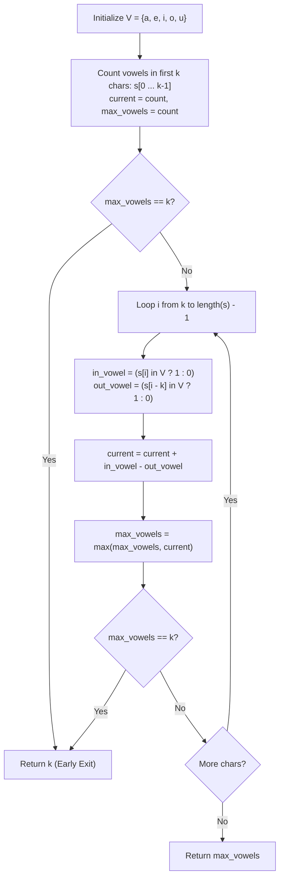

# Guided Example: Maximum Number of Vowels in a Substring of Given Length

We trace the step-by-step sliding window execution maintaining vowel counts over fixed-length character intervals on a representative problem instance:

- **Input:** $s = \text{"abciiidef"}$, $k = 3$
- **Required Output:** $3$

This instance illustrates the dynamics of a fixed-size window sliding across consonants and vowels, demonstrating running incremental updates ($\pm 1$) and early termination when the theoretical upper bound $k$ is reached.

---

## 1. Instance & Teaching Goal

We are given a string $s$ of lowercase English letters and an integer $k$. We must find the maximum number of vowel letters (`'a'`, `'e'`, `'i'`, `'o'`, `'u'`) in any contiguous substring of length exactly $k$.

In the provided instance:
- String length is $9$, window size $k = 3$.
- Window $[0 \dots 2]$ (`"abc"`): contains `'a'` ($1$ vowel).
- Window $[1 \dots 3]$ (`"bci"`): contains `'i'` ($1$ vowel).
- Window $[2 \dots 4]$ (`"cii"`): contains `'i'`, `'i'` ($2$ vowels).
- Window $[3 \dots 5]$ (`"iii"`): contains `'i'`, `'i'`, `'i'` ($3$ vowels).
- Since $3$ vowels in a window of size $3$ is the maximum possible capacity ($3 = k$), no subsequent window can exceed this count.
- Maximum vowels: $3$.

The primary teaching goal is to model fixed-size sliding window maintenance: updating the count in $\mathcal{O}(1)$ time per slide by adding the incoming right character and subtracting the outgoing left character, rather than re-counting all $k$ characters.

---

## 2. Conceptual Foundation & Invariants

Let $V = \{\text{'a'}, \text{'e'}, \text{'i'}, \text{'o'}, \text{'u'}\}$ be the set of vowels, and let indicator function $\chi(c)$ be:

$$\chi(c) = \begin{cases} 1 & \text{if } c \in V \\ 0 & \text{otherwise} \end{cases}$$

For any window spanning indices $[i - k + 1, \, i]$, its vowel count $C_i$ is:

$$C_i = \sum_{j = i - k + 1}^i \chi(s[j])$$

When sliding the window from ending position $i - 1$ to ending position $i$:
$$C_i = C_{i-1} + \chi(s[i]) - \chi(s[i - k])$$

We track the running maximum:
$$max\_vowels = \max_{k-1 \le i < |s|} C_i$$

```
Sliding Window Transition Diagram (k = 3):
Index:     0   1   2   3   4   5   6   7   8
Chars:     a   b   c   i   i   i   d   e   f
Vowel?     1   0   0   1   1   1   0   1   0

Window 0: [a   b   c]                         --> Sum = 1 + 0 + 0 = 1
Window 1:     [b   c   i]                     --> Sum = 1 - 1('a') + 1('i') = 1
Window 2:         [c   i   i]                 --> Sum = 1 - 0('b') + 1('i') = 2
Window 3:             [i   i   i]             --> Sum = 2 - 0('c') + 1('i') = 3 (MAX!)
```

We establish tracking parameters across the algorithm:

| Parameter | Type & Domain | Role in Algorithm |
|---|---|---|
| Window End ($i$) | Integer $k - 1 \le i < \lvert s \rvert$ | Right boundary of sliding window |
| Incoming Character ($s[i]$) | Character `a`-`z` | Character entering the window at right |
| Outgoing Character ($s[i - k]$) | Character `a`-`z` | Character leaving the window at left |
| Current Vowels ($current$) | Integer $0 \le current \le k$ | Exact vowel count inside active window |
| Maximum Vowels ($max\_vowels$) | Integer $0 \le max \le k$ | Highest vowel count observed across all windows |

> **Invariant.** Before index $i$ advances, $current$ strictly equals the number of vowels in the contiguous slice $s[i - k + 1 \dots i]$.



---

## 3. Step-by-Step Worked Execution

We walk through the representative instance $s = \text{"abciiidef"}$ with $k = 3$.

### Phase 1: Initialize First Window $[0 \dots 2]$
- Characters: $s[0] = \text{'a'}, s[1] = \text{'b'}, s[2] = \text{'c'}$.
- Vowel evaluations:
  - $\chi(\text{'a'}) = 1$
  - $\chi(\text{'b'}) = 0$
  - $\chi(\text{'c'}) = 0$
- Initial window vowel sum: $current = 1 + 0 + 0 = 1$.
- Record: $max\_vowels = 1$.

### Phase 2: Slide Window Across Remaining Characters

1. **Step $i = 3$ (Window $[1 \dots 3]$, `"bci"`):**
   - Outgoing: $s[3 - 3] = s[0] = \text{'a'}$ ($\chi = 1$).
   - Incoming: $s[3] = \text{'i'}$ ($\chi = 1$).
   - Update: $current \leftarrow 1 + 1 - 1 = 1$.
   - $max\_vowels = \max(1, 1) = 1$.

2. **Step $i = 4$ (Window $[2 \dots 4]$, `"cii"`):**
   - Outgoing: $s[4 - 3] = s[1] = \text{'b'}$ ($\chi = 0$).
   - Incoming: $s[4] = \text{'i'}$ ($\chi = 1$).
   - Update: $current \leftarrow 1 + 1 - 0 = 2$.
   - $max\_vowels = \max(1, 2) = 2$.

3. **Step $i = 5$ (Window $[3 \dots 5]$, `"iii"`):**
   - Outgoing: $s[5 - 3] = s[2] = \text{'c'}$ ($\chi = 0$).
   - Incoming: $s[5] = \text{'i'}$ ($\chi = 1$).
   - Update: $current \leftarrow 2 + 1 - 0 = 3$.
   - $max\_vowels = \max(2, 3) = 3$.
   - **Early Exit:** Because $max\_vowels = 3 == k$, the theoretical maximum is achieved. Traversal halts immediately.

| Window Span | Window Substring | Outgoing $s[i - k]$ | Incoming $s[i]$ | Net Adjustment | Active Vowel Count | Running Max |
|---|---|---|---|---|---|---|
| $[0 \dots 2]$ | `"abc"` | - | - | Initial Sum | 1 | 1 |
| $[1 \dots 3]$ | `"bci"` | `'a'` ($-1$) | `'i'` ($+1$) | $1 - 1 = 0$ | 1 | 1 |
| $[2 \dots 4]$ | `"cii"` | `'b'` ($0$) | `'i'` ($+1$) | $+1$ | 2 | 2 |
| $[3 \dots 5]$ | `"iii"` | `'c'` ($0$) | `'i'` ($+1$) | $+1$ | **3** | **3 (Optimal)** |

---

## 4. Complete Execution Trace

```
Final Sliding Window Evaluation:
Input String: "abciiidef"
Window Length: 3
Optimal Window: s[3..5] = "iii"
Vowels in Optimal Window: {'i', 'i', 'i'} (Total: 3)
Capacity Reached: 3 == k
Halted at Index 5 without evaluating suffix "def"
Maximum Vowel Count: 3
```

| Window Index | Slice Range | Incoming Token | Outgoing Token | Window Vowels | Maximum Recorded |
|---|---|---|---|---|---|
| Window 0 | $s[0 \dots 2]$ | Base | Base | 1 | 1 |
| Window 1 | $s[1 \dots 3]$ | `'i'` | `'a'` | 1 | 1 |
| Window 2 | $s[2 \dots 4]$ | `'i'` | `'b'` | 2 | 2 |
| Window 3 | $s[3 \dots 5]$ | `'i'` | `'c'` | 3 | **3 (Halt)** |

---

## 5. Algorithmic Correctness

**Soundness.** For any window $[L, R]$ of size $k$, its vowel count equals the sum of vowel indicator values over that range. Since each step adds exactly the indicator of the newly included right character and subtracts the indicator of the newly excluded left character, $current$ remains identical to the sum obtained by re-scanning.

**Completeness.** Traversal visits every valid window of size $k$ in left-to-right order unless stopped early by the capacity condition $max\_vowels = k$. Because a window of size $k$ cannot hold more than $k$ vowels, early exit upon reaching $k$ is unconditionally safe and exhaustive.

---

## 6. Traps This Instance Exposes

- **Re-counting the Whole Window:** Recomputing vowel counts by scanning all $k$ characters at every step takes $\mathcal{O}(n \cdot k)$ time, which degrades to $10^5 \times 10^5 = 10^{10}$ operations in the worst case. Sliding window incremental updates achieve $\mathcal{O}(n)$ time.
- **Missing Upper Bound Optimization:** Without checking `if max_vowels == k: return k`, the algorithm continues evaluating all remaining windows needlessly even after achieving the maximum possible answer.
- **Vowel Set Lookup Cost:** Checking whether a character is a vowel using a long list or regular expression can incur unnecessary overhead. Using a hash set or bitmask provides instantaneous $\mathcal{O}(1)$ membership testing.

---

## 7. Complexity Derivation

- **Time Complexity:** $\mathcal{O}(n)$, where $n = |s|$ is the length of the string ($n \le 10^5$). Initializing the first window takes $k$ checks. Sliding across the remaining $n - k$ positions performs two $\mathcal{O}(1)$ set lookups and integer additions per step. Total time is strictly linear in $n$.
- **Auxiliary Space Complexity:** $\mathcal{O}(1)$. The set of vowels contains only $5$ characters, and memory usage is limited to integer counters ($current, max\_vowels, i$).