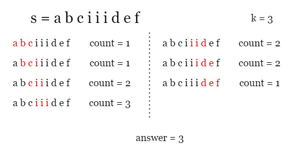
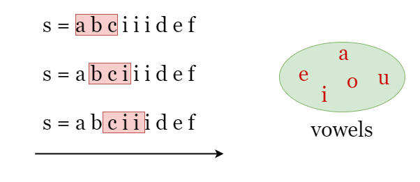
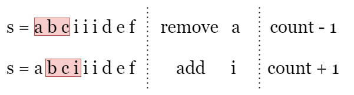

[TOC]

## Solution

---

### Overview

As shown in the picture below, given $s = abciiidef$ and $k = 3$, we can find all substrings of length $k = 3$ and count the number of vowel letters in each of them.



---

### Approach: Sliding Window

#### Intuition

We can use a sliding window to solve this problem. The term "subarray of length k" in the problem is actually equivalent to "window of length k". Since the length of the window (substring) is fixed as `k`, we only need to create a window at the leftmost side of the string `s`, and move it one character to the right each time. This way, the window can cover all subarrays of length `k`. Then, we simply count the number of vowels in each window and record the maximum count according to the requirement. As shown in the picture below, the window of length `3` is represented by the red box.



The problem is that if we count the number of vowels in each window by iteration every time, it would result in a time complexity of $O(\text{length\\\_of\\\_s}\cdot k)$ which could be expensive. However, by observation, we can see that two adjacent windows only differ by two characters. When we move the index of the right boundary of the window from $i - 1$ to `i`, only one character is added to the window while one is removed, Therefore, we can represent the new window by keeping track of the changes between adjacent windows

> Let `count` be the number of vowels in the current window `[i - k, i - 1]`. If we move the window one character to the right as `[i - k + 1, i]`.
> - If the newly added character $s[i]$ is a vowel, we increase `count` by 1.
> - If the newly removed character $s[i - k]$ is a vowel, we reduce `count` by 1.



That's it. While moving the window, we keep track of the changes between adjacent windows and count the number of vowels `count` in the current window as shown above, and update `answer` as the maximum `count` we have encountered.

<br>

#### Algorithm

1) Build a hash set `vowels` that contains all 5 vowel letters, initialize `answer` as 0.
2) Record the number of vowel letters in the first `k` letters as `count`.
3) Now we move the "window" to the right, let `i` be the index of its right boundary:
- If $s[i]$ is in `vowels`, increment `count` by `1.`
- If $s[i - k]$ is in `vowels`, reduce `count` by `1.`
- Update `answer` as the maximum `count` we have encountered.

4) Return `answer` after the iteration ends.

#### Implementation

```python
class Solution:
    def maxVowels(self, s: str, k: int) -> int:
        vowels = {'a', 'e', 'i', 'o', 'u'}

        # Build the window of size k, count the number of vowels it contains.
        count = 0
        for i in range(k):
            count += int(s[i] in vowels)
        answer = count

        # Slide the window to the right, focus on the added character and the
        # removed character and update "count". Record the largest "count".
        for i in range(k, len(s)):
            count += int(s[i] in vowels)
            count -= int(s[i - k] in vowels)
            answer = max(answer, count)

        return answer
```

#### Complexity Analysis

Let $n$ be the length of the input string `s`.

* Time complexity: $O(n)$

- We apply 1 iteration over `s`.
- At each step in the iteration, we check if the newly added character and the removed character are in `vowels`, which takes constant time.
- To sum up, the time complexity is $O(n)$.

* Space complexity: $O(1)$

- We need to record several parameters, `count` and `answer`, which takes $O(1)$ space.
- The set `vowels` contains 5 vowel letters which takes $O(1)$ space.

<br/>