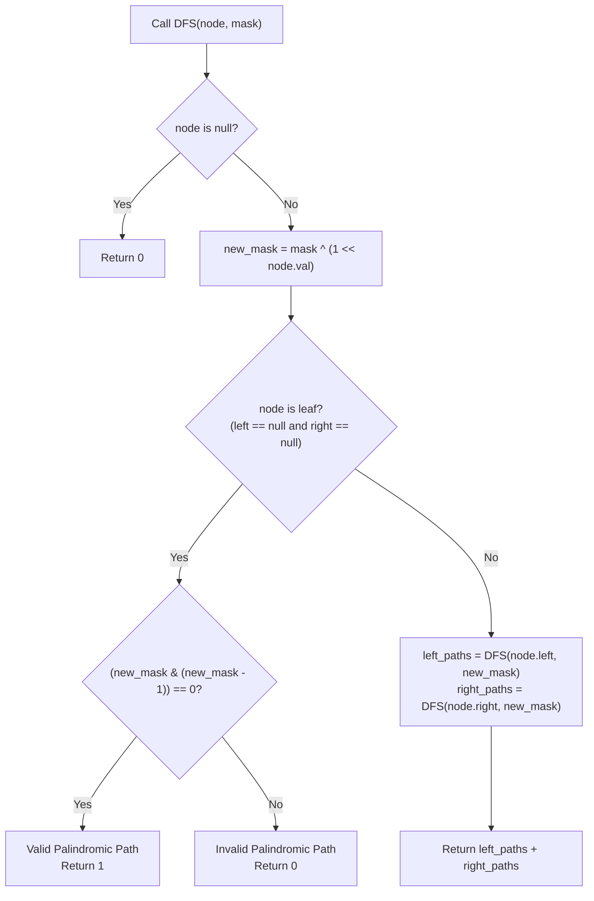

# Guided Example: Pseudo-Palindromic Paths in a Binary Tree

We trace the step-by-step depth-first search path tracking using parity bitmasks on a representative binary tree instance:

- **Input:** $root = [2, 3, 1, 3, 1, \text{null}, 1]$
- **Required Output:** $2$

This instance illustrates how node values along root-to-leaf paths accumulate digit frequencies, how parity flips can be modeled using bitwise XOR, and how the palindromic property is verified via the single-bit population check $(mask \ \& \ (mask - 1)) == 0$.

---

## 1. Instance & Teaching Goal

We are given a binary tree where each node holds a digit between $1$ and $9$. A root-to-leaf path is defined as **pseudo-palindromic** if the sequence of node values along that path can be permuted to form a palindrome. We must count the total number of pseudo-palindromic root-to-leaf paths.

A multiset of values can form a palindrome if and only if **at most one** value appears an odd number of times (all other values must appear an even number of times).

In the provided instance:
- Path 1 ($2 \to 3 \to 3$): Digits $\{2: 1, \, 3: 2\}$. Only digit $2$ has odd count. Can be arranged as $[3, 2, 3]$ (Palindrome!). **Valid** ($+1$).
- Path 2 ($2 \to 3 \to 1$): Digits $\{2: 1, \, 3: 1, \, 1: 1\}$. Three digits have odd counts. Cannot form a palindrome. Invalid.
- Path 3 ($2 \to 1 \to 1$): Digits $\{2: 1, \, 1: 2\}$. Only digit $2$ has odd count. Can be arranged as $[1, 2, 1]$ (Palindrome!). **Valid** ($+1$).
- Total pseudo-palindromic paths: $2$.

The primary teaching goal is to model digit frequency parity using a 9-bit integer bitmask, where visiting node $v$ toggles bit $v$ via XOR ($mask \oplus 2^v$), reducing path state verification to a single constant-time power-of-two check.

---

## 2. Conceptual Foundation & Invariants

Let $path$ be the sequence of digits from the root to a node $u$. For each digit $d \in \{1, \dots, 9\}$, let $\text{count}(d)$ be its frequency in $path$.
A path is pseudo-palindromic if and only if:

$$\sum_{d=1}^9 (\text{count}(d) \bmod 2) \le 1$$

We encode the parity of each digit's frequency as a binary bitmask $mask$:
- Bit $d$ is $1$ if $\text{count}(d)$ is odd.
- Bit $d$ is $0$ if $\text{count}(d)$ is even.

When visiting a node with value $v$, we update the mask:
$$mask_{\text{next}} = mask \oplus (1 \ll v)$$

At a leaf node (where $left = \text{null}$ and $right = \text{null}$), the mask has at most one bit set if and only if:
$$(mask_{\text{next}} \ \& \ (mask_{\text{next}} - 1)) = 0$$

```
Parity Bitmask Architecture:
Root (2): mask = 0 ^ (1 << 2) = 0000000100_2  (Digit 2 is odd)
  |
  +-- Left (3): mask = 0000000100 ^ (1 << 3) = 0000001100_2 (Digits 2, 3 odd)
  |     |
  |     +-- Left Leaf (3): mask = 0000001100 ^ (1 << 3) = 0000000100_2
  |     |   Only bit 2 set! (popcount = 1 <= 1) ==> VALID PALINDROME [3,2,3]
  |     |
  |     \-- Right Leaf (1): mask = 0000001100 ^ (1 << 1) = 0000001110_2
  |         Bits 1, 2, 3 set! (popcount = 3 > 1) ==> INVALID
  |
  \-- Right (1): mask = 0000000100 ^ (1 << 1) = 0000000110_2 (Digits 1, 2 odd)
        |
        \-- Right Leaf (1): mask = 0000000110 ^ (1 << 1) = 0000000100_2
            Only bit 2 set! (popcount = 1 <= 1) ==> VALID PALINDROME [1,2,1]
```

We establish tracking parameters across the traversal:

| Parameter | Type & Domain | Role in Algorithm |
|---|---|---|
| Node ($u$) | Tree node reference | Active vertex in depth-first traversal |
| Digit Value ($v$) | Integer $1 \le v \le 9$ | Node label toggling bit $v$ |
| Parity Mask ($mask$) | Integer $0 \le mask < 2^{10}$ | Binary representation of odd-frequency digits |
| Single Bit Test | Boolean | $(mask \ \& \ (mask - 1)) == 0$ testing popcount $\le 1$ |

> **Invariant.** For any path from the root to node $u$, bit $d$ of $mask$ is $1$ if and only if digit $d$ appears an odd number of times along that path.



---

## 3. Step-by-Step Worked Execution

We walk through the representative instance $root = [2, 3, 1, 3, 1, \text{null}, 1]$.

### Root Step
- Node: `val = 2`.
- Initial mask: $0$.
- Updated mask: $mask = 0 \oplus (1 \ll 2) = 4 = (100_2)$.
- Odd digits set: $\{2\}$.

### Left Subtree: Visit Node 3 (`val = 3`)
- Updated mask: $mask = 4 \oplus (1 \ll 3) = 4 \oplus 8 = 12 = (1100_2)$.
- Odd digits set: $\{2, 3\}$.
- **Branch A: Left Child of 3 (Leaf, `val = 3`):**
  - Path: $[2 \to 3 \to 3]$.
  - Updated mask: $12 \oplus (1 \ll 3) = 12 \oplus 8 = 4 = (100_2)$.
  - Check leaf: $(4 \ \& \ (4 - 1)) = (4 \ \& \ 3) = 0$.
  - Only bit $2$ is set ($1$ odd digit).
  - Outcome: **Valid Path 1** ($+1$).
- **Branch B: Right Child of 3 (Leaf, `val = 1`):**
  - Path: $[2 \to 3 \to 1]$.
  - Updated mask: $12 \oplus (1 \ll 1) = 12 \oplus 2 = 14 = (1110_2)$.
  - Check leaf: $(14 \ \& \ 13) = 12 \ne 0$.
  - Three bits set (digits $1, 2, 3$ are all odd).
  - Outcome: Invalid ($+0$).

### Right Subtree: Visit Node 1 (`val = 1`)
- From root mask $4$:
- Updated mask: $mask = 4 \oplus (1 \ll 1) = 4 \oplus 2 = 6 = (110_2)$.
- Odd digits set: $\{1, 2\}$.
- Node $1$ has no left child.
- **Branch C: Right Child of 1 (Leaf, `val = 1`):**
  - Path: $[2 \to 1 \to 1]$.
  - Updated mask: $6 \oplus (1 \ll 1) = 6 \oplus 2 = 4 = (100_2)$.
  - Check leaf: $(4 \ \& \ 3) = 0$.
  - Only bit $2$ is set ($1$ odd digit).
  - Outcome: **Valid Path 2** ($+1$).

Total valid paths: $1 + 0 + 1 = 2$.

| Path Sequence | Digit Multiset | Odd Count Digits | Bitmask Binary ($b_9 \dots b_1$) | Bitmask Integer | $(mask \ \& \ (mask - 1))$ | Palindromic? |
|---|---|---|---|---|---|---|
| $[2 \to 3 \to 3]$ | $\{2: 1, 3: 2\}$ | $\{2\}$ | $0000000100_2$ | 4 | $4 \ \& \ 3 = 0$ | **Yes (+1)** |
| $[2 \to 3 \to 1]$ | $\{2: 1, 3: 1, 1: 1\}$ | $\{1, 2, 3\}$ | $0000001110_2$ | 14 | $14 \ \& \ 13 = 12$ | No (+0) |
| $[2 \to 1 \to 1]$ | $\{2: 1, 1: 2\}$ | $\{2\}$ | $0000000100_2$ | 4 | $4 \ \& \ 3 = 0$ | **Yes (+1)** |

---

## 4. Complete Execution Trace

```
Final Traversal Summary:
Leaf 1 reached via [2, 3, 3] -> Odd digits: {2}    -> Can permute to [3, 2, 3] (VALID)
Leaf 2 reached via [2, 3, 1] -> Odd digits: {1,2,3}-> Cannot permute (INVALID)
Leaf 3 reached via [2, 1, 1] -> Odd digits: {2}    -> Can permute to [1, 2, 1] (VALID)
Total Valid Pseudo-Palindromic Paths: 2
```

| Leaf Node | Traversed Path | Final Parity State | Active Odd Digits Count | Valid Palindrome Example |
|---|---|---|---|---|
| Left Grandchild 3 | $[2, 3, 3]$ | $100_2$ | 1 | $[3, 2, 3]$ |
| Left Grandchild 1 | $[2, 3, 1]$ | $1110_2$ | 3 | None |
| Right Grandchild 1 | $[2, 1, 1]$ | $100_2$ | 1 | $[1, 2, 1]$ |

---

## 5. Algorithmic Correctness

**Soundness.** A sequence of characters can be arranged into a palindrome if and only if at most one character has an odd frequency. Bitwise XOR toggles each digit bit between $0$ (even) and $1$ (odd). The expression $(m \ \& \ (m - 1)) == 0$ is a classic bit manipulation theorem that evaluates to true if and only if $m$ has zero or one bit set. Hence, every path counted is mathematically guaranteed to be pseudo-palindromic.

**Completeness.** Depth-first search visits every root-to-leaf path in the tree. Because the parity bitmask is passed by value down the recursion stack, the mask at each leaf strictly reflects that leaf's unique ancestral path, ensuring all valid paths are counted without interference.

---

## 6. Traps This Instance Exposes

- **Evaluating Non-Leaf Nodes:** Checking the palindromic condition at internal nodes instead of strictly at leaves. The problem specifies *"paths going from the root node to leaf nodes"*.
- **Copying Full Frequency Arrays:** Passing arrays or hash tables of size $10$ down the recursion requires allocating and copying arrays at each node ($\mathcal{O}(N \cdot 10)$ allocation overhead). Bitwise integers provide $\mathcal{O}(1)$ updates and zero allocation overhead.
- **Handling Node Digits from 1 to 9:** Forgetting that digits are 1-indexed ($1 \dots 9$), so bitmask shifts must accommodate up to $1 \ll 9 = 512$. Using a 32-bit integer easily accommodates all 10 bits.

---

## 7. Complexity Derivation

- **Time Complexity:** $\mathcal{O}(N)$, where $N$ is the number of nodes in the binary tree ($N \le 10^5$). Each node is visited once during DFS. At each node, a bit shift and XOR take $\mathcal{O}(1)$ time. Leaf verification takes $\mathcal{O}(1)$ bitwise operations.
- **Auxiliary Space Complexity:** $\mathcal{O}(H)$, where $H$ is the height of the binary tree ($H \le N$), representing the depth-first search recursion call stack.