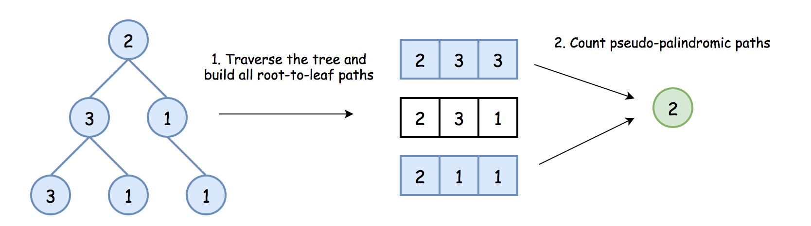
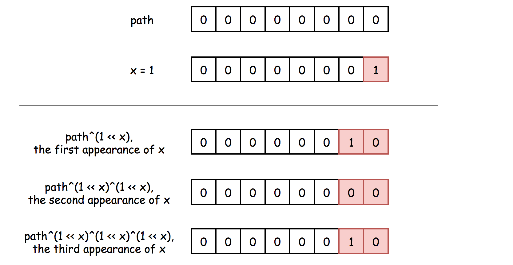
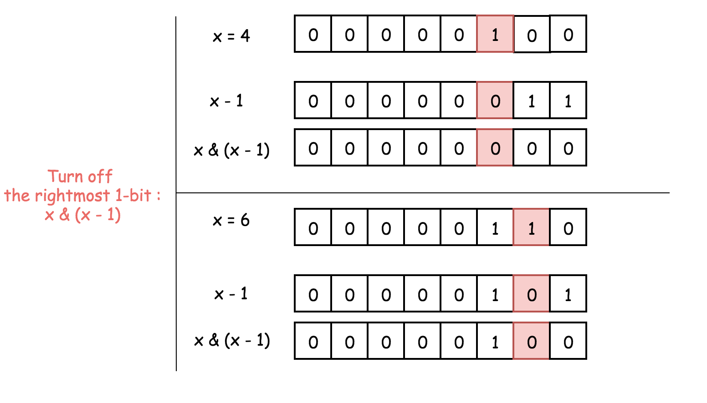
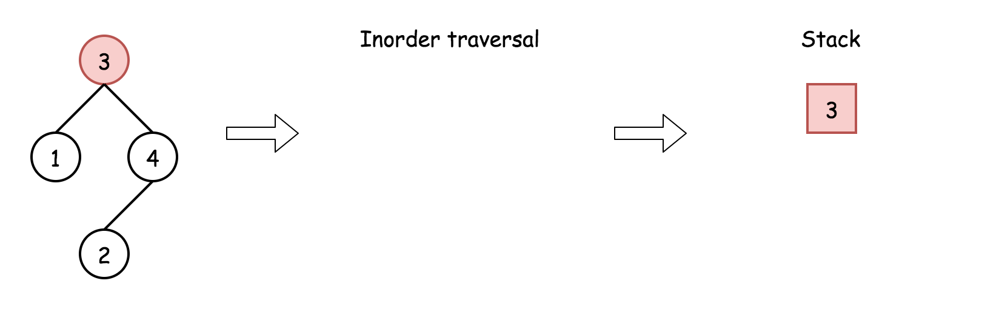
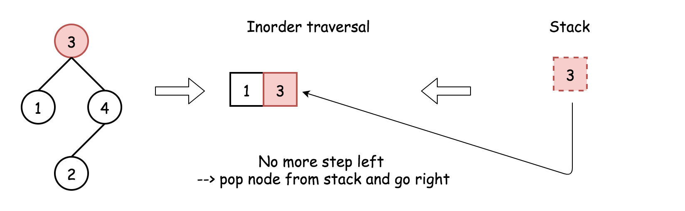

## Solution

---

### Overview

**Two subproblems**

The problem consists of two subproblems:

- Traverse the tree to build all root-to-leaf paths.

- For each root-to-leaf path, check if it's a pseudo-palindromic path or not.


*Figure 1. Two subproblems.*

**How to traverse the tree to build all root-to-leaf paths**

There are three DFS ways to traverse the tree: preorder, postorder and inorder. Please check two minutes picture explanation if you don't remember them quite well: [here is the Python version](https://leetcode.com/problems/binary-tree-inorder-traversal/discuss/283746/all-dfs-traversals-preorder-inorder-postorder-in-python-in-1-line) and [here is the Java version](https://leetcode.com/problems/binary-tree-inorder-traversal/discuss/328601/all-dfs-traversals-preorder-postorder-inorder-in-java-in-5-lines).


*Figure 2. The nodes are enumerated in the order of visits. To compare different DFS strategies, follow `1-2-3-4-5` direction.*

> Root-to-leaf traversal is so-called _DFS preorder traversal_. To implement it, one has to follow the straightforward strategy Root->Left->Right.

> There are three ways to implement preorder traversal: iterative, recursive, and Morris. Here we're going to implement the first two.

Iterative and recursive approaches here do the job in one pass, but they both need up to $\mathcal{O}(H)$ space to keep the stack, where $H$ is a tree height.

**How to check if the path is pseudo-palindromic or not**

> It's quite evident that the path is pseudo-palindromic if it has at most one digit with an odd frequency.

How to check that?

The straightforward way is to save each root-to-leaf path into a list and then check each digit for parity.

```python
def check_palindrom(nums):
    is_palindrom = 0

    for i in range(1, 10):
        if nums.count(i) % 2 == 1:
            is_palindrom += 1
            if is_palindrom > 1:
                return False

    return True
```

This method requires keeping each root-to-leaf path, and that becomes space-consuming for the large trees. To save space, let's compute the parity on the fly using bitwise operators.

> The idea is to keep the frequency of digit `1` in the first bit, `2` in the second bit, etc: $path ^= (1 << \text{node.val})$.

[Left shift operator]((https://wiki.python.org/moin/BitwiseOperators)) is used to define the bit, and [XOR operator](https://leetcode.com/problems/single-number-ii/solution/) - to compute the digit frequency.


*Figure 3. XOR of zero and a bit results in that bit. XOR of two equal bits (even if they are zeros) results in a zero. Hence, one could see the bit in a path only if it appears an odd number of times.*

```python
# compute occurences of each digit
# in the corresponding bit
path = path ^ (1 << node.val)
```

Now, to ensure that at most one digit has an odd frequency, one has to check that `path` is a [power of two](https://leetcode.com/problems/power-of-two/solution/), _i.e._, at most one bit is set to one. That could be done by turning off (= setting to 0) the rightmost 1-bit: $path \& (path - 1) = 0$. You might want to check the article [Power of Two](https://leetcode.com/problems/power-of-two/solution/) for the detailed explanation of this bitwise trick.


*Figure 4. $x \& (x - 1)$ is a way to set the rightmost 1-bit to zero, _i.e._, $x \& (x - 1) = 0$ for the power of two. To subtract 1 means to change the rightmost 1-bit to 0 and to set all the lower bits to 1. Now AND operator: the rightmost 1-bit will be turned off because $1 \& 0 = 0$, and all the lower bits as well.*

```python
# if it's a leaf,
# check that at most one digit has an odd frequency
if path & (path - 1) == 0:
    count += 1
```

<br />
<br />

---
### Approach 1: Iterative Preorder Traversal.

**Intuition**

Note: The visual below shows how a stack is used for an inorder traversal. The algorithm and implementation use a preorder traversal. These are both methods for depth-first search, and the only difference is the order in which the nodes are handled.







Here we implement standard iterative preorder traversal with the stack:

- Initialize the counter to zero.

- Push root into the stack.

- While the stack is not empty:

- Pop out a node from the stack and update the current number.

- If the node is a leaf, update the root-to-leaf path, check it for being pseudo-palindromic, and update the count.

- Push right and left child nodes into the stack.

- Return count.

**Implementation**

Note, that [Javadocs recommends using ArrayDeque, and not Stack as a stack implementation](https://docs.oracle.com/javase/8/docs/api/java/util/ArrayDeque.html).

```python
class Solution:
    def pseudoPalindromicPaths (self, root: TreeNode) -> int:
        count = 0

        stack = [(root, 0) ]
        while stack:
            node, path = stack.pop()
            if node is not None:
                # compute occurences of each digit
                # in the corresponding register
                path = path ^ (1 << node.val)
                # if it's a leaf, check if the path is pseudo-palindromic
                if node.left is None and node.right is None:
                    # check if at most one digit has an odd frequency
                    if path & (path - 1) == 0:
                        count += 1
                else:
                    stack.append((node.right, path))
                    stack.append((node.left, path))

        return count
```

**Complexity Analysis**

* Time complexity: $\mathcal{O}(N)$ since one has to visit each node, where $N$ is a number of nodes.

* Space complexity: up to $\mathcal{O}(H)$ to keep the stack, where $H$ is a tree height.
<br />
<br />

---
### Approach 2: Recursive Preorder Traversal.

Iterative approach 1 could be converted into a recursive one.

Recursive preorder traversal is extremely simple: follow Root->Left->Right direction, _i.e._, do all the business with the node (_i.e._, update the current path and the counter), and then do the recursive calls for the left and right child nodes.

P.S. Here is the difference between _preorder_ and the other DFS recursive traversals.


*Figure 5. The nodes are enumerated in the order of visits. To compare different DFS strategies, follow `1-2-3-4-5` direction.*

**Implementation**

```python
class Solution:
    def pseudoPalindromicPaths (self, root: TreeNode) -> int:
        def preorder(node, path):
            nonlocal count
            if node:
                # compute occurences of each digit
                # in the corresponding register
                path = path ^ (1 << node.val)
                # if it's a leaf, check if the path is pseudo-palindromic
                if node.left is None and node.right is None:
                    # check if at most one digit has an odd frequency
                    if path & (path - 1) == 0:
                        count += 1
                else:
                    preorder(node.left, path)
                    preorder(node.right, path)

        count = 0
        preorder(root, 0)
        return count
```

**Complexity Analysis**

* Time complexity: $\mathcal{O}(N)$ since one has to visit each node, check if at most one digit has an odd frequency.

* Space complexity: up to $\mathcal{O}(H)$ to keep the recursion stack, where $H$ is a tree height.
<br />
<br />

---
### Further Reading

The problem could be solved in constant space using the Morris inorder traversal algorithm, as it was done in [Sum Root-to-Leaf Numbers](https://leetcode.com/problems/sum-root-to-leaf-numbers/solution/). It is unlikely that one can come up with a Morris Traversal solution during an interview, but it is worth knowing anyway.

---