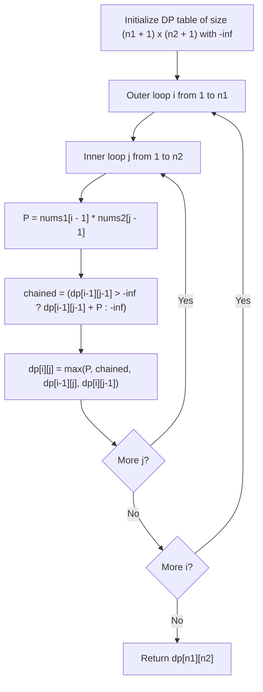

# Guided Example: Max Dot Product of Two Subsequences

We trace the step-by-step 2D dynamic programming grid evaluation over non-empty subsequence dot products on a representative problem instance:

- **Input:** $nums1 = [2, 1, -2, 5]$, $nums2 = [3, 0, -6]$
- **Required Output:** $18$

This instance illustrates both positive product accumulation ($2 \times 3 = 6$) and negative-times-negative reinforcement ($(-2) \times (-6) = 12$), while skipping non-contributing intermediate numbers ($1, 5, 0$) to achieve an optimal combined dot product of $18$.

---

## 1. Instance & Teaching Goal

We are given two integer arrays $nums1$ and $nums2$. We must choose two non-empty subsequences of equal length $k \ge 1$, say $A = [a_1, \dots, a_k]$ from $nums1$ and $B = [b_1, \dots, b_k]$ from $nums2$, to maximize their dot product:

$$\text{Dot Product}(A, B) = \sum_{m=1}^k a_m \cdot b_m$$

In the provided instance:
- $nums1 = [2, 1, -2, 5]$
- $nums2 = [3, 0, -6]$
- Selecting single-element subsequences:
  - $[2]$ and $[3] \implies 2 \times 3 = 6$.
  - $[-2]$ and $[-6] \implies (-2) \times (-6) = 12$.
  - $[5]$ and $[3] \implies 5 \times 3 = 15$.
- Selecting two-element subsequences:
  - $A = [2, -2]$ from $nums1$ and $B = [3, -6]$ from $nums2$.
  - $\text{Dot Product} = (2 \times 3) + ((-2) \times (-6)) = 6 + 12 = 18$.
- Maximum achievable dot product: $18$.

The primary teaching goal is to model sequence alignment dynamic programming where at each coordinate $(i, j)$, the product $nums1[i-1] \times nums2[j-1]$ can either initiate a new subsequence of length $1$, extend an existing non-empty optimal prefix, or be bypassed by skipping an element from either array.

---

## 2. Conceptual Foundation & Invariants

Let $dp[i][j]$ denote the maximum dot product achievable using non-empty equal-length subsequences from prefixes $nums1[0 \dots i-1]$ and $nums2[0 \dots j-1]$.

Let $P = nums1[i-1] \times nums2[j-1]$ be the product of the active coordinate pair.

At state $(i, j)$, there are four mutually exhaustive choices:
1. **Fresh Start:** Use only the single pair $(nums1[i-1], nums2[j-1])$, contributing $P$.
2. **Extend Prior Subsequence:** Chain $(nums1[i-1], nums2[j-1])$ after the best non-empty subsequences from $(i-1, j-1)$, contributing $dp[i-1][j-1] + P$.
3. **Skip $nums1[i-1]$:** Inherit the best result from $dp[i-1][j]$.
4. **Skip $nums2[j-1]$:** Inherit the best result from $dp[i][j-1]$.

Combining these choices yields the recurrence relation:

$$dp[i][j] = \max \Big( P, \; dp[i-1][j-1] + P, \; dp[i-1][j], \; dp[i][j-1] \Big)$$

**Base Conditions:**
$dp[0][j] = -\infty$ and $dp[i][0] = -\infty$ for all $i, j$, because at least one pair must be chosen (non-empty constraint).

```
2D Alignment Transition Grid:
                    nums2[j-1]
                   /
                  v
          dp[i-1][j-1] ----> dp[i-1][j] (Skip nums1[i-1])
               |                   |
               v                   v
nums1[i-1] dp[i][j-1] -----> dp[i][j] = max(P, dp[i-1][j-1] + P, dp[i-1][j], dp[i][j-1])
        (Skip nums2[j-1])
```

We establish tracking parameters across the algorithm:

| Parameter | Type & Domain | Role in Algorithm |
|---|---|---|
| Prefix Indices ($i, j$) | $1 \le i \le |nums1|, \, 1 \le j \le |nums2|$ | Current lengths of prefixes evaluated |
| Element Product ($P$) | Integer $[-10^6, 10^6]$ | Direct product $nums1[i-1] \times nums2[j-1]$ |
| Diagonal State ($dp[i-1][j-1]$) | Integer | Optimal dot product prior to pairing $i-1$ and $j-1$ |
| Cell Value ($dp[i][j]$) | Integer | Global maximum dot product for prefixes $i$ and $j$ |

> **Invariant.** For all $1 \le i \le |nums1|$ and $1 \le j \le |nums2|$, $dp[i][j]$ represents the exact maximum dot product among all non-empty equal-length subsequences chosen from $nums1[0 \dots i-1]$ and $nums2[0 \dots j-1]$.



---

## 3. Step-by-Step Worked Execution

We walk through the representative instance $nums1 = [2, 1, -2, 5]$ ($n_1 = 4$) and $nums2 = [3, 0, -6]$ ($n_2 = 3$).

### Row $i = 1$ ($nums1[0] = 2$)
- $j = 1$ ($nums2[0] = 3$): $P = 2 \times 3 = 6$. $dp[1][1] = 6$.
- $j = 2$ ($nums2[1] = 0$): $P = 2 \times 0 = 0$. $\max(0, dp[1][1]) = \max(0, 6) = 6$. $dp[1][2] = 6$.
- $j = 3$ ($nums2[2] = -6$): $P = 2 \times (-6) = -12$. $\max(-12, dp[1][2]) = 6$. $dp[1][3] = 6$.

### Row $i = 2$ ($nums1[1] = 1$)
- $j = 1$ ($nums2[0] = 3$): $P = 1 \times 3 = 3$. $\max(3, dp[1][1]) = \max(3, 6) = 6$. $dp[2][1] = 6$.
- $j = 2$ ($nums2[1] = 0$): $P = 0$. Chained: $dp[1][1] + 0 = 6$. $\max(0, 6, dp[1][2], dp[2][1]) = 6$. $dp[2][2] = 6$.
- $j = 3$ ($nums2[2] = -6$): $P = -6$. Chained: $dp[1][2] + (-6) = 0$. $\max(-6, 0, 6, 6) = 6$. $dp[2][3] = 6$.

### Row $i = 3$ ($nums1[2] = -2$)
- $j = 1$ ($nums2[0] = 3$): $P = -6$. $\max(-6, dp[2][1]) = 6$. $dp[3][1] = 6$.
- $j = 2$ ($nums2[1] = 0$): $P = 0$. Chained: $dp[2][1] + 0 = 6$. $\max = 6$. $dp[3][2] = 6$.
- $j = 3$ ($nums2[2] = -6$):
  - $P = (-2) \times (-6) = 12$.
  - Chained: $dp[2][2] + 12 = 6 + 12 = \mathbf{18}$.
  - Skips: $dp[2][3] = 6, dp[3][2] = 6$.
  - Cell value: $dp[3][3] = \max(12, 18, 6, 6) = \mathbf{18}$.

### Row $i = 4$ ($nums1[3] = 5$)
- $j = 1$ ($nums2[0] = 3$): $P = 5 \times 3 = 15$. $\max(15, dp[3][1]=6) = 15$. $dp[4][1] = 15$.
- $j = 2$ ($nums2[1] = 0$): $P = 0$. Chained: $dp[3][1] + 0 = 6$. $\max(0, 6, 6, 15) = 15$. $dp[4][2] = 15$.
- $j = 3$ ($nums2[2] = -6$):
  - $P = 5 \times (-6) = -30$.
  - Chained: $dp[3][2] + (-30) = 6 - 30 = -24$.
  - Skips: $dp[3][3] = 18, dp[4][2] = 15$.
  - Cell value: $dp[4][3] = \max(-30, -24, 18, 15) = \mathbf{18}$.

Final optimal dot product: $dp[4][3] = 18$.

| $dp[i][j]$ Table | Empty Prefix | $nums2[0] = 3$ | $nums2[1] = 0$ | $nums2[2] = -6$ |
|---|---|---|---|---|
| Empty Prefix | $-\infty$ | $-\infty$ | $-\infty$ | $-\infty$ |
| $nums1[0] = 2$ | $-\infty$ | 6 | 6 | 6 |
| $nums1[1] = 1$ | $-\infty$ | 6 | 6 | 6 |
| $nums1[2] = -2$ | $-\infty$ | 6 | 6 | **18** |
| $nums1[3] = 5$ | $-\infty$ | 15 | 15 | **18** |

---

## 4. Complete Execution Trace

```
Subsequence Construction Trace:
Pair 1: nums1[0] = 2,  nums2[0] = 3  ==> dot = 2 * 3 = 6
Pair 2: nums1[2] = -2, nums2[2] = -6 ==> dot = (-2) * (-6) = 12
Total Accumulated Dot Product: 6 + 12 = 18
Subsequences Chosen: nums1 -> [2, -2], nums2 -> [3, -6]
```

| Coordinate $(i, j)$ | Pair $(nums1[i-1], nums2[j-1])$ | Direct Product $P$ | Extended Product $dp[i-1][j-1] + P$ | Cell Output $dp[i][j]$ | Dominant Action |
|---|---|---|---|---|---|
| $(1, 1)$ | $(2, 3)$ | 6 | N/A | 6 | Fresh Start $(2 \times 3)$ |
| $(2, 1)$ | $(1, 3)$ | 3 | N/A | 6 | Skip $nums1[1]$ |
| $(3, 3)$ | $(-2, -6)$ | 12 | $6 + 12 = 18$ | **18** | **Chain with $(1, 1)$** |
| $(4, 1)$ | $(5, 3)$ | 15 | N/A | 15 | Fresh Start $(5 \times 3)$ |
| $(4, 3)$ | $(5, -6)$ | -30 | $6 - 30 = -24$ | **18** | Skip $nums1[3]$ |

---

## 5. Algorithmic Correctness

**Soundness.** Every valid equal-length subsequence pair corresponds to a monotonic sequence of index pairs $(i_1, j_1) < (i_2, j_2) < \dots < (i_k, j_k)$. The transition equation strictly enforces that if a pair is chained, its elements must come strictly after the previously paired elements.

**Completeness.** Since the recurrence considers starting a new subsequence of length $1$ at any pair $(i, j)$, extending any previously discovered non-empty optimal subsequence, or skipping either element, all possible common subsequence combinations are implicitly evaluated.

---

## 6. Traps This Instance Exposes

- **Allowing Empty Subsequences:** If $dp$ is initialized to $0$ and negative products are clobbered to $0$, instances where all pairs produce negative products (e.g. $nums1 = [-1], nums2 = [1]$) would falsely return $0$ instead of the required negative maximum ($-1$). Base cases must be $-\infty$.
- **Index Alignment in Subsequence Pairing:** Forgetting that subsequences must have equal length. One cannot pair two elements from $nums1$ with three elements from $nums2$; pairing is strictly 1-to-1.
- **Overwriting Optimal Chains with Greedy Positives:** At $(4, 1)$, $5 \times 3 = 15$ looks promising, but chaining $2 \times 3$ with $(-2) \times (-6)$ yields $18$. The DP correctly retains $18$ via the skip transition $dp[4][3] = dp[3][3]$.

---

## 7. Complexity Derivation

- **Time Complexity:** $\mathcal{O}(n_1 \cdot n_2)$, where $n_1 = |nums1|$ and $n_2 = |nums2|$ ($n_1, n_2 \le 500$). The algorithm fills a grid of size $(n_1 + 1) \times (n_2 + 1)$. Each cell computes a constant number of comparisons and additions ($\mathcal{O}(1)$). Total operations are at most $500 \times 500 = 2.5 \times 10^5$, running in milliseconds.
- **Auxiliary Space Complexity:** $\mathcal{O}(n_1 \cdot n_2)$ to store the 2D DP matrix, which can be optimized to $\mathcal{O}(n_2)$ by maintaining only the previous and current row.