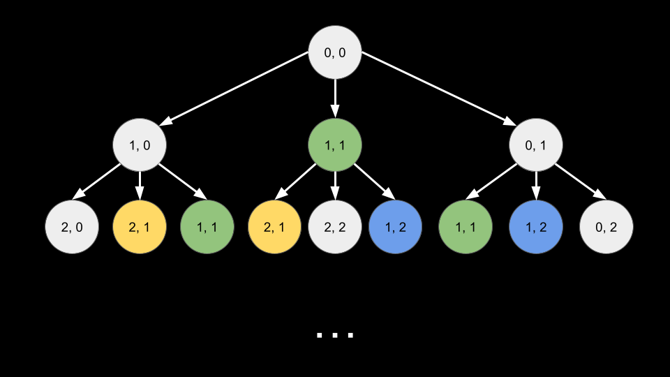

[TOC]

## Solution

---

### Approach 1: Top-Down Dynamic Programming

**Intuition**

> **Note.** For this approach, we assume that you already know the fundamentals of dynamic programming and are figuring out how to apply it to a wide range of problems, such as this one. If you are not yet at this stage, we recommend checking out our relevant [Explore Card content on dynamic programming](https://leetcode.com/explore/featured/card/dynamic-programming/) before coming back to this problem.

In this problem, we need to make decisions regarding which numbers to multiply with each other. If we use a pair of numbers, we cannot use them anymore in the future. We also must make the operations in a certain order. This is a perfect problem for dynamic programming because every decision we make will affect future decisions.

Let's define a function `dp(i, j)`. It will return the maximum dot product possible when considering:
- the suffix of `nums1` starting at index `i`.
- the suffix of `nums2` starting at index `j`.

The base case to this function is when $i = \text{nums1.length}$ or $j = \text{nums2.length}$. In this case, one of the arrays has been exhausted and it is impossible to have any dot product. Thus, we will `return 0`.

Now, how do we calculate a given state `dp(i, j)`? There are 3 options at each state.

1. We can multiply the numbers at $\text{nums}[i]$ and $\text{nums}[j]$ together. This will give us $\text{nums1}[i] * \text{nums2}[j]$, and then we move to the next indices. Thus, this option gives us a dot product of $\text{nums1}[i] * \text{nums2}[j] + dp(i + 1, j + 1)$.
2. We can move forward in `nums1`. This gives us a dot product of $dp(i + 1, j)$.
3. We can move forward in `nums2`. This gives us a dot product of $dp(i, j + 1)$.

We should take the maximum of these three options.

> You may recognize this process - this problem is very similar to [Longest Common Subsequence](https://leetcode.com/problems/longest-common-subsequence/)!

This recursive solution will work, but it is inefficient because each call to `dp` generates 3 more calls to `dp`, resulting in an exponential time complexity. In the following image, each node represents a function call, and nodes of the same color denote repeated computation.


<br>

To solve this, we will use **memoization**. The first time we calculate a given state `(i, j)`, we will store the result. In the future, we can simply refer to this stored value instead of having to re-calculate the state.

We are still missing something! Notice that in the problem description, it states that we must have **non-empty** subsequences. What would happen if we had an input like this:

- $nums1 = [-1, -4, -7]$
- $nums2 = [6, 2, 52]$

When all the elements in `nums1` are negative and all the elements in `nums2` are positive (or vice-versa), and no matter what operation is performed we get a negative value, then we would prefer to not perform any operation and get 0! However, the problem forces us to do at least one operation. We should try to minimize the "damage" (maximize this negative value) by choosing the largest negative value and the smallest positive value (choose the element with the smallest absolute value from each array).

**Algorithm**

1. Check the following special cases:
- If `max(nums1) < 0` and `min(nums2) > 0`, then $return max(nums1) * min(nums2)$.
- If `min(nums1) > 0` and `max(nums2) < 0`, then $return min(nums1) * max(nums2)$.
2. Define a memoized function `dp(i, j)`:
- If $i = \text{nums1.length}$ or $j = \text{nums2.length}$, then `return 0`.
- Set $use = \text{nums1}[i] * \text{nums2}[j] + dp(i + 1, j + 1)$. This is the dot product from using the current numbers.
- Return the maximum of $use, dp(i + 1, j), dp(i, j + 1)$.
3. Return `dp(0, 0)`, the answer to the original problem.

**Implementation**

```python
class Solution:
    def maxDotProduct(self, nums1: List[int], nums2: List[int]) -> int:
        @cache
        def dp(i, j):
            if i == len(nums1) or j == len(nums2):
                return 0

            use = nums1[i] * nums2[j] + dp(i + 1, j + 1)
            return max(use, dp(i + 1, j), dp(i, j + 1))

        if max(nums1) < 0 and min(nums2) > 0:
            return max(nums1) * min(nums2)

        if min(nums1) > 0 and max(nums2) < 0:
            return min(nums1) * max(nums2)

        return dp(0, 0)
```

**Complexity Analysis**

Given $n$ as the length of `nums1` and $m$ as the length of `nums2`,

* Time complexity: $O(n \cdot m)$

    Due to memoization, we only calculate each state `(i, j)` once. There are $n \cdot m$ states of `(i, j)`. To calculate a state, we simply take the maximum of three options, which costs $O(1)$.

* Space complexity: $O(n \cdot m)$

    We memoize `dp`, which requires us to store the answer to $O(n \cdot m)$ states.

<br/>

---

### Approach 2: Bottom-Up Dynamic Programming

**Intuition**

In the previous approach, we used recursion to start at the answer state `(0, 0)` and we made calls toward the base cases. The same algorithm can be implemented iteratively.

In bottom-up, we will start at the base cases and iterate toward the answer state. We do this by using a nested for loop over the state variables. We will start iterating `i` from the base case ($i = \text{nums1.length} - 1$) and within that loop, we will iterate `j` starting from $\text{nums2.length} - 1$.

Each inner loop iteration represents a state, and we can calculate the state the same way we did in the previous approach. We keep a 2d array called `dp`. Note that here, $\text{dp}[i][j]$ is equal to `dp(i, j)` from the previous approach.

We first consider using both the current numbers, resulting in $use = \text{nums1}[i] * \text{nums2}[j] + dp[i + 1][j + 1]$. Then, we consider skipping in both ways, resulting in $dp[i + 1][j]$ and $\text{dp}[i][j + 1]$. We set $\text{dp}[i][j]$ to the maximum of these three choices.

At the end, we simply return the value in $\text{dp}[0][0]$.

**Algorithm**

1. Check the following special cases:
- If `max(nums1) < 0` and `min(nums2) > 0`, then $return max(nums1) * min(nums2)$.
- If `min(nums1) > 0` and `max(nums2) < 0`, then $return min(nums1) * max(nums2)$.
2. Create a 2d table `dp` of size $(\text{nums1.length} + 1) * (\text{nums2.length} + 1)$.
3. Iterate `i` from $\text{nums1.length} - 1$ until `0`:
- Iterate `j` from $\text{nums2.length} - 1$ until `0`:
- Set $use = \text{nums1}[i] * \text{nums2}[j] + dp[i + 1][j + 1]$. This is the dot product from using the current numbers.
- Find maximum of $use, dp[i + 1][j], \text{dp}[i][j + 1]$. Store it in $\text{dp}[i][j]$.
4. Return $\text{dp}[0][0]$, the answer to the original problem.

**Implementation**

```python
class Solution:
    def maxDotProduct(self, nums1: List[int], nums2: List[int]) -> int:
        if max(nums1) < 0 and min(nums2) > 0:
            return max(nums1) * min(nums2)

        if min(nums1) > 0 and max(nums2) < 0:
            return min(nums1) * max(nums2)

        dp = [[0] * (len(nums2) + 1) for _ in range(len(nums1) + 1)]
        for i in range(len(nums1) - 1, -1, -1):
            for j in range(len(nums2) - 1, -1, -1):
                use = nums1[i] * nums2[j] + dp[i + 1][j + 1]
                dp[i][j] = max(use, dp[i + 1][j], dp[i][j + 1])

        return dp[0][0]
```

**Complexity Analysis**

Given $n$ as the length of `nums1` and $m$ as the length of `nums2`,

* Time complexity: $O(n \cdot m)$

    We only calculate each state `(i, j)` once - one state per inner for loop iteration. There are $n \cdot m$ states of `(i, j)`. To calculate a state, we simply take the maximum of three options, which costs $O(1)$.

* Space complexity: $O(n \cdot m)$

    The table `dp` takes $O(n \cdot m)$ space.

<br/>

---

### Approach 3: Space Optimized Dynamic Programming

**Intuition**

Notice that in the previous approach, each outer loop iteration focuses on calculating all values for $\text{dp}[i]$. However, we only rely on the values of $dp[i + 1]$ in this calculation. For example, let's say we have $i = 4$. We only reference $\text{dp}[4][...]$ and $\text{dp}[5][...]$, while the values in $\text{dp}[6]$, $\text{dp}[7]$, $\text{dp}[8]$ and so forth, become irrelevant to the current calculation.

Thus, we can save some space since we only need the results of the current and previous rows. We will flatten `dp` so it is a 1d array of length $\text{nums2.length} + 1$. We will also use a similarly sized array `prevDp`.

Here, `dp` is analogous to $\text{dp}[i]$, and `prevDp` is analogous to $dp[i + 1]$, since `prevDp` represents the previous row. In each outer loop iteration, we start by resetting `dp` to a clean state. Then, we calculate `dp` (like we would calculate $\text{dp}[i]$ in the previous approach) using the exact same process.

1. If we `use` the current numbers, the dot product is $\text{nums1}[i] * \text{nums2}[j] + prevDp[j + 1]$, since $prevDp[j + 1]$ is analogous to $dp[i + 1][j + 1]$ from the previous approach.
2. If we move forward in `nums1`, the dot product is $\text{prevDp}[j]$, analogous to $dp[i + 1][j]$ from the previous approach.
3. If we move forward in `nums2`, the dot product is $dp[j + 1]$, analogous to $\text{dp}[i][j + 1]$ from the previous approach.

After we finish calculating `dp`, we set $prevDp = dp$ so that in the next iteration, `prevDp` correctly represents $dp[i + 1]$.

**Algorithm**

1. Check the following special cases:
- If `max(nums1) < 0` and `min(nums2) > 0`, then $return max(nums1) * min(nums2)$.
- If `min(nums1) > 0` and `max(nums2) < 0`, then $return min(nums1) * max(nums2)$.
2. Create an array `dp` and an array `prevDp`, both of size $m = (\text{nums2.length} + 1)$.
3. Iterate `i` from $\text{nums1.length} - 1$ until `0`:
- Reset `dp`.
- Iterate `j` from $\text{nums2.length} - 1$ until `0`:
- Set $use = \text{nums1}[i] * \text{nums2}[j] + prevDp[j + 1]$. This is the dot product from using the current numbers.
- Find maximum of $use, \text{prevDp}[j], dp[j + 1]$. Store it in $\text{dp}[j]$.
- Update $prevDp = dp$.
4. Return $\text{dp}[0]$, the answer to the original problem.

**Implementation**

> Implementation tip: first, implement the previous approach. Now, to convert it to the space-optimized version, make the following replacements in the code:
>
> $\text{dp}[i] -> dp$
>
> $dp[i + 1] -> prevDp$
>
> Then you just need to reset `dp` at the start of each outer loop iteration and update `prevDp` at the end of each outer loop iteration.

```python
class Solution:
    def maxDotProduct(self, nums1: List[int], nums2: List[int]) -> int:
        if max(nums1) < 0 and min(nums2) > 0:
            return max(nums1) * min(nums2)

        if min(nums1) > 0 and max(nums2) < 0:
            return min(nums1) * max(nums2)

        m = len(nums2) + 1
        prev_dp = [0] * m
        dp = [0] * m

        for i in range(len(nums1) - 1, -1, -1):
            dp = [0] * m
            for j in range(len(nums2) - 1, -1, -1):
                use = nums1[i] * nums2[j] + prev_dp[j + 1]
                dp[j] = max(use, prev_dp[j], dp[j + 1])

            prev_dp = dp

        return dp[0]
```

**Complexity Analysis**

Given $n$ as the length of `nums1` and $m$ as the length of `nums2`,

* Time complexity: $O(n \cdot m)$

    We only calculate each state `(i, j)` once - one state per inner for loop iteration. There are $n \cdot m$ states of `(i, j)`. To calculate a state, we simply take the maximum of three options, which costs $O(1)$.

* Space complexity: $O(m)$

    We reduced space complexity by only requiring two 1d arrays of length $m$. Note that you could further improve it to $O(\min(n, m))$ if you were to compare the lengths of `nums1` and `nums2` before starting the algorithm, and then build `dp` along the shorter edge.

<br/>

---