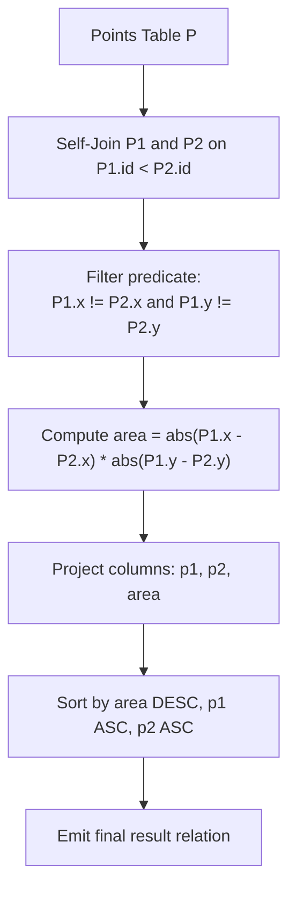

# Guided Example: Rectangles Area

We trace the step-by-step relational self-join, coordinate disparity filtering, and area calculation on a representative database instance:

- **Input:** Relation $Points$ containing three 2D coordinates:
  - Point 1: $(2, 7)$
  - Point 2: $(4, 8)$
  - Point 3: $(2, 10)$
- **Required Output:** Relation with columns $(p1, p2, area)$ ordered by $area \downarrow, p1 \uparrow, p2 \uparrow$.

---

## 1. Instance & Teaching Goal

We are given a database table $Points(id, x\_value, y\_value)$ where each row represents a unique 2D point on a Cartesian plane. Any two points can form the opposite diagonal corners of an axis-aligned rectangle. A rectangle has **non-zero area** if and only if the two points do not share the same horizontal or vertical line ($x_1 \ne x_2$ and $y_1 \ne y_2$).
- We must output each pair once, enforcing the canonical ordering constraint $p1 < p2$.
- Area is calculated as $|x_1 - x_2| \times |y_1 - y_2|$.
- Results must be sorted by $area$ descending, with ties broken by $p1$ ascending, then $p2$ ascending.

In the provided instance:
- Pair $(1, 2)$: $(2, 7)$ and $(4, 8) \implies |2 - 4| \times |7 - 8| = 2 \times 1 = 2 \ne 0$. Valid.
- Pair $(1, 3)$: $(2, 7)$ and $(2, 10) \implies |2 - 2| \times |7 - 10| = 0 \times 3 = 0$. Collinear on $x = 2$, degenerate area $0$. Invalid.
- Pair $(2, 3)$: $(4, 8)$ and $(2, 10) \implies |4 - 2| \times |8 - 10| = 2 \times 2 = 4 \ne 0$. Valid.
- Output sorted by area descending: $(2, 3, 4)$, then $(1, 2, 2)$.

The primary teaching goal is to model geometric pair generation in relational algebra using a strictly ordered self-join ($P_1.id < P_2.id$) combined with a non-degeneracy selection predicate ($\sigma_{x_1 \ne x_2 \land y_1 \ne y_2}$).

---

## 2. Conceptual Foundation & Invariants

Let $P_1$ and $P_2$ denote two aliases of the $Points$ relation.
We perform an inequality self-join:

$$J = P_1 \bowtie_{P_1.id < P_2.id} P_2$$

The strict inequality $P_1.id < P_2.id$ guarantees:
1. No point is paired with itself ($P_1.id \ne P_2.id$).
2. Each unordered pair of distinct points is considered exactly once.

We filter out collinear pairs that form horizontal or vertical line segments:

$$F = \sigma_{P_1.x\_value \ne P_2.x\_value \; \land \; P_1.y\_value \ne P_2.y\_value}(J)$$

For each qualifying pair in $F$, we compute the non-zero rectangle area:
$$\text{area} = |P_1.x\_value - P_2.x\_value| \cdot |P_1.y\_value - P_2.y\_value|$$

Finally, we project the output attributes and apply multi-attribute sorting:

$$R = \tau_{area \downarrow, \, p1 \uparrow, \, p2 \uparrow} \left( \Pi_{P_1.id \to p1, \, P_2.id \to p2, \, area}(F) \right)$$

```
Planar Coordinate Geometry:
  y ^
 10 |        (Point 3: 2, 10)
  9 |
  8 |                        (Point 2: 4, 8)
  7 |        (Point 1: 2, 7)
    +----------------------------------------> x
             2               4

Pair (1, 3): Same x-coord (x=2)  --> Area = |2-2| * |7-10| = 0 (DEGENERATE!)
Pair (1, 2): Diff x=2, Diff y=1  --> Area = 2 * 1 = 2 (VALID)
Pair (2, 3): Diff x=2, Diff y=2  --> Area = 2 * 2 = 4 (VALID)
```

We establish tracking parameters across the relational pipeline:

| Parameter | Type & Domain | Role in Algorithm |
|---|---|---|
| Primary Point ($P_1$) | Relation row $(id_1, x_1, y_1)$ | First corner of potential rectangle |
| Secondary Point ($P_2$) | Relation row $(id_2, x_2, y_2)$ | Opposite diagonal corner with $id_1 < id_2$ |
| Horizontal Span ($\Delta x$) | Integer $> 0$ | Distance $\lvert x_1 - x_2 \rvert$ |
| Vertical Span ($\Delta y$) | Integer $> 0$ | Distance $\lvert y_1 - y_2 \rvert$ |
| Rectangle Area | Integer $> 0$ | Product $\Delta x \cdot \Delta y$ |

> **Invariant.** A point pair $(P_1, P_2)$ produces an output row if and only if $P_1.id < P_2.id$, $P_1.x\_value \ne P_2.x\_value$, and $P_1.y\_value \ne P_2.y\_value$, ensuring that every reported area is strictly positive.



---

## 3. Step-by-Step Worked Execution

We walk through the representative instance with 3 points:
- Point 1: $(2, 7)$
- Point 2: $(4, 8)$
- Point 3: $(2, 10)$

### Step 1: Generate Candidate Pairs with $p_1 < p_2$
Possible pairs with $id_1 < id_2$:
1. Pair $(1, 2)$
2. Pair $(1, 3)$
3. Pair $(2, 3)$

### Step 2: Evaluate Coordinate Deltas and Areas

1. **Pair $(1, 2)$:**
   - Coordinates: $P_1 = (2, 7)$, $P_2 = (4, 8)$.
   - $\Delta x = |2 - 4| = 2$.
   - $\Delta y = |7 - 8| = 1$.
   - Check non-zero condition: $\Delta x > 0$ and $\Delta y > 0$ (Valid).
   - $\text{area} = 2 \times 1 = 2$.

2. **Pair $(1, 3)$:**
   - Coordinates: $P_1 = (2, 7)$, $P_3 = (2, 10)$.
   - $\Delta x = |2 - 2| = 0$.
   - $\Delta y = |7 - 10| = 3$.
   - Check non-zero condition: $\Delta x = 0$ (Collinear on vertical line $x = 2$).
   - $\text{area} = 0 \times 3 = 0$.
   - Disqualified.

3. **Pair $(2, 3)$:**
   - Coordinates: $P_2 = (4, 8)$, $P_3 = (2, 10)$.
   - Wait, here $id_1 = 2 < id_2 = 3$.
   - $\Delta x = |4 - 2| = 2$.
   - $\Delta y = |8 - 10| = 2$.
   - Check non-zero condition: $\Delta x > 0$ and $\Delta y > 0$ (Valid).
   - $\text{area} = 2 \times 2 = 4$.

### Step 3: Sort Qualifying Tuples
Qualifying tuples before sort:
- $(1, 2, 2)$
- $(2, 3, 4)$

Applying sorting criteria ($\text{area} \downarrow, \, p_1 \uparrow, \, p_2 \uparrow$):
- Area $4 > 2$, so tuple $(2, 3, 4)$ appears first.
- Tuple $(1, 2, 2)$ appears second.

| Pair $(P_1, P_2)$ | Corner Coordinates | $\Delta x = \lvert x_1 - x_2 \rvert$ | $\Delta y = \lvert y_1 - y_2 \rvert$ | Computed Area | Valid Non-zero Area? | Emitted Tuple |
|---|---|---|---|---|---|---|
| $(1, 2)$ | $(2,7), (4,8)$ | 2 | 1 | 2 | Yes | $(1, 2, 2)$ |
| $(1, 3)$ | $(2,7), (2,10)$ | 0 | 3 | 0 | **No (Degenerate)** | *Discarded* |
| $(2, 3)$ | $(4,8), (2,10)$ | 2 | 2 | 4 | Yes | $(2, 3, 4)$ |

---

## 4. Complete Execution Trace

```
Sorted Final Output Table:
+----+----+------+
| p1 | p2 | area |
+----+----+------+
| 2  | 3  |  4   |
| 1  | 2  |  2   |
+----+----+------+
Total candidate pairs: 3
Valid non-zero rectangles: 2
Degenerate lines discarded: 1 (pair 1-3)
```

| Output Rank | Point 1 ($p1$) | Point 2 ($p2$) | Diagonal Vertices | Width $\times$ Height | Emitted Area |
|---|---|---|---|---|---|
| 1 | 2 | 3 | $(4, 8), (2, 10)$ | $2 \times 2$ | 4 |
| 2 | 1 | 2 | $(2, 7), (4, 8)$ | $2 \times 1$ | 2 |

---

## 5. Algorithmic Correctness

**Soundness.** A pair of points on a 2D plane defines an axis-aligned rectangle of non-zero area if and only if their horizontal displacement $|x_1 - x_2|$ and vertical displacement $|y_1 - y_2|$ are both strictly non-zero. The algebraic predicate $x_1 \ne x_2 \land y_1 \ne y_2$ rigorously guarantees this property. Enforcing $p_1 < p_2$ ensures each geometric rectangle is output exactly once without inverted duplicates.

**Completeness.** Self-joining the entire $Points$ relation on $P_1.id < P_2.id$ exhaustively evaluates all $\binom{P}{2}$ possible point pairings. No candidate rectangle is omitted from consideration.

---

## 6. Traps This Instance Exposes

- **Duplicate Pairs with Inverted Order:** Joining on $P_1.id \ne P_2.id$ instead of $P_1.id < P_2.id$ would generate both $(2, 3, 4)$ and $(3, 2, 4)$, creating duplicate records. The condition $P_1.id < P_2.id$ is essential to enforce canonical representation.
- **Including Zero-Area Rectangles:** Pair $(1, 3)$ has $\Delta x = 0$. Its area is $0$. Omitting the predicate $x_1 \ne x_2 \land y_1 \ne y_2$ would emit $(1, 3, 0)$, violating the requirement that area must be non-zero.
- **Inverting Tie-Break Order:** Area must be sorted descending (`DESC`), whereas tie-breakers $p1$ and $p2$ must be sorted ascending (`ASC`).

---

## 7. Complexity Derivation

- **Time Complexity:** $\mathcal{O}(P^2 + R \log R)$, where $P$ is the number of points in the $Points$ table and $R \le \binom{P}{2}$ is the number of valid non-zero rectangles.
  - The inequality join examines $\frac{P(P - 1)}{2} = \mathcal{O}(P^2)$ pairs.
  - Filtering and computing area for each pair takes $\mathcal{O}(1)$ arithmetic operations.
  - Sorting the $R$ valid pairs requires $\mathcal{O}(R \log R)$ comparisons.
- **Auxiliary Space Complexity:** $\mathcal{O}(R)$ to buffer the generated rectangle tuples prior to sorting and presentation.
