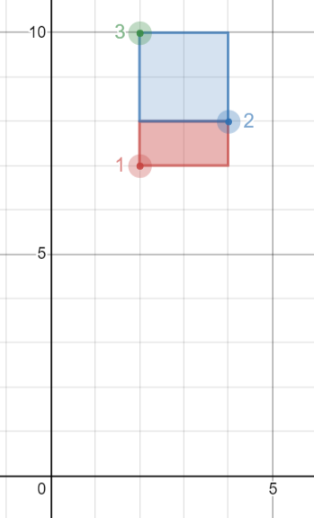

## Description

Table: `Points`

```
+---------------+---------+
| Column Name   | Type    |
+---------------+---------+
| id            | int     |
| x_value       | int     |
| y_value       | int     |
+---------------+---------+
id is the column with unique values for this table.
Each point is represented as a 2D coordinate (x_value, y_value).
```

Write a solution to report all possible **axis-aligned** rectangles with a **non-zero area** that can be formed by any two points from the `Points` table.

Each row in the result should contain three columns `(p1, p2, area)` where:

- `p1` and `p2` are the `id`'s of the two points that determine the opposite corners of a rectangle.

- `area` is the area of the rectangle and must be **non-zero**.

Return the result table **ordered** by `area` **in descending order**. If there is a tie, order them by `p1` **in ascending order**. If there is still a tie, order them by `p2` **in ascending order**.

The result format is in the following table.
### Function Contract

**Input**

- `Points(id, x_value, y_value)`: uniquely identified integer-coordinate
  points.

Let $P$ be the number of points, and let $R$ be the number of reported
non-degenerate point pairs.

**Return value**

Return columns `p1`, `p2`, and `area`. Represent each unordered pair once with
`p1 < p2`. A pair is valid only when its points differ in both coordinates, and
its area is

$$
\lvert x_1-x_2\rvert\,\lvert y_1-y_2\rvert.
$$

Order the rows by `area DESC, p1 ASC, p2 ASC`.

### Examples
#### Example 1



```
**Input:**
Points table:
+----------+-------------+-------------+
| id       | x_value     | y_value     |
+----------+-------------+-------------+
| 1        | 2           | 7           |
| 2        | 4           | 8           |
| 3        | 2           | 10          |
+----------+-------------+-------------+
**Output:**
+----------+-------------+-------------+
| p1       | p2          | area        |
+----------+-------------+-------------+
| 2        | 3           | 4           |
| 1        | 2           | 2           |
+----------+-------------+-------------+
**Explanation:**
The rectangle formed by p1 = 2 and p2 = 3 has an area equal to |4-2| * |8-10| = 4.
The rectangle formed by p1 = 1 and p2 = 2 has an area equal to |2-4| * |7-8| = 2.
Note that the rectangle formed by p1 = 1 and p2 = 3 is invalid because the area is 0.
```