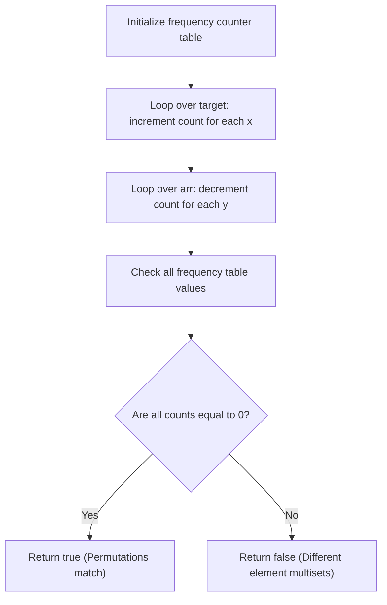

# Guided Example: Make Two Arrays Equal by Reversing Subarrays

We trace the step-by-step equivalence between subarray reversals and multiset equality verification on a representative problem instance:

- **Input:** $target = [1, 2, 3, 4]$, $arr = [2, 4, 1, 3]$
- **Required Output:** `true`

This instance illustrates how reversing arbitrary subarrays encompasses adjacent element transpositions, enabling any permutation to be synthesized provided the underlying element frequency distributions match.

---

## 1. Instance & Teaching Goal

We are given two integer arrays of equal length, $target$ and $arr$. In a single operation, we may choose any non-empty contiguous subarray of $arr$ and reverse it in place. We are allowed to perform this operation an arbitrary number of times. We must determine whether it is possible to transform $arr$ into $target$.

In the provided instance:
- $target = [1, 2, 3, 4]$
- $arr = [2, 4, 1, 3]$
- A sequence of subarray reversals transforms $arr$ into $target$:
  1. Reverse subarray $arr[0 \dots 2] = [2, 4, 1] \implies arr$ becomes $[1, 4, 2, 3]$.
  2. Reverse subarray $arr[1 \dots 2] = [4, 2] \implies arr$ becomes $[1, 2, 4, 3]$.
  3. Reverse subarray $arr[2 \dots 3] = [4, 3] \implies arr$ becomes $[1, 2, 3, 4]$.
- $arr$ matches $target$ exactly; output is `true`.

The primary teaching goal is to recognize the algebraic group property: reversing a subarray of length $2$ is an adjacent swap $(i, i+1)$. Because adjacent swaps generate the full symmetric group $S_n$, any permutation of elements can be achieved. Thus, the problem reduces to verifying whether $arr$ and $target$ are multiset permutations of each other.

---

## 2. Conceptual Foundation & Invariants

Let $\mathcal{M}(A)$ denote the multiset (frequency mapping) of elements in array $A$:

$$\mathcal{M}(A) = \{ x \mapsto \text{count}(x \text{ in } A) \}$$

Reversing any subarray $[L, R]$ changes only the positions of elements, preserving the multiset of values:
$$\mathcal{M}(\text{reverse}(arr, L, R)) = \mathcal{M}(arr)$$

Because reversals of length $2$ permit swapping any adjacent pair of elements $(arr[i], arr[i+1])$, and adjacent transpositions suffice to sort or rearrange an array into any arbitrary order (by the correctness of Bubble Sort), the reachability condition is:

$$\text{arr can be transformed into target} \iff \mathcal{M}(arr) = \mathcal{M}(target)$$

Testing multiset equality is achieved in two ways:
1. **Frequency Array / Hash Map:** Increment counts for each element in $target$, decrement for each in $arr$. The arrays are transformable if and only if all net counts are zero.
2. **Sorting:** Sort both arrays; they are transformable if and only if $\text{sorted}(arr) = \text{sorted}(target)$.

```
Permutation Equivalence Pipeline:
arr = [2, 4, 1, 3]
  |  Reverse [0..2] ([2, 4, 1] -> [1, 4, 2])
  v
[1, 4, 2, 3]
  |  Reverse [1..2] ([4, 2] -> [2, 4])
  v
[1, 2, 4, 3]
  |  Reverse [2..3] ([4, 3] -> [3, 4])
  v
[1, 2, 3, 4]  <=====> Exactly matches target!

Algebraic Fact:
Subarray reversals of size 2 generate all permutations (S_n).
Therefore: Can transform <=> Multiset(arr) == Multiset(target).
```

We establish tracking parameters across the algorithm:

| Parameter | Type & Domain | Role in Algorithm |
|---|---|---|
| Value ($v$) | Integer $1 \le v \le 1000$ | Element key evaluated in frequency map |
| Frequency Delta | Integer $\mathbb{Z}$ | Net count difference: $\text{count}_{target}(v) - \text{count}_{arr}(v)$ |
| Balance Invariant | Boolean | True if all balance counters equal zero |

> **Invariant.** The array $arr$ can be transformed into $target$ via finite subarray reversals if and only if every element value occurs with identical frequency in both arrays.



---

## 3. Step-by-Step Worked Execution

We walk through the representative instance $target = [1, 2, 3, 4]$ and $arr = [2, 4, 1, 3]$.

### Phase 1: Frequency Accumulation
Initialize integer array $count$ of size $1001$ with zeros.

1. **Scan $target = [1, 2, 3, 4]$:**
   - $target[0] = 1 \implies count[1] \leftarrow +1$
   - $target[1] = 2 \implies count[2] \leftarrow +1$
   - $target[2] = 3 \implies count[3] \leftarrow +1$
   - $target[3] = 4 \implies count[4] \leftarrow +1$
   - State: $\{1: +1, \, 2: +1, \, 3: +1, \, 4: +1\}$.

2. **Scan $arr = [2, 4, 1, 3]$:**
   - $arr[0] = 2 \implies count[2] \leftarrow 1 - 1 = 0$
   - $arr[1] = 4 \implies count[4] \leftarrow 1 - 1 = 0$
   - $arr[2] = 1 \implies count[1] \leftarrow 1 - 1 = 0$
   - $arr[3] = 3 \implies count[3] \leftarrow 1 - 1 = 0$
   - State: $\{1: 0, \, 2: 0, \, 3: 0, \, 4: 0\}$.

### Phase 2: Zero-Balance Inspection
- Every entry in $count$ equals $0$.
- Both arrays possess identical elements and frequencies.
- Result evaluates to `true`.

### Contrasting Negative Instance: $target = [3, 7, 9]$, $arr = [3, 7, 11]$
- Add target: $count[3] = +1, count[7] = +1, count[9] = +1$.
- Subtract arr: $count[3] = 0, count[7] = 0, count[11] = -1$.
- Net non-zero entries: $count[9] = +1$ and $count[11] = -1$.
- Cannot be transformed $\implies$ `false`.

| Element Key | Target Occurrences | Array Occurrences | Net Balance | Balanced Status |
|---|---|---|---|---|
| 1 | 1 | 1 | $1 - 1 = 0$ | Balanced |
| 2 | 1 | 1 | $1 - 1 = 0$ | Balanced |
| 3 | 1 | 1 | $1 - 1 = 0$ | Balanced |
| 4 | 1 | 1 | $1 - 1 = 0$ | Balanced |

---

## 4. Complete Execution Trace

```
Multi-Step Bubble-Reversal Simulation:
Initial State: arr = [2, 4, 1, 3]

Step 1: Reverse subarray indices [0..2]:
  arr[0..2] was [2, 4, 1] -> reversed is [1, 4, 2]
  New arr = [1, 4, 2, 3]

Step 2: Reverse subarray indices [1..2]:
  arr[1..2] was [4, 2] -> reversed is [2, 4]
  New arr = [1, 2, 4, 3]

Step 3: Reverse subarray indices [2..3]:
  arr[2..3] was [4, 3] -> reversed is [3, 4]
  New arr = [1, 2, 3, 4]

Target Reached: [1, 2, 3, 4] == target [1, 2, 3, 4]
Result: true
```

| Operation Step | Selected Interval | Subarray Before | Subarray After | Resulting Array State | Target Matched? |
|---|---|---|---|---|---|
| Initial | - | - | - | $[2, 4, 1, 3]$ | No |
| Reverse 1 | $[0 \dots 2]$ | $[2, 4, 1]$ | $[1, 4, 2]$ | $[1, 4, 2, 3]$ | No |
| Reverse 2 | $[1 \dots 2]$ | $[4, 2]$ | $[2, 4]$ | $[1, 2, 4, 3]$ | No |
| Reverse 3 | $[2 \dots 3]$ | $[4, 3]$ | $[3, 4]$ | $[1, 2, 3, 4]$ | **Yes (true)** |

---

## 5. Algorithmic Correctness

**Soundness.** Reversing an arbitrary subarray does not create, destroy, or change the values of any elements. If $arr$ can be transformed into $target$, their element multisets must be identical.

**Completeness.** Reversing a subarray of length $2$ swaps two adjacent elements without affecting any other elements in the array. Since the set of adjacent transpositions generates all $n!$ permutations of an $n$-element array, any two arrays that share the same multiset can be transformed into each other using a finite sequence of adjacent swaps. Hence, multiset equality is both necessary and sufficient.

---

## 6. Traps This Instance Exposes

- **Simulating Explicit Reversals:** Attempting to search for the shortest sequence of reversals using breadth-first search or backtracking leads to exponential factorial complexity $\mathcal{O}(n!)$. Recognizing the multiset equality invariant reduces the problem to linear time.
- **Set vs. Multiset:** Using unique sets instead of counting duplicates. If $target = [1, 1, 2]$ and $arr = [1, 2, 2]$, both have the same distinct values $\{1, 2\}$, but unequal counts. Frequency counting is mandatory.
- **Array Length Mismatch:** If lengths differ, equality is impossible; however, problem constraints guarantee $|target| = |arr|$.

---

## 7. Complexity Derivation

- **Time Complexity:** $\mathcal{O}(n)$, where $n = |target| = |arr|$ ($n \le 1000$).
  - A single pass increments counts for $target$ in $\mathcal{O}(n)$ time.
  - A second pass decrements counts for $arr$ in $\mathcal{O}(n)$ time.
  - A final scan over the value domain takes $\mathcal{O}(\max V) \le 1000$ operations.
  - Total time is strictly linear $\mathcal{O}(n)$.
- **Auxiliary Space Complexity:** $\mathcal{O}(\max V) = \mathcal{O}(1)$ to maintain a fixed-size frequency table of $1001$ integers.
