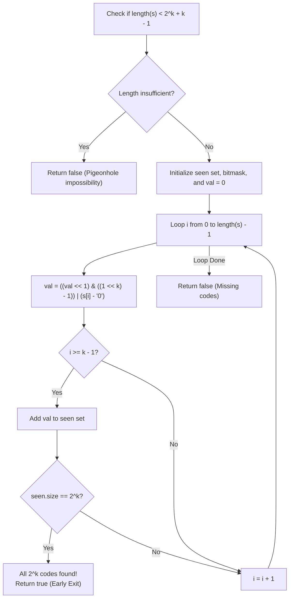

# Guided Example: Check If a String Contains All Binary Codes of Size K

We trace the step-by-step rolling hash bitmask extraction and distinct $k$-bit pattern tracking on a representative problem instance:

- **Input:** $s = \text{"00110110"}$, $k = 2$
- **Required Output:** `true`

This instance illustrates how all $2^k = 4$ binary permutations of length $2$ (`"00"`, `"01"`, `"10"`, `"11"`) are discovered through a continuous sliding window across the binary string.

---

## 1. Instance & Teaching Goal

We are given a binary string $s$ and an integer $k$. We must determine whether every binary code of length $k$ occurs as a contiguous substring of $s$.
- The total number of distinct binary codes of length $k$ is exactly $2^k$.
- A string $s$ contains all binary codes if and only if the number of distinct length-$k$ substrings extracted from $s$ equals $2^k$.

In the provided instance:
- Length $k = 2$, requiring $2^2 = 4$ distinct patterns: `"00"`, `"01"`, `"10"`, `"11"`.
- Substrings of length $2$ in `"00110110"`:
  - At index $0$: `"00"`
  - At index $1$: `"01"`
  - At index $2$: `"11"`
  - At index $3$: `"10"`
  - At index $4$: `"01"` (duplicate)
  - At index $5$: `"11"` (duplicate)
  - At index $6$: `"10"` (duplicate)
- Distinct patterns observed: $\{\text{"00"}, \text{"01"}, \text{"10"}, \text{"11"}\}$.
- All $4$ patterns are present; output evaluates to `true`.

The primary teaching goal is to model pattern completeness testing using a rolling integer bitmask: shifting left by $1$, masking out high bits with $((1 \ll k) - 1)$, and recording seen codes in a hash set or boolean array until the cardinality reaches the target threshold $2^k$.

---

## 2. Conceptual Foundation & Invariants

Let $\mathcal{B}_k = \{0, 1\}^k$ be the language of all binary words of length $k$, with cardinality $|\mathcal{B}_k| = 2^k$.

1. **Length Pre-condition:** A string of length $|s|$ has at most $|s| - k + 1$ substrings of length $k$. Therefore, if:
   $$|s| < 2^k + k - 1$$
   it is mathematically impossible to contain all $2^k$ codes, allowing immediate rejection (`false`).

2. **Rolling Bitmask Formulation:** Rather than slicing substrings of length $k$, we maintain a rolling integer value $val$:
   $$val_{\text{next}} = ((val \ll 1) \ \& \ ((1 \ll k) - 1)) \mid (s[i] - \text{'0'})$$
   where:
   - $(val \ll 1)$ shifts existing bits to the left.
   - $\& \ ((1 \ll k) - 1)$ clears any bit exceeding length $k$.
   - $\mid (s[i] - \text{'0'})$ incorporates the new bit at position $0$.

3. **Early Exit Invariant:** As soon as the set of observed codes reaches size $2^k$, we can terminate the search early and return `true`.

```
Rolling Window Bitmask Trace (k = 2, mask = 3 = 11_2):
String s:   0   0   1   1   0   1   1   0
Window:    [00]
            [01]
                [11]
                    [10]

Binary Integer Values:
Index 1: "00" -> 0 (00_2) ==> Add 0
Index 2: "01" -> 1 (01_2) ==> Add 1
Index 3: "11" -> 3 (11_2) ==> Add 3
Index 4: "10" -> 2 (10_2) ==> Add 2
Seen Set: {0, 1, 2, 3} -> Size 4 == 2^2! (TARGET REACHED -> Return true)
```

We establish tracking parameters across the algorithm:

| Parameter | Type & Domain | Role in Algorithm |
|---|---|---|
| Target Count ($2^k$) | Integer $2 \le 2^k \le 2^{20}$ | Number of distinct patterns required |
| Active Window End ($i$) | Integer $k - 1 \le i < |s|$ | Scan pointer over binary string |
| Rolling Value ($val$) | Integer $0 \le val < 2^k$ | Integer representation of the current $k$-bit window |
| Distinct Seen Codes | Set / Boolean array | Tracks observed pattern identifiers |

> **Invariant.** After scanning character $s[i]$ ($i \ge k - 1$), the rolling integer $val$ represents the exact binary value of $s[i - k + 1 \dots i]$, and the seen set holds all unique length-$k$ codes occurring in the prefix $s[0 \dots i]$.



---

## 3. Step-by-Step Worked Execution

We walk through the representative instance $s = \text{"00110110"}$ with $k = 2$ ($2^k = 4$, bitmask $((1 \ll 2) - 1) = 3 = 11_2$).

### Window Processing Trace

1. **$i = 0$ ($s[0] = \text{'0'}$):**
   - $val = ((0 \ll 1) \ \& \ 3) \mid 0 = 0$.
   - $i < k - 1$ ($0 < 1$). Window incomplete; proceed.

2. **$i = 1$ ($s[1] = \text{'0'}$):**
   - $val = ((0 \ll 1) \ \& \ 3) \mid 0 = 0 = (00_2)$.
   - Window complete: substring is `"00"`.
   - Insert $0$ into $seen \implies seen = \{0\}$.
   - Cardinality: $1 < 4$.

3. **$i = 2$ ($s[2] = \text{'1'}$):**
   - $val = ((0 \ll 1) \ \& \ 3) \mid 1 = 1 = (01_2)$.
   - Window complete: substring is `"01"`.
   - Insert $1$ into $seen \implies seen = \{0, 1\}$.
   - Cardinality: $2 < 4$.

4. **$i = 3$ ($s[3] = \text{'1'}$):**
   - $val = ((1 \ll 1) \ \& \ 3) \mid 1 = (2 \ \& \ 3) \mid 1 = 2 \mid 1 = 3 = (11_2)$.
   - Window complete: substring is `"11"`.
   - Insert $3$ into $seen \implies seen = \{0, 1, 3\}$.
   - Cardinality: $3 < 4$.

5. **$i = 4$ ($s[4] = \text{'0'}$):**
   - $val = ((3 \ll 1) \ \& \ 3) \mid 0 = (6 \ \& \ 3) \mid 0 = 2 \mid 0 = 2 = (10_2)$.
   - Window complete: substring is `"10"`.
   - Insert $2$ into $seen \implies seen = \{0, 1, 2, 3\}$.
   - Cardinality: $4 == 2^k = 4$.
   - **Target Complete!** All $2^k$ codes have been discovered. Early exit with `true`.

Remaining characters at indices $5, 6, 7$ are skipped.

| Step $i$ | Character $s[i]$ | Previous $val$ | Updated $val$ (Binary) | Window Substring | Unique Codes Observed | Target Check |
|---|---|---|---|---|---|---|
| 0 | `'0'` | 0 | $00_2$ (0) | `"0"` (partial) | $\emptyset$ | Buffering |
| 1 | `'0'` | 0 | $00_2$ (0) | `"00"` | $\{00\}$ | $1 / 4$ |
| 2 | `'1'` | 0 | $01_2$ (1) | `"01"` | $\{00, 01\}$ | $2 / 4$ |
| 3 | `'1'` | 1 | $11_2$ (3) | `"11"` | $\{00, 01, 11\}$ | $3 / 4$ |
| 4 | `'0'` | 3 | $10_2$ (2) | `"10"` | $\{00, 01, 11, 10\}$ | **4 / 4 (Target Met!)** |

---

## 4. Complete Execution Trace

```
Final Binary Pattern Verification (k = 2):
Expected Codes: {"00", "01", "10", "11"} (Total: 4)
First Discovered Positions:
  "00" -> Index [0..1]
  "01" -> Index [1..2]
  "11" -> Index [2..3]
  "10" -> Index [3..4]
All 4 codes identified by index 4.
Early Exit Triggered.
Result: true
```

| Binary Code String | Integer Key | First Occurrence Range in $s$ | Seen Confirmation |
|---|---|---|---|
| `"00"` | 0 | $s[0 \dots 1]$ | Confirmed |
| `"01"` | 1 | $s[1 \dots 2]$ | Confirmed |
| `"10"` | 2 | $s[3 \dots 4]$ | Confirmed |
| `"11"` | 3 | $s[2 \dots 3]$ | Confirmed |

---

## 5. Algorithmic Correctness

**Soundness.** The rolling bitmask computes $val = \sum_{j=0}^{k-1} (s[i - j] - \text{'0'}) \cdot 2^j$. Each integer $0 \le val < 2^k$ uniquely represents a distinct binary string of length $k$. Recording unique integer values in a hash set or boolean array guarantees that only genuine contiguous occurrences are counted.

**Completeness.** Traversal visits every starting index from $0$ to $|s| - k$ in order. Since every length-$k$ substring is mapped to its integer value, no pattern present in the string can be omitted. Terminating early when the count reaches $2^k$ is correct because the count can never decrease.

---

## 6. Traps This Instance Exposes

- **String Slicing Memory Overhead:** Calling `s.substring(i, i + k)` or `s[i:i+k]` allocates a new string object at every index. For $|s| \le 5 \times 10^5$ and $k \le 20$, allocating half a million strings incurs heavy garbage collection and memory pressure. Bitwise rolling integers consume $\mathcal{O}(1)$ allocation.
- **Missing Pigeonhole Impossibility Check:** If $k = 20$, $2^{20} \approx 10^6$. If $|s| = 5 \times 10^5$, $|s| < 2^{20}$, making it impossible to contain all codes. Checking `if len(s) < (1 << k) + k - 1: return False` prevents redundant processing.
- **Bitmask Overflow:** Forgetting to mask with $(1 \ll k) - 1$ causes high bits to accumulate without bound, corrupting the $k$-bit window value.

---

## 7. Complexity Derivation

- **Time Complexity:** $\mathcal{O}(|s|)$, where $|s| \le 5 \times 10^5$.
  - At each character index, bit shifts, bitwise AND, and OR operations take $\mathcal{O}(1)$ time.
  - Adding the integer to a hash set or direct-access boolean array of size $2^k$ takes $\mathcal{O}(1)$ time.
  - Total time is strictly linear $\mathcal{O}(|s|)$.
- **Auxiliary Space Complexity:** $\mathcal{O}(2^k)$ to store the set of seen codes, which for $k \le 20$ can be backed by a bitset of size $2^k$ bits (e.g. $2^{20}\text{ bits} \approx 128\text{ KB}$).
