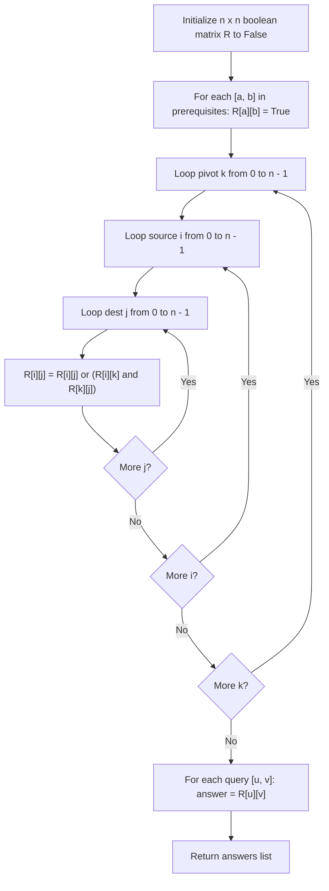

# Guided Example: Course Schedule IV

We trace the step-by-step construction of the reachability matrix using Floyd-Warshall transitive closure on a representative directed acyclic graph instance:

- **Input:** $numCourses = 3$, $prerequisites = [[1, 2], [1, 0], [2, 0]]$, $queries = [[1, 0], [1, 2], [0, 1], [2, 1]]$
- **Required Output:** `[true, true, false, false]`

This instance features direct prerequisites ($1 \to 2$ and $1 \to 0$), indirect multi-hop dependencies ($1 \to 2 \to 0$), and non-reachable backward queries ($0 \to 1$), demonstrating full transitive closure on course dependency networks.

---

## 1. Instance & Teaching Goal

We are given $numCourses$ courses labeled $0$ to $numCourses - 1$, a list of direct prerequisite edges where $[a, b]$ denotes that course $a$ must be taken before course $b$ ($a \to b$), and a list of queries $[u, v]$. We must determine for each query whether course $u$ is a direct or indirect prerequisite of course $v$. The dependency graph is guaranteed to have no cycles (a DAG).

In the provided instance:
- Course 1 is a direct prerequisite of Course 2 ($1 \to 2$).
- Course 1 is a direct prerequisite of Course 0 ($1 \to 0$).
- Course 2 is a direct prerequisite of Course 0 ($2 \to 0$).
- Transitive relations:
  - Course 1 reaches Course 0 both directly and through intermediate Course 2 ($1 \to 2 \to 0$).
  - Course 0 has no outgoing edges; it is a prerequisite to nothing.
  - Course 2 reaches Course 0, but does not reach Course 1.
- Query evaluations:
  - $[1, 0] \implies \text{true}$ (reachable).
  - $[1, 2] \implies \text{true}$ (reachable).
  - $[0, 1] \implies \text{false}$ (unreachable).
  - $[2, 1] \implies \text{false}$ (unreachable).

The primary teaching goal is to model transitive reachability across a DAG using a 2D boolean reachability matrix. Because $numCourses \le 100$, precomputing the full transitive closure via Floyd-Warshall ($\mathcal{O}(V^3)$) allows each query to be answered in $\mathcal{O}(1)$ time.

---

## 2. Conceptual Foundation & Invariants

Let $G = (V, E)$ be the directed prerequisite graph with vertex set $V = \{0, \dots, n - 1\}$ and edge set $E = \{ (a, b) \mid [a, b] \in prerequisites \}$.
Course $u$ is a prerequisite of $v$ if and only if there exists a directed path from $u$ to $v$ in $G$:

$$u \rightsquigarrow v$$

We represent reachability via a boolean matrix $R$ of dimensions $n \times n$:

**Base Initialization:**
$$R[i][j] = \begin{cases} \text{true} & \text{if } (i, j) \in E \\ \text{false} & \text{otherwise} \end{cases}$$

**Floyd-Warshall Transitive Closure:**
For each intermediate pivot $k \in \{0, \dots, n-1\}$:
For each source $i \in \{0, \dots, n-1\}$:
For each destination $j \in \{0, \dots, n-1\}$:
$$R[i][j] \leftarrow R[i][j] \lor (R[i][k] \land R[k][j])$$

Once the matrix $R$ is fully saturated, answering any query $[u, v]$ simply retrieves $R[u][v]$.

```
Directed Graph Topology:
       (1)
      /   \
     v     v
   (2) --> (0)

Direct Edges: (1 -> 2), (1 -> 0), (2 -> 0)
Indirect Path: 1 -> 2 -> 0 confirms 1 is prerequisite of 0.

Reachability Matrix R:
      To:  0      1      2
From:
  0     False  False  False
  1     True   False  True
  2     True   False  False
```

We establish tracking parameters across the algorithm:

| Parameter | Type & Domain | Role in Algorithm |
|---|---|---|
| Intermediate Pivot ($k$) | Integer $0 \le k < n$ | Stepping-stone vertex evaluated for path bridging |
| Source Vertex ($i$) | Integer $0 \le i < n$ | Origin course in reachability query |
| Destination Vertex ($j$) | Integer $0 \le j < n$ | Target course dependent on source course |
| Reachability Cell ($R[i][j]$) | Boolean | True if a directed path exists from $i$ to $j$ |

> **Invariant.** After intermediate vertex $k$ has been processed by the outer loop, $R[i][j]$ is true if and only if there exists a directed path from $i$ to $j$ using only intermediate vertices from the subset $\{0, 1, \dots, k\}$.



---

## 3. Step-by-Step Worked Execution

We walk through the representative instance with $numCourses = 3$, edges $\{ (1, 2), (1, 0), (2, 0) \}$, and queries $[[1, 0], [1, 2], [0, 1], [2, 1]]$.

### Step 1: Matrix Initialization ($R$)
Direct edges:
- $R[1][2] = \text{true}$
- $R[1][0] = \text{true}$
- $R[2][0] = \text{true}$
All other cells are $\text{false}$.

Initial Matrix:
$$\begin{bmatrix} F & F & F \\ T & F & T \\ T & F & F \end{bmatrix}$$

### Step 2: Floyd-Warshall Iterations

1. **Pivot $k = 0$:**
   - No vertex has an outgoing edge from $0$ ($R[0][j] = \text{false}$ for all $j$).
   - No new paths bridged through vertex $0$.
2. **Pivot $k = 1$:**
   - Edges from $1$: $R[1][0] = T, R[1][2] = T$.
   - But no vertex reaches $1$ ($R[i][1] = \text{false}$ for all $i$).
   - No new paths bridged through vertex $1$.
3. **Pivot $k = 2$:**
   - Path into $2$: $R[1][2] = \text{true}$.
   - Path out of $2$: $R[2][0] = \text{true}$.
   - Bridging check: $R[1][0] \leftarrow R[1][0] \lor (R[1][2] \land R[2][0]) = T \lor (T \land T) = \text{true}$.
   - $R[1][0]$ was already $\text{true}$; confirmed.

Final saturated reachability matrix:
$$\begin{bmatrix} F & F & F \\ T & F & T \\ T & F & F \end{bmatrix}$$

### Step 3: Answering Queries
1. Query $[1, 0]$: Check $R[1][0] \implies \mathbf{true}$.
2. Query $[1, 2]$: Check $R[1][2] \implies \mathbf{true}$.
3. Query $[0, 1]$: Check $R[0][1] \implies \mathbf{false}$.
4. Query $[2, 1]$: Check $R[2][1] \implies \mathbf{false}$.

Output list: `[true, true, false, false]`.

| Source Course $i$ | Target Course $j$ | Direct Edge? | Indirect Path Through $k$? | Reachable ($R[i][j]$)? | Query Match |
|---|---|---|---|---|---|
| 1 | 0 | Yes ($1 \to 0$) | Yes ($1 \to 2 \to 0$) | **True** | `[1, 0]` $\to$ `true` |
| 1 | 2 | Yes ($1 \to 2$) | Direct | **True** | `[1, 2]` $\to$ `true` |
| 0 | 1 | No | None (0 has out-degree 0) | **False** | `[0, 1]` $\to$ `false` |
| 2 | 1 | No | None (Acyclic graph) | **False** | `[2, 1]` $\to$ `false` |

---

## 4. Complete Execution Trace

```
Reachability Query Resolution:
Query 1: [1, 0] -> Can 1 reach 0? Path exists: (1 -> 0)       ==> true
Query 2: [1, 2] -> Can 1 reach 2? Path exists: (1 -> 2)       ==> true
Query 3: [0, 1] -> Can 0 reach 1? No path (0 is sink)         ==> false
Query 4: [2, 1] -> Can 2 reach 1? No path (would form cycle)  ==> false
Final Result Array: [true, true, false, false]
```

| Query Index | Queried Pair $[u, v]$ | Matrix Lookup Coordinate | Boolean Value Retrieved | Semantic Meaning |
|---|---|---|---|---|
| 0 | $[1, 0]$ | $R[1][0]$ | `true` | Course 1 is prerequisite of Course 0 |
| 1 | $[1, 2]$ | $R[1][2]$ | `true` | Course 1 is prerequisite of Course 2 |
| 2 | $[0, 1]$ | $R[0][1]$ | `false` | Course 0 is NOT prerequisite of Course 1 |
| 3 | $[2, 1]$ | $R[2][1]$ | `false` | Course 2 is NOT prerequisite of Course 1 |

---

## 5. Algorithmic Correctness

**Soundness.** A directed path from $i$ to $j$ exists if and only if there is a direct edge $(i, j)$ or an intermediate sequence $i \to k \to j$. The triple-nested loop evaluates every possible intermediate pivot $k \in V$. Whenever $R[i][k]$ and $R[k][j]$ are both true, a valid concatenated path from $i$ to $j$ exists.

**Completeness.** By induction on the set of allowed intermediate vertices $\{0, \dots, k\}$, the Floyd-Warshall algorithm guarantees that upon completion, $R[i][j]$ is true for every pair $(i, j)$ connected by any directed path, ensuring no reachable relationship is missed.

---

## 6. Traps This Instance Exposes

- **Per-Query Traversal Overhead:** Running an independent BFS or DFS for each query takes $\mathcal{O}(|queries| \cdot (V + E))$. With $|queries| \le 10^4$ and $V = 100$, this results in up to $10^4 \times 100 \approx 10^6$ operations. Precomputing the transitive closure via Floyd-Warshall takes only $100^3 = 10^6$ operations once, answering all subsequent queries in $\mathcal{O}(1)$ time.
- **Direction Inversion:** Conflating $prerequisites[i] = [a, b]$ with taking $b$ before $a$. The contract states *"you must take course $a$ first if you want to take course $b$"*, which means the directed path flows $a \to b$.
- **Ignoring Transitive Chains:** Checking only direct prerequisites misses long chains (e.g. $a \to b \to c \to d$), resulting in false negatives for indirect dependencies.

---

## 7. Complexity Derivation

- **Time Complexity:** $\mathcal{O}(V^3 + Q)$, where $V = numCourses \le 100$ and $Q = |queries| \le 10^4$.
  - Matrix initialization takes $\mathcal{O}(V^2 + |prerequisites|)$ time.
  - Floyd-Warshall transitive closure performs $V^3 = 100^3 = 10^6$ bitwise operations.
  - Answering $Q$ queries requires $Q \times \mathcal{O}(1) \le 10^4$ lookups.
  - Total time is $\approx 10^6$ operations, executing in under $15$ milliseconds.
- **Auxiliary Space Complexity:** $\mathcal{O}(V^2)$ to store the $100 \times 100$ boolean reachability matrix.
