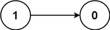
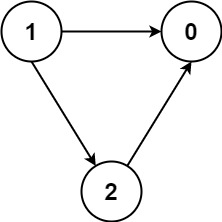

### 1. Description

There are a total of `numCourses` courses you have to take, labeled from `0` to $numCourses - 1$. You are given an array `prerequisites` where $\text{prerequisites}[i] = [a_{i}, b_{i}]$ indicates that you **must** take course $a_{i}$ first if you want to take course $b_{i}$.

- For example, the pair `[0, 1]` indicates that you have to take course `0` before you can take course `1`.

Prerequisites can also be **indirect**. If course `a` is a prerequisite of course `b`, and course `b` is a prerequisite of course `c`, then course `a` is a prerequisite of course `c`.

You are also given an array `queries` where $\text{queries}[j] = [u_{j}, v_{j}]$. For the $$j^{\text{th}}$$ query, you should answer whether course $u_{j}$ is a prerequisite of course $v_{j}$ or not.

Return *a boolean array *`answer`*, where *$\text{answer}[j]$* is the answer to the *$$j^{\text{th}}$$* query.*

### 2. Function Contract

- `n`: Input parameter.
- Returns expected result.

### 3. Examples

#### Example 1

- **Input:** $numCourses = 2, prerequisites = [[1,0]], queries = [[0,1],[1,0]]$
- **Output:** `[false,true]`
- **Explanation:** The pair [1, 0] indicates that you have to take course 1 before you can take course 0.
Course 0 is not a prerequisite of course 1, but the opposite is true.
#### Example 2

- **Input:** $numCourses = 2, prerequisites = [], queries = [[1,0],[0,1]]$
- **Output:** `[false,false]`
- **Explanation:** There are no prerequisites, and each course is independent.
#### Example 3

- **Input:** $numCourses = 3, prerequisites = [[1,2],[1,0],[2,0]], queries = [[1,0],[1,2]]$
- **Output:** `[true,true]`

### 4. Constraints

- $2 \le numCourses \le 100$

- $0 \le \text{prerequisites.length} \le (numCourses * (numCourses - 1) / 2)$

- $\text{prerequisites}[i].length = 2$

- $0 \le a_{i}, b_{i} \le numCourses - 1$

- $a_{i} \neq b_{i}$

- All the pairs $[a_{i}, b_{i}]$ are **unique**.

- The prerequisites graph has no cycles.

- $1 \le \text{queries.length} \le 10^{4}$

- $0 \le u_{i}, v_{i} \le numCourses - 1$

- $u_{i} \neq v_{i}$