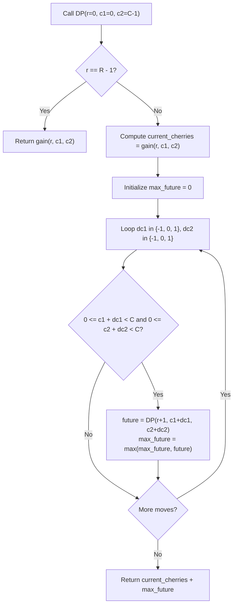

# Guided Example: Cherry Pickup II

We trace the step-by-step 3D dynamic programming progression for two synchronized robots collecting cherries on a representative grid instance:

- **Input:** $grid = [[3,1,1],[2,5,1],[1,5,5],[2,1,1]]$
- **Required Output:** $24$

This instance illustrates row-synchronized dual-path traversal, spatial boundary avoidance, non-overlapping vs. overlapping cell evaluation, and 9-way move branching.

---

## 1. Instance & Teaching Goal

We are given an $R \times C$ matrix $grid$ representing a field of cherries. Two robots collect cherries starting from the top row and moving downward to the bottom row:
- **Robot 1** starts at top-left $(0, 0)$.
- **Robot 2** starts at top-right $(0, C - 1)$.
- At each row $r$, both robots advance simultaneously to row $r + 1$. A robot at column $c$ can transition to $c - 1, c$, or $c + 1$ (provided the target column remains in $[0, C - 1]$).
- If both robots occupy distinct cells $(c_1 \ne c_2)$, both collect their respective cherries: $grid[r][c_1] + grid[r][c_2]$.
- If both robots land on the same cell $(c_1 = c_2)$, the cherries are collected only once: $grid[r][c_1]$.
- We must find the maximum total cherries collected by both robots upon reaching the bottom row $R - 1$.

In the provided instance:
- $R = 4$ rows, $C = 3$ columns.
- Row 0: Robot 1 at $c_1 = 0$ (cherries: $3$), Robot 2 at $c_2 = 2$ (cherries: $1$). Picked: $3 + 1 = 4$.
- Row 1: Robot 1 moves to $c_1 = 0$ (cherries: $2$), Robot 2 moves to $c_2 = 1$ (cherries: $5$). Picked: $2 + 5 = 7$.
- Row 2: Robot 1 moves to $c_1 = 1$ (cherries: $5$), Robot 2 moves to $c_2 = 2$ (cherries: $5$). Picked: $5 + 5 = 10$.
- Row 3: Robot 1 moves to $c_1 = 0$ (cherries: $2$), Robot 2 moves to $c_2 = 2$ (cherries: $1$). Picked: $2 + 1 = 3$.
- Total cherries collected: $4 + 7 + 10 + 3 = 24$.

The primary teaching goal is to model synchronized multi-agent planning via dynamic programming state $(r, c_1, c_2)$: because both robots advance downward by exactly one row at every step, their vertical coordinate $r$ is identical, reducing the state space from 4D to 3D.

---

## 2. Conceptual Foundation & Invariants

Let $DP(r, c_1, c_2)$ denote the maximum cherries collected from row $r$ down to the bottom row $R - 1$ given that Robot 1 is at $(r, c_1)$ and Robot 2 is at $(r, c_2)$.

**Harvest Function:**
$$\text{gain}(r, c_1, c_2) = \begin{cases} grid[r][c_1] & \text{if } c_1 = c_2 \\ grid[r][c_1] + grid[r][c_2] & \text{if } c_1 \ne c_2 \end{cases}$$

**Base Case ($r = R - 1$):**
$$DP(R - 1, c_1, c_2) = \text{gain}(R - 1, c_1, c_2)$$

**Recurrence Transition ($0 \le r < R - 1$):**
Both robots can choose column shifts $\Delta c_1, \Delta c_2 \in \{-1, 0, 1\}$. There are $3 \times 3 = 9$ candidate next-column pairs $(c_1 + \Delta c_1, \, c_2 + \Delta c_2)$:

$$DP(r, c_1, c_2) = \text{gain}(r, c_1, c_2) + \max_{\substack{\Delta c_1 \in \{-1,0,1\} \\ \Delta c_2 \in \{-1,0,1\} \\ 0 \le c_1 + \Delta c_1 < C \\ 0 \le c_2 + \Delta c_2 < C}} DP(r + 1, \, c_1 + \Delta c_1, \, c_2 + \Delta c_2)$$

```
3D Row Synchronized State Space:
Row 0:   (R1: 0)                     (R2: 2)   --> Harvest: 3 + 1 = 4
            |  \                     /  |
            v   v                   v   v
Row 1:   (R1: 0)                   (R2: 1)     --> Harvest: 2 + 5 = 7
            \                       /   |
             v                     v    v
Row 2:         (R1: 1)          (R2: 2)        --> Harvest: 5 + 5 = 10
              /                     |
             v                      v
Row 3:   (R1: 0)                (R2: 2)        --> Harvest: 2 + 1 = 3
Total Cherries = 4 + 7 + 10 + 3 = 24
```

We establish tracking parameters across the dynamic programming engine:

| Parameter | Type & Domain | Role in Algorithm |
|---|---|---|
| Row Index ($r$) | Integer $0 \le r < R$ | Current synchronized vertical level of both robots |
| Robot 1 Column ($c_1$) | Integer $0 \le c_1 < C$ | Horizontal coordinate of Robot 1 |
| Robot 2 Column ($c_2$) | Integer $0 \le c_2 < C$ | Horizontal coordinate of Robot 2 |
| Immediate Gain | Integer $\ge 0$ | Cherries picked on current row ($\text{gain}(r, c_1, c_2)$) |
| Suffix Maximum | Integer $\ge 0$ | Best cherries achievable from $(r, c_1, c_2)$ down to $R-1$ |

> **Invariant.** For every legal state $(r, c_1, c_2)$, $DP(r, c_1, c_2)$ equals the optimal cherry yield obtainable from row $r$ through row $R - 1$ under optimal subsequent moves for both robots.



---

## 3. Step-by-Step Worked Execution

We walk through the representative instance $grid = [[3, 1, 1], [2, 5, 1], [1, 5, 5], [2, 1, 1]]$ ($4 \times 3$).

### Bottom-Up Evaluation by Row

#### Row 3 (Base Case $r = 3$)
- For each valid pair $(c_1, c_2)$, $DP(3, c_1, c_2) = \text{gain}(3, c_1, c_2)$:
  - $(0, 2) \implies grid[3][0] + grid[3][2] = 2 + 1 = 3$.
  - $(1, 2) \implies grid[3][1] + grid[3][2] = 1 + 1 = 2$.
  - $(0, 1) \implies grid[3][0] + grid[3][1] = 2 + 1 = 3$.
  - $(1, 1) \implies grid[3][1] = 1$.

#### Row 2 ($r = 2$)
We compute $DP(2, 1, 2)$:
- Current gain: $grid[2][1] + grid[2][2] = 5 + 5 = 10$.
- Available transitions to row 3:
  - From $c_1 = 1$: can go to $\{0, 1, 2\}$.
  - From $c_2 = 2$: can go to $\{1, 2\}$.
- Best transition pair: $c_1' = 0, c_2' = 2$, where $DP(3, 0, 2) = 3$.
- $DP(2, 1, 2) = 10 + 3 = 13$.

#### Row 1 ($r = 1$)
We compute $DP(1, 0, 1)$:
- Current gain: $grid[1][0] + grid[1][1] = 2 + 5 = 7$.
- Available transitions to row 2:
  - From $c_1 = 0$: can go to $\{0, 1\}$.
  - From $c_2 = 1$: can go to $\{0, 1, 2\}$.
- Best transition pair: $c_1' = 1, c_2' = 2$, where $DP(2, 1, 2) = 13$.
- $DP(1, 0, 1) = 7 + 13 = 20$.

#### Row 0 ($r = 0$, Start Position $c_1 = 0, c_2 = 2$)
- Current gain: $grid[0][0] + grid[0][2] = 3 + 1 = 4$.
- Available transitions to row 1:
  - From $c_1 = 0$: can go to $\{0, 1\}$.
  - From $c_2 = 2$: can go to $\{1, 2\}$.
- Best transition pair: $c_1' = 0, c_2' = 1$, where $DP(1, 0, 1) = 20$.
- $DP(0, 0, 2) = 4 + 20 = 24$.

Total maximal cherries: $24$.

| Row $r$ | Robot 1 Pos $(r, c_1)$ | Robot 2 Pos $(r, c_2)$ | Cells Distinct? | Row Harvest Gain | Future Suffix Yield | Cumulative Optimal |
|---|---|---|---|---|---|---|
| 0 | $(0, 0)$ | $(0, 2)$ | Yes ($0 \ne 2$) | $3 + 1 = 4$ | 20 (to row 1) | **24** |
| 1 | $(1, 0)$ | $(1, 1)$ | Yes ($0 \ne 1$) | $2 + 5 = 7$ | 13 (to row 2) | 20 |
| 2 | $(2, 1)$ | $(2, 2)$ | Yes ($1 \ne 2$) | $5 + 5 = 10$ | 3 (to row 3) | 13 |
| 3 | $(3, 0)$ | $(3, 2)$ | Yes ($0 \ne 2$) | $2 + 1 = 3$ | 0 (terminal) | 3 |

---

## 4. Complete Execution Trace

```
Optimal Robot Trajectory:
Row 0: Robot 1 at col 0 (3) | Robot 2 at col 2 (1) | Row sum: 4  | Total: 4
Row 1: Robot 1 at col 0 (2) | Robot 2 at col 1 (5) | Row sum: 7  | Total: 11
Row 2: Robot 1 at col 1 (5) | Robot 2 at col 2 (5) | Row sum: 10 | Total: 21
Row 3: Robot 1 at col 0 (2) | Robot 2 at col 2 (1) | Row sum: 3  | Total: 24
Final Harvested Cherries: 24
```

| Traversal Stage | Robot 1 Decision | Robot 2 Decision | Coordinates $(r, c_1, c_2)$ | Cell Values Harvested | Running Sum |
|---|---|---|---|---|---|
| Start | Anchor at $(0, 0)$ | Anchor at $(0, 2)$ | $(0, 0, 2)$ | $grid[0][0]=3, grid[0][2]=1$ | 4 |
| Step 1 | Down ($\Delta c=0$) | Left ($\Delta c=-1$) | $(1, 0, 1)$ | $grid[1][0]=2, grid[1][1]=5$ | 11 |
| Step 2 | Right ($\Delta c=+1$) | Right ($\Delta c=+1$) | $(2, 1, 2)$ | $grid[2][1]=5, grid[2][2]=5$ | 21 |
| Step 3 | Left ($\Delta c=-1$) | Down ($\Delta c=0$) | $(3, 0, 2)$ | $grid[3][0]=2, grid[3][2]=1$ | 24 |

---

## 5. Algorithmic Correctness

**Soundness.** Since both robots must advance exactly one row per step, their row coordinates are always coupled ($r_1 = r_2 = r$). The transition considers all legal horizontal movements $\{-1, 0, 1\}$ within grid boundaries. By explicitly checking $c_1 == c_2$, cell cherries are never double-counted when the robots intersect.

**Completeness.** Dynamic programming evaluates all valid path combinations simultaneously. By memoizing states over $(r, c_1, c_2)$, every reachable configuration is considered without exploring suboptimal redundant subpaths, guaranteeing global optimality upon completion.

---

## 6. Traps This Instance Exposes

- **Greedy Independent Paths:** Running single-robot DP for Robot 1, removing its cherries, and then running for Robot 2. This greedy separation is suboptimal because Robot 1's greedy path might consume cherries that would have allowed a higher joint sum. The two robots must be optimized simultaneously.
- **Double Counting on Intersection:** Failing to check $c_1 == c_2$ would award $grid[r][c]$ twice if both robots land on the same cell, inflating the answer.
- **Out of Bounds Movements:** Forgetting to guard $0 \le c + \Delta c < C$, causing index out-of-range errors when robots move toward grid edges.

---

## 7. Complexity Derivation

- **Time Complexity:** $\mathcal{O}(R \cdot C^2 \cdot 9) = \mathcal{O}(R \cdot C^2)$, where $R \le 70$ and $C \le 70$.
  - Number of distinct DP states is $R \times C \times C \le 70 \times 70 \times 70 \approx 3.43 \times 10^5$.
  - From each state, at most $9$ transitions are checked.
  - Total operations: $3.43 \times 10^5 \times 9 \approx 3.1 \times 10^6$, easily executing in under $0.1$ seconds.
- **Auxiliary Space Complexity:** $\mathcal{O}(R \cdot C^2)$ for 3D DP memoization, or $\mathcal{O}(C^2)$ if using space-optimized 2D rolling arrays across rows.
