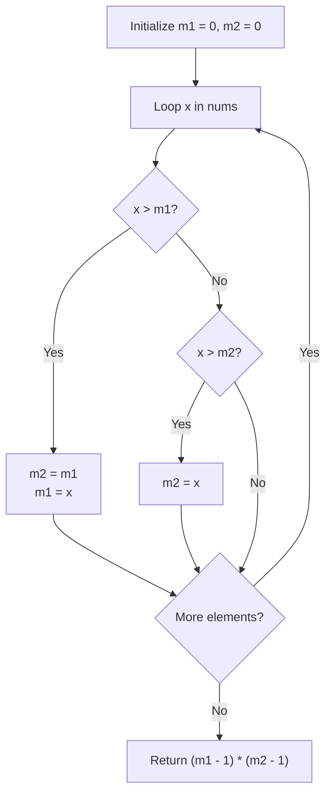

# Guided Example: Maximum Product of Two Elements in an Array

We trace the step-by-step single-pass extraction of the two largest elements and product calculation on a representative problem instance:

- **Input:** $nums = [3, 4, 5, 2]$
- **Required Output:** $12$

This instance illustrates how maintaining the top two scalar values ($m_1$ and $m_2$) in a single scan identifies the maximal pair $(4, 5)$ without sorting, yielding $(5 - 1) \times (4 - 1) = 12$.

---

## 1. Instance & Teaching Goal

We are given an array of positive integers $nums$. We must choose two distinct indices $i$ and $j$ ($i \ne j$) to maximize the product:

$$(nums[i] - 1) \times (nums[j] - 1)$$

In the provided instance:
- Array entries: $[3, 4, 5, 2]$.
- Evaluating candidate index pairs:
  - Indices $(0, 1)$: $(3 - 1) \times (4 - 1) = 2 \times 3 = 6$.
  - Indices $(0, 2)$: $(3 - 1) \times (5 - 1) = 2 \times 4 = 8$.
  - Indices $(0, 3)$: $(3 - 1) \times (2 - 1) = 2 \times 1 = 2$.
  - Indices $(1, 2)$: $(4 - 1) \times (5 - 1) = 3 \times 4 = 12$.
  - Indices $(1, 3)$: $(4 - 1) \times (2 - 1) = 3 \times 1 = 3$.
  - Indices $(2, 3)$: $(5 - 1) \times (2 - 1) = 4 \times 1 = 4$.
- Maximum product obtained: $12$ at indices $1$ and $2$.

The primary teaching goal is to observe monotonicity: since all elements satisfy $nums[k] \ge 1$, the function $f(x, y) = (x - 1)(y - 1)$ is strictly increasing in both $x$ and $y$. Maximizing $f(x, y)$ is mathematically equivalent to selecting the two largest elements in the array ($m_1$ and $m_2$). These two values can be captured in a single $\mathcal{O}(n)$ pass using two scalar variables.

---

## 2. Conceptual Foundation & Invariants

Let $m_1$ denote the global maximum element in $nums$, and let $m_2$ denote the second largest element (allowing duplicates, so $m_1 \ge m_2$).
Because $x \mapsto x - 1$ is monotonically non-decreasing for $x \ge 1$:

$$\max_{i \ne j} (nums[i] - 1)(nums[j] - 1) = (m_1 - 1)(m_2 - 1)$$

We maintain two tracking variables initialized to $0$:
- $m_1$: greatest value seen so far.
- $m_2$: second greatest value seen so far.

For each element $x \in nums$:
1. If $x > m_1$:
   - The former greatest value becomes the new second greatest: $m_2 \leftarrow m_1$.
   - The current value becomes the new greatest: $m_1 \leftarrow x$.
2. Else if $x > m_2$:
   - The current value displaces the second greatest: $m_2 \leftarrow x$.

```
Streaming Maximum Tracking (m1 >= m2):
Index:     0        1        2        3
Element:   3        4        5        2
-----------------------------------------
x = 3:   m1 = 3,  m2 = 0     (Initial peak)
x = 4:   m1 = 4,  m2 = 3     (Displaces m1, old m1 moves to m2)
x = 5:   m1 = 5,  m2 = 4     (Displaces m1, old m1 moves to m2)
x = 2:   m1 = 5,  m2 = 4     (2 < m2, ignored)

Final Extrema: m1 = 5, m2 = 4
Product: (5 - 1) * (4 - 1) = 4 * 3 = 12
```

We establish tracking parameters across the traversal:

| Parameter | Type & Domain | Role in Algorithm |
|---|---|---|
| Active Element ($x$) | Integer $1 \le x \le 1000$ | Current array element being scanned |
| Global Maximum ($m_1$) | Integer $\ge 0$ | Highest value encountered so far |
| Runner-Up Maximum ($m_2$) | Integer $\ge 0$ | Second highest value encountered so far |
| Product Outcome | Integer $\ge 0$ | Final computed value $(m_1 - 1)(m_2 - 1)$ |

> **Invariant.** After inspecting prefix $nums[0 \dots k]$, $m_1$ and $m_2$ are the two largest elements in the multiset $nums[0 \dots k]$ with $m_1 \ge m_2$.



---

## 3. Step-by-Step Worked Execution

We walk through the representative instance $nums = [3, 4, 5, 2]$.

### Initialization
- $m_1 = 0$
- $m_2 = 0$

### Streaming Updates

1. **At index 0 ($x = 3$):**
   - Test $3 > m_1$ ($3 > 0$): True.
   - Demote $m_1$ to $m_2$: $m_2 \leftarrow 0$.
   - Assign new maximum: $m_1 \leftarrow 3$.
   - Current state: $(m_1 = 3, \, m_2 = 0)$.

2. **At index 1 ($x = 4$):**
   - Test $4 > m_1$ ($4 > 3$): True.
   - Demote $m_1$ to $m_2$: $m_2 \leftarrow 3$.
   - Assign new maximum: $m_1 \leftarrow 4$.
   - Current state: $(m_1 = 4, \, m_2 = 3)$.

3. **At index 2 ($x = 5$):**
   - Test $5 > m_1$ ($5 > 4$): True.
   - Demote $m_1$ to $m_2$: $m_2 \leftarrow 4$.
   - Assign new maximum: $m_1 \leftarrow 5$.
   - Current state: $(m_1 = 5, \, m_2 = 4)$.

4. **At index 3 ($x = 2$):**
   - Test $2 > m_1$ ($2 > 5$): False.
   - Test $2 > m_2$ ($2 > 4$): False.
   - Values remain unchanged.
   - Current state: $(m_1 = 5, \, m_2 = 4)$.

### Product Evaluation
- Top two values: $m_1 = 5, m_2 = 4$.
- Formula: $(5 - 1) \times (4 - 1) = 4 \times 3 = 12$.

| Step $k$ | Scanned $nums[k]$ | Comparison ($x > m_1$) | Comparison ($x > m_2$) | Updated $m_1$ | Updated $m_2$ | Running Status |
|---|---|---|---|---|---|---|
| Init | - | - | - | 0 | 0 | Unset |
| 0 | 3 | $3 > 0$ (True) | - | 3 | 0 | Primary anchor |
| 1 | 4 | $4 > 3$ (True) | - | 4 | 3 | Shift $3 \to m_2$ |
| 2 | 5 | $5 > 4$ (True) | - | 5 | 4 | Shift $4 \to m_2$ |
| 3 | 2 | $2 > 5$ (False) | $2 > 4$ (False) | 5 | 4 | Ignored smaller |

---

## 4. Complete Execution Trace

```
Final Evaluation Summary:
Array Examined: [3, 4, 5, 2]
Primary Maximum (m1): 5
Secondary Maximum (m2): 4
Calculation: (5 - 1) * (4 - 1) = 4 * 3 = 12
Maximum Product: 12
```

| Candidate Pair $(nums[i], nums[j])$ | Pair Values | Adjusted Factors $(a-1, b-1)$ | Evaluated Product | Optimality Status |
|---|---|---|---|---|
| $(nums[0], nums[1])$ | $(3, 4)$ | $(2, 3)$ | 6 | Suboptimal |
| $(nums[0], nums[2])$ | $(3, 5)$ | $(2, 4)$ | 8 | Suboptimal |
| $(nums[0], nums[3])$ | $(3, 2)$ | $(2, 1)$ | 2 | Suboptimal |
| $(nums[1], nums[2])$ | $(4, 5)$ | $(3, 4)$ | **12** | **Optimal** |
| $(nums[1], nums[3])$ | $(4, 2)$ | $(3, 1)$ | 3 | Suboptimal |
| $(nums[2], nums[3])$ | $(5, 2)$ | $(4, 1)$ | 4 | Suboptimal |

---

## 5. Algorithmic Correctness

**Soundness.** For positive values $x \ge 1$ and $y \ge 1$, the function $(x - 1)(y - 1)$ is strictly non-decreasing with respect to each argument. Therefore, choosing the largest possible values for $x$ and $y$ from the array maximizes the product. Because $m_1$ and $m_2$ represent the two largest values at distinct array indices, their product is mathematically maximal.

**Completeness.** A single linear pass updates $m_1$ and $m_2$ on every element. If an element exceeds $m_1$, the old $m_1$ is demoted to $m_2$ without loss of information. If an element does not exceed $m_1$ but exceeds $m_2$, $m_2$ is updated directly. Hence, upon processing all elements, $m_1$ and $m_2$ are guaranteed to be the two largest elements in the array.

---

## 6. Traps This Instance Exposes

- **Quadratic All-Pairs Comparison:** Nested double loops comparing all $\binom{n}{2}$ pairs take $\mathcal{O}(n^2)$ time. Tracking the top two elements takes $\mathcal{O}(n)$ time.
- **Handling Duplicate Maximums:** In arrays with duplicate top values (e.g. $[1, 5, 4, 5]$), both $m_1$ and $m_2$ should equal $5$. If the check uses strict identity or fails to assign $m_2 = x$ when $x == m_1$, duplicate peaks are missed. The conditional structure $x > m_1$ and $x > m_2$ correctly handles identical maximums.
- **Full Array Sorting Overhead:** Sorting the array takes $\mathcal{O}(n \log n)$ time and allocates auxiliary memory; tracking two scalar maximums runs in strictly linear $\mathcal{O}(n)$ time and $\mathcal{O}(1)$ space.

---

## 7. Complexity Derivation

- **Time Complexity:** $\mathcal{O}(n)$, where $n = |nums|$ is the length of the array ($n \le 500$). The algorithm inspects each element once, performing at most two integer comparisons per element. Total operations are bounded by $2n \le 1000$.
- **Auxiliary Space Complexity:** $\mathcal{O}(1)$. Only two scalar integer variables ($m_1$ and $m_2$) are allocated, using constant additional memory.
