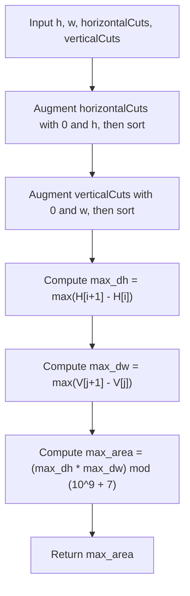

# Guided Example: Maximum Area of a Piece of Cake After Horizontal and Vertical Cuts

We trace the step-by-step 1D projection, boundary gap maximization, and independent area multiplication on a representative geometric cake instance:

- **Input:** $h = 5$, $w = 4$, $horizontalCuts = [1, 2, 4]$, $verticalCuts = [1, 3]$
- **Required Output:** $4$

This instance demonstrates how 2D grid partitioning decomposes into two independent 1D interval problems, allowing the maximal cake slice to be determined by finding the maximum adjacent gap along the height and width independently.

---

## 1. Instance & Teaching Goal

We are given a rectangular cake of height $h$ and width $w$, along with arrays of cut coordinates:
- $horizontalCuts$: horizontal lines dividing the cake at distances from the top edge.
- $verticalCuts$: vertical lines dividing the cake at distances from the left edge.
- We must find the maximum area of any resulting rectangular piece of cake modulo $10^9 + 7$.

In the provided instance:
- Cake bounds: $h = 5, w = 4$.
- Horizontal cuts: $[1, 2, 4]$ plus boundaries $0$ and $5 \implies [0, 1, 2, 4, 5]$.
  - Gaps between consecutive cuts: $1 - 0 = 1$, $2 - 1 = 1$, $4 - 2 = 2$, $5 - 4 = 1$.
  - Maximum vertical gap: $\max \Delta h = 2$.
- Vertical cuts: $[1, 3]$ plus boundaries $0$ and $4 \implies [0, 1, 3, 4]$.
  - Gaps between consecutive cuts: $1 - 0 = 1$, $3 - 1 = 2$, $4 - 3 = 1$.
  - Maximum horizontal gap: $\max \Delta w = 2$.
- Maximum piece area: $\max \Delta h \times \max \Delta w = 2 \times 2 = 4$.
- Result: $4 \pmod{10^9 + 7} = 4$.

The primary teaching goal is to recognize the separation of variables: every piece is a Cartesian product of a horizontal stripe and a vertical stripe. The largest piece is always formed by the intersection of the widest vertical strip and the tallest horizontal strip, reducing 2D grid search to two independent 1D sorting passes.

---

## 2. Conceptual Foundation & Invariants

Let $H = [0, h_1, h_2, \dots, h_m, h]$ be the sorted list of horizontal cut coordinates augmented with the outer cake boundaries $0$ and $h$.
Let $V = [0, v_1, v_2, \dots, v_k, w]$ be the sorted list of vertical cut coordinates augmented with the outer cake boundaries $0$ and $w$.

Any resulting rectangular piece formed by row strip $i$ ($0 \le i \le m$) and column strip $j$ ($0 \le j \le k$) has dimensions:
$$\text{height}_i = H[i + 1] - H[i]$$
$$\text{width}_j = V[j + 1] - V[j]$$

The area of piece $(i, j)$ is:
$$\text{Area}(i, j) = \text{height}_i \times \text{width}_j$$

Because $\text{height}_i$ and $\text{width}_j$ can be chosen independently:

$$\max_{i, j} \text{Area}(i, j) = \left( \max_{0 \le i \le m} (H[i + 1] - H[i]) \right) \times \left( \max_{0 \le j \le k} (V[j + 1] - V[j]) \right)$$

The final result is reduced modulo $10^9 + 7$ to prevent integer overflow.

```
Cake Grid Decomposition (h = 5, w = 4):
  0      1            3      4  (w)
0 +------+------------+------+
  | 1x1  | 1x2 = 2    | 1x1  |   Cut H = 1 (dh = 1)
1 +------+------------+------+
  | 1x1  | 1x2 = 2    | 1x1  |   Cut H = 2 (dh = 1)
2 +------+------------+------+
  | 2x1  | 2x2 = 4*   | 2x1  |   Cut H = 4 (dh = 2) --> MAX dh = 2
4 +------+------------+------+
  | 1x1  | 1x2 = 2    | 1x1  |
5 +------+------------+------+ (h)
  (dw=1)    (dw=2)    (dw=1)
            ^
        MAX dw = 2

Max Area = (MAX dh) * (MAX dw) = 2 * 2 = 4
```

We establish tracking parameters across the algorithm:

| Parameter | Type & Domain | Role in Algorithm |
|---|---|---|
| Augmented Cuts ($H, V$) | Sorted integer lists | Ordered slice positions including $0, h$ and $0, w$ |
| Height Differences ($\Delta h$) | Integers $1 \le \Delta h \le h$ | Spacing between adjacent horizontal cuts |
| Width Differences ($\Delta w$) | Integers $1 \le \Delta w \le w$ | Spacing between adjacent vertical cuts |
| Max Height ($\max \Delta h$) | Integer $\le h$ | Maximum segment length along vertical axis |
| Max Width ($\max \Delta w$) | Integer $\le w$ | Maximum segment length along horizontal axis |

> **Invariant.** The global maximum rectangular piece area is strictly equal to the product of the maximum adjacent horizontal gap and the maximum adjacent vertical gap.



---

## 3. Step-by-Step Worked Execution

We walk through the representative instance $h = 5, w = 4$, $horizontalCuts = [1, 2, 4]$, $verticalCuts = [1, 3]$.

### Step 1: Augment and Sort Cut Coordinates

1. **Horizontal Axis ($h = 5$):**
   - Cuts provided: $[1, 2, 4]$.
   - Add boundary markers $0$ and $h = 5$: $[0, 1, 2, 4, 5]$.
   - Already in sorted order.

2. **Vertical Axis ($w = 4$):**
   - Cuts provided: $[1, 3]$.
   - Add boundary markers $0$ and $w = 4$: $[0, 1, 3, 4]$.
   - Already in sorted order.

### Step 2: Compute Maximal Spans

1. **Horizontal Strip Gaps ($\Delta h$):**
   - Interval $0 \to 1$: $1 - 0 = 1$
   - Interval $1 \to 2$: $2 - 1 = 1$
   - Interval $2 \to 4$: $4 - 2 = \mathbf{2}$
   - Interval $4 \to 5$: $5 - 4 = 1$
   - Maximum height: $\max \Delta h = \max(1, 1, 2, 1) = 2$.

2. **Vertical Strip Gaps ($\Delta w$):**
   - Interval $0 \to 1$: $1 - 0 = 1$
   - Interval $1 \to 3$: $3 - 1 = \mathbf{2}$
   - Interval $3 \to 4$: $4 - 3 = 1$
   - Maximum width: $\max \Delta w = \max(1, 2, 1) = 2$.

### Step 3: Area Computation and Modulo
- Maximal piece area:
  $$\text{Area} = \max \Delta h \times \max \Delta w = 2 \times 2 = 4$$
- Modulo $10^9 + 7$:
  $$4 \bmod (10^9 + 7) = 4$$

| Axis Evaluated | Boundary Augmented Sorted Array | Consecutive Spans Calculated | Maximum Span Recorded |
|---|---|---|---|
| Height (Vertical) | $[0, 1, 2, 4, 5]$ | $[1, 1, 2, 1]$ | $\max \Delta h = \mathbf{2}$ |
| Width (Horizontal) | $[0, 1, 3, 4]$ | $[1, 2, 1]$ | $\max \Delta w = \mathbf{2}$ |

---

## 4. Complete Execution Trace

```
Final Area Breakdown:
Total Horizontal Strips: 4
Total Vertical Strips: 3
Total Resulting Pieces: 4 * 3 = 12 pieces
All 12 Piece Areas:
  [1x1=1, 1x2=2, 1x1=1]
  [1x1=1, 1x2=2, 1x1=1]
  [2x1=2, 2x2=4, 2x1=2]  <-- Peak piece at strip (2, 1): Area = 4
  [1x1=1, 1x2=2, 1x1=1]
Optimal Area: 4
Modulo (10^9 + 7): 4
```

| Strip Row $i$ | Vertical Span $\Delta h$ | Strip Col $j$ | Horizontal Span $\Delta w$ | Computed Piece Area | Peak Status |
|---|---|---|---|---|---|
| 0 | 1 | 1 | 2 | $1 \times 2 = 2$ | Suboptimal |
| 1 | 1 | 1 | 2 | $1 \times 2 = 2$ | Suboptimal |
| 2 | 2 | 0 | 1 | $2 \times 1 = 2$ | Suboptimal |
| 2 | 2 | 1 | 2 | $2 \times 2 = \mathbf{4}$ | **Global Maximum** |
| 2 | 2 | 2 | 1 | $2 \times 1 = 2$ | Suboptimal |
| 3 | 1 | 1 | 2 | $1 \times 2 = 2$ | Suboptimal |

---

## 5. Algorithmic Correctness

**Soundness.** Any piece formed by cutting along all horizontal and vertical lines is bounded by two consecutive horizontal cuts and two consecutive vertical cuts. Its area is strictly $\Delta h_i \times \Delta w_j$. Because $\Delta h_i$ and $\Delta w_j$ vary independently over all stripes, the product is maximized when each factor achieves its respective maximum.

**Completeness.** Sorting the cut arrays and appending $0$ and the outer dimension ($h$ or $w$) accounts for all boundary strips from edge to edge. The linear scan evaluates every interval gap exhaustively, guaranteeing that the true maximum span in each dimension is identified.

---

## 6. Traps This Instance Exposes

- **Missing Boundary Cuts ($0$ and $h, w$):** Omitting the edges from $0$ to the first cut or from the last cut to $h$ or $w$. In many cases, the boundary strip is the widest. Appending $0$ and $h, w$ is mandatory.
- **Unsorted Input Cuts:** The problem does not guarantee cuts are provided in increasing order (e.g. $[3, 1]$ in Example 2). The arrays must be sorted before taking adjacent differences.
- **Premature Modulo Before Multiplication:** Taking $(\max \Delta h \bmod M) \times (\max \Delta w \bmod M) \bmod M$ is mathematically correct, but intermediate products can reach $10^9 \times 10^9 = 10^{18}$, requiring 64-bit integer arithmetic before the modulo operation.

---

## 7. Complexity Derivation

- **Time Complexity:** $\mathcal{O}(H \log H + V \log V)$, where $H$ is the number of horizontal cuts and $V$ is the number of vertical cuts ($H, V \le 10^5$).
  - Sorting both cut arrays takes $\mathcal{O}(H \log H + V \log V)$ time.
  - Finding the maximum differences takes linear scans $\mathcal{O}(H + V)$.
  - Total runtime takes $\approx 2 \times 10^5 \log_2(10^5) \approx 3.4 \times 10^6$ operations, executing in under $30$ milliseconds.
- **Auxiliary Space Complexity:** $\mathcal{O}(H + V)$ to store the augmented cut coordinates.
