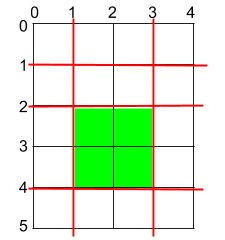
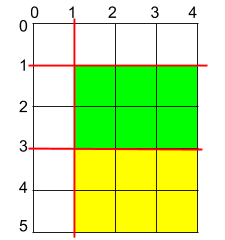

### 1. Description

You are given a rectangular cake of size `h x w` and two arrays of integers `horizontalCuts` and `verticalCuts` where:

- $\text{horizontalCuts}[i]$ is the distance from the top of the rectangular cake to the $i^{\text{th}}$ horizontal cut and similarly, and

- $\text{verticalCuts}[j]$ is the distance from the left of the rectangular cake to the $j^{\text{th}}$ vertical cut.

Return *the maximum area of a piece of cake after you cut at each horizontal and vertical position provided in the arrays* `horizontalCuts` *and* `verticalCuts`. Since the answer can be a large number, return this **modulo** $10^{9} + 7$.

### 2. Function Contract

**Inputs**

- `h`: Input parameter (`int`).
- `w`: Input parameter (`int`).
- `horizontalCuts`: Input parameter (`List[int]`).
- `verticalCuts`: Input parameter (`List[int]`).

**Return value**

- Returns `int`.

### 3. Examples

#### Example 1

- **Input:** $h = 5, w = 4, horizontalCuts = [1,2,4], verticalCuts = [1,3]$
- **Output:** `4`
- **Explanation:** The figure above represents the given rectangular cake. Red lines are the horizontal and vertical cuts. After you cut the cake, the green piece of cake has the maximum area.

#### Example 2

- **Input:** $h = 5, w = 4, horizontalCuts = [3,1], verticalCuts = [1]$
- **Output:** `6`
- **Explanation:** The figure above represents the given rectangular cake. Red lines are the horizontal and vertical cuts. After you cut the cake, the green and yellow pieces of cake have the maximum area.

#### Example 3

- **Input:** $h = 5, w = 4, horizontalCuts = [3], verticalCuts = [3]$
- **Output:** `9`

### 4. Constraints

- $2 \le h, w \le 10^{9}$

- $1 \le \text{horizontalCuts.length} \le min(h - 1, 10^{5})$

- $1 \le \text{verticalCuts.length} \le min(w - 1, 10^{5})$

- $1 \le \text{horizontalCuts}[i] < h$

- $1 \le \text{verticalCuts}[i] < w$

- All the elements in `horizontalCuts` are distinct.

- All the elements in `verticalCuts` are distinct.
