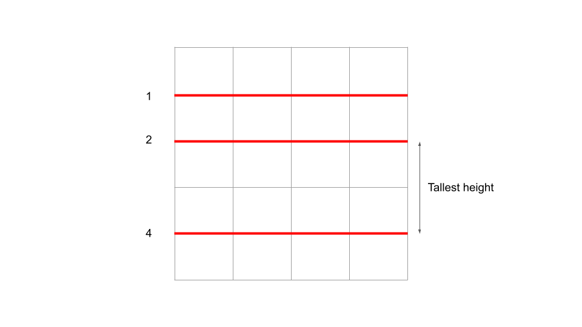
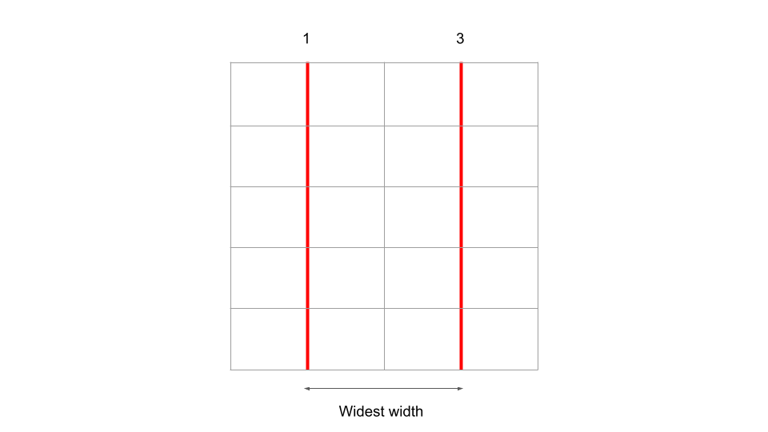
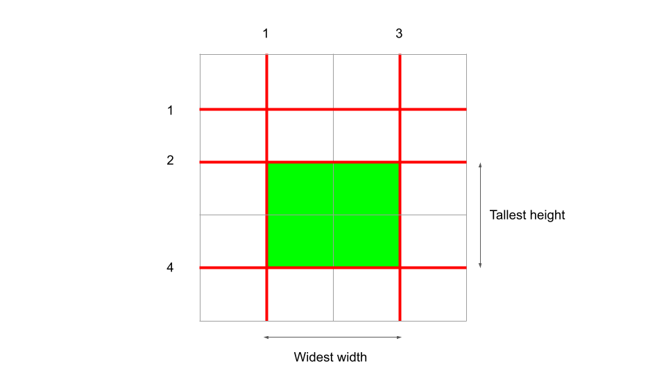

[TOC]

## Solution

---

### Overview

Calculating the area of every possible piece of cake can get out of hand very quickly. In the first example alone, there are already 12 pieces of cake, and our input can have up to 100,000 vertical and horizontal cuts. We need a smarter way to find the area of the largest piece of cake.

The key insight to solve this problem is that not all of the pairs of horizontal and vertical cuts matter. Let's take a step back - the area of a cake piece is defined by $width * height$. If we were to consider **only** the horizontal cuts, then we would end up with many pieces of cake with $width = w$ and varying heights. For each new piece, making a vertical cut will change the width, but not the height.

Let's use the first test case in the problem description as an example. If we were to only apply the horizontal cuts `[1, 2, 4]`, we will end up with 4 pieces of cake, all with $width = 4$. Take the piece of cake with $height = 2$ between the cuts at `2` and `4`, and make any vertical cut you want - notice that the height will always be `2`. The same logic can be applied when considering the vertical cuts first - we will have many pieces of cake with $height = h$ and varying widths.

Therefore, we know the largest piece of cake must have a height equal to the tallest height after applying only the horizontal cuts, and it will have a width equal to the widest width after applying only the vertical cuts.







</br>

---

### Approach: Sort

**Intuition**

As mentioned above, we can find the max height and the max width separately. Our final answer will be $maxHeight * maxWidth$. Each height and width is defined by the distance between 2 cuts. In the first example, the max height of `2` is defined by the distance between cuts `2` and `4` (4 - 2 = 2). To find all heights and widths, we must first sort our inputs `horizontalCuts` and `verticalCuts`. This will ensure that all of the cuts that are beside each other on the cake are also beside each other in the array. Then, we can iterate through the sorted inputs one at a time and find each height or width by simply taking the difference between two adjacent cuts.

One thing to be careful about is the edges. For cuts in the middle, the distance is defined by the difference between two cuts. However, for the edges, they are defined by the cake's dimensions.

- The top-most cut's height will be equal to $\text{horizontalCuts}[0]$, while the bottom-most cut's height will be equal to $h - horizontalCuts[\text{horizontalCuts.length} - 1]$.
- The left-most cut's width will be equal to $\text{verticalCuts}[0]$, while the right-most cut's width will be equal to $w - verticalCuts[\text{verticalCuts.length} - 1]$.

**Algorithm**

1. Sort both `horizontalCuts` and `verticalCuts` in ascending order.

2. Initialize a variable `maxHeight` as the larger of the top and bottom edge: $maxHeight = max(\text{horizontalCuts}[0], h - horizontalCuts[\text{horizontalCuts.length} - 1])$.

3. Iterate through `horizontalCuts` starting from index 1 (skip the 0th index since it represents the edge cut, which we accounted for in the previous step). At each iteration, find the height defined by the $i^{th}$ cut and the nearest cut above, $\text{horizontalCuts}[i] - horizontalCuts[i - 1]$. Update `maxHeight` if necessary.

4. Initialize a variable `maxWidth` as the larger of the left and right edge: $maxWidth = max(\text{verticalCuts}[0], w - verticalCuts[\text{verticalCuts.length} - 1])$.

5. Iterate through `verticalCuts` starting from index 1. At each iteration, find the width defined by the $i^{th}$ cut and the nearest cut to the left, $\text{verticalCuts}[i] - verticalCuts[i - 1]$. Update `maxWidth` if necessary.

6. Our maximum area is $maxHeight * maxWidth$. Don't forget the modulo $10^{9} + 7$, and depending on what language you're using, be careful of overflow. Return the maximum area.

**Implementation**

```python
class Solution:
    def maxArea(self, h: int, w: int, horizontalCuts: List[int], verticalCuts: List[int]) -> int:
        # Start by sorting the inputs
        horizontalCuts.sort()
        verticalCuts.sort()

        # Consider the edges first
        max_height = max(horizontalCuts[0], h - horizontalCuts[-1])
        for i in range(1, len(horizontalCuts)):
            # horizontalCuts[i] - horizontalCuts[i - 1] represents the distance between
            # two adjacent edges, and thus a possible height
            max_height = max(max_height, horizontalCuts[i] - horizontalCuts[i - 1])

        # Consider the edges first
        max_width = max(verticalCuts[0], w - verticalCuts[-1])
        for i in range(1, len(verticalCuts)):
            # verticalCuts[i] - verticalCuts[i - 1] represents the distance between
            # two adjacent edges, and thus a possible width
            max_width = max(max_width, verticalCuts[i] - verticalCuts[i - 1])

        # Python doesn't need to worry about overflow - don't forget the modulo though!
        return (max_height * max_width) % (10**9 + 7)
```

**Complexity Analysis**

Given $N$ as the length of `horizontalCuts` and $M$ as the length of `verticalCuts`,

* Time complexity: $O(N \cdot \log(N) + M \cdot \log(M))$

    Sorting an array of length $n$ costs $n \cdot logn$ time. We need to sort both `horizontalCuts` and `verticalCuts`, which is why both are present in the time complexity. Although we also iterate through both arrays, which costs $O(N)$ and $O(M)$ time, these iterations are not as expensive as the sorting, and by the rules of Big O, do not get included in the final time complexity.

* Space complexity: $O(1)$

    Regardless of the input size, we only ever need to use 2 variables: `maxHeight` and `maxWidth`.

<br/>

---