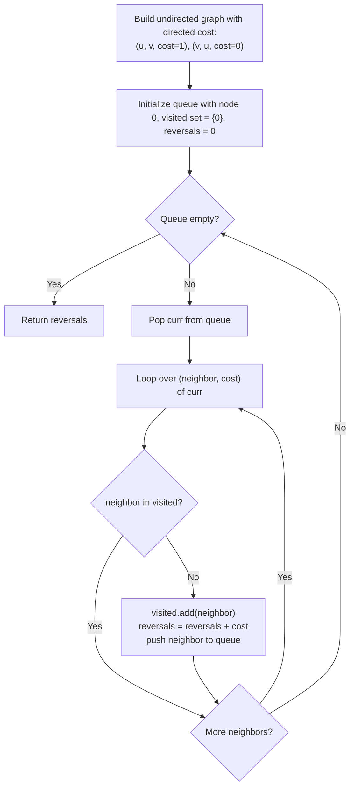

# Guided Example: Reorder Routes to Make All Paths Lead to the City Zero

We trace the step-by-step outward tree traversal from the capital node, counting directed edges pointing away from root zero on a representative problem instance:

- **Input:** $n = 6$, $connections = [[0, 1], [1, 3], [2, 3], [4, 0], [4, 5]]$
- **Required Output:** $3$

This instance contains roads oriented toward the capital (such as $4 \to 0$ and $2 \to 3$), as well as roads oriented away from the capital (such as $0 \to 1$, $1 \to 3$, and $4 \to 5$), illustrating edge orientation flags during depth-first search.

---

## 1. Instance & Teaching Goal

We are given a tree network of $n$ cities labeled $0$ to $n - 1$ with $n - 1$ one-way roads. We must reorient the minimum number of roads so that every city can travel along directed paths to reach city $0$ (the capital).

In the provided instance:
- Original directed edges: $0 \to 1, 1 \to 3, 2 \to 3, 4 \to 0, 4 \to 5$.
- Path to 0 from each node:
  - Node 4: has road $4 \to 0$, points directly to 0 (reversals: $0$).
  - Node 5: has road $4 \to 5$, points away from 4 and toward 5. Must reverse to $5 \to 4 \to 0$ (reversals: $1$).
  - Node 1: has road $0 \to 1$, points away from 0 toward 1. Must reverse to $1 \to 0$ (reversals: $1$).
  - Node 3: has road $1 \to 3$, points away from 1 toward 3. Must reverse to $3 \to 1$ (reversals: $1$).
  - Node 2: has road $2 \to 3$, already points toward 3, so once $3 \to 1 \to 0$ is fixed, path $2 \to 3 \to 1 \to 0$ works (reversals: $0$).
- Total roads reversed: $3$ (edges $0 \to 1$, $1 \to 3$, and $4 \to 5$).

The primary teaching goal is to invert the perspective: traversing outward from capital $0$ to all other nodes, any edge that points in the direction of traversal ($u \to v$) is pointing **away from 0** and must be reversed (cost $1$). Any edge pointing against the traversal ($v \to u$) already points **toward 0** (cost $0$).

---

## 2. Conceptual Foundation & Invariants

Let the undirected tree be represented as an adjacency list where each undirected edge $(u, v)$ carries an orientation weight:
$$\text{weight}(u \to v) = \begin{cases} 1 & \text{if original road is } u \to v \text{ (points away from } 0) \\ 0 & \text{if original road is } v \to u \text{ (points toward } 0) \end{cases}$$

When running a tree traversal (BFS or DFS) rooted at $0$:
- For each edge explored from current node $curr$ to an unvisited neighbor $neighbor$:
  - If the original road was $curr \to neighbor$, traffic flow is pointing away from $0$; we must reverse it, incurring cost $+1$.
  - If the original road was $neighbor \to curr$, traffic flow is already pointing toward $0$; cost is $+0$.
- The total changes required is simply the sum of edge weights encountered during the traversal:

$$\text{reversals} = \sum_{(u \to v) \in \text{DFS Tree}} \text{weight}(u \to v)$$

```
Outward Traversal from Capital 0:
Original Directed Graph:
  0 ----> 1 ----> 3 <---- 2
  ^               |
  |               v (originally 4 -> 5)
  4 ------------> 5

Outward Exploration from Node 0:
0 -> 1: Edge is 0 -> 1 (Moving away from 0)  --> REVERSE! (+1)
1 -> 3: Edge is 1 -> 3 (Moving away from 0)  --> REVERSE! (+1)
3 -> 2: Edge is 2 -> 3 (Points toward 0!)    --> Keep (+0)
0 -> 4: Edge is 4 -> 0 (Points toward 0!)    --> Keep (+0)
4 -> 5: Edge is 4 -> 5 (Moving away from 0)  --> REVERSE! (+1)

Total Reversals = 1 + 1 + 0 + 0 + 1 = 3
```

We establish tracking parameters across the traversal:

| Parameter | Type & Domain | Role in Algorithm |
|---|---|---|
| Current Node ($curr$) | Integer $0 \le curr < n$ | Active node in outward tree traversal |
| Neighbor Node ($neighbor$) | Integer $0 \le neighbor < n$ | Unvisited adjacent city in tree |
| Edge Direction Flag | Integer $\{0, 1\}$ | $1$ if directed $curr \to neighbor$, else $0$ |
| Total Reversals | Integer $\ge 0$ | Accumulated count of reversed edges |

> **Invariant.** For every directed road between parent $u$ and child $v$ in the tree rooted at $0$, the road enables $v \rightsquigarrow 0$ if and only if it is directed $v \to u$. If it is directed $u \to v$, it must be reversed.



---

## 3. Step-by-Step Worked Execution

We walk through the representative instance with $n = 6$ and $connections = [[0, 1], [1, 3], [2, 3], [4, 0], [4, 5]]$.

### Step 1: Graph Representation with Direction Costs
- Edge $0 \to 1$: $(0, 1, 1)$ and $(1, 0, 0)$
- Edge $1 \to 3$: $(1, 3, 1)$ and $(3, 1, 0)$
- Edge $2 \to 3$: $(2, 3, 1)$ and $(3, 2, 0)$
- Edge $4 \to 0$: $(4, 0, 1)$ and $(0, 4, 0)$
- Edge $4 \to 5$: $(4, 5, 1)$ and $(5, 4, 0)$

### Step 2: Breadth-First Outward Sweep from Root $0$

1. **At Node $0$ (Queue: $[0]$, $reversals = 0$):**
   - Neighbor $1$: Original edge is $0 \to 1$ (points away from 0). Cost: $+1$.
     - Enqueue $1$. $reversals \leftarrow 0 + 1 = 1$.
   - Neighbor $4$: Original edge is $4 \to 0$ (points toward 0). Cost: $+0$.
     - Enqueue $4$. $reversals \leftarrow 1 + 0 = 1$.

2. **At Node $1$ (Queue: $[4, 1]$, $reversals = 1$):**
   - Neighbor $3$: Original edge is $1 \to 3$ (points away from 0). Cost: $+1$.
     - Enqueue $3$. $reversals \leftarrow 1 + 1 = 2$.

3. **At Node $4$ (Queue: $[3, 4]$, $reversals = 2$):**
   - Neighbor $5$: Original edge is $4 \to 5$ (points away from 0). Cost: $+1$.
     - Enqueue $5$. $reversals \leftarrow 2 + 1 = 3$.

4. **At Node $3$ (Queue: $[5, 3]$, $reversals = 3$):**
   - Neighbor $2$: Original edge is $2 \to 3$ (points toward 0). Cost: $+0$.
     - Enqueue $2$. $reversals \leftarrow 3 + 0 = 3$.

5. **At Nodes $5$ and $2$:**
   - Both are leaf nodes with no unvisited neighbors.
   - Queue empties.

Total reversals: $3$.

| Traversal Step | Node Visited | Adjacent Neighbor | Original Edge Orientation | Points Away from 0? | Added Cost | Cumulative Reversals |
|---|---|---|---|---|---|---|
| 1 | 0 | 1 | $0 \to 1$ | Yes | +1 | 1 |
| 1 | 0 | 4 | $4 \to 0$ | No (points toward 0) | +0 | 1 |
| 2 | 1 | 3 | $1 \to 3$ | Yes | +1 | 2 |
| 3 | 4 | 5 | $4 \to 5$ | Yes | +1 | **3** |
| 4 | 3 | 2 | $2 \to 3$ | No (points toward 0) | +0 | 3 |

---

## 4. Complete Execution Trace

```
Outward Traversal Edge Decision Log:
1. Explored (0 -> 1): Directed outward  ==> Must reverse to (1 -> 0)  [Count: 1]
2. Explored (0 -> 4): Directed inward   ==> Keep as (4 -> 0)         [Count: 1]
3. Explored (1 -> 3): Directed outward  ==> Must reverse to (3 -> 1)  [Count: 2]
4. Explored (4 -> 5): Directed outward  ==> Must reverse to (5 -> 4)  [Count: 3]
5. Explored (3 -> 2): Directed inward   ==> Keep as (2 -> 3)         [Count: 3]
Final Modified Edges: {(0,1), (1,3), (4,5)}
Total Reorientations: 3
```

| Edge Under Test | Initial Direction | Required Path Direction to Capital | Needs Inversion? |
|---|---|---|---|
| $(0, 1)$ | $0 \to 1$ | $1 \to 0$ | **Yes** |
| $(4, 0)$ | $4 \to 0$ | $4 \to 0$ | No |
| $(1, 3)$ | $1 \to 3$ | $3 \to 1$ | **Yes** |
| $(4, 5)$ | $4 \to 5$ | $5 \to 4$ | **Yes** |
| $(2, 3)$ | $2 \to 3$ | $2 \to 3$ | No |

---

## 5. Algorithmic Correctness

**Soundness.** In any tree, there is exactly one simple path between node $0$ and any other node $v$. For node $v$ to reach $0$, all edges along the unique path connecting $v$ to $0$ must be directed toward $0$. Reversing an edge pointing away from $0$ makes it point toward $0$. Thus, each reversal directly satisfies the directional requirement for that edge.

**Completeness.** Since the network is a tree with $n - 1$ edges connecting $n$ nodes, traversing all $n - 1$ undirected edges once from root $0$ partitions the edges into an orientation tree. Every edge is checked exactly once against the outward direction, ensuring that all edges pointing away from $0$ are reversed.

---

## 6. Traps This Instance Exposes

- **Attempting Multi-Source Search from Every City:** Running BFS from each of the $n$ cities to check if they reach $0$ takes $\mathcal{O}(n^2)$ time. Inverting the view to an outward sweep from $0$ requires only a single $\mathcal{O}(n)$ pass.
- **Directional Ambiguity:** Mislabeling the cost flag: traversing from $curr$ to $neighbor$, an edge originally $curr \to neighbor$ must cost $1$ (it flows away from $0$), while $neighbor \to curr$ must cost $0$. Inverting these costs computes the count of edges already correct rather than those needing reversal.
- **Graph Cycles:** Trees contain no cycles, but because edges are added symmetrically to allow bidirectional traversal, an unvisited check (or passing $parent$) is necessary to prevent infinite oscillation.

---

## 7. Complexity Derivation

- **Time Complexity:** $\mathcal{O}(n)$, where $n \le 5 \times 10^4$ is the number of cities. Building the adjacency list from $n - 1$ edges takes $\mathcal{O}(n)$ time. The breadth-first or depth-first traversal visits each vertex once and traverses each of the $n - 1$ undirected edges twice, taking $\mathcal{O}(n)$ time.
- **Auxiliary Space Complexity:** $\mathcal{O}(n)$ to store the adjacency list with direction flags and the traversal queue/visited array.
