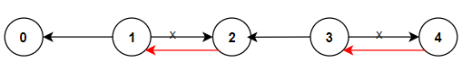

### 1. Description

There are `n` cities numbered from `0` to $n - 1$ and $n - 1$ roads such that there is only one way to travel between two different cities (this network form a tree). Last year, The ministry of transport decided to orient the roads in one direction because they are too narrow.

Roads are represented by `connections` where $\text{connections}[i] = [a_{i}, b_{i}]$ represents a road from city $a_{i}$ to city $b_{i}$.

This year, there will be a big event in the capital (city `0`), and many people want to travel to this city.

Your task consists of reorienting some roads such that each city can visit the city `0`. Return the **minimum** number of edges changed.

It's **guaranteed** that each city can reach city `0` after reorder.

### 2. Function Contract

**Inputs**

- `n`: Input parameter (`int`).
- `connections`: Input parameter (`List[List[int]]`).

**Return value**

- Returns `int`.

### 3. Examples

#### Example 1

- **Input:** $n = 6, connections = [[0,1],[1,3],[2,3],[4,0],[4,5]]$
- **Output:** `3`
- **Explanation:** Change the direction of edges show in red such that each node can reach the node 0 (capital).

#### Example 2

- **Input:** $n = 5, connections = [[1,0],[1,2],[3,2],[3,4]]$
- **Output:** `2`
- **Explanation:** Change the direction of edges show in red such that each node can reach the node 0 (capital).

#### Example 3

- **Input:** $n = 3, connections = [[1,0],[2,0]]$
- **Output:** `0`

### 4. Constraints

- $2 \le n \le 5 * 10^{4}$

- $\text{connections.length} = n - 1$

- $\text{connections}[i].length = 2$

- $0 \le a_{i}, b_{i} \le n - 1$

- $a_{i} \neq b_{i}$
