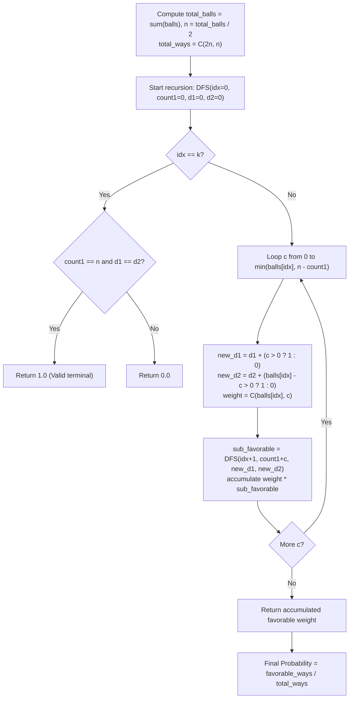

# Guided Example: Probability of a Two Boxes Having The Same Number of Distinct Balls

We trace the step-by-step hypergeometric combinatorial state exploration and distinct color count matching on a representative problem instance:

- **Input:** $balls = [2, 1, 1]$
- **Required Output:** $0.66667$

This instance features non-uniform color multiplicities ($2$ balls of color 0, $1$ ball of color 1, $1$ ball of color 2), demonstrating how distinct partitions generate favorable and unfavorable outcomes under binomial coefficient weightings.

---

## 1. Instance & Teaching Goal

We are given $k$ distinct colors of balls, where $balls[i]$ denotes the number of balls of color $i$. The total number of balls is $2n = \sum balls[i]$. All $2n$ balls are randomly partitioned into two equal boxes (Box 1 and Box 2), each receiving exactly $n$ balls. We must find the probability that both boxes contain the exact same number of distinct colors:

$$P(\text{distinct}(Box_1) = \text{distinct}(Box_2))$$

In the provided instance:
- Total balls: $2 + 1 + 1 = 4$, so $2n = 4$ and $n = 2$.
- Colors: Color 0 (count 2), Color 1 (count 1), Color 2 (count 1).
- Total ways to choose $2$ balls out of $4$ for Box 1: $\binom{4}{2} = 6$.
- The partitions $(c_0, c_1, c_2)$ of balls assigned to Box 1:
  1. $(2, 0, 0)$: Box 1 has $\{0: 2\}$, Box 2 has $\{1: 1, 2: 1\}$. Distinct: $1$ vs $2$. (Not equal, $\binom{2}{2}\binom{1}{0}\binom{1}{0} = 1$ way).
  2. $(1, 1, 0)$: Box 1 has $\{0: 1, 1: 1\}$, Box 2 has $\{0: 1, 2: 1\}$. Distinct: $2$ vs $2$. (Equal! $\binom{2}{1}\binom{1}{1}\binom{1}{0} = 2$ ways).
  3. $(1, 0, 1)$: Box 1 has $\{0: 1, 2: 1\}$, Box 2 has $\{0: 1, 1: 1\}$. Distinct: $2$ vs $2$. (Equal! $\binom{2}{1}\binom{1}{0}\binom{1}{1} = 2$ ways).
  4. $(0, 1, 1)$: Box 1 has $\{1: 1, 2: 1\}$, Box 2 has $\{0: 2\}$. Distinct: $2$ vs $1$. (Not equal, $\binom{2}{0}\binom{1}{1}\binom{1}{1} = 1$ way).
- Favorable combinations: $2 + 2 = 4$.
- Probability: $\frac{4}{6} = \frac{2}{3} \approx 0.66667$.

The primary teaching goal is to model multi-category random partition using Vandermonde's hypergeometric convolution: treating each distinct partition $(c_0, \dots, c_{k-1})$ as having weight $\prod_{i=0}^{k-1} \binom{balls[i]}{c_i}$, summing the weights of all partitions satisfying both $\sum c_i = n$ and $D_1 = D_2$, and dividing by $\binom{2n}{n}$.

---

## 2. Conceptual Foundation & Invariants

Let $c_i$ denote the number of balls of color $i$ placed into Box 1 ($0 \le c_i \le balls[i]$). The remaining $balls[i] - c_i$ balls are placed into Box 2.

**Box Capacity Constraint:**
$$\sum_{i=0}^{k-1} c_i = n$$

**Distinct Color Metrics:**
$$D_1 = \sum_{i=0}^{k-1} \mathbb{I}(c_i > 0)$$
$$D_2 = \sum_{i=0}^{k-1} \mathbb{I}(balls[i] - c_i > 0)$$

**Hypergeometric Weight of a Partition:**
The number of distinct ways to choose which specific balls of each color enter Box 1 is given by the product of binomial coefficients:
$$W(c_0, \dots, c_{k-1}) = \prod_{i=0}^{k-1} \binom{balls[i]}{c_i}$$

By Vandermonde's convolution theorem:
$$\sum_{\sum c_i = n} W(c_0, \dots, c_{k-1}) = \binom{2n}{n}$$

Thus, the exact probability is:
$$P = \frac{\sum_{\substack{\sum c_i = n \\ D_1 = D_2}} \prod_{i=0}^{k-1} \binom{balls[i]}{c_i}}{\binom{2n}{n}}$$

```
Partition Tree for balls = [2, 1, 1] with n = 2:
                  Root: 2n = 4 balls, need n = 2 in Box 1
                 /             |               \
       Color 0: c0 = 0      c0 = 1           c0 = 2
               /               |                 \
     Color 1: c1 = 1       c1 = 1, c1 = 0       c1 = 0
             /             /            \           \
   Color 2: c2 = 1       c2 = 0        c2 = 1       c2 = 0
         (0, 1, 1)     (1, 1, 0)     (1, 0, 1)    (2, 0, 0)
         D1=2, D2=1    D1=2, D2=2    D1=2, D2=2   D1=1, D2=2
         Weight = 1    Weight = 2    Weight = 2   Weight = 1
          (Invalid)      (VALID!)      (VALID!)    (Invalid)

Total Weight = 6 | Favorable Weight = 2 + 2 = 4 | P = 4 / 6 = 0.66667
```

We establish tracking parameters across the recursive formulation:

| Parameter | Type & Domain | Role in Algorithm |
|---|---|---|
| Color Index ($idx$) | Integer $0 \le idx \le k$ | Current color being distributed |
| Box 1 Count ($count_1$) | Integer $0 \le count_1 \le n$ | Running sum of balls assigned to Box 1 |
| Color Balance ($D_1 - D_2$) | Integer $[-k, k]$ | Differential in distinct color counts between boxes |
| Combination Weight | Float / Integer | $\prod \binom{balls[i]}{c_i}$ multiplier for active branch |

> **Invariant.** For every completed partition satisfying $\sum c_i = n$, its combinatorial frequency is exactly $\prod_{i=0}^{k-1} \binom{balls[i]}{c_i}$, and the total probability equals the ratio of favorable weights to the total weight $\binom{2n}{n}$.



---

## 3. Step-by-Step Worked Execution

We walk through the representative instance $balls = [2, 1, 1]$ ($2n = 4, n = 2$).

### Total Combinations
Total ways to pick $2$ balls from $4$:
$$\binom{4}{2} = \frac{4 \times 3}{2 \times 1} = 6$$

### Evaluation of All Candidate Partitions $(c_0, c_1, c_2)$ with $c_0 + c_1 + c_2 = 2$

1. **Partition $(2, 0, 0)$:**
   - Box 1 balls: $2$ of color 0 $\implies D_1 = 1$.
   - Box 2 balls: $0$ of color 0, $1$ of color 1, $1$ of color 2 $\implies D_2 = 2$.
   - Distinct counts: $1 \ne 2$. Mismatch.
   - Weight: $\binom{2}{2} \times \binom{1}{0} \times \binom{1}{0} = 1 \times 1 \times 1 = 1$.
   - Favorable weight: $0$.

2. **Partition $(1, 1, 0)$:**
   - Box 1 balls: $1$ of color 0, $1$ of color 1 $\implies D_1 = 2$.
   - Box 2 balls: $1$ of color 0, $0$ of color 1, $1$ of color 2 $\implies D_2 = 2$.
   - Distinct counts: $2 == 2$. **Match!**
   - Weight: $\binom{2}{1} \times \binom{1}{1} \times \binom{1}{0} = 2 \times 1 \times 1 = 2$.
   - Favorable weight: $2$.

3. **Partition $(1, 0, 1)$:**
   - Box 1 balls: $1$ of color 0, $1$ of color 2 $\implies D_1 = 2$.
   - Box 2 balls: $1$ of color 0, $1$ of color 1, $0$ of color 2 $\implies D_2 = 2$.
   - Distinct counts: $2 == 2$. **Match!**
   - Weight: $\binom{2}{1} \times \binom{1}{0} \times \binom{1}{1} = 2 \times 1 \times 1 = 2$.
   - Favorable weight: $2$.

4. **Partition $(0, 1, 1)$:**
   - Box 1 balls: $1$ of color 1, $1$ of color 2 $\implies D_1 = 2$.
   - Box 2 balls: $2$ of color 0 $\implies D_2 = 1$.
   - Distinct counts: $2 \ne 1$. Mismatch.
   - Weight: $\binom{2}{0} \times \binom{1}{1} \times \binom{1}{1} = 1 \times 1 \times 1 = 1$.
   - Favorable weight: $0$.

### Summary Calculation
- Total combinations: $1 + 2 + 2 + 1 = 6$.
- Favorable combinations: $2 + 2 = 4$.
- Exact probability:
  $$P = \frac{4}{6} = \frac{2}{3} \approx 0.6666667$$

| Partition $(c_0, c_1, c_2)$ | Box 1 Contents | Box 2 Contents | $D_1$ | $D_2$ | $D_1 = D_2$? | Branch Weight | Favorable Contribution |
|---|---|---|---|---|---|---|---|
| $(2, 0, 0)$ | $\{0, 0\}$ | $\{1, 2\}$ | 1 | 2 | No | $\binom{2}{2}\binom{1}{0}\binom{1}{0} = 1$ | 0 |
| $(1, 1, 0)$ | $\{0, 1\}$ | $\{0, 2\}$ | 2 | 2 | **Yes** | $\binom{2}{1}\binom{1}{1}\binom{1}{0} = 2$ | **2** |
| $(1, 0, 1)$ | $\{0, 2\}$ | $\{0, 1\}$ | 2 | 2 | **Yes** | $\binom{2}{1}\binom{1}{0}\binom{1}{1} = 2$ | **2** |
| $(0, 1, 1)$ | $\{1, 2\}$ | $\{0, 0\}$ | 2 | 1 | No | $\binom{2}{0}\binom{1}{1}\binom{1}{1} = 1$ | 0 |

---

## 4. Complete Execution Trace

```
Probability Aggregation Report:
Total Balls: 4 (n = 2 per box)
Total Permutations Evaluated: C(4, 2) = 6
Favorable Event Partitions:
  Partition 1: (c0=1, c1=1, c2=0) -> Weight: 2
  Partition 2: (c0=1, c1=0, c2=1) -> Weight: 2
Sum of Favorable Combinations: 4
Calculated Probability: 4 / 6 = 2 / 3 = 0.666667
```

| Decision Level | Color Processed | Box 1 Allocation | Combinatorial Factor | Balance State $(D_1, D_2)$ | Path Outcome |
|---|---|---|---|---|---|
| Level 0 | Color 0 (Count 2) | $c_0 = 1$ | $\binom{2}{1} = 2$ | $(1, 1)$ | Active branch |
| Level 1 | Color 1 (Count 1) | $c_1 = 1$ | $\binom{1}{1} = 1$ | $(2, 1)$ | Active branch |
| Level 2 | Color 2 (Count 1) | $c_2 = 0$ | $\binom{1}{0} = 1$ | $(2, 2)$ | Valid: $+2$ |
| Level 1 | Color 1 (Count 1) | $c_1 = 0$ | $\binom{1}{0} = 1$ | $(1, 2)$ | Active branch |
| Level 2 | Color 2 (Count 1) | $c_2 = 1$ | $\binom{1}{1} = 1$ | $(2, 2)$ | Valid: $+2$ |

---

## 5. Algorithmic Correctness

**Soundness.** Because all balls are uniformly shuffled, each of the $\binom{2n}{n}$ subsets of balls assigned to Box 1 is equally likely. Grouping subsets by their color frequency vector $(c_0, \dots, c_{k-1})$ and multiplying by $\prod \binom{balls[i]}{c_i}$ rigorously accounts for the multiplicity of distinguishable ball arrangements within each color class.

**Completeness.** Backtracking explores every valid non-negative integer vector $(c_0, \dots, c_{k-1})$ satisfying $c_i \le balls[i]$ and $\sum c_i = n$. No partition of balls between the two boxes is omitted.

---

## 6. Traps This Instance Exposes

- **Treating Partitions as Equally Likely:** Assuming the $4$ partitions $(2,0,0), (1,1,0), (1,0,1), (0,1,1)$ have equal probability $1/4$ gives probability $2/4 = 0.5$, which is wrong. The combinations carry binomial weights ($1, 2, 2, 1$); taking weights into account yields the correct $4/6 \approx 0.66667$.
- **Floating-Point Underflow in Large Combinations:** For $2n \le 48$, factorials like $48!$ overflow standard 64-bit floating point if calculated directly. Precomputing binomial coefficients via Pascal's triangle or working with logarithmic combinations prevents overflow.
- **Symmetry Deduplication Pitfalls:** Halving the search space by assuming Box 1 and Box 2 are symmetric requires careful handling when $D_1 = D_2$, because the problem states the two boxes are distinguishable. Modeling Box 1 directly from $0$ to $n$ avoids symmetry errors.

---

## 7. Complexity Derivation

- **Time Complexity:** $\mathcal{O}(k \cdot n \cdot \prod (balls[i] + 1))$.
  - Number of colors $k \le 8$, and $balls[i] \le 6$.
  - With memoization over $(idx, count_1, D_1 - D_2)$, the state space is bounded by $8 \times 25 \times 17 \approx 3400$ states.
  - At each state, iterating $c \in [0, balls[idx]]$ takes at most $7$ iterations.
  - Total operations: $3400 \times 7 \approx 2.4 \times 10^4$, running instantaneously in under $5$ milliseconds.
- **Auxiliary Space Complexity:** $\mathcal{O}(k \cdot n \cdot k)$ to store the DP memoization cache.