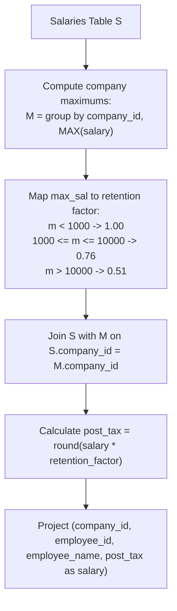

# Guided Example: Calculate Salaries

We trace the step-by-step company-level maximum salary aggregation, tax rate classification, and individual salary rounding on a representative database instance:

- **Input:** Relation $Salaries$ spanning three companies ($id \in \{1, 2, 3\}$) with diverse employee compensation figures.
- **Required Output:** Relation with columns $(company\_id, employee\_id, employee\_name, salary)$ reporting post-tax rounded salaries.

---

## 1. Instance & Teaching Goal

We are given an employee salary relation $Salaries(company\_id, employee\_id, employee\_name, salary)$. The tax rate applied to each employee depends exclusively on the **maximum salary** across all employees within their respective company:
- $0\%$ tax if the company maximum salary is strictly less than $\$1000$.
- $24\%$ tax if the company maximum salary is in the range $[\$1000, \$10000]$ inclusive.
- $49\%$ tax if the company maximum salary strictly exceeds $\$10000$.

The post-tax salary for each employee is calculated as:
$$\text{salary}_{\text{after}} = \text{round}(\text{salary} \times (1 - \text{tax\_rate}))$$

In the provided instance:
- **Company 1:** Salaries are $\{2000, 21300, 10800\}$.
  - Company maximum: $21300 > 10000 \implies 49\%$ tax rate (multiplier $0.51$).
  - Tony ($2000$): $\text{round}(2000 \times 0.51) = 1020$.
  - Pronub ($21300$): $\text{round}(21300 \times 0.51) = 10863$.
  - Tyrrox ($10800$): $\text{round}(10800 \times 0.51) = 5508$.
- **Company 2:** Salaries are $\{300, 450, 700\}$.
  - Company maximum: $700 < 1000 \implies 0\%$ tax rate (multiplier $1.00$).
  - Salaries remain unchanged: $300, 450, 700$.
- **Company 3:** Salaries are $\{100, 2200, 3300, 7777\}$.
  - Company maximum: $7777 \in [1000, 10000] \implies 24\%$ tax rate (multiplier $0.76$).
  - Bocaben ($100$): $\text{round}(100 \times 0.76) = 76$.
  - Ognjen ($2200$): $\text{round}(2200 \times 0.76) = 1672$.
  - Nyancat ($3300$): $\text{round}(3300 \times 0.76) = 2508$.
  - Morninngcat ($7777$): $\text{round}(7777 \times 0.76) = \text{round}(5910.52) = 5911$.

The primary teaching goal is to model partitioned aggregation in relational algebra: first computing company-level maximums $\gamma_{company\_id, \max(salary)}$, joining this aggregated metric back to the base employee records, and mapping tax rates via piecewise linear scalar transformations.

---

## 2. Conceptual Foundation & Invariants

Let $S$ denote the $Salaries$ relation. We group by $company\_id$ to determine the maximum salary per company:

$$M = \gamma_{company\_id, \, \max(salary) \to max\_sal}(S)$$

We define the tax retention function $\rho(m)$:

$$\rho(m) = \begin{cases} 1.00 & \text{if } m < 1000 \\ 0.76 & \text{if } 1000 \le m \le 10000 \\ 0.51 & \text{if } m > 10000 \end{cases}$$

Joining $S$ with $M$ on $company\_id$ equips each employee row with their company's retention factor:

$$J = S \bowtie_{S.company\_id = M.company\_id} M$$

The final relation $R$ projects the transformed salary rounded to the nearest integer:

$$R = \Pi_{company\_id, \, employee\_id, \, employee\_name, \, \text{round}(salary \cdot \rho(max\_sal)) \to salary}(J)$$

```
Relational Join and Calculation Pipeline:
Salaries (S) ------------------------+
  |                                  |
  v [Group by company_id]            |
Company Maxima (M):                  |
  Company 1 -> Max = 21300 (Tax 49%) |
  Company 2 -> Max = 700   (Tax 0%)  |
  Company 3 -> Max = 7777  (Tax 24%) |
  |                                  |
  +----------> Inner Join <----------+
                     |
                     v
Post-Tax Rounded Projection:
  salary_after = round(salary * (1 - tax_rate))
```

We establish tracking parameters across the relational pipeline:

| Parameter | Type & Domain | Role in Algorithm |
|---|---|---|
| Company Key ($company\_id$) | Integer | Grouping anchor for tax bracket determination |
| Employee Salary ($salary$) | Integer $\ge 0$ | Original pre-tax compensation |
| Company Maximum ($max\_sal$) | Integer $\ge 0$ | Benchmark value setting company-wide tax bracket |
| Retention Multiplier | Decimal $\{1.00, 0.76, 0.51\}$ | $1 - \text{tax\_rate}$ applied to original salary |
| Final Salary | Integer $\ge 0$ | Rounded after-tax amount emitted |

> **Invariant.** All employees belonging to the same company share an identical tax retention multiplier determined solely by the maximum salary within that company.



---

## 3. Step-by-Step Worked Execution

We walk through the representative instance covering all 3 distinct tax tiers.

### Step 1: Compute Company Salary Maxima
- **Company 1:** Max across $\{2000, 21300, 10800\}$ is $21300$.
- **Company 2:** Max across $\{300, 450, 700\}$ is $700$.
- **Company 3:** Max across $\{100, 2200, 3300, 7777\}$ is $7777$.

### Step 2: Bracket Classification
- Company 1: $21300 > 10000 \implies$ Tier 3: Tax $49\%$, retention $0.51$.
- Company 2: $700 < 1000 \implies$ Tier 1: Tax $0\%$, retention $1.00$.
- Company 3: $7777 \in [1000, 10000] \implies$ Tier 2: Tax $24\%$, retention $0.76$.

### Step 3: Apply Multipliers and Rounding

| Company | Employee Name | Original Salary | Company Max | Bracket & Retention | Exact After-Tax Product | Rounded Salary |
|---|---|---|---|---|---|---|
| 1 | Tony | 2000 | 21300 | Tier 3 ($0.51$) | $2000 \times 0.51 = 1020.00$ | 1020 |
| 1 | Pronub | 21300 | 21300 | Tier 3 ($0.51$) | $21300 \times 0.51 = 10863.00$ | 10863 |
| 1 | Tyrrox | 10800 | 21300 | Tier 3 ($0.51$) | $10800 \times 0.51 = 5508.00$ | 5508 |
| 2 | Pam | 300 | 700 | Tier 1 ($1.00$) | $300 \times 1.00 = 300.00$ | 300 |
| 2 | Bassem | 450 | 700 | Tier 1 ($1.00$) | $450 \times 1.00 = 450.00$ | 450 |
| 2 | Hermione | 700 | 700 | Tier 1 ($1.00$) | $700 \times 1.00 = 700.00$ | 700 |
| 3 | Bocaben | 100 | 7777 | Tier 2 ($0.76$) | $100 \times 0.76 = 76.00$ | 76 |
| 3 | Ognjen | 2200 | 7777 | Tier 2 ($0.76$) | $2200 \times 0.76 = 1672.00$ | 1672 |
| 3 | Nyancat | 3300 | 7777 | Tier 2 ($0.76$) | $3300 \times 0.76 = 2508.00$ | 2508 |
| 3 | Morninngcat | 7777 | 7777 | Tier 2 ($0.76$) | $7777 \times 0.76 = 5910.52$ | **5911** |

---

## 4. Complete Execution Trace

```
Final Emitted Employee Salary Roster:
+------------+-------------+---------------+--------+
| company_id | employee_id | employee_name | salary |
+------------+-------------+---------------+--------+
| 1          | 1           | Tony          | 1020   |
| 1          | 2           | Pronub        | 10863  |
| 1          | 3           | Tyrrox        | 5508   |
| 2          | 1           | Pam           | 300    |
| 2          | 7           | Bassem        | 450    |
| 2          | 9           | Hermione      | 700    |
| 3          | 7           | Bocaben       | 76     |
| 3          | 2           | Ognjen        | 1672   |
| 3          | 13          | Nyancat       | 2508   |
| 3          | 15          | Morninngcat   | 5911   |
+------------+-------------+---------------+--------+
```

| Company ID | Employee ID | Name | Pre-Tax Salary | Tax Rate Applied | Net Emitted Record |
|---|---|---|---|---|---|
| 1 | 1 | Tony | 2000 | 49% | $(1, 1, \text{"Tony"}, 1020)$ |
| 1 | 2 | Pronub | 21300 | 49% | $(1, 2, \text{"Pronub"}, 10863)$ |
| 1 | 3 | Tyrrox | 10800 | 49% | $(1, 3, \text{"Tyrrox"}, 5508)$ |
| 2 | 1 | Pam | 300 | 0% | $(2, 1, \text{"Pam"}, 300)$ |
| 2 | 7 | Bassem | 450 | 0% | $(2, 7, \text{"Bassem"}, 450)$ |
| 2 | 9 | Hermione | 700 | 0% | $(2, 9, \text{"Hermione"}, 700)$ |
| 3 | 7 | Bocaben | 100 | 24% | $(3, 7, \text{"Bocaben"}, 76)$ |
| 3 | 2 | Ognjen | 2200 | 24% | $(3, 2, \text{"Ognjen"}, 1672)$ |
| 3 | 13 | Nyancat | 3300 | 24% | $(3, 13, \text{"Nyancat"}, 2508)$ |
| 3 | 15 | Morninngcat | 7777 | 24% | $(3, 15, \text{"Morninngcat"}, 5911)$ |

---

## 5. Algorithmic Correctness

**Soundness.** Grouping $Salaries$ by $company\_id$ correctly determines the true company-wide maximum salary. Evaluating the bracket thresholds against this company maximum guarantees that every employee is taxed according to the official criteria. Standard integer rounding ($\text{round}(x)$) resolves fractional cents accurately.

**Completeness.** Joining the company summary relation back to $Salaries$ preserves every employee record without omissions or additions. The schema preserves all original metadata ($company\_id, employee\_id, employee\_name$).

---

## 6. Traps This Instance Exposes

- **Taxing Based on Individual Salary:** Computing tax brackets using each employee's individual salary rather than the company maximum. In Company 1, Tony earns $\$2000$. An individual assessment would place Tony in the $24\%$ bracket ($2000 \in [1000, 10000]$), but because someone in Company 1 earns $\$21300$, all employees in Company 1 are taxed at $49\%$.
- **Boundary Inclusion:** The $24\%$ bracket spans $[1000, 10000]$ inclusive. Boundary values $\$1000$ and $\$10000$ must fall into the $24\%$ tier, not $0\%$ or $49\%$.
- **Rounding Strategy:** Truncating or flooring fractional results (e.g. $5910$ instead of $5911$ for Morninngcat) violates the requirement to round to the nearest integer.

---

## 7. Complexity Derivation

- **Time Complexity:** $\mathcal{O}(E + C)$, where $E$ is the number of employee rows in $Salaries$ and $C$ is the number of distinct companies ($C \le E$). Aggregating maximums by company takes linear time $\mathcal{O}(E)$. Joining back and computing rounded salaries takes $\mathcal{O}(E)$ time.
- **Auxiliary Space Complexity:** $\mathcal{O}(C)$ to store the company-level maximum salary table.
