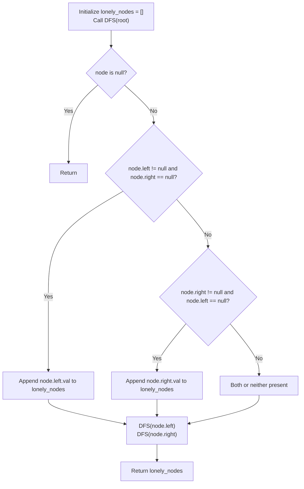

# Guided Example: Find All The Lonely Nodes

We trace the step-by-step parent-child branching analysis and single-child node identification on a representative binary tree instance:

- **Input:** $root = [1, 2, 3, \text{null}, 4]$
- **Required Output:** `[4]`

This instance features a balanced root with two sibling children ($2$ and $3$), and an asymmetric interior node ($2$) having a unique right child ($4$) and no left child, clearly isolating the single-child lonely property.

---

## 1. Instance & Teaching Goal

We are given the root of a binary tree. A node is defined as **lonely** if it is the only child of its parent node (i.e. its parent has exactly one child).
- The root of the tree is never lonely because it has no parent.
- If a parent has two children (both left and right), neither child is lonely.
- If a parent has a left child but no right child, the left child is lonely.
- If a parent has a right child but no left child, the right child is lonely.
- We must return the values of all lonely nodes in any order.

In the provided instance:
- Root node $1$ has two children: Node $2$ (left) and Node $3$ (right). Neither is lonely.
- Node $2$ has no left child, but has a right child: Node $4$. Because Node $2$ has exactly one child, Node $4$ is **lonely**.
- Node $3$ has no children (leaf).
- Node $4$ has no children (leaf).
- The only lonely node in the tree is Node $4$.
- Output: `[4]`.

The primary teaching goal is to model local structural validation during tree traversal: testing the child configuration at each parent node rather than tracking sibling state from the perspective of the child.

---

## 2. Conceptual Foundation & Invariants

Let $u$ be any node in the tree. The lonely status of $u$'s children is determined entirely by the boolean state of $u.left$ and $u.right$:

$$\text{is\_lonely}(v) = \begin{cases} \text{true} & \text{if } v = u.left \land u.right = \text{null} \\ \text{true} & \text{if } v = u.right \land u.left = \text{null} \\ \text{false} & \text{otherwise} \end{cases}$$

Traversing the tree (via DFS or BFS):
1. If $u.left \ne \text{null}$ and $u.right == \text{null}$:
   - $u.left$ is the sole child; record $u.left.val$.
2. If $u.right \ne \text{null}$ and $u.left == \text{null}$:
   - $u.right$ is the sole child; record $u.right.val$.
3. Recursively traverse all existing children ($u.left$ and $u.right$).

```
Tree Topology & Sibling Relationships:
                 [1] (Root: Has 2 children -> Neither lonely)
                /   \
              [2]   [3] (Leaf)
                \
                [4] (Only child of [2] -> LONELY!)
```

We establish tracking parameters across the traversal:

| Parameter | Type & Domain | Role in Algorithm |
|---|---|---|
| Parent Node ($u$) | Tree node reference | Active vertex inspecting its child configuration |
| Left Child Presence | Boolean ($u.left \ne \text{null}$) | Indicates existence of left branch |
| Right Child Presence | Boolean ($u.right \ne \text{null}$) | Indicates existence of right branch |
| Lonely Node Set | List of integers | Values of detected single children |

> **Invariant.** A node $v$ is added to the output collection if and only if its parent $u$ has exactly one non-null child pointer pointing to $v$.



---

## 3. Step-by-Step Worked Execution

We walk through the representative instance $root = [1, 2, 3, \text{null}, 4]$.

### Traversal Walkthrough

1. **Visit Root Node $1$:**
   - Left child: Node $2$ (exists).
   - Right child: Node $3$ (exists).
   - Both children exist ($u.left \ne \text{null} \land u.right \ne \text{null}$).
   - Neither child is lonely.
   - Recurse into Node $2$ and Node $3$.

2. **Visit Node $2$ (Left child of Node $1$):**
   - Left child: $\text{null}$.
   - Right child: Node $4$ (exists).
   - Exactly one child exists ($u.left == \text{null} \land u.right \ne \text{null}$).
   - Node $4$ is verified as a **lonely node**!
   - Append $4$ to the lonely nodes list: $lonely = [4]$.
   - Recurse into Node $4$.

3. **Visit Node $4$ (Right child of Node $2$):**
   - Left child: $\text{null}$.
   - Right child: $\text{null}$.
   - Node $4$ is a leaf; no children to evaluate.

4. **Visit Node $3$ (Right child of Node $1$):**
   - Left child: $\text{null}$.
   - Right child: $\text{null}$.
   - Node $3$ is a leaf; no children to evaluate.

Total lonely nodes found: `[4]`.

| Node Visited | Left Child | Right Child | Children Count | Lonely Child Detected? | Lonely List State |
|---|---|---|---|---|---|
| Node 1 | Node 2 | Node 3 | 2 | No (Siblings exist) | $[]$ |
| Node 2 | None | Node 4 | 1 | **Yes: Node 4** | $[4]$ |
| Node 4 | None | None | 0 | No (Leaf) | $[4]$ |
| Node 3 | None | None | 0 | No (Leaf) | $[4]$ |

---

## 4. Complete Execution Trace

```
Final Traversal Log:
Node 1 (val=1): Left=2, Right=3 --> Both present, 0 lonely children
Node 2 (val=2): Left=null, Right=4 --> Single child! Node 4 is lonely (+4)
Node 4 (val=4): Left=null, Right=null --> Leaf node
Node 3 (val=3): Left=null, Right=null --> Leaf node
Collected Lonely Nodes: [4]
```

| Node Identity | Value | Parent Identity | Parent's Total Child Count | Is Lonely? |
|---|---|---|---|---|
| Root | 1 | None | N/A | No (Root) |
| Left Child | 2 | Node 1 | 2 | No |
| Right Child | 3 | Node 1 | 2 | No |
| Grandchild | 4 | Node 2 | 1 | **Yes (Only child)** |

---

## 5. Algorithmic Correctness

**Soundness.** A node is lonely by definition if and only if it has a parent and that parent has no other child. When a parent node evaluates $u.left \ne \text{null} \land u.right == \text{null}$, $u.left$ is provably the only child of $u$. The symmetric check holds for $u.right$. Therefore, every recorded value is strictly lonely.

**Completeness.** Tree traversal (DFS or BFS) visits every node in the binary tree exactly once. Because every non-root node is a child of some visited node $u$, every parent-child link is evaluated, ensuring no lonely node can be omitted.

---

## 6. Traps This Instance Exposes

- **Falsely Counting the Root:** Marking the root as lonely if it has only one child. The root has no parent by definition, so the root itself can never be lonely. Only children of a node can be classified as lonely.
- **Child-to-Parent Pointer Requirement:** Assuming one needs parent pointers or two-way node references. Inspecting children from the perspective of the parent allows full identification during a standard top-down traversal without auxiliary pointer overhead.
- **Output Order Expectation:** The problem states *"Return the list in any order"*. Sorting the output is unnecessary.

---

## 7. Complexity Derivation

- **Time Complexity:** $\mathcal{O}(N)$, where $N$ is the number of nodes in the binary tree ($N \le 1000$). The traversal visits each tree node exactly once. At each node, checking the presence of left and right children takes $\mathcal{O}(1)$ time.
- **Auxiliary Space Complexity:** $\mathcal{O}(H)$, where $H$ is the height of the tree ($H \le N$), representing the call stack in DFS (or queue size in BFS), plus $\mathcal{O}(N)$ to store the output list.