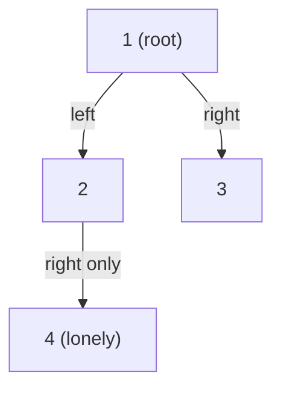
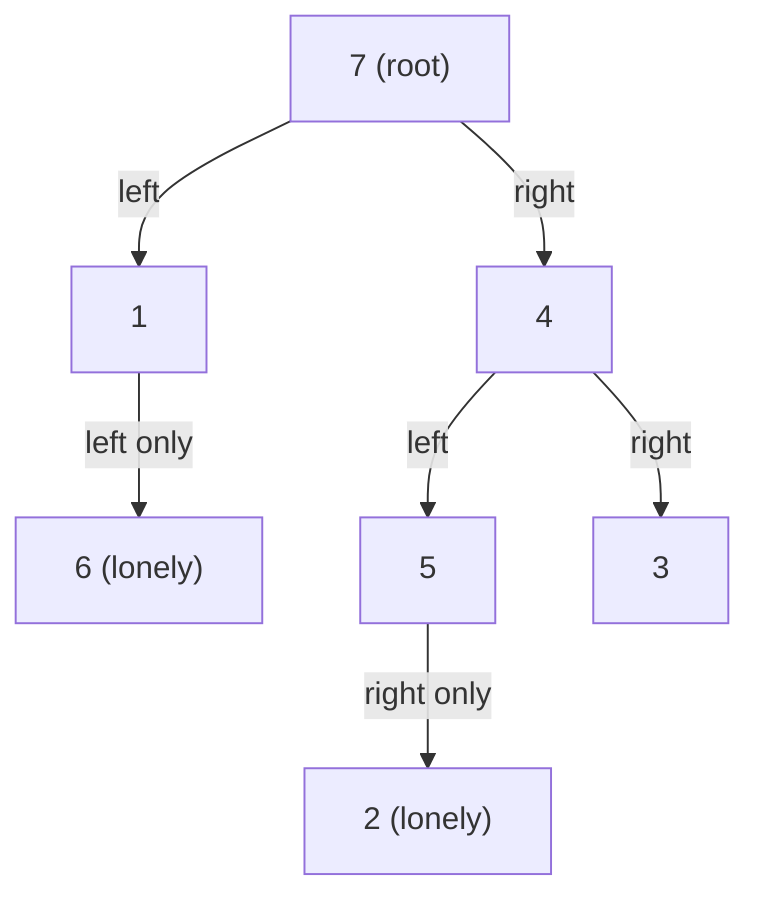
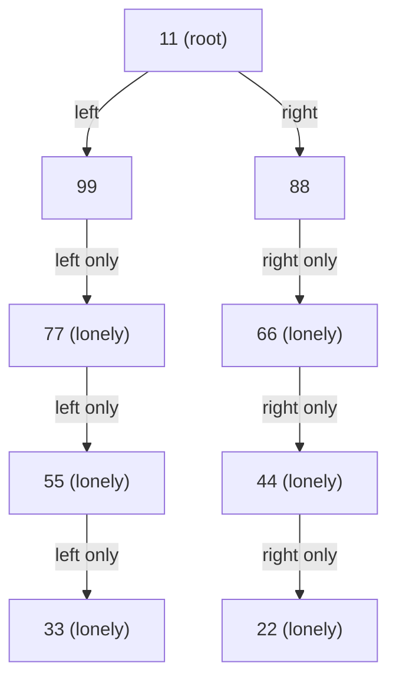

## Examples

**Example 1**

- **Input:** `root = [1,2,3,null,4]`

- **Output:** `[4]`
- **Explanation:** The light-blue node in the source diagram is node `4`, the
  only lonely node. Node `1` is the root, while nodes `2` and `3` share the same
  parent, so none of those three nodes is lonely.

**Example 2**

- **Input:** `root = [7,1,4,6,null,5,3,null,null,null,null,null,2]`

- **Output:** `[6,2]`
- **Explanation:** The light-blue nodes in the source diagram are the lonely
  nodes `6` and `2`. Output order does not matter, so `[2,6]` is also accepted.

**Example 3**

- **Input:** `root = [11,99,88,77,null,null,66,55,null,null,44,33,null,null,22]`

- **Output:** `[77,55,33,66,44,22]`
- **Explanation:** Nodes `99` and `88` are siblings, and node `11` is the root.
  Every other node has no sibling, so `77`, `55`, `33`, `66`, `44`, and `22`
  are lonely.
