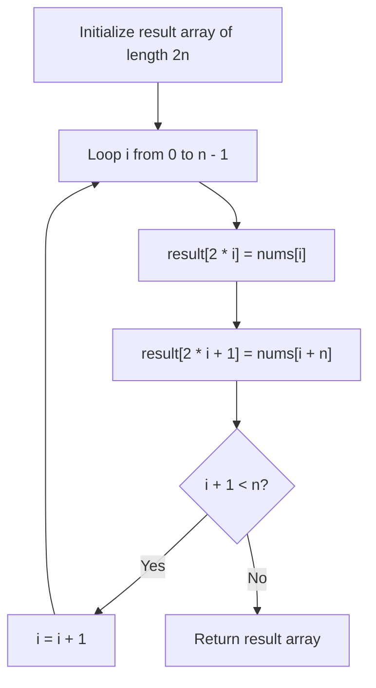

# Guided Example: Shuffle the Array

We trace the step-by-step interleaving index projection and split-array reassembly on a representative problem instance:

- **Input:** $nums = [2, 5, 1, 3, 4, 7]$, $n = 3$
- **Required Output:** `[2, 3, 5, 4, 1, 7]`

This instance divides an array of size $2n = 6$ into equal halves $X = [2, 5, 1]$ and $Y = [3, 4, 7]$, then systematically weaves them into alternating coordinate pairs $(x_i, y_i)$.

---

## 1. Instance & Teaching Goal

We are given an array $nums$ consisting of $2n$ elements formatted as $[x_1, x_2, \dots, x_n, y_1, y_2, \dots, y_n]$. We must rearrange the elements to form the interleaved sequence:

$$[x_1, y_1, x_2, y_2, \dots, x_n, y_n]$$

In the provided instance with $n = 3$:
- The first half ($X$) spans indices $0 \dots 2$: $x_1 = 2, x_2 = 5, x_3 = 1$.
- The second half ($Y$) spans indices $3 \dots 5$: $y_1 = 3, y_2 = 4, y_3 = 7$.
- Interleaving pairs:
  - First pair: $x_1 = 2, y_1 = 3 \implies [2, 3]$
  - Second pair: $x_2 = 5, y_2 = 4 \implies [5, 4]$
  - Third pair: $x_3 = 1, y_3 = 7 \implies [1, 7]$
- Combined result: $[2, 3, 5, 4, 1, 7]$.

The primary teaching goal is to model linear permutation mapping via direct index arithmetic: placing $nums[i]$ at target index $2i$ and $nums[i + n]$ at target index $2i + 1$ for all $0 \le i < n$.

---

## 2. Conceptual Foundation & Invariants

Let $nums$ have length $2n$. The array naturally decomposes into two sub-arrays:
- $X[i] = nums[i]$ for $0 \le i < n$.
- $Y[i] = nums[i + n]$ for $0 \le i < n$.

The target array $ans$ of length $2n$ places the $i^{\text{th}}$ pair into consecutive even and odd indices:

$$ans[2i] = nums[i] = x_{i+1}$$
$$ans[2i + 1] = nums[i + n] = y_{i+1}$$

```
Index Mapping Architecture (n = 3):
Original Index:   0     1     2     3     4     5
Original Values: [2,    5,    1,    3,    4,    7]
                 <- X Sub-array ->  <- Y Sub-array ->

Target Indices:
ans[0] = nums[0] = 2       (2 * 0)
ans[1] = nums[0 + 3] = 3   (2 * 0 + 1)
ans[2] = nums[1] = 5       (2 * 1)
ans[3] = nums[1 + 3] = 4   (2 * 1 + 1)
ans[4] = nums[2] = 1       (2 * 2)
ans[5] = nums[2 + 3] = 7   (2 * 2 + 1)
```

We establish tracking parameters across the algorithm:

| Parameter | Type & Domain | Role in Algorithm |
|---|---|---|
| Half Size ($n$) | Integer $1 \le n \le 500$ | Number of elements in each sub-array |
| Element Index ($i$) | Integer $0 \le i < n$ | Current element pair being interleaved |
| Left Source Index ($i$) | Integer $0 \le i < n$ | Pointer into the $X$ half |
| Right Source Index ($i + n$) | Integer $n \le i + n < 2n$ | Pointer into the $Y$ half |
| Even Destination ($2i$) | Integer even $0 \dots 2n-2$ | Target location for $x_{i+1}$ |
| Odd Destination ($2i + 1$) | Integer odd $1 \dots 2n-1$ | Target location for $y_{i+1}$ |

> **Invariant.** For each index $i \in [0, n - 1]$, element $nums[i]$ is written to output position $2i$, and element $nums[i + n]$ is written to output position $2i + 1$.



---

## 3. Step-by-Step Worked Execution

We walk through the representative instance $nums = [2, 5, 1, 3, 4, 7]$ with $n = 3$.

### Initialization
- Input length: $2n = 6$.
- Allocate destination array: $ans = [0, 0, 0, 0, 0, 0]$.

### Pairwise Interleaving Steps

1. **Step $i = 0$:**
   - Read $x_1$: $nums[0] = 2$.
   - Read $y_1$: $nums[0 + 3] = nums[3] = 3$.
   - Assign even index: $ans[2 \times 0] = ans[0] \leftarrow 2$.
   - Assign odd index: $ans[2 \times 0 + 1] = ans[1] \leftarrow 3$.
   - Current $ans$: $[2, 3, 0, 0, 0, 0]$.

2. **Step $i = 1$:**
   - Read $x_2$: $nums[1] = 5$.
   - Read $y_2$: $nums[1 + 3] = nums[4] = 4$.
   - Assign even index: $ans[2 \times 1] = ans[2] \leftarrow 5$.
   - Assign odd index: $ans[2 \times 1 + 1] = ans[3] \leftarrow 4$.
   - Current $ans$: $[2, 3, 5, 4, 0, 0]$.

3. **Step $i = 2$:**
   - Read $x_3$: $nums[2] = 1$.
   - Read $y_3$: $nums[2 + 3] = nums[5] = 7$.
   - Assign even index: $ans[2 \times 2] = ans[4] \leftarrow 1$.
   - Assign odd index: $ans[2 \times 2 + 1] = ans[5] \leftarrow 7$.
   - Current $ans$: $[2, 3, 5, 4, 1, 7]$.

Traversal completes as $i = 2 = n - 1$.
Emitted result: $[2, 3, 5, 4, 1, 7]$.

| Iteration $i$ | Source $x = nums[i]$ | Target Index $2i$ | Source $y = nums[i + n]$ | Target Index $2i + 1$ | Output Array State |
|---|---|---|---|---|---|
| Init | - | - | - | - | $[0, 0, 0, 0, 0, 0]$ |
| $i = 0$ | $nums[0] = 2$ | Index 0 | $nums[3] = 3$ | Index 1 | $[2, 3, 0, 0, 0, 0]$ |
| $i = 1$ | $nums[1] = 5$ | Index 2 | $nums[4] = 4$ | Index 3 | $[2, 3, 5, 4, 0, 0]$ |
| $i = 2$ | $nums[2] = 1$ | Index 4 | $nums[5] = 7$ | Index 5 | $[2, 3, 5, 4, 1, 7]$ |

---

## 4. Complete Execution Trace

```
State Evolution Trace:
Input Sequence: [2, 5, 1, 3, 4, 7] (n = 3)
Split Partitions:
  X = [2, 5, 1]
  Y = [3, 4, 7]
Interleaved Output: [X[0], Y[0], X[1], Y[1], X[2], Y[2]]
                 = [  2,    3,    5,    4,    1,    7  ]
Length: 6 elements
```

| Interleaved Rank | Element Value | Original Role | Input Coordinate | Output Coordinate |
|---|---|---|---|---|
| 0 | 2 | $x_1$ | Index 0 | Index 0 |
| 1 | 3 | $y_1$ | Index 3 | Index 1 |
| 2 | 5 | $x_2$ | Index 1 | Index 2 |
| 3 | 4 | $y_2$ | Index 4 | Index 3 |
| 4 | 1 | $x_3$ | Index 2 | Index 4 |
| 5 | 7 | $y_3$ | Index 5 | Index 5 |

---

## 5. Algorithmic Correctness

**Soundness.** For each $i \in [0, n - 1]$, the formulas $2i$ and $2i + 1$ map the elements to disjoint sets of even and odd integers. Since $2i \in \{0, 2, \dots, 2n - 2\}$ and $2i + 1 \in \{1, 3, \dots, 2n - 1\}$, the union covers all indices $0 \dots 2n - 1$ without collision, preserving the required alternating order $[x_1, y_1, x_2, y_2, \dots]$.

**Completeness.** Iterating $i$ from $0$ to $n - 1$ ensures that all $n$ elements of $X$ and all $n$ elements of $Y$ are placed into their designated locations, leaving no unfilled slots in the output array.

---

## 6. Traps This Instance Exposes

- **In-Place Overwriting Hazards:** Attempting to shuffle the array in-place without auxiliary memory or bit-packing can overwrite $nums[i]$ before it is read (e.g. placing $nums[3]$ at index $1$ overwrites $nums[1]$). Using an auxiliary output array of size $2n$ ensures safe $\mathcal{O}(n)$ construction.
- **Index Math Offset:** Adding an incorrect offset $n - 1$ instead of $n$ to reach the $Y$ sub-array. The second half strictly begins at index $n$.
- **Odd/Even Index Inversion:** Swapping $2i$ and $2i + 1$ produces $[y_1, x_1, y_2, x_2, \dots]$, which inverts the required order.

---

## 7. Complexity Derivation

- **Time Complexity:** $\mathcal{O}(n)$, where the array length is $2n$ ($n \le 500$). The loop runs $n$ iterations, performing two memory reads, two arithmetic index calculations, and two memory writes per step.
- **Auxiliary Space Complexity:** $\mathcal{O}(n)$ to allocate the output array of length $2n$.
