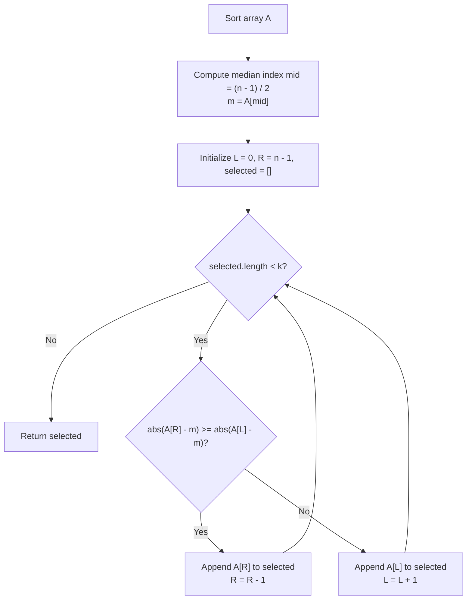

# Guided Example: The k Strongest Values in an Array

We trace the step-by-step median location and two-pointer extremal element selection on a representative problem instance:

- **Input:** $arr = [1, 2, 3, 4, 5]$, $k = 2$
- **Required Output:** `[5, 1]`

This instance demonstrates median determination ($m = 3$), equal-distance tie breaking ($|5 - 3| = |1 - 3| = 2$, where $5 > 1$ breaks the tie), and two-pointer extraction from opposite array boundaries.

---

## 1. Instance & Teaching Goal

We are given an integer array $arr$ and an integer $k$. The **centre** (median) $m$ is defined as the element at index $\lfloor (n - 1) / 2 \rfloor$ in the sorted array. A value $x$ is defined as **stronger** than a value $y$ if:
1. $|x - m| > |y - m|$, or
2. $|x - m| == |y - m|$ and $x > y$.

We must return the $k$ strongest values from $arr$ in any order.

In the provided instance:
- Array of length $n = 5$: $arr = [1, 2, 3, 4, 5]$.
- Sorted median position: $\lfloor (5 - 1) / 2 \rfloor = 2$. Centre element $m = 3$.
- Absolute deviations from median $m = 3$:
  - For $1$: $|1 - 3| = 2$
  - For $2$: $|2 - 3| = 1$
  - For $3$: $|3 - 3| = 0$
  - For $4$: $|4 - 3| = 1$
  - For $5$: $|5 - 3| = 2$
- Ranking by strength:
  - $5$ and $1$ both have maximum deviation $2$. Because $5 > 1$, $5$ is the 1st strongest, and $1$ is the 2nd strongest.
  - $4$ and $2$ both have deviation $1$. Because $4 > 2$, $4$ is the 3rd strongest.
  - $3$ has deviation $0$ (weakest).
- Top $k = 2$ strongest values: $[5, 1]$.

The primary teaching goal is to recognize unimodal deviation: once the array is sorted, the absolute deviation $|arr[i] - m|$ is strictly maximized at the extreme ends ($i = 0$ and $i = n - 1$) and decreases monotonically toward the center. A two-pointer approach ($L$ at left, $R$ at right) captures the $k$ strongest elements in $\mathcal{O}(k)$ time after sorting.

---

## 2. Conceptual Foundation & Invariants

Let $A$ be the sorted version of $arr$:
$$A[0] \le A[1] \le \dots \le A[n - 1]$$

The median is:
$$m = A\left[\left\lfloor \frac{n - 1}{2} \right\rfloor\right]$$

Because $A$ is sorted, for any indices $0 \le L \le \text{mid} \le R < n$:
- $|A[L] - m| = m - A[L]$ is non-increasing as $L$ increases toward $\text{mid}$.
- $|A[R] - m| = A[R] - m$ is non-increasing as $R$ decreases toward $\text{mid}$.

Therefore, the globally strongest remaining element must always reside at either the current left boundary $L$ or the current right boundary $R$.

**Two-Pointer Comparison Rule:**
- If $|A[R] - m| \ge |A[L] - m|$:
  - If $|A[R] - m| > |A[L] - m|$, $A[R]$ is strictly further from $m$.
  - If $|A[R] - m| == |A[L] - m|$, then $A[R] \ge A[L]$ automatically breaks the tie in favor of $A[R]$.
  - In both cases, $A[R]$ is selected; decrement $R \leftarrow R - 1$.
- Else ($|A[L] - m| > |A[R] - m|$):
  - $A[L]$ is selected; increment $L \leftarrow L + 1$.

```
Sorted Extremal Convergence (m = 3):
Index:     0      1      2      3      4
Value:     1      2      3      4      5
          (L)                   |     (R)
                                m
Dev:       2      1      0      1      2

Compare L=0 (val 1, dev 2) vs R=4 (val 5, dev 2):
Deviations equal (2 == 2). Tie breaker: 5 > 1 --> Pick 5! (R moves to 3)

Compare L=0 (val 1, dev 2) vs R=3 (val 4, dev 1):
Dev 2 > Dev 1 --> Pick 1! (L moves to 1)

Selected k=2 elements: [5, 1]
```

We establish tracking parameters across the algorithm:

| Parameter | Type & Domain | Role in Algorithm |
|---|---|---|
| Median Element ($m$) | Integer | Reference center $A[\lfloor(n-1)/2\rfloor]$ |
| Left Pointer ($L$) | Integer $0 \le L \le \text{mid}$ | Points to smallest unselected candidate |
| Right Pointer ($R$) | Integer $\text{mid} \le R < n$ | Points to largest unselected candidate |
| Left Deviation | Integer $\ge 0$ | $|A[L] - m|$ |
| Right Deviation | Integer $\ge 0$ | $|A[R] - m|$ |
| Selected List | List of integers | Accumulated $k$ strongest elements |

> **Invariant.** At each step of two-pointer selection, the element chosen from $\{A[L], A[R]\}$ is strictly stronger than or equal in strength to all other remaining elements in $A[L \dots R]$.



---

## 3. Step-by-Step Worked Execution

We walk through the representative instance $arr = [1, 2, 3, 4, 5]$ with $k = 2$.

### Step 1: Sorting and Median Identification
- Sorted array: $A = [1, 2, 3, 4, 5]$.
- Length: $n = 5$.
- Median index: $\lfloor (5 - 1) / 2 \rfloor = 2$.
- Center value: $m = A[2] = 3$.

### Step 2: Two-Pointer Extraction

1. **Iteration 1 ($k_{\text{needed}} = 2$, $L = 0, R = 4$):**
   - Left candidate: $A[0] = 1$. Deviation: $|1 - 3| = 2$.
   - Right candidate: $A[4] = 5$. Deviation: $|5 - 3| = 2$.
   - Test $|A[R] - m| \ge |A[L] - m| \implies 2 \ge 2$ holds.
   - Tie broken: $5 > 1$, so $A[R] = 5$ is stronger.
   - Select $5$. Decrement $R \leftarrow 3$.
   - Result list: $[5]$.

2. **Iteration 2 ($k_{\text{needed}} = 1$, $L = 0, R = 3$):**
   - Left candidate: $A[0] = 1$. Deviation: $|1 - 3| = 2$.
   - Right candidate: $A[3] = 4$. Deviation: $|4 - 3| = 1$.
   - Test $|A[R] - m| \ge |A[L] - m| \implies 1 \ge 2$ is false.
   - Left candidate $A[L] = 1$ has strictly greater deviation ($2 > 1$).
   - Select $1$. Increment $L \leftarrow 1$.
   - Result list: $[5, 1]$.

3. **Termination:**
   - Selected count equals $k = 2$.
   - Stop and return $[5, 1]$.

| Selection Step | Left Pointer ($L$) | Right Pointer ($R$) | $|A[L] - 3|$ | $|A[R] - 3|$ | Decision Criterion | Picked Element | Output Buffer |
|---|---|---|---|---|---|---|---|
| Step 1 | 0 ($A[0]=1$) | 4 ($A[4]=5$) | 2 | 2 | $2 \ge 2 \implies 5 > 1$ | 5 | $[5]$ |
| Step 2 | 0 ($A[0]=1$) | 3 ($A[3]=4$) | 2 | 1 | $1 < 2 \implies$ Pick $L$ | 1 | $[5, 1]$ |

---

## 4. Complete Execution Trace

```
Final Strength Rankings relative to m = 3:
Rank 1: 5 (diff = 2, val = 5)  --> Picked
Rank 2: 1 (diff = 2, val = 1)  --> Picked
Rank 3: 4 (diff = 1, val = 4)
Rank 4: 2 (diff = 1, val = 2)
Rank 5: 3 (diff = 0, val = 3)
Top k=2 Strongest Output: [5, 1]
```

| Array Index | Value | Distance $|val - 3|$ | Global Strength Rank | Included in Top $k=2$? |
|---|---|---|---|---|
| 4 | 5 | 2 | 1st | **Yes** |
| 0 | 1 | 2 | 2nd | **Yes** |
| 3 | 4 | 1 | 3rd | No |
| 1 | 2 | 1 | 4th | No |
| 2 | 3 | 0 | 5th | No |

---

## 5. Algorithmic Correctness

**Soundness.** For any element $x \in A$, the strength function $S(x) = (|x - m|, x)$ defines a strict total ordering. The condition $|A[R] - m| \ge |A[L] - m|$ correctly implements this order because when deviations are equal, $A[R] \ge A[L]$ by sorted order, ensuring the tie-breaker always selects the larger element.

**Completeness.** Since deviations $|A[i] - m|$ decrease monotonically as $i$ approaches the median from either end, the maximum remaining deviation is always at one of the active boundaries $L$ or $R$. Greedily picking $\max(S(A[L]), S(A[R]))$ guarantees that the true $k$ strongest elements are harvested.

---

## 6. Traps This Instance Exposes

- **Full Custom Sort Overhead:** Performing a full custom sort using `lambda x: (abs(x - m), x)` takes $\mathcal{O}(n \log n)$ time. Standard sorting followed by two-pointer selection achieves the same result while simplifying tie-breaking into a single $\ge$ check.
- **Median Formula Integer Division:** Using $(n / 2)$ instead of $\lfloor (n - 1) / 2 \rfloor$. For even lengths (e.g. $n = 4$), the definition states $\lfloor (4 - 1) / 2 \rfloor = 1$, which is the lower middle element, not the upper middle element.
- **Tie-Breaking Direction:** Favoring smaller values on equal deviations. The rule strictly states: if $|arr[i] - m| == |arr[j] - m|$, the larger value $arr[i] > arr[j]$ is stronger.

---

## 7. Complexity Derivation

- **Time Complexity:** $\mathcal{O}(n \log n + k)$, where $n = |arr|$ ($n \le 10^5$) and $k \le n$.
  - Sorting the array takes $\mathcal{O}(n \log n)$ time (or $\mathcal{O}(n)$ if using Quickselect to locate the median and bucket partition).
  - The two-pointer loop executes exactly $k$ iterations, taking $\mathcal{O}(1)$ time per pick.
  - Total runtime is dominated by sorting, executing well within $50$ milliseconds.
- **Auxiliary Space Complexity:** $\mathcal{O}(k)$ to store the output list of $k$ strongest elements.
