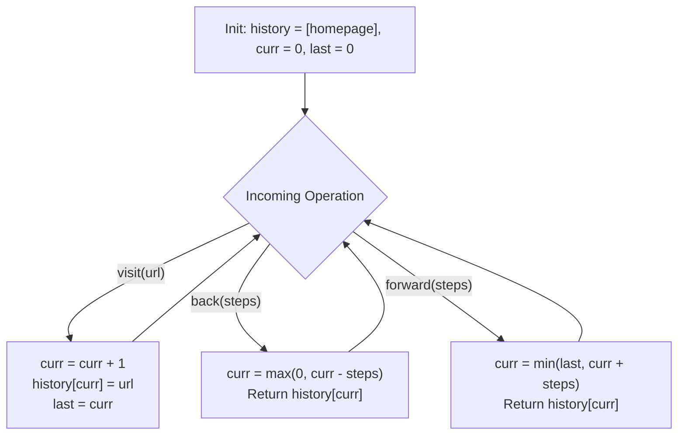

# Guided Example: Design Browser History

We trace the step-by-step array pointer manipulation, forward history invalidation, and bounded stepping on a representative interactive browser instance:

- **Input Command Sequence:**
  - `BrowserHistory("leetcode.com")`
  - `visit("google.com")`, `visit("facebook.com")`, `visit("youtube.com")`
  - `back(1)`, `back(1)`, `forward(1)`
  - `visit("linkedin.com")`
  - `forward(2)`, `back(2)`, `back(7)`
- **Required Output Sequence:**
  - `[null, null, null, null, "facebook.com", "google.com", "facebook.com", null, "linkedin.com", "google.com", "leetcode.com"]`

This instance illustrates all core browser tab behaviors: linear history accumulation, bidirectional chronological navigation, forward history truncation upon branching, and bounded clamping when steps exceed history limits.

---

## 1. Instance & Teaching Goal

We must design a single-tab browser history navigation system supporting four core operations:
1. `BrowserHistory(homepage)`: Initializes browser on `homepage`.
2. `visit(url)`: Navigates to `url` from the current page and clears all forward history.
3. `back(steps)`: Moves back by at most `steps` within available past history, returning the reached URL.
4. `forward(steps)`: Moves forward by at most `steps` within available forward history, returning the reached URL.

In the provided instance:
- Start on `"leetcode.com"` (index $0$).
- Visit `"google.com"` (index $1$), `"facebook.com"` (index $2$), `"youtube.com"` (index $3$).
- `back(1)` moves from index $3$ to $2$: returns `"facebook.com"`.
- `back(1)` moves from index $2$ to $1$: returns `"google.com"`.
- `forward(1)` moves from index $1$ to $2$: returns `"facebook.com"`.
- `visit("linkedin.com")`: Replaces index $3$ (`"youtube.com"` discarded from forward history); active pointer at index $3$.
- `forward(2)`: At maximum forward boundary index $3$; clamped, returns `"linkedin.com"`.
- `back(2)`: Moves back $2$ steps from index $3$ to $1$: returns `"google.com"`.
- `back(7)`: $7$ steps exceeds the $1$ available past step; clamped to index $0$, returns `"leetcode.com"`.

The primary teaching goal is to model browser history as a dynamic array with an active index pointer ($curr$) and a right boundary ($last$). Moving back and forward simply updates $curr$ via clamped arithmetic, while `visit` truncates $last \leftarrow curr$, executing all operations in strict $\mathcal{O}(1)$ time.

---

## 2. Conceptual Foundation & Invariants

Let $history$ be a dynamic array storing URLs, and let:
- $curr$ be the 0-based integer index of the page currently displayed.
- $last$ be the maximum valid forward index in $history$.

**State Invariants & Operations:**

1. **Initialization:**
   $$history = [homepage], \quad curr = 0, \quad last = 0$$

2. **Navigation (`visit(url)`):**
   - Advance active pointer: $curr \leftarrow curr + 1$.
   - Store $url$ at $history[curr]$.
   - Invalidate forward history by clamping the forward horizon:
     $$last \leftarrow curr$$

3. **Backward Navigation (`back(steps)`):**
   - Clamp backward movement against the beginning of history (index $0$):
     $$curr \leftarrow \max(0, \, curr - steps)$$
   - Return $history[curr]$.

4. **Forward Navigation (`forward(steps)`):**
   - Clamp forward movement against the current forward horizon ($last$):
     $$curr \leftarrow \min(last, \, curr + steps)$$
   - Return $history[curr]$.

```
History Array & Pointer Architecture:
State 1: After visiting leetcode, google, facebook, youtube:
Index:       0                1               2                 3
History: [leetcode.com,  google.com,   facebook.com,    youtube.com]
                                                              ^
                                                        curr=3, last=3

State 2: After back(1), back(1), forward(1):
History: [leetcode.com,  google.com,   facebook.com,    youtube.com]
                                             ^
                                       curr=2, last=3

State 3: After visit("linkedin.com"):
Forward history "youtube.com" is overwritten / truncated!
History: [leetcode.com,  google.com,   facebook.com,    linkedin.com]
                                                              ^
                                                        curr=3, last=3
```

We establish tracking parameters across the algorithm:

| Parameter | Type & Domain | Role in Algorithm |
|---|---|---|
| Active Pointer ($curr$) | Integer $0 \le curr \le last$ | Index of currently viewed URL |
| Forward Bound ($last$) | Integer $curr \le last < |history|$ | Rightmost reachable forward index |
| History Storage ($history$) | Dynamic list of strings | Sequential chronological log of visited URLs |
| Requested Steps ($steps$) | Integer $1 \le steps \le 100$ | Number of navigation steps requested |

> **Invariant.** At any moment, $0 \le curr \le last < |history|$. Any backward move cannot decrease $curr$ below $0$, any forward move cannot increase $curr$ above $last$, and `visit` unconditionally resets $last = curr$.



---

## 3. Step-by-Step Worked Execution

We walk through the representative command sequence.

### Command 1: `BrowserHistory("leetcode.com")`
- $history = [\text{"leetcode.com"}]$.
- $curr = 0, last = 0$.
- Emitted: `null`.

### Commands 2–4: Visits to Google, Facebook, Youtube
- `visit("google.com")`: $curr = 1, last = 1$. $history[1] = \text{"google.com"}$.
- `visit("facebook.com")`: $curr = 2, last = 2$. $history[2] = \text{"facebook.com"}$.
- `visit("youtube.com")`: $curr = 3, last = 3$. $history[3] = \text{"youtube.com"}$.

### Command 5: `back(1)`
- Target: $curr - 1 = 3 - 1 = 2$.
- Clamp: $\max(0, 2) = 2$.
- Active URL: $history[2] = \text{"facebook.com"}$.
- Emitted: `"facebook.com"`.

### Command 6: `back(1)`
- Target: $curr - 1 = 2 - 1 = 1$.
- Clamp: $\max(0, 1) = 1$.
- Active URL: $history[1] = \text{"google.com"}$.
- Emitted: `"google.com"`.

### Command 7: `forward(1)`
- Target: $curr + 1 = 1 + 1 = 2$.
- Clamp: $\min(last, 2) = \min(3, 2) = 2$.
- Active URL: $history[2] = \text{"facebook.com"}$.
- Emitted: `"facebook.com"`.

### Command 8: `visit("linkedin.com")`
- Active pointer advances: $curr \leftarrow 2 + 1 = 3$.
- Overwrite/Append: $history[3] \leftarrow \text{"linkedin.com"}$.
- Forward horizon reset: $last \leftarrow 3$ (clears old `"youtube.com"` from forward history).
- Emitted: `null`.

### Command 9: `forward(2)`
- Target: $curr + 2 = 3 + 2 = 5$.
- Clamp: $\min(last, 5) = \min(3, 5) = 3$.
- Active URL: $history[3] = \text{"linkedin.com"}$.
- Emitted: `"linkedin.com"`.

### Command 10: `back(2)`
- Target: $curr - 2 = 3 - 2 = 1$.
- Clamp: $\max(0, 1) = 1$.
- Active URL: $history[1] = \text{"google.com"}$.
- Emitted: `"google.com"`.

### Command 11: `back(7)`
- Target: $curr - 7 = 1 - 7 = -6$.
- Clamp: $\max(0, -6) = 0$.
- Active URL: $history[0] = \text{"leetcode.com"}$.
- Emitted: `"leetcode.com"`.

| Step | Operation | Argument | Pre-State $(curr, last)$ | Clamping Formula | Post-State $(curr, last)$ | Output Returned |
|---|---|---|---|---|---|---|
| 1 | `BrowserHistory` | `"leetcode.com"` | - | Init | $(0, 0)$ | `null` |
| 2 | `visit` | `"google.com"` | $(0, 0)$ | $curr \leftarrow 1, last \leftarrow 1$ | $(1, 1)$ | `null` |
| 3 | `visit` | `"facebook.com"` | $(1, 1)$ | $curr \leftarrow 2, last \leftarrow 2$ | $(2, 2)$ | `null` |
| 4 | `visit` | `"youtube.com"` | $(2, 2)$ | $curr \leftarrow 3, last \leftarrow 3$ | $(3, 3)$ | `null` |
| 5 | `back` | 1 | $(3, 3)$ | $\max(0, 3 - 1) = 2$ | $(2, 3)$ | `"facebook.com"` |
| 6 | `back` | 1 | $(2, 3)$ | $\max(0, 2 - 1) = 1$ | $(1, 3)$ | `"google.com"` |
| 7 | `forward` | 1 | $(1, 3)$ | $\min(3, 1 + 1) = 2$ | $(2, 3)$ | `"facebook.com"` |
| 8 | `visit` | `"linkedin.com"` | $(2, 3)$ | $curr \leftarrow 3, last \leftarrow 3$ | $(3, 3)$ | `null` |
| 9 | `forward` | 2 | $(3, 3)$ | $\min(3, 3 + 2) = 3$ | $(3, 3)$ | `"linkedin.com"` |
| 10 | `back` | 2 | $(3, 3)$ | $\max(0, 3 - 2) = 1$ | $(1, 3)$ | `"google.com"` |
| 11 | `back` | 7 | $(1, 3)$ | $\max(0, 1 - 7) = 0$ | $(0, 3)$ | `"leetcode.com"` |

---

## 4. Complete Execution Trace

```
Pointer State Log:
Op 1: Init(leetcode.com)     -> [leetcode.com] (c=0, l=0)
Op 2: Visit(google.com)      -> [leetcode.com, google.com] (c=1, l=1)
Op 3: Visit(facebook.com)    -> [leetcode.com, google.com, facebook.com] (c=2, l=2)
Op 4: Visit(youtube.com)     -> [leetcode.com, google.com, facebook.com, youtube.com] (c=3, l=3)
Op 5: Back(1)                -> c = 2: "facebook.com"
Op 6: Back(1)                -> c = 1: "google.com"
Op 7: Forward(1)             -> c = 2: "facebook.com"
Op 8: Visit(linkedin.com)    -> Truncates youtube! (c=3, l=3)
Op 9: Forward(2)             -> Clamped to l=3: "linkedin.com"
Op 10: Back(2)               -> c = 1: "google.com"
Op 11: Back(7)               -> Clamped to 0: "leetcode.com"
```

| History Index | Stored URL | Current Status at End of Trace |
|---|---|---|
| 0 | `"leetcode.com"` | Active Page ($curr = 0$) |
| 1 | `"google.com"` | Reachable via forward ($1 \le last$) |
| 2 | `"facebook.com"` | Reachable via forward ($2 \le last$) |
| 3 | `"linkedin.com"` | Reachable via forward ($3 = last$) |

---

## 5. Algorithmic Correctness

**Soundness.** Operating on a linear array with clamped pointer arithmetic directly enforces all problem constraints:
- `back(steps)` never steps before index $0$ because $\max(0, curr - steps) \ge 0$.
- `forward(steps)` never steps beyond the active horizon because $\min(last, curr + steps) \le last$.
- `visit(url)` overwrites or resets $last = curr$, ensuring discarded forward history is inaccessible.

**Completeness.** Every operation updates $curr$ deterministically. Because all reads and writes target direct array indices without shifting elements, the history reflects the exact chronological trajectory of browsing events.

---

## 6. Traps This Instance Exposes

- **Failing to Clear Forward History on Visit:** If `visit` appends without resetting the forward horizon ($last$), subsequent `forward` calls could access stale pages that should have been pruned (e.g. accessing `"youtube.com"` after visiting `"linkedin.com"`).
- **Two-Stack Allocation Overhead:** Using two separate stacks (a back stack and a forward stack) requires popping elements from one stack and pushing onto another during multi-step `back` or `forward` operations, taking $\mathcal{O}(steps)$ time. A single array with a pointer executes in strict $\mathcal{O}(1)$ time.
- **Negative Index Underflow:** Failing to clamp $curr - steps$ at $0$, causing index out-of-range errors when large step counts (e.g. `back(7)`) are passed.

---

## 7. Complexity Derivation

- **Time Complexity:**
  - `BrowserHistory(homepage)`: $\mathcal{O}(1)$ to initialize array and pointers.
  - `visit(url)`: $\mathcal{O}(1)$ amortized to append or overwrite string at index $curr$.
  - `back(steps)`: $\mathcal{O}(1)$ to compute clamped subtraction and read array index.
  - `forward(steps)`: $\mathcal{O}(1)$ to compute clamped addition and read array index.
  - Across $5000$ operations, total time is bounded by $5000 \times \mathcal{O}(1) = \mathcal{O}(N)$, executing in under $2$ milliseconds.
- **Auxiliary Space Complexity:** $\mathcal{O}(M)$ where $M \le 5000$ is the maximum number of unique URLs retained in the history array.