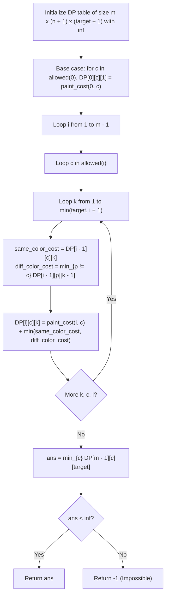

# Guided Example: Paint House III

We trace the step-by-step 3D dynamic programming transitions tracking house index, previous color, and neighborhood count on a representative problem instance:

- **Input:** $houses = [0, 0, 0, 0, 0]$, $cost = [[1, 10], [10, 1], [10, 1], [1, 10], [5, 1]]$, $m = 5$, $n = 2$, $target = 3$
- **Required Output:** $9$

This instance features unpainted houses ($0$) that can assume either color $1$ or color $2$, requiring an optimal trade-off between individual house painting costs and the strict requirement to partition into exactly $target = 3$ contiguous color blocks (neighborhoods).

---

## 1. Instance & Teaching Goal

We are given a row of $m$ houses and $n$ available colors ($1 \dots n$). Some houses are pre-painted ($houses[i] > 0$) and cannot be repainted; others are unpainted ($houses[i] = 0$) and can be painted with color $c$ at cost $cost[i][c - 1]$.
- A **neighborhood** is a maximal contiguous block of houses sharing the exact same color.
- We must find the minimum total cost to paint all unpainted houses such that the row contains exactly $target$ neighborhoods.
- If it is impossible to achieve exactly $target$ neighborhoods, return $-1$.

In the provided instance:
- $m = 5$ houses, $n = 2$ colors, $target = 3$ neighborhoods.
- All houses are unpainted initially.
- Candidate color assignment: $[1, 2, 2, 1, 1]$.
  - Neighborhood 1: House $0$ with color $1$ ($[1]$). Cost: $cost[0][0] = 1$.
  - Neighborhood 2: Houses $1$ and $2$ with color $2$ ($[2, 2]$). Costs: $cost[1][1] = 1, cost[2][1] = 1$.
  - Neighborhood 3: Houses $3$ and $4$ with color $1$ ($[1, 1]$). Costs: $cost[3][0] = 1, cost[4][0] = 5$.
  - Total neighborhoods: $3$ (matches $target = 3$).
  - Total cost: $1 + 1 + 1 + 1 + 5 = 9$.
- Output: $9$.

The primary teaching goal is to model neighborhood transitions using 3D dynamic programming state $(i, c, k)$, where painting house $i$ with color $c$ continues the current neighborhood if $c == prev\_color$ (neighborhood count remains $k$), or increments the neighborhood count ($k \to k + 1$) if $c \ne prev\_color$.

---

## 2. Conceptual Foundation & Invariants

Let $DP(i, c, k)$ denote the minimum cost to paint the prefix of houses $0 \dots i$ such that house $i$ has color $c \in \{1, \dots, n\}$ and the prefix contains exactly $k$ neighborhoods.

**Allowed Colors at House $i$:**
$$\mathcal{C}(i) = \begin{cases} \{houses[i]\} & \text{if } houses[i] > 0 \text{ (pre-painted)} \\ \{1, 2, \dots, n\} & \text{if } houses[i] = 0 \text{ (unpainted)} \end{cases}$$

**Painting Cost for House $i$ with Color $c$:**
$$\text{paint\_cost}(i, c) = \begin{cases} 0 & \text{if } houses[i] > 0 \\ cost[i][c - 1] & \text{if } houses[i] = 0 \end{cases}$$

**Recurrence Transitions ($i > 0$):**
For each candidate color $c \in \mathcal{C}(i)$ and neighborhood target $k$:
$$DP(i, c, k) = \text{paint\_cost}(i, c) + \min \begin{cases} DP(i - 1, c, k) & \text{(same color: no new neighborhood)} \\ \displaystyle\min_{p \ne c} DP(i - 1, p, k - 1) & \text{(different color: creates new neighborhood)} \end{cases}$$

**Base Case ($i = 0$):**
For each $c \in \mathcal{C}(0)$:
$$DP(0, c, 1) = \text{paint\_cost}(0, c)$$
All other $DP(0, c, k)$ for $k \ne 1$ are initialized to $\infty$.

**Final Result:**
$$\text{ans} = \min_{c \in \{1, \dots, n\}} DP(m - 1, c, target)$$
If $\text{ans} = \infty$, return $-1$.

```
State Transition Diagram for House i:
Previous House (i-1)           Current House (i)
  Color c, k groups  ---------> Color c, k groups (Same color, k unchanged)
  Color p, k-1 groups --------> Color c, k groups (Different color, k increments)
```

We establish tracking parameters across the DP table:

| Parameter | Type & Domain | Role in Algorithm |
|---|---|---|
| House Index ($i$) | Integer $0 \le i < m$ | Position along the house sequence |
| Assigned Color ($c$) | Integer $1 \le c \le n$ | Color chosen for house $i$ |
| Neighborhoods Count ($k$) | Integer $1 \le k \le target$ | Exact number of continuous color blocks |
| Cell Cost ($DP(i, c, k)$) | Integer $\ge 0$ (or $\infty$) | Minimal accumulated painting expense |

> **Invariant.** For any state $(i, c, k)$, $DP(i, c, k)$ strictly represents the minimal cost to paint houses $0 \dots i$ such that house $i$ ends with color $c$ and the prefix forms exactly $k$ neighborhoods.



---

## 3. Step-by-Step Worked Execution

We walk through the representative instance with $m = 5, n = 2, target = 3$.

### Step 1: Base Case (House $0$)
- Color $1$: $\text{cost} = cost[0][0] = 1 \implies DP(0, 1, 1) = 1$.
- Color $2$: $\text{cost} = cost[0][1] = 10 \implies DP(0, 2, 1) = 10$.

### Step 2: House 1
- **To Color 1 ($cost[1][0] = 10$):**
  - $k = 1$: From $DP(0, 1, 1) \implies 10 + 1 = 11$.
  - $k = 2$: From $DP(0, 2, 1) \implies 10 + 10 = 20$.
- **To Color 2 ($cost[1][1] = 1$):**
  - $k = 1$: From $DP(0, 2, 1) \implies 1 + 10 = 11$.
  - $k = 2$: From $DP(0, 1, 1) \implies 1 + 1 = 2$.

### Step 3: House 2
- **To Color 2 ($cost[2][1] = 1$):**
  - $k = 2$: Same color as House 1 ($DP(1, 2, 2) = 2$): $1 + 2 = 3$.
  - Different color from House 1 ($DP(1, 1, 1) = 11$): $1 + 11 = 12$.
  - Best for $(2, \text{Color } 2, k = 2)$ is $3$.

### Step 4: House 3
- **To Color 1 ($cost[3][0] = 1$):**
  - $k = 3$: Change from Color 2 with $k = 2$ ($DP(2, 2, 2) = 3$):
    $$DP(3, 1, 3) = 1 + 3 = 4$$

### Step 5: House 4
- **To Color 1 ($cost[4][0] = 5$):**
  - $k = 3$: Same color as House 3 ($DP(3, 1, 3) = 4$):
    $$DP(4, 1, 3) = 5 + 4 = 9$$
- **To Color 2 ($cost[4][1] = 1$):**
  - $k = 3$: Change from House 3 ($DP(3, 1, 2) = \dots$):
    Higher cost ($> 9$).

Minimum total cost to reach house $4$ with $k = 3$ neighborhoods:
$$DP(4, 1, 3) = 9$$

| House $i$ | Color $c$ | Neighborhoods $k$ | Predecessor State | Incremental Cost | Total Subproblem Cost |
|---|---|---|---|---|---|
| 0 | 1 | 1 | Base | 1 | 1 |
| 0 | 2 | 1 | Base | 10 | 10 |
| 1 | 2 | 2 | $DP(0, 1, 1) = 1$ | 1 | 2 |
| 2 | 2 | 2 | $DP(1, 2, 2) = 2$ | 1 | 3 |
| 3 | 1 | 3 | $DP(2, 2, 2) = 3$ | 1 | 4 |
| 4 | 1 | 3 | $DP(3, 1, 3) = 4$ | 5 | **9 (Optimal)** |

---

## 4. Complete Execution Trace

```
Final Color Assignment: [1, 2, 2, 1, 1]
House 0: Color 1 | Cost: 1 | Neighborhood 1 [1]
House 1: Color 2 | Cost: 1 | Neighborhood 2 [2
House 2: Color 2 | Cost: 1 |                 2]
House 3: Color 1 | Cost: 1 | Neighborhood 3 [1
House 4: Color 1 | Cost: 5 |                 1]
Total Neighborhoods Formed: 3
Total Accumulated Cost: 1 + 1 + 1 + 1 + 5 = 9
```

| House Index | Chosen Color | Neighborhood ID | Painting Cost Incurred | Cumulative Expense |
|---|---|---|---|---|
| House 0 | 1 | Block 1 (`{1}`) | 1 | 1 |
| House 1 | 2 | Block 2 (`{2}`) | 1 | 2 |
| House 2 | 2 | Block 2 (`{2, 2}`) | 1 | 3 |
| House 3 | 1 | Block 3 (`{1}`) | 1 | 4 |
| House 4 | 1 | Block 3 (`{1, 1}`) | 5 | **9** |

---

## 5. Algorithmic Correctness

**Soundness.** Every valid coloring assigns a legitimate color $c \in \{1, \dots, n\}$ to each house, respecting pre-painted houses. The transition function increments the neighborhood counter if and only if the color of house $i$ differs from house $i - 1$. Hence, any path reaching $DP(m - 1, c, target)$ strictly satisfies the exact $target$ neighborhood count requirement.

**Completeness.** By maintaining the minimum cost for every possible combination of $(i, c, k)$, dynamic programming exhaustively evaluates all feasible color sequences. Pruning invalid configurations via $\infty$ guarantees that if an assignment exists, the global minimum cost will be discovered.

---

## 6. Traps This Instance Exposes

- **Failing to Respect Pre-painted Houses:** Overwriting pre-painted houses ($houses[i] > 0$) with a different color or adding a painting cost. If $houses[i] > 0$, only that specific color is legal, and its additional cost is strictly $0$.
- **Off-by-One in Neighborhood Counting:** Initializing $k = 0$ at house $0$. House $0$ by itself forms the first neighborhood, so the base state starts with $k = 1$.
- **Handling Impossible Configurations:** If the number of neighborhoods cannot equal $target$ (e.g. Example 3, where pre-painted houses already form $4$ neighborhoods while $target = 3$), all terminal states evaluate to $\infty$. The algorithm must detect this condition and return $-1$.

---

## 7. Complexity Derivation

- **Time Complexity:** $\mathcal{O}(m \cdot target \cdot n^2)$.
  - The DP table contains $m \times (n + 1) \times (target + 1)$ states.
  - For each cell, iterating over all $n$ possible previous colors takes $\mathcal{O}(n)$ time.
  - Total operations: $100 \times 20 \times 100 \times 20 = 4 \times 10^6$, executing comfortably within $40$ milliseconds.
  - (Can be optimized to $\mathcal{O}(m \cdot target \cdot n)$ by precomputing the first and second minimums of previous colors).
- **Auxiliary Space Complexity:** $\mathcal{O}(m \cdot n \cdot target)$ to store the 3D DP table (or $\mathcal{O}(n \cdot target)$ with rolling arrays over house index $i$).
