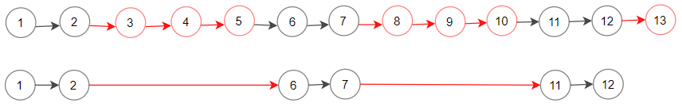
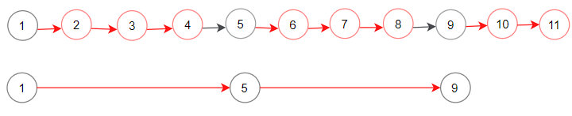

## Description

You are given the `head` of a linked list and two integers `m` and `n`.

Traverse the linked list and remove some nodes in the following way:

- Start with the head as the current node.

- Keep the first `m` nodes starting with the current node.

- Remove the next `n` nodes

- Keep repeating steps 2 and 3 until you reach the end of the list.

Return *the head of the modified list after removing the mentioned nodes*.
### Function Contract

**Inputs**

- `head`: the first node of a nonempty singly linked list;
- `m`: the number of nodes to keep at the start of each cycle;
- `n`: the number of following nodes to remove.

The app-local contract uses the package's explicit `ListNode` equivalent, whose
`val` and `next` fields represent the source-native node model. Let $L$ be the
number of nodes in the input list.

**Return value**

Return `head` after modifying the list in place so each cycle keeps up to `m`
available nodes and then removes up to `n` available nodes. Retained nodes keep
their original relative order and identity.

### Examples
#### Example 1

- **Input:** $head = [1,2,3,4,5,6,7,8,9,10,11,12,13], m = 2, n = 3$
- **Output:** `[1,2,6,7,11,12]`
- **Explanation:** Keep the first (m = 2) nodes starting from the head of the linked List  (1 ->2) show in black nodes.
Delete the next (n = 3) nodes (3 -> 4 -> 5) show in read nodes.
Continue with the same procedure until reaching the tail of the Linked List.
Head of the linked list after removing nodes is returned.
#### Example 2

- **Input:** $head = [1,2,3,4,5,6,7,8,9,10,11], m = 1, n = 3$
- **Output:** `[1,5,9]`
- **Explanation:** Head of linked list after removing nodes is returned.
### Constraints

- The number of nodes in the list is in the range $[1, 10^{4}]$.

- $1 \le \text{Node.val} \le 10^{6}$

- $1 \le m, n \le 1000$

**Follow up:** Could you solve this problem by modifying the list in-place?