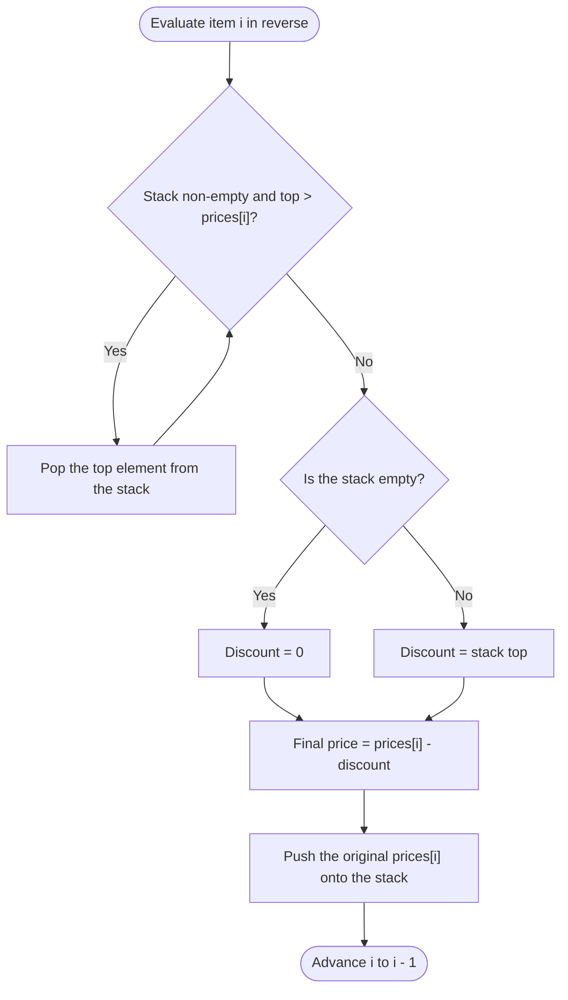

# Guided Example: Final Prices With a Special Discount in a Shop

We trace the step-by-step execution of the monotonic stack algorithm on a representative problem instance:

- **Input:** `prices = [8, 4, 6, 2, 3]`
- **Required output:** `[4, 2, 4, 2, 3]`

This instance captures every critical dynamic: immediate discounts ($8$ discounted by adjacent $4$), non-adjacent discounts where intermediate larger values must be discarded ($6$ discounted by $2$ across distance), items receiving zero discount ($2$ and tail item $3$), and the preservation of original catalog prices when pushing onto the candidate stack.

---

## 1. Instance & Teaching Goal

You are given an integer array `prices` where $\text{prices}[i]$ represents the purchase price of the $i$-th item in a shop. A special discount rule applies: if you purchase the $i$-th item, you receive a discount equivalent to $\text{prices}[j]$, where $j$ is the minimum index such that $j > i$ and $\text{prices}[j] \le \text{prices}[i]$. If no such subsequent index exists, no discount is applied and you pay the full price $\text{prices}[i]$.

Our objective is to compute the array of final payable prices `[4, 2, 4, 2, 3]` in linear time without testing all $\mathcal{O}(n^2)$ index pairs.

Evaluating every pair $(i, j)$ requires searching forward from each item, leading to quadratic latency on non-decreasing sequences. The monotonic stack resolves this by scanning the array in reverse (from right to left, index $n-1$ down to $0$) and maintaining the subset of future prices that can realistically serve as the first smaller-or-equal discount for preceding items.

---

## 2. Conceptual Foundation & Invariants

When examining item $i$, any future item $k > i$ whose price is strictly greater than $\text{prices}[i]$ can never serve as a discount for item $i$. Furthermore, because item $i$ occurs earlier in the array ($i < k$) and has a lower or equal price ($\text{prices}[i] \le \text{prices}[k]$), any item to the left of $i$ seeking a discount will encounter item $i$ before it ever encounters item $k$. Therefore, item $k$ becomes completely obsolete and can be discarded.

```
Reverse Traversal: index i moves from 4 down to 0
Stack stores candidate discounts to the right (top = closest candidate)

           +-------------------------+
Step i:    | Current Price prices[i] |
           +-------------------------+
                        |
                        v
          Pop stack while top > prices[i]
                        |
                        v
          Stack top is <= prices[i]?
           /                       \
        YES                         NO (Stack empty)
         |                           |
Discount = Stack top          Discount = 0
         \                           /
          +-------------------------+
          | Record: prices[i] - Disc|
          +-------------------------+
                        |
          Push original prices[i] onto stack
```

We define the primary state tracking parameters:

| Parameter | Type / Domain | Operational Responsibility | State at Instance Start |
|---|---|---|---|
| Index $i$ | Integer $\in [0, n-1]$ | Active item under evaluation, moving from right to left | $4$ |
| Original Price $x$ | Integer $\ge 1$ | Unmodified catalog price $\text{prices}[i]$ | $3$ |
| Monotonic Stack | LIFO Stack of integers | Surviving future price candidates, strictly non-decreasing from top to bottom | $\emptyset$ |
| Resolved Discount | Integer $\ge 0$ | Selected discount value ($\text{top}$ of stack or $0$) | None |
| Final Price | Integer $\ge 0$ | Computed payable value: $x - \text{Discount}$ | Unassigned |

> **Monotonic Discount Invariant.** At the start of step $i$, the stack contains a subsequence of future prices from indices $j > i$. From top to bottom, these values are strictly increasing (or non-decreasing). When elements greater than $\text{prices}[i]$ are popped, the new top element is guaranteed to be the nearest future item $j > i$ satisfying $\text{prices}[j] \le \text{prices}[i]$.



---

## 3. Step-by-Step Worked Execution

### Step 1: Tail Item at Index $i = 4$ ($x = 3$)

We begin at the rightmost boundary index $i = 4$ with original price $x = 3$.

- The candidate stack is empty ($\emptyset$).
- Because no elements follow index $4$, no discount can exist. Discount is $0$.
- The final price is $3 - 0 = 3$.
- We push the original price $3$ onto the stack.

| Field | Prior Value | Action / Transformation | Resulting State |
|---|---|---|---|
| Evaluated Index | Unset | Initialize at right boundary $i = 4$ | $i = 4, x = 3$ |
| Stack State | $\emptyset$ | Stack empty, no pop needed | $\emptyset$ |
| Discount Applied | None | No successor exists | $0$ |
| Final Price $\text{ans}[4]$ | Unset | $3 - 0 = 3$ | $3$ |
| Stack After Push | $\emptyset$ | Push original price $3$ | $[3]$ |

---

### Step 2: Item at Index $i = 3$ ($x = 2$)

We advance leftward to index $i = 3$ with price $x = 2$.

- The stack top is $3$.
- Comparing $x = 2$ against the stack top: $2 < 3$. Since $3 > 2$, item $4$ can never serve as a discount for item $3$, nor can it serve as a discount for any item to the left of $3$ (item $3$ is smaller and closer).
- We pop $3$ from the stack.
- The stack is now empty. Discount is $0$.
- The final price is $2 - 0 = 2$.
- We push the original price $2$ onto the stack.

| Field | Prior Value | Action / Transformation | Resulting State |
|---|---|---|---|
| Evaluated Index | $4$ | Decrement cursor to $i = 3$ | $i = 3, x = 2$ |
| Stack Top Comparison | $\text{top} = 3$ | $2 < 3 \implies$ pop $3$ | Stack emptied: $\emptyset$ |
| Discount Applied | $0$ | No valid successor $\le 2$ | $0$ |
| Final Price $\text{ans}[3]$ | Unset | $2 - 0 = 2$ | $2$ |
| Stack After Push | $\emptyset$ | Push original price $2$ | $[2]$ |

---

### Step 3: Item at Index $i = 2$ ($x = 6$)

We advance leftward to index $i = 2$ with price $x = 6$.

- The stack top is $2$.
- Comparing $x = 6$ against the stack top: $6 \ge 2$. No pop occurs.
- The stack top $2$ represents the earliest valid discount to the right of index $2$.
- Discount is $2$.
- The final price is $6 - 2 = 4$.
- We push the original price $6$ onto the stack. The stack is now $[2, 6]$ with top $= 6$.

| Field | Prior Value | Action / Transformation | Resulting State |
|---|---|---|---|
| Evaluated Index | $3$ | Decrement cursor to $i = 2$ | $i = 2, x = 6$ |
| Stack Top Comparison | $\text{top} = 2$ | $6 \ge 2 \implies$ condition satisfied, retain top | Stack unchanged: $[2]$ |
| Discount Applied | $0$ | First smaller-or-equal price found | $2$ |
| Final Price $\text{ans}[2]$ | Unset | $6 - 2 = 4$ | $4$ |
| Stack After Push | $[2]$ | Push original price $6$ | $[2, 6]$ (top is $6$) |

---

### Step 4: Item at Index $i = 1$ ($x = 4$)

We advance leftward to index $i = 1$ with price $x = 4$.

- The stack top is $6$.
- Comparing $x = 4$ against the stack top: $4 < 6$. We pop $6$.
- The new stack top is $2$.
- Comparing $x = 4$ against the new stack top: $4 \ge 2$. Condition satisfied, stop popping.
- Discount is $2$.
- The final price is $4 - 2 = 2$.
- We push the original price $4$ onto the stack. The stack is now $[2, 4]$ with top $= 4$.

| Field | Prior Value | Action / Transformation | Resulting State |
|---|---|---|---|
| Evaluated Index | $2$ | Decrement cursor to $i = 1$ | $i = 1, x = 4$ |
| Stack Top Comparison | $\text{top} = 6$ | $4 < 6 \implies$ pop $6$; then $\text{top} = 2 \le 4$ | Stack: $[2]$ |
| Discount Applied | $2$ | Nearest valid successor is $2$ (at index $3$) | $2$ |
| Final Price $\text{ans}[1]$ | Unset | $4 - 2 = 2$ | $2$ |
| Stack After Push | $[2]$ | Push original price $4$ | $[2, 4]$ (top is $4$) |

---

### Step 5: Head Item at Index $i = 0$ ($x = 8$)

We advance leftward to the first item at index $i = 0$ with price $x = 8$.

- The stack top is $4$.
- Comparing $x = 8$ against the stack top: $8 \ge 4$. No pop occurs.
- The stack top $4$ represents the earliest valid discount to the right of index $0$ (item at index $1$).
- Discount is $4$.
- The final price is $8 - 4 = 4$.
- We push the original price $8$ onto the stack. The stack is now $[2, 4, 8]$ with top $= 8$.

| Field | Prior Value | Action / Transformation | Resulting State |
|---|---|---|---|
| Evaluated Index | $1$ | Decrement cursor to $i = 0$ | $i = 0, x = 8$ |
| Stack Top Comparison | $\text{top} = 4$ | $8 \ge 4 \implies$ retain top | Stack unchanged: $[2, 4]$ |
| Discount Applied | $2$ | Immediate successor at index $1$ qualifies | $4$ |
| Final Price $\text{ans}[0]$ | Unset | $8 - 4 = 4$ | $4$ |
| Stack After Push | $[2, 4]$ | Push original price $8$ | $[2, 4, 8]$ (top is $8$) |

---

## 4. Complete Execution Trace

The table below summarizes the full execution across the entire array from right to left:

| Step | Index $i$ | Original Price $x$ | Stack Before Step | Popped Values | Active Stack Top | Applied Discount | Computed Price | Stack After Push |
|---|---|---|---|---|---|---|---|---|
| 1 | $4$ | $3$ | $\emptyset$ | None | None | $0$ | $3 - 0 = 3$ | $[3]$ |
| 2 | $3$ | $2$ | $[3]$ | $3$ | None | $0$ | $2 - 0 = 2$ | $[2]$ |
| 3 | $2$ | $6$ | $[2]$ | None | $2$ | $2$ | $6 - 2 = 4$ | $[2, 6]$ |
| 4 | $1$ | $4$ | $[2, 6]$ | $6$ | $2$ | $2$ | $4 - 2 = 2$ | $[2, 4]$ |
| 5 | $0$ | $8$ | $[2, 4]$ | None | $4$ | $4$ | $8 - 4 = 4$ | $[2, 4, 8]$ |

Assembling the computed prices in original index order $i = 0, 1, 2, 3, 4$:
$$\text{ans} = [4, 2, 4, 2, 3]$$

This matches the required output.

---

## 5. Algorithmic Correctness

We prove that the reverse monotonic stack algorithm computes the exact discount defined by the problem statement.

### Soundness

Suppose the algorithm assigns discount $d = \text{prices}[j]$ to item $i$ via the stack top.
1. By construction of the reverse iteration, only elements from indices $k > i$ have been pushed onto the stack, so $j > i$.
2. The pop condition removes any stack element strictly greater than $\text{prices}[i]$. The retained stack top satisfies $d \le \text{prices}[i]$.
3. Therefore, $d$ is a valid discount value satisfying the problem inequality.

### Completeness

We show that $j$ is indeed the *minimum* index greater than $i$ with $\text{prices}[j] \le \text{prices}[i]$.
1. Assume for contradiction that there exists an index $k$ such that $i < k < j$ with $\text{prices}[k] \le \text{prices}[i]$.
2. Because index $k$ is greater than $i$, item $k$ was processed before item $i$.
3. At the time item $k$ was processed, item $j$ was already in the stack or had been popped. If $\text{prices}[j] \le \text{prices}[k]$, $j$ would have been preserved below $k$. When item $k$ was pushed, it occupied a position above $j$ in the stack.
4. When item $i$ subsequently inspected the stack, item $k$ sat above item $j$. If $\text{prices}[k] \le \text{prices}[i]$, the popping loop would have halted at item $k$, selecting $k$ rather than $j$.
5. Conversely, if item $k$ had been popped prior to step $i$, it must have been popped by an element $m$ with $k < m < j$ such that $\text{prices}[m] < \text{prices}[k] \le \text{prices}[i]$, in which case element $m$ would precede $j$.
6. In all cases, no valid candidate $k < j$ can be bypassed. The stack top is guaranteed to be the earliest qualifying successor.

---

## 6. Traps This Instance Exposes

### Trap 1: Pushing Mutated Discounted Prices Onto the Stack
A common error when modifying the input array in place is pushing the updated value $\text{prices}[i] - \text{discount}$ rather than the original catalog price $x$. In Step 3, if we modified $\text{prices}[2]$ from $6$ to $4$ and pushed $4$ onto the stack, subsequent item $1$ (with price $4$) would incorrectly treat $4$ as a valid discount, subtracting $4$ instead of $2$. The original price must always be preserved and pushed.

### Trap 2: Strict Inequality Discarding Equal Prices
The problem definition allows discounts when $\text{prices}[j] \le \text{prices}[i]$. An equal price is a completely valid discount. Using strict inequality $x \le \text{top}$ when popping would discard equal prices, leading to missing discounts when two adjacent items have identical prices. The pop condition must strictly be $x < \text{top}$.

### Trap 3: Quadratic Forward Traversal Degeneration
Attempting a naive nested search scanning forward from index $i+1$ to $n-1$ for each item results in $\frac{n(n-1)}{2}$ comparisons when the price array is strictly increasing (e.g., $[1, 2, 3, 4, 5]$). For $n = 500$, this executes $124{,}750$ checks, whereas the monotonic stack processes the entire input in exactly $n$ pushes and at most $n$ pops.

---

## 7. Complexity Derivation

### Time Complexity

- **Stack Operations:** Every element $i \in [0, n-1]$ is pushed onto the stack exactly once.
- **Pop Operations:** Each element can be popped from the stack at most once over the entire execution of the algorithm.
- **Arithmetic and Assignment:** At each index $i$, constant-time comparisons, subtractions, and array updates are performed.
- Therefore, the total number of stack operations across all $n$ items is at most $2n$.
- The overall time complexity is strictly linear:
$$\mathcal{O}(n)$$

### Auxiliary Space Complexity

- The monotonic stack holds at most $n$ elements in the worst case (which occurs when prices are strictly decreasing from left to right, meaning strictly increasing during the reverse traversal).
- Storing the output requires an array of length $n$ (or $\mathcal{O}(1)$ additional memory if modified in-place).
- The auxiliary working space is bounded by the stack depth:
$$\mathcal{O}(n)$$
