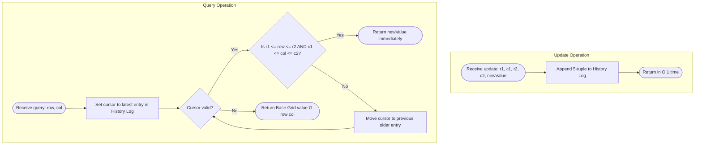

# Guided Example: Subrectangle Queries

We trace the step-by-step execution of the lazy update log approach on a representative problem instance:

- **Initial Grid:**
  $$\begin{bmatrix} 1 & 2 & 1 \\ 4 & 3 & 4 \\ 3 & 2 & 1 \\ 1 & 1 & 1 \end{bmatrix} \quad (\text{dimensions } 4 \times 3)$$
- **Operation Sequence:**
  1. `getValue(0, 2)`
  2. `updateSubrectangle(0, 0, 3, 2, 5)`
  3. `getValue(0, 2)`
  4. `getValue(3, 1)`
  5. `updateSubrectangle(3, 0, 3, 2, 10)`
  6. `getValue(3, 1)`
  7. `getValue(0, 2)`
- **Required Output:** `[1, null, 5, 5, null, 10, 5]`

This instance captures every essential behavior of 2D range update systems: retrieving unchanged values directly from the base grid, recording full-grid overwrites, layering localized subrectangle patches over earlier broader updates, and evaluating coordinates that intersect different historical layers.

---

## 1. Instance & Teaching Goal

The problem asks us to design a data structure that initializes a 2D integer matrix and supports two operations:
1. An update operation specifying a bounding box $[r_1, c_1, r_2, c_2]$ and a replacement value $v$, setting all cells in that subrectangle to $v$.
2. A point query operation returning the current value at coordinate $(row, col)$.

Evaluating this problem naively by rewriting every cell in the subrectangle during each update costs $\mathcal{O}((r_2 - r_1 + 1)(c_2 - c_1 + 1))$ time per update. When rectangles span up to $100 \times 100$, each update could write $10{,}000$ cells.

The optimal approach stores the base matrix once and records each update as a lightweight metadata tuple in an append-only log. Because newer updates overwrite older updates, a query resolves the cell's current value by inspecting recorded operations in reverse chronological order (from most recent to oldest). The first update whose bounding box contains the target coordinate yields the authoritative value. If no recorded update covers the coordinate, the value is read directly from the initial matrix.

---

## 2. Conceptual Foundation & Invariants

Instead of eagerly propagating updates across thousands of grid cells, we treat each subrectangle update as a geometric layer stacked on top of the base grid.

```
Base Grid: 4 rows x 3 columns
Initial cells: G[r][c]

Update 1: [0, 0, 3, 2] -> value 5    (Covers rows 0..3, cols 0..2)
Update 2: [3, 0, 3, 2] -> value 10   (Covers row 3, cols 0..2)

Query Resolution for coordinate (row, col):
Reverse Scan Log:
  Check Update 2: Is (row, col) in [3, 0, 3, 2]?
    YES -> return 10 immediately
    NO  -> continue
  Check Update 1: Is (row, col) in [0, 0, 3, 2]?
    YES -> return 5 immediately
    NO  -> continue
  Exhausted log -> read base matrix G[row][col]
```

We establish the core parameters and data structures:

| Parameter | Mathematical Domain | Description & Invariant | Initial Value |
|---|---|---|---|
| Base Grid $G$ | Matrix of size $R \times C$ | Unmodified baseline matrix storing original values | $4 \times 3$ matrix |
| History Log $L$ | Sequence of 5-tuples $(r_1, c_1, r_2, c_2, v)$ | Ordered log of updates appended chronologically | Empty sequence $\emptyset$ |
| Query Point $(r, c)$ | $r \in [0, R-1], c \in [0, C-1]$ | Requested cell coordinate for value extraction | Variable |
| Bounding Box Test | Boolean predicate | Evaluates $r_1 \le r \le r_2 \land c_1 \le c \le c_2$ | True / False |

> **Latest-Timestamp Invariant.** If a coordinate $(r, c)$ falls within the bounding boxes of multiple updates in $L$, its true value at any point in time is determined strictly by the update with the highest chronological timestamp (the one appended latest). Scanning $L$ from newest to oldest guarantees finding this dominating update on the first match.



---

## 3. Step-by-Step Worked Execution

### Operation 1: `getValue(0, 2)`

We query coordinate $(row=0, col=2)$.

- The history log $L$ is empty ($\emptyset$).
- No updates exist to check.
- We read directly from the base grid: $G[0][2] = 1$.
- Output returned: $1$.

| Parameter | State Before Operation | Evaluation / Transition | State After Operation |
|---|---|---|---|
| Operation Type | Query $(0, 2)$ | Direct lookup in base grid | Value retrieved: $1$ |
| Log Depth | $0$ entries | No log entries checked | $0$ entries |
| Output Produced | None | Returns $G[0][2]$ | $1$ |

---

### Operation 2: `updateSubrectangle(0, 0, 3, 2, 5)`

We apply an update covering the entire matrix: rows $0$ to $3$, columns $0$ to $2$, setting value to $5$.

- Rather than iterating across all $4 \times 3 = 12$ cells, we record the tuple:
  $$\text{Tuple}_0 = (0, 0, 3, 2, 5)$$
- Append $\text{Tuple}_0$ to history log $L$.
- History log now contains $1$ entry: $L = [(0, 0, 3, 2, 5)]$.

| Parameter | State Before Operation | Evaluation / Transition | State After Operation |
|---|---|---|---|
| Operation Type | Update $(0, 0, 3, 2, 5)$ | Append tuple to log in $\mathcal{O}(1)$ time | Tuple registered |
| Log Content | $\emptyset$ | Append $(0, 0, 3, 2, 5)$ | $[(0, 0, 3, 2, 5)]$ |
| Grid Cells Written | $0$ cells modified | Matrix left untouched | $0$ cells modified |

---

### Operation 3: `getValue(0, 2)`

We query coordinate $(row=0, col=2)$.

- We scan log $L$ in reverse, starting with the newest entry $\text{Tuple}_0 = (0, 0, 3, 2, 5)$.
- Test coordinate inclusion:
  $$0 \le row \le 3 \implies 0 \le 0 \le 3 \quad (\text{True})$$
  $$0 \le col \le 2 \implies 0 \le 2 \le 2 \quad (\text{True})$$
- The bounding box contains $(0, 2)$.
- Immediately return the assigned value: $5$. Base grid is never accessed.

| Parameter | State Before Operation | Evaluation / Transition | State After Operation |
|---|---|---|---|
| Target Coordinate | $(row=0, col=2)$ | Test against $\text{Tuple}_0$ | Inclusion confirmed |
| Candidate Value | None | $r_1 \le 0 \le r_2 \land c_1 \le 2 \le c_2$ holds | Match found: $v = 5$ |
| Output Produced | None | Immediate early return | $5$ |

---

### Operation 4: `getValue(3, 1)`

We query coordinate $(row=3, col=1)$.

- Scan log $L$ in reverse: inspect $\text{Tuple}_0 = (0, 0, 3, 2, 5)$.
- Test coordinate inclusion:
  $$0 \le 3 \le 3 \quad (\text{True}), \quad 0 \le 1 \le 2 \quad (\text{True})$$
- The bounding box contains $(3, 1)$.
- Return the assigned value: $5$.

| Parameter | State Before Operation | Evaluation / Transition | State After Operation |
|---|---|---|---|
| Target Coordinate | $(row=3, col=1)$ | Test against $\text{Tuple}_0$ | Inclusion confirmed |
| Bounding Conditions | $r_1=0, c_1=0, r_2=3, c_2=2$ | $0 \le 3 \le 3$ and $0 \le 1 \le 2$ | Valid |
| Output Produced | None | Early exit returns $5$ | $5$ |

---

### Operation 5: `updateSubrectangle(3, 0, 3, 2, 10)`

We apply a localized update covering the bottom row: rows $3$ to $3$, columns $0$ to $2$, setting value to $10$.

- Record tuple:
  $$\text{Tuple}_1 = (3, 0, 3, 2, 10)$$
- Append $\text{Tuple}_1$ to history log $L$.
- History log now contains $2$ entries: $L = [(0, 0, 3, 2, 5), (3, 0, 3, 2, 10)]$.

| Parameter | State Before Operation | Evaluation / Transition | State After Operation |
|---|---|---|---|
| Operation Type | Update $(3, 0, 3, 2, 10)$ | Append to log | Tuple registered |
| Log Content | $1$ entry | Add new layer with timestamp $1$ | $2$ entries |
| Output Produced | None | Void procedure | null |

---

### Operation 6: `getValue(3, 1)`

We query coordinate $(row=3, col=1)$.

- Scan log $L$ in reverse, starting with the newest entry $\text{Tuple}_1 = (3, 0, 3, 2, 10)$.
- Test inclusion in $\text{Tuple}_1$:
  $$3 \le 3 \le 3 \quad (\text{True}), \quad 0 \le 1 \le 2 \quad (\text{True})$$
- The coordinate falls inside $\text{Tuple}_1$.
- Because $\text{Tuple}_1$ is the newest update, it completely overrides any prior updates (such as $\text{Tuple}_0$).
- Return value: $10$.

| Parameter | State Before Operation | Evaluation / Transition | State After Operation |
|---|---|---|---|
| Target Coordinate | $(row=3, col=1)$ | Inspect $\text{Tuple}_1$ first | Inside bounds |
| Overriding Layer | None | $\text{Tuple}_1$ supersedes $\text{Tuple}_0$ | Value selected: $10$ |
| Output Produced | None | Return latest value | $10$ |

---

### Operation 7: `getValue(0, 2)`

We query coordinate $(row=0, col=2)$.

- Scan log $L$ in reverse:
  1. Inspect newest entry $\text{Tuple}_1 = (3, 0, 3, 2, 10)$:
     $$3 \le row=0 \le 3 \quad (\text{False})$$
     Coordinate $(0, 2)$ is outside $\text{Tuple}_1$. Continue scanning backward.
  2. Inspect previous entry $\text{Tuple}_0 = (0, 0, 3, 2, 5)$:
     $$0 \le 0 \le 3 \quad (\text{True}), \quad 0 \le 2 \le 2 \quad (\text{True})$$
     Coordinate $(0, 2)$ is inside $\text{Tuple}_0$.
- Return value: $5$.

| Parameter | State Before Operation | Evaluation / Transition | State After Operation |
|---|---|---|---|
| Target Coordinate | $(row=0, col=2)$ | Test $\text{Tuple}_1$, then $\text{Tuple}_0$ | $\text{Tuple}_1$ fails, $\text{Tuple}_0$ matches |
| Evaluation Step 1 | $\text{Tuple}_1$ | $3 \le 0 \le 3$ is False | Skip to earlier layer |
| Evaluation Step 2 | $\text{Tuple}_0$ | $0 \le 0 \le 3 \land 0 \le 2 \le 2$ is True | Match found: $v = 5$ |
| Output Produced | None | Return $5$ | $5$ |

---

## 4. Complete Execution Trace

The table below summarizes the comprehensive trace across all operations:

| Op Index | Invoked Operation | Arguments | Log State After Operation | Log Entries Inspected | Matched Source | Return Value |
|---|---|---|---|---|---|---|
| 1 | `getValue` | $(0, 2)$ | $\emptyset$ | $0$ (log empty) | Base Matrix $G[0][2]$ | $1$ |
| 2 | `updateSubrectangle` | $(0, 0, 3, 2, 5)$ | $[(0, 0, 3, 2, 5)]$ | N/A | Log appended | null |
| 3 | `getValue` | $(0, 2)$ | $[(0, 0, 3, 2, 5)]$ | $\text{Tuple}_0$ | $\text{Tuple}_0$ | $5$ |
| 4 | `getValue` | $(3, 1)$ | $[(0, 0, 3, 2, 5)]$ | $\text{Tuple}_0$ | $\text{Tuple}_0$ | $5$ |
| 5 | `updateSubrectangle` | $(3, 0, 3, 2, 10)$ | $[(0, 0, 3, 2, 5), (3, 0, 3, 2, 10)]$ | N/A | Log appended | null |
| 6 | `getValue` | $(3, 1)$ | $[(0, 0, 3, 2, 5), (3, 0, 3, 2, 10)]$ | $\text{Tuple}_1$ | $\text{Tuple}_1$ | $10$ |
| 7 | `getValue` | $(0, 2)$ | $[(0, 0, 3, 2, 5), (3, 0, 3, 2, 10)]$ | $\text{Tuple}_1, \text{Tuple}_0$ | $\text{Tuple}_0$ | $5$ |

Final collected sequence of outputs:
$$[1, \text{null}, 5, 5, \text{null}, 10, 5]$$

---

## 5. Algorithmic Correctness

### Soundness

Let $U$ be the sequence of updates applied up to time $t$. By specification, the value of cell $(r, c)$ is defined as the value of the most recently executed update whose rectangle contains $(r, c)$, or the original value $G[r][c]$ if no such update exists.
1. The history log maintains updates in exact chronological order $0, 1, \dots, k-1$.
2. Scanning in reverse order $k-1, k-2, \dots, 0$ encounters updates in strictly decreasing timestamp order.
3. The first update satisfying $r_1 \le r \le r_2$ and $c_1 \le c \le c_2$ is guaranteed to have the largest timestamp among all containing updates.
4. Hence, returning its value is sound and strictly conforms to the update overwrite semantics.

### Completeness

If no update in the log covers $(r, c)$, every entry in the log was evaluated and rejected. By definition, the cell was never modified by any update. The algorithm falls through and returns $G[r][c]$, which is the true original value. No case can be overlooked or falsely evaluated.

---

## 6. Traps This Instance Exposes

### Trap 1: Eager 2D Matrix Modification Overhead
If each update iteratively mutates every cell in the rectangle, each update takes $\mathcal{O}(R \cdot C)$ time. For a $100 \times 100$ grid with $500$ full-rectangle updates, eager modification performs $5{,}000{,}000$ write operations. In contrast, the lazy log records each update in $\mathcal{O}(1)$ time, requiring only $500$ tuple appends.

### Trap 2: Forward Log Traversal Without Early Exit
If the query scans the log forward from oldest to newest ($0$ to $k-1$), it cannot early-exit upon finding a match because a later update might overwrite it. A forward scan must examine all $k$ updates every single query. The reverse scan stops at the very first match, often executing in $\mathcal{O}(1)$ checks when recent updates cover the queried cell.

### Trap 3: Non-Inclusive Boundary Checks
The coordinates $(r_1, c_1)$ and $(r_2, c_2)$ are inclusive corners of the subrectangle. Using strict inequalities ($r_1 < row < r_2$) fails to update border and corner cells. In Operation 6, cell $(3, 1)$ sits on the boundary row $r = 3$; the comparison must use non-strict inequalities $3 \le 3 \le 3$.

---

## 7. Complexity Derivation

### Time Complexity

- **Constructor:** Storing the matrix reference or creating a copy requires $\mathcal{O}(R \cdot C)$ time.
- **`updateSubrectangle`:** Appending a 5-tuple $(r_1, c_1, r_2, c_2, v)$ to the log requires amortized $\mathcal{O}(1)$ time.
- **`getValue`:** In the worst case (when the queried cell has never been updated, or only matched by the earliest update), the reverse scan checks up to $U$ recorded updates, where $U$ is the number of updates made so far. Each check is a constant-time bounding box test.
  $$\text{Query Time} = \mathcal{O}(U)$$
  With constraints $U \le 500$, at most $500$ integer comparisons are performed per query, which executes instantaneously.

### Auxiliary Space Complexity

- **Base Matrix Storage:** Storing the initial grid requires $\mathcal{O}(R \cdot C)$ space.
- **History Log:** Each update appends a single 5-tuple of integers. After $U$ updates, the log occupies $\mathcal{O}(U)$ auxiliary space.
- **Overall Auxiliary Space:**
  $$\mathcal{O}(R \cdot C + U)$$
  This avoids any auxiliary 2D cloning or segment-tree memory overhead.
