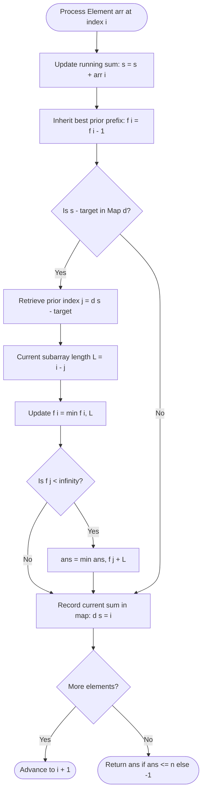

# Guided Example: Find Two Non-overlapping Sub-arrays Each With Target Sum

We trace the step-by-step execution of the dynamic programming prefix-minimum approach on a representative problem instance:

- **Input:** `arr = [3, 2, 2, 4, 3]`, `target = 3`
- **Required output:** `2`

This instance demonstrates the core challenge of the problem: multiple valid subarrays of varying lengths exist across the array, and we must identify two completely non-overlapping subarrays whose combined length is strictly minimized.

---

## 1. Instance & Teaching Goal

You are given an array of positive integers `arr` and an integer `target`. We must find two non-overlapping contiguous subarrays such that the sum of elements in each subarray equals `target`. There may be multiple pairs of subarrays meeting this requirement; our goal is to minimize the sum of the lengths of the two subarrays. If no two non-overlapping subarrays exist, return $-1$.

For `arr = [3, 2, 2, 4, 3]` and `target = 3`:
- Subarray at index $0$ (`[3]`) has sum $3$ and length $1$.
- Subarray at index $4$ (`[3]`) has sum $3$ and length $1$.
- These two subarrays do not overlap and have a combined length of $1 + 1 = 2$.
- Intermediate elements $[2, 2, 4]$ sum to $8$, containing no valid subarray summing to $3$.

A naive brute-force method enumerates all $\mathcal{O}(n^2)$ possible subarrays, filters those summing to `target`, and then compares every disjoint pair in $\mathcal{O}(n^4)$ or $\mathcal{O}(n^2)$ time. The optimal method maintains a running prefix sum hash map coupled with a prefix minimum length array, solving the problem in a single pass of $\mathcal{O}(n)$ time.

---

## 2. Conceptual Foundation & Invariants

Because all elements in `arr` are strictly positive ($arr[i] \ge 1$), the running prefix sum $s$ is strictly increasing. If a contiguous subarray ending at 1-based index $i$ sums to `target`, then the prefix sum prior to this subarray must equal $s - \text{target}$. Looking up $s - \text{target}$ in a hash map reveals the 1-based start boundary $j$. The current valid subarray therefore occupies indices $[j+1, i]$ and has length $i - j$.

To form a pair of non-overlapping subarrays, the first subarray must end at or before index $j$. If we maintain an array $f$ where $f[j]$ stores the minimum length of any valid target-sum subarray occurring entirely within the prefix $arr[1 \dots j]$, the optimal pair using $[j+1, i]$ as the second subarray has total length:
$$\text{Total Length} = f[j] + (i - j)$$

```
Index:       0     1       2       3       4       5
Array:             3       2       2       4       3
Prefix Sum:  0     3       5       7      11      14

Valid Subarray 1: [index 1..1] (val: 3) -> len = 1, ends at 1
Valid Subarray 2: [index 5..5] (val: 3) -> len = 1, starts at 5 (prior sum at j=4)

Non-overlapping condition: End of Subarray 1 (1) <= Start of Subarray 2 - 1 (4)
Combined length: f[4] + len(Subarray 2) = 1 + 1 = 2
```

We specify the state parameters tracked throughout the single pass:

| State Parameter | Mathematical Domain | Operational Responsibility | Value at Inception |
|---|---|---|---|
| 1-based Cursor $i$ | Integer $\in [1, n]$ | Current array element being scanned | $1$ |
| Prefix Sum $s$ | Integer $\ge 0$ | Cumulative sum of elements $\sum_{k=1}^i arr[k]$ | $0$ |
| Prefix Map $d$ | Hash Map: $\text{sum} \mapsto \text{index}$ | Maps cumulative sum value to the 1-based index where it was reached | $\{0: 0\}$ |
| Best Prefix Length $f[i]$ | Integer $\in [1, n] \cup \{\infty\}$ | Minimum length of any single valid subarray ending at or before $i$ | $f[0] = \infty$ |
| Global Minimum Pair $\text{ans}$ | Integer $\in [2, n] \cup \{\infty\}$ | Minimum sum of lengths of two non-overlapping valid subarrays | $\infty$ |

> **Non-Overlapping Prefix Minimum Invariant.** At step $i$, $f[i]$ holds the exact minimum length of a valid subarray ending at or before index $i$. For any newly identified subarray spanning $[j+1, i]$, all candidate preceding subarrays that do not overlap with $[j+1, i]$ must end at or before index $j$. Looking up $f[j]$ guarantees that the optimal non-overlapping companion is considered without testing earlier subarrays individually.



---

## 3. Step-by-Step Worked Execution

### Initial Configuration
- Array length $n = 5$, $\text{target} = 3$.
- Initialize map $d = \{0: 0\}$ (sum $0$ occurs at index $0$).
- Initialize DP array $f = [\infty, \infty, \infty, \infty, \infty, \infty]$.
- Initialize $\text{ans} = \infty$.

---

### Step 1: Element $arr[1] = 3$ (1-based $i = 1$)

- Add element to running sum: $s = 0 + 3 = 3$.
- Inherit prior minimum length: $f[1] = f[0] = \infty$.
- Compute required prior sum: $s - \text{target} = 3 - 3 = 0$.
- Is $0$ in $d$? Yes, $j = d[0] = 0$.
  - Current subarray spans $[0 + 1, 1] = [1, 1]$, length $= 1 - 0 = 1$.
  - Update prefix minimum: $f[1] = \min(\infty, 1) = 1$.
  - Check non-overlapping companion: $f[j] = f[0] = \infty$.
  - Since $f[0] = \infty$, no valid preceding subarray exists to pair with this one.
- Store sum in map: $d[3] = 1$.

| Parameter | State Before Step | Action / Computation | State After Step |
|---|---|---|---|
| Index & Value | $i = 1, arr[1] = 3$ | Running sum $s = 0 + 3 = 3$ | $s = 3$ |
| Prefix Lookup | $s - \text{target} = 0$ | Found at $j = 0$, length $= 1$ | Subarray $[1, 1]$ found |
| Best Prefix Length $f[1]$ | $\infty$ | $f[1] = \min(\infty, 1)$ | $f[1] = 1$ |
| Pair Candidate | $\text{ans} = \infty$ | $f[0] = \infty$, no pair possible | $\text{ans} = \infty$ |
| Prefix Map $d$ | $\{0: 0\}$ | Record sum $3 \to 1$ | $\{0: 0, 3: 1\}$ |

---

### Step 2: Element $arr[2] = 2$ (1-based $i = 2$)

- Add element: $s = 3 + 2 = 5$.
- Inherit prior minimum length: $f[2] = f[1] = 1$.
- Compute required prior sum: $s - \text{target} = 5 - 3 = 2$.
- Is $2$ in $d$? No (map only contains $\{0, 3\}$).
- No new valid subarray ends at $i = 2$.
- Store sum in map: $d[5] = 2$.

| Parameter | State Before Step | Action / Computation | State After Step |
|---|---|---|---|
| Index & Value | $i = 2, arr[2] = 2$ | Running sum $s = 3 + 2 = 5$ | $s = 5$ |
| Prefix Lookup | $s - \text{target} = 2$ | Not in map | No subarray ending at $2$ |
| Best Prefix Length $f[2]$ | Unset | Inherits $f[1] = 1$ | $f[2] = 1$ |
| Pair Candidate | $\text{ans} = \infty$ | No update | $\text{ans} = \infty$ |
| Prefix Map $d$ | $\{0: 0, 3: 1\}$ | Record sum $5 \to 2$ | $\{0: 0, 3: 1, 5: 2\}$ |

---

### Step 3: Element $arr[3] = 2$ (1-based $i = 3$)

- Add element: $s = 5 + 2 = 7$.
- Inherit prior minimum length: $f[3] = f[2] = 1$.
- Compute required prior sum: $s - \text{target} = 7 - 3 = 4$.
- Is $4$ in $d$? No.
- No new valid subarray ends at $i = 3$.
- Store sum in map: $d[7] = 3$.

| Parameter | State Before Step | Action / Computation | State After Step |
|---|---|---|---|
| Index & Value | $i = 3, arr[3] = 2$ | Running sum $s = 5 + 2 = 7$ | $s = 7$ |
| Prefix Lookup | $s - \text{target} = 4$ | Not in map | No subarray ending at $3$ |
| Best Prefix Length $f[3]$ | Unset | Inherits $f[2] = 1$ | $f[3] = 1$ |
| Pair Candidate | $\text{ans} = \infty$ | No update | $\text{ans} = \infty$ |
| Prefix Map $d$ | $\{0: 0, 3: 1, 5: 2\}$ | Record sum $7 \to 3$ | $\{0: 0, 3: 1, 5: 2, 7: 3\}$ |

---

### Step 4: Element $arr[4] = 4$ (1-based $i = 4$)

- Add element: $s = 7 + 4 = 11$.
- Inherit prior minimum length: $f[4] = f[3] = 1$.
- Compute required prior sum: $s - \text{target} = 11 - 3 = 8$.
- Is $8$ in $d$? No.
- Store sum in map: $d[11] = 4$.

| Parameter | State Before Step | Action / Computation | State After Step |
|---|---|---|---|
| Index & Value | $i = 4, arr[4] = 4$ | Running sum $s = 7 + 4 = 11$ | $s = 11$ |
| Prefix Lookup | $s - \text{target} = 8$ | Not in map | No subarray ending at $4$ |
| Best Prefix Length $f[4]$ | Unset | Inherits $f[3] = 1$ | $f[4] = 1$ |
| Pair Candidate | $\text{ans} = \infty$ | No update | $\text{ans} = \infty$ |
| Prefix Map $d$ | Prior 4 entries | Record sum $11 \to 4$ | $5$ entries in $d$ |

---

### Step 5: Element $arr[5] = 3$ (1-based $i = 5$)

- Add element: $s = 11 + 3 = 14$.
- Inherit prior minimum length: $f[5] = f[4] = 1$.
- Compute required prior sum: $s - \text{target} = 14 - 3 = 11$.
- Is $11$ in $d$? Yes! Found at $j = d[11] = 4$.
  - Current subarray spans $[4 + 1, 5] = [5, 5]$ (element $3$), length $= 5 - 4 = 1$.
  - Update prefix minimum: $f[5] = \min(f[5], 1) = \min(1, 1) = 1$.
  - Check non-overlapping companion: $f[j] = f[4] = 1$.
  - Since $f[4] = 1 \ne \infty$, we found a valid non-overlapping pair!
  - Combined length $= f[4] + (i - j) = 1 + 1 = 2$.
  - Update global minimum: $\text{ans} = \min(\infty, 2) = 2$.
- Store sum in map: $d[14] = 5$.

| Parameter | State Before Step | Action / Computation | State After Step |
|---|---|---|---|
| Index & Value | $i = 5, arr[5] = 3$ | Running sum $s = 11 + 3 = 14$ | $s = 14$ |
| Prefix Lookup | $s - \text{target} = 11$ | Found at $j = 4$, length $= 5 - 4 = 1$ | Subarray $[5, 5]$ found |
| Best Prefix Length $f[5]$ | Unset | Inherits $f[4]=1$, $\min(1, 1) = 1$ | $f[5] = 1$ |
| Pair Candidate | $\text{ans} = \infty$ | Combined length $f[4] + 1 = 1 + 1 = 2$ | $\text{ans} = 2$ |
| Prefix Map $d$ | Prior 5 entries | Record sum $14 \to 5$ | $6$ entries in $d$ |

---

## 4. Complete Execution Trace

The table below summarizes the comprehensive step-by-step state evolution:

| Step $i$ | $arr[i]$ | Prefix Sum $s$ | Target Remainder $s - 3$ | Found Index $j$ | Subarray Length $i - j$ | Inherited $f[i]$ | Updated $f[i]$ | Candidate Pair $f[j] + (i - j)$ | Global Best $\text{ans}$ |
|---|---|---|---|---|---|---|---|---|---|
| Initial | - | $0$ | - | - | - | - | $f[0] = \infty$ | - | $\infty$ |
| 1 | $3$ | $3$ | $0$ | $0$ | $1$ | $\infty$ | $1$ | $\infty + 1 = \infty$ | $\infty$ |
| 2 | $2$ | $5$ | $2$ | None | - | $1$ | $1$ | - | $\infty$ |
| 3 | $2$ | $7$ | $4$ | None | - | $1$ | $1$ | - | $\infty$ |
| 4 | $4$ | $11$ | $8$ | None | - | $1$ | $1$ | - | $\infty$ |
| 5 | $3$ | $14$ | $11$ | $4$ | $1$ | $1$ | $1$ | $f[4] + 1 = 1 + 1 = 2$ | $2$ |

At termination, $\text{ans} = 2 \le n = 5$. The algorithm outputs $2$.

---

## 5. Algorithmic Correctness

### Soundness

Every candidate pair evaluated by the algorithm has form $f[j] + (i - j)$.
1. By definition of prefix sums, the subarray $[j+1, i]$ sums exactly to $\text{target}$.
2. The index $j$ strictly bounds the end of any earlier subarray: all elements contributing to $f[j]$ lie within indices $[1, j]$.
3. Because $[1, j] \cap [j+1, i] = \emptyset$, the two subarrays are strictly disjoint (non-overlapping).
4. Since $f[j]$ represents a known subarray with sum equal to $\text{target}$, both subarrays satisfy the sum constraint.
5. Hence, every evaluated candidate represents a valid disjoint pair.

### Completeness

Suppose the optimal solution consists of two disjoint subarrays: subarray $A$ spanning $[a_1, a_2]$ and subarray $B$ spanning $[b_1, b_2]$, with $a_2 < b_1$ and sum equal to $\text{target}$ for both.
1. When the loop reaches index $i = b_2$, the running prefix sum satisfies $s - \text{target} = \text{prefix}[b_1 - 1]$.
2. The hash map retrieves $j = b_1 - 1$. The length of subarray $B$ is computed as $b_2 - (b_1 - 1) = b_2 - b_1 + 1$.
3. Since $a_2 \le b_1 - 1 = j$, subarray $A$ lies entirely within the prefix ending at $j$.
4. By the inductive invariant of $f$, $f[j]$ is less than or equal to the length of subarray $A$:
   $$f[j] \le \text{length}(A)$$
5. Therefore, the combination $f[j] + (i - j) \le \text{length}(A) + \text{length}(B)$.
6. The global minimum $\text{ans}$ cannot miss the optimal pair.

---

## 6. Traps This Instance Exposes

### Trap 1: Greedy Subarray Selection
A natural temptation is to find the single shortest subarray with sum equal to `target` first, and then search for a second disjoint subarray. However, an isolated shortest subarray might sit in the center of the array and overlap with two slightly longer disjoint subarrays whose sum of lengths is smaller, or it might leave no disjoint valid subarray at all. Evaluating pairs dynamically via DP avoids this greedy fallacy.

### Trap 2: Off-By-One Boundary Overlap
The prior prefix sum is located at index $j$. The current subarray begins at $j+1$, spanning $[j+1, i]$. If an implementation checks $f[j+1]$ instead of $f[j]$, the two subarrays could share the element at $j+1$, violating the strict non-overlapping constraint. The lookup must strictly query $f[j]$.

### Trap 3: Unhandled Infeasible Cases
If no two non-overlapping subarrays exist (for example, if only one subarray sums to `target`, or if all valid subarrays overlap), the variable $\text{ans}$ remains $\infty$. The implementation must verify $\text{ans} \le n$ before returning, outputting $-1$ if $\text{ans} > n$.

---

## 7. Complexity Derivation

### Time Complexity

- **Prefix Sum & Map Lookups:** We perform a single pass through the array from $i = 1$ to $n$.
- **Hash Table Operations:** For each index, calculating $s - \text{target}$, performing a dictionary lookup, and inserting $s$ takes $\mathcal{O}(1)$ average time.
- **DP State Updates:** Computing $f[i] = \min(f[i-1], i-j)$ and $\text{ans} = \min(\text{ans}, f[j] + i - j)$ involves simple arithmetic and minimum operations in $\mathcal{O}(1)$ time.
- Across all $n$ elements:
$$\mathcal{O}(n)$$

### Auxiliary Space Complexity

- **Prefix Map $d$:** Stores at most $n + 1$ unique prefix sums and their indices, requiring $\mathcal{O}(n)$ space.
- **DP Array $f$:** Holds $n + 1$ integer values, requiring $\mathcal{O}(n)$ space.
- Total auxiliary space:
$$\mathcal{O}(n)$$