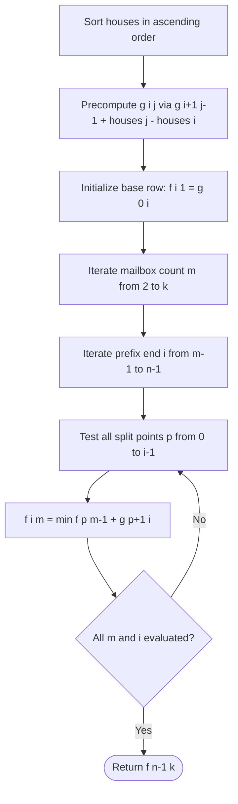

# Guided Example: Allocate Mailboxes

We trace the step-by-step execution of the median-precomputation and interval-partitioning dynamic programming algorithm on a representative problem instance:

- **Input:** `houses = [1, 4, 8, 10, 20]`, `k = 3`
- **Required output:** `5`

This instance demonstrates both foundational phases of the algorithm: calculating the minimum total distance for single-mailbox clusters using 1D medians, and partitioning the sorted houses across multiple mailboxes using dynamic programming.

---

## 1. Instance & Teaching Goal

You are given an array of integers `houses` where each value denotes the 1D coordinate of a house along a street, and an integer $k$ specifying the total number of mailboxes to install. We must choose the locations of all $k$ mailboxes to minimize the sum of distances from every house to its nearest mailbox.

For `houses = [1, 4, 8, 10, 20]` and $k = 3$:
- Sorting gives coordinates $[1, 4, 8, 10, 20]$ with $n = 5$ houses.
- An optimal partition allocates:
  1. Mailbox 1 to houses $\{1, 4\}$ at location $1$ (or any point in $[1, 4]$), giving distance $|1-1| + |4-1| = 3$.
  2. Mailbox 2 to houses $\{8, 10\}$ at location $8$ (or any point in $[8, 10]$), giving distance $|8-8| + |10-8| = 2$.
  3. Mailbox 3 to house $\{20\}$ at location $20$, giving distance $|20-20| = 0$.
- Total distance: $3 + 2 + 0 = 5$.

Arbitrary clustering without ordering results in an exponential combinatorial explosion. The optimal approach relies on two critical mathematical properties:
1. When houses are sorted, any mailbox serves a contiguous range of houses $[i \dots j]$.
2. For any contiguous cluster $[i \dots j]$, placing the mailbox at the median coordinate strictly minimizes the sum of absolute deviations.

---

## 2. Conceptual Foundation & Invariants

The solution proceeds in two distinct stages:

```
Stage 1: Precompute Single-Mailbox Cost g[i][j]
For range houses[i..j], median minimizes sum of |houses[m] - median|.
Symmetric peel-off recurrence:
g[i][j] = g[i+1][j-1] + (houses[j] - houses[i])

Stage 2: Interval DP Partitioning f[i][m]
f[i][m] = minimum cost to cover prefix houses[0..i] using m mailboxes.
Transition:
f[i][m] = min_{p < i} { f[p][m-1] + g[p+1][i] }
             \________________/   \__________/
               m-1 mailboxes       m-th mailbox
```

We establish the core parameters and structures:

| Parameter | Domain | Mathematical Purpose | Initial Value |
|---|---|---|---|
| Sorted Coordinates | Array of length $n$ | Houses arranged in strictly non-decreasing order | $[1, 4, 8, 10, 20]$ |
| Segment Cost $g[i][j]$ | $0 \le i \le j < n$ | Minimal total distance for subarray $houses[i \dots j]$ served by 1 mailbox | $g[i][i] = 0$ |
| Partition DP $f[i][m]$ | $0 \le i < n, 1 \le m \le k$ | Minimal total distance for prefix $houses[0 \dots i]$ served by $m$ mailboxes | $f[i][1] = g[0][i]$ |
| Split Boundary $p$ | $0 \le p < i$ | Partition index separating the first $m-1$ mailboxes from the $m$-th mailbox | Variable |

> **Optimal Substructure & Median Allocation Invariant.** In an optimal assignment of $m$ mailboxes over sorted houses $0 \dots i$, the $m$-th mailbox serves a contiguous suffix $p+1 \dots i$ situated at its median, while the remaining $m-1$ mailboxes optimally cover prefix $0 \dots p$. No cluster of houses assigned to a single mailbox ever interleaves with another cluster.



---

## 3. Step-by-Step Worked Execution

### Stage 1: Precomputing Single-Mailbox Costs $g[i][j]$

For sorted `houses = [1, 4, 8, 10, 20]`:
- Length 1 ranges ($i = j$): $g[i][i] = 0$.
- Length 2 ranges ($j = i + 1$): $g[i][i+1] = houses[i+1] - houses[i]$.
  - $g[0][1] = 4 - 1 = 3$
  - $g[1][2] = 8 - 4 = 4$
  - $g[2][3] = 10 - 8 = 2$
  - $g[3][4] = 20 - 10 = 10$
- Length 3 ranges ($j = i + 2$): $g[i][i+2] = g[i+1][i+1] + houses[i+2] - houses[i] = 0 + houses[i+2] - houses[i]$.
  - $g[0][2] = 0 + (8 - 1) = 7$
  - $g[1][3] = 0 + (10 - 4) = 6$
  - $g[2][4] = 0 + (20 - 8) = 12$
- Length 4 ranges ($j = i + 3$): $g[i][i+3] = g[i+1][i+2] + houses[i+3] - houses[i]$.
  - $g[0][3] = g[1][2] + (10 - 1) = 4 + 9 = 13$
  - $g[1][4] = g[2][3] + (20 - 4) = 2 + 16 = 18$
- Length 5 range ($i = 0, j = 4$):
  - $g[0][4] = g[1][3] + (20 - 1) = 6 + 19 = 25$

| Range $[i \dots j]$ | Subarray of Coordinates | Optimal Median Location | Cost Formula | Computed Value $g[i][j]$ |
|---|---|---|---|---|
| $[0 \dots 1]$ | $[1, 4]$ | Any point in $[1, 4]$ | $4 - 1$ | $3$ |
| $[1 \dots 2]$ | $[4, 8]$ | Any point in $[4, 8]$ | $8 - 4$ | $4$ |
| $[2 \dots 3]$ | $[8, 10]$ | Any point in $[8, 10]$ | $10 - 8$ | $2$ |
| $[3 \dots 4]$ | $[10, 20]$ | Any point in $[10, 20]$ | $20 - 10$ | $10$ |
| $[0 \dots 2]$ | $[1, 4, 8]$ | Coordinate $4$ | $g[1][1] + (8 - 1)$ | $7$ |
| $[1 \dots 3]$ | $[4, 8, 10]$ | Coordinate $8$ | $g[2][2] + (10 - 4)$ | $6$ |
| $[2 \dots 4]$ | $[8, 10, 20]$ | Coordinate $10$ | $g[3][3] + (20 - 8)$ | $12$ |
| $[0 \dots 3]$ | $[1, 4, 8, 10]$ | Any point in $[4, 8]$ | $g[1][2] + (10 - 1)$ | $13$ |
| $[1 \dots 4]$ | $[4, 8, 10, 20]$ | Any point in $[8, 10]$ | $g[2][3] + (20 - 4)$ | $18$ |
| $[0 \dots 4]$ | $[1, 4, 8, 10, 20]$ | Coordinate $8$ | $g[1][3] + (20 - 1)$ | $25$ |

---

### Stage 2: DP State Transitions

#### Step 1: Initialize Base Layer ($m = 1$ Mailbox)
When only $1$ mailbox is allocated, it must serve the entire prefix $0 \dots i$:
$$f[i][1] = g[0][i]$$
- $f[0][1] = g[0][0] = 0$
- $f[1][1] = g[0][1] = 3$
- $f[2][1] = g[0][2] = 7$
- $f[3][1] = g[0][3] = 13$
- $f[4][1] = g[0][4] = 25$

---

#### Step 2: Transitions for $m = 2$ Mailboxes
We iterate prefix end $i$ from $1$ to $4$:

- **For $i = 1$:** Only $p = 0$ is possible:
  $$f[1][2] = f[0][1] + g[1][1] = 0 + 0 = 0$$
- **For $i = 2$:** Candidates $p \in \{0, 1\}$:
  - $p = 0 \implies f[0][1] + g[1][2] = 0 + 4 = 4$
  - $p = 1 \implies f[1][1] + g[2][2] = 3 + 0 = 3$
  - Minimum: $f[2][2] = \min(4, 3) = 3$ (optimal split at $p = 1$).
- **For $i = 3$:** Candidates $p \in \{0, 1, 2\}$:
  - $p = 0 \implies f[0][1] + g[1][3] = 0 + 6 = 6$
  - $p = 1 \implies f[1][1] + g[2][3] = 3 + 2 = 5$
  - $p = 2 \implies f[2][1] + g[3][3] = 7 + 0 = 7$
  - Minimum: $f[3][2] = \min(6, 5, 7) = 5$ (optimal split at $p = 1$).
- **For $i = 4$:** Candidates $p \in \{0, 1, 2, 3\}$:
  - $p = 0 \implies f[0][1] + g[1][4] = 0 + 18 = 18$
  - $p = 1 \implies f[1][1] + g[2][4] = 3 + 12 = 15$
  - $p = 2 \implies f[2][1] + g[3][4] = 7 + 10 = 17$
  - $p = 3 \implies f[3][1] + g[4][4] = 13 + 0 = 13$
  - Minimum: $f[4][2] = \min(18, 15, 17, 13) = 13$ (optimal split at $p = 3$).

---

#### Step 3: Transitions for $m = 3$ Mailboxes
We iterate prefix end $i$ from $2$ to $4$:

- **For $i = 2$:** Only $p = 1$ is possible:
  $$f[2][3] = f[1][2] + g[2][2] = 0 + 0 = 0$$
- **For $i = 3$:** Candidates $p \in \{1, 2\}$:
  - $p = 1 \implies f[1][2] + g[2][3] = 0 + 2 = 2$
  - $p = 2 \implies f[2][2] + g[3][3] = 3 + 0 = 3$
  - Minimum: $f[3][3] = \min(2, 3) = 2$ (optimal split at $p = 1$).
- **For $i = 4$:** Candidates $p \in \{1, 2, 3\}$:
  - $p = 1 \implies f[1][2] + g[2][4] = 0 + 12 = 12$
  - $p = 2 \implies f[2][2] + g[3][4] = 3 + 10 = 13$
  - $p = 3 \implies f[3][2] + g[4][4] = 5 + 0 = 5$
  - Minimum: $f[4][3] = \min(12, 13, 5) = 5$ (optimal split at $p = 3$).

---

## 4. Complete Execution Trace

The DP table below summarizes the optimal distances $f[i][m]$ across all prefixes and mailbox budgets:

| Prefix End $i$ | Subarray $houses[0 \dots i]$ | $m = 1$ Mailbox | $m = 2$ Mailboxes | $m = 3$ Mailboxes |
|---|---|---|---|---|
| $0$ | $[1]$ | $0$ | $\infty$ | $\infty$ |
| $1$ | $[1, 4]$ | $3$ | $0$ | $\infty$ |
| $2$ | $[1, 4, 8]$ | $7$ | $3$ | $0$ |
| $3$ | $[1, 4, 8, 10]$ | $13$ | $5$ | $2$ |
| $4$ | $[1, 4, 8, 10, 20]$ | $25$ | $13$ | **$5$** |

### Partition Reconstruction
Tracing back from $f[4][3] = 5$:
- At $i = 4, m = 3$, optimal split was $p = 3$:
  - Mailbox 3 covers suffix $houses[4 \dots 4] = [20]$ with cost $g[4][4] = 0$.
- At $i = 3, m = 2$, optimal split was $p = 1$:
  - Mailbox 2 covers suffix $houses[2 \dots 3] = [8, 10]$ with cost $g[2][3] = 2$.
- At $i = 1, m = 1$:
  - Mailbox 1 covers prefix $houses[0 \dots 1] = [1, 4]$ with cost $g[0][1] = 3$.
- Total Minimal Distance: $3 + 2 + 0 = 5$.

---

## 5. Algorithmic Correctness

### Soundness

1. **1D Median Optimality:** For any set of real coordinates $x_1 \le x_2 \le \dots \le x_k$, the convex function $\Phi(y) = \sum_{j=1}^k |x_j - y|$ achieves its global minimum when $y$ is the median coordinate. By placing each mailbox at the median of its assigned contiguous segment, $g[i][j]$ computes the exact minimum distance possible for that cluster.
2. **Contiguity of Clusters:** In 1D Euclidean space, if two mailboxes $A < B$ serve sets of houses, every house served by $A$ must lie to the left of every house served by $B$. If they crossed, swapping assignments would strictly decrease total distance by triangle inequality. Hence, optimal clusters never interleave.

### Completeness

The dynamic program examines every valid split point $p \in [0, i-1]$ for every prefix $i$ and every mailbox count $m \le k$.
Because optimal clustering preserves prefix substructure, the optimal solution for $m$ mailboxes on $0 \dots i$ is guaranteed to be composed of some optimal $m-1$ mailbox solution on $0 \dots p$ plus one mailbox on $p+1 \dots i$. By testing all choices of $p$, no possible configuration is omitted.

---

## 6. Traps This Instance Exposes

### Trap 1: Failing to Sort the Coordinates
The houses array in the input is not guaranteed to be sorted. Without initial sorting, the median peeling recurrence $g[i][j] = g[i+1][j-1] + houses[j] - houses[i]$ is invalid, and the 1D contiguity guarantee collapses. Sorting upfront in $\mathcal{O}(n \log n)$ time is mandatory.

### Trap 2: Using the Mean Instead of the Median
Placing a mailbox at the arithmetic mean $\mu = \frac{1}{k}\sum x_i$ minimizes the sum of *squared* distances $\sum (x_i - \mu)^2$. Here, the objective is the sum of *absolute* distances $\sum |x_i - y|$, which is minimized at the median. For coordinates $[1, 4, 8]$, the mean is $4.33$ (giving distance $|1-4.33| + |4-4.33| + |8-4.33| = 3.33 + 0.33 + 3.67 = 7.33$), whereas the median $4$ yields distance $3 + 0 + 4 = 7$.

### Trap 3: Recomputing Range Costs from Scratch
A naive implementation might recalculate the median sum for each pair $(i, j)$ in $\mathcal{O}(n)$ time, leading to $\mathcal{O}(n^3)$ preprocessing. The symmetrical boundary formula $g[i][j] = g[i+1][j-1] + houses[j] - houses[i]$ computes every cell in $\mathcal{O}(1)$ time from smaller intervals, finishing in $\mathcal{O}(n^2)$ time.

---

## 7. Complexity Derivation

### Time Complexity

1. **Sorting:** Sorting $n$ house coordinates requires $\mathcal{O}(n \log n)$ time.
2. **Precomputing Range Costs $g$:** A 2D table of size $n \times n$ is populated in diagonal order, taking $\mathcal{O}(n^2)$ time.
3. **DP Transitions:**
   - Mailbox counts $m$ range from $2$ to $k$ ($k - 1$ outer iterations).
   - Prefix endpoints $i$ range up to $n$ ($n$ iterations).
   - Split points $p$ iterate up to $i$ ($n$ inner iterations).
   - Total transition operations: $\mathcal{O}(k \cdot n^2)$.
- Overall time complexity:
$$\mathcal{O}(n \log n + n^2 + k \cdot n^2) = \mathcal{O}(k \cdot n^2)$$
Given $n \le 100$ and $k \le n$, the maximum operations are roughly $100 \times 100^2 = 1{,}000{,}000$, executing well within a few milliseconds.

### Auxiliary Space Complexity

- **Matrix $g$:** Holds precomputed single-mailbox costs for all $n \times n$ subarrays, requiring $\mathcal{O}(n^2)$ space.
- **DP Table $f$:** Dimensions $n \times (k + 1)$, requiring $\mathcal{O}(n \cdot k)$ space.
- Total auxiliary space:
$$\mathcal{O}(n^2 + n \cdot k)$$
For $n = 100$, this requires negligible memory.