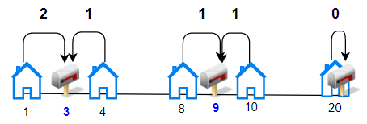
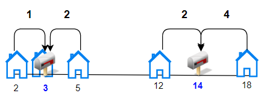

### 1. Description

Given the array `houses` where $\text{houses}[i]$ is the location of the $i^{\text{th}}$ house along a street and an integer `k`, allocate `k` mailboxes in the street.

Return *the **minimum** total distance between each house and its nearest mailbox*.

The test cases are generated so that the answer fits in a 32-bit integer.

### 2. Function Contract

**Inputs**

- `houses`: Input parameter (`List[int]`).
- `k`: Input parameter (`int`).

**Return value**

- Returns `int`.

### 3. Examples

#### Example 1

- **Input:** $houses = [1,4,8,10,20], k = 3$
- **Output:** `5`
- **Explanation:** Allocate mailboxes in position 3, 9 and 20.
Minimum total distance from each houses to nearest mailboxes is |3-1| + |4-3| + |9-8| + |10-9| + |20-20| = 5

#### Example 2

- **Input:** $houses = [2,3,5,12,18], k = 2$
- **Output:** `9`
- **Explanation:** Allocate mailboxes in position 3 and 14.
Minimum total distance from each houses to nearest mailboxes is |2-3| + |3-3| + |5-3| + |12-14| + |18-14| = 9.

### 4. Constraints

- $1 \le k \le \text{houses.length} \le 100$

- $1 \le \text{houses}[i] \le 10^{4}$

- All the integers of `houses` are **unique**.
