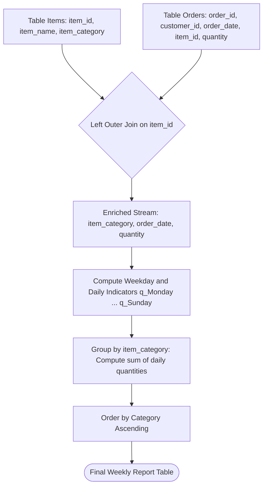

# Guided Example: Sales by Day of the Week

We trace the step-by-step relational algebra transformation of catalog items and order transactions on a representative database instance:

- **Input Relations:**
  - `Items` containing $6$ catalog items across $4$ categories: `Book`, `Phone`, `Glasses`, `T-shirt`.
  - `Orders` containing $9$ purchase transactions between `2020-06-01` and `2020-06-21`.
- **Required Output:** A pivoted weekly sales report displaying total units sold per day of the week for every catalog category, ordered by `Category` ascending:

| Category | Monday | Tuesday | Wednesday | Thursday | Friday | Saturday | Sunday |
|---|---|---|---|---|---|---|---|
| Book | 20 | 5 | 0 | 0 | 10 | 0 | 0 |
| Glasses | 0 | 0 | 0 | 0 | 5 | 0 | 0 |
| Phone | 0 | 0 | 5 | 1 | 0 | 0 | 10 |
| T-shirt | 0 | 0 | 0 | 0 | 0 | 0 | 0 |

This instance exhibits the full set of relational challenges: many-to-one category aggregation across distinct item IDs, weekly date-to-weekday decomposition, multi-order accumulation across different calendar weeks, and preserving unsold categories (`T-shirt`) with zero-filled counts.

---

## 1. Instance & Teaching Goal

The objective is to produce a management report summarizing weekly sales volumes by item category. Each row corresponds to a unique category, with seven metric columns indicating the sum of units ordered on `Monday`, `Tuesday`, `Wednesday`, `Thursday`, `Friday`, `Saturday`, and `Sunday`. Categories that experienced zero sales on a given day must report $0$ rather than null, and categories with no orders whatsoever must still appear in the final report.

A standard inner join between `Items` and `Orders` discards categories without sales. An unconditional cross product without date filtering causes Cartesian explosion. The optimal relational strategy performs a left outer join from `Items` to `Orders`, decomposes transaction timestamps into weekday names, applies conditional indicator projections to allocate quantities into daily buckets, groups by category, and sorts alphabetically.

---

## 2. Conceptual Foundation & Invariants

The relational transformation proceeds through four formal stages:

```
Items (6 items, 4 categories)
        |
        | Left Outer Join on item_id
        v
Orders (9 transactions) ---> Enriched Joined Relation (10 tuples)
                                      |
                                      v
                             Date-to-Day Mapping
                           & Conditional Indicators
                                      |
                                      v
                             Grouped Summation
                            gamma_{Category, sum...}
                                      |
                                      v
                             Lexicographical Sort
                               tau_{Category ASC}
```

We define the formal relational operators and schemas:

| Relational Operator | Algebraic Notation | Structural Transformation | Input Cardinality $\to$ Output Cardinality |
|---|---|---|---|
| Left Outer Join | $\text{Items} \bowtie_{\text{left}} \text{Orders}$ | Preserves all catalog items; matches order lines | $6 \text{ items} \times 9 \text{ orders} \to 10 \text{ rows}$ |
| Weekday Mapping | $\text{day\_name}(\text{order\_date})$ | Maps calendar dates to day of week strings | $10 \text{ rows} \to 10 \text{ rows}$ |
| Conditional Pivot | $\Pi_{\text{item\_category}, q_{\text{Mon}}, \dots, q_{\text{Sun}}}$ | Emits quantity into matching day column; $0$ elsewhere | $10 \text{ rows} \to 10 \text{ rows}$ |
| Grouped Summation | $\gamma_{\text{Category}, \sum q_{\text{Mon}}, \dots}$ | Aggregates daily quantities per category | $10 \text{ rows} \to 4 \text{ category rows}$ |
| Order by Category | $\tau_{\text{Category} \uparrow}$ | Sorts final summary alphabetically | $4 \text{ category rows} \to 4 \text{ sorted rows}$ |

> **Universal Category Preservation Invariant.** By using `Items` as the left relation in the left outer join $\text{Items} \bowtie_{\text{left}} \text{Orders}$, every category defined in the catalog is guaranteed to survive into the grouped aggregation. Unmatched categories evaluate to null orders, which default to zero under the conditional indicator function, preventing silent omissions.



---

## 3. Step-by-Step Worked Execution

### Step 1: Base Catalog and Order Transactions

The database provides:
- Catalog `Items`:
  - Item $1$: `LC Alg. Book` (Category: `Book`)
  - Item $2$: `LC DB. Book` (Category: `Book`)
  - Item $3$: `LC SmarthPhone` (Category: `Phone`)
  - Item $4$: `LC Phone 2020` (Category: `Phone`)
  - Item $5$: `LC SmartGlass` (Category: `Glasses`)
  - Item $6$: `LC T-Shirt XL` (Category: `T-shirt`)
- Transactions `Orders`:
  - Order $1$: Item $1$, Date `2020-06-01`, Quantity $10$
  - Order $2$: Item $2$, Date `2020-06-08`, Quantity $10$
  - Order $3$: Item $1$, Date `2020-06-02`, Quantity $5$
  - Order $4$: Item $3$, Date `2020-06-03`, Quantity $5$
  - Order $5$: Item $4$, Date `2020-06-04`, Quantity $1$
  - Order $6$: Item $5$, Date `2020-06-05`, Quantity $5$
  - Order $7$: Item $1$, Date `2020-06-05`, Quantity $10$
  - Order $8$: Item $4$, Date `2020-06-14`, Quantity $5$
  - Order $9$: Item $3$, Date `2020-06-21`, Quantity $5$

---

### Step 2: Left Outer Join and Weekday Resolution

We perform $\text{Items} \bowtie_{\text{left}} \text{Orders}$ on $\text{item\_id}$ and map each `order_date` to its corresponding weekday name:
- `2020-06-01` $\to$ Monday
- `2020-06-02` $\to$ Tuesday
- `2020-06-03` $\to$ Wednesday
- `2020-06-04` $\to$ Thursday
- `2020-06-05` $\to$ Friday
- `2020-06-08` $\to$ Monday
- `2020-06-14` $\to$ Sunday
- `2020-06-21` $\to$ Sunday
- Item $6$ has no matching order: attributes `order_id`, `order_date`, `quantity` are null.

| Item ID | Category | Order ID | Order Date | Resolved Weekday | Quantity |
|---|---|---|---|---|---|
| $1$ | Book | $1$ | `2020-06-01` | Monday | $10$ |
| $1$ | Book | $3$ | `2020-06-02` | Tuesday | $5$ |
| $1$ | Book | $7$ | `2020-06-05` | Friday | $10$ |
| $2$ | Book | $2$ | `2020-06-08` | Monday | $10$ |
| $3$ | Phone | $4$ | `2020-06-03` | Wednesday | $5$ |
| $3$ | Phone | $9$ | `2020-06-21` | Sunday | $5$ |
| $4$ | Phone | $5$ | `2020-06-04` | Thursday | $1$ |
| $4$ | Phone | $8$ | `2020-06-14` | Sunday | $5$ |
| $5$ | Glasses | $6$ | `2020-06-05` | Friday | $5$ |
| $6$ | T-shirt | null | null | null | null |

---

### Step 3: Conditional Projection for Weekly Buckets

For each tuple, we project indicator functions for each day of the week:
$$q_d = \begin{cases} \text{quantity} & \text{if } \text{weekday} = d \\ 0 & \text{otherwise} \end{cases}$$

- For Row 1 (Book, Monday, qty 10): $q_{\text{Mon}} = 10$, all other days $0$.
- For Row 2 (Book, Tuesday, qty 5): $q_{\text{Tue}} = 5$, all other days $0$.
- For Row 3 (Book, Friday, qty 10): $q_{\text{Fri}} = 10$, all other days $0$.
- For Row 4 (Book, Monday, qty 10): $q_{\text{Mon}} = 10$, all other days $0$.
- For Row 5 (Phone, Wednesday, qty 5): $q_{\text{Wed}} = 5$, all other days $0$.
- For Row 6 (Phone, Sunday, qty 5): $q_{\text{Sun}} = 5$, all other days $0$.
- For Row 7 (Phone, Thursday, qty 1): $q_{\text{Thu}} = 1$, all other days $0$.
- For Row 8 (Phone, Sunday, qty 5): $q_{\text{Sun}} = 5$, all other days $0$.
- For Row 9 (Glasses, Friday, qty 5): $q_{\text{Fri}} = 5$, all other days $0$.
- For Row 10 (T-shirt, null): all days evaluate to $0$.

---

### Step 4: Grouped Aggregation by Category

We evaluate $\gamma_{\text{Category}, \sum q_{\text{Mon}}, \dots, \sum q_{\text{Sun}}}$:

1. **Category `Book`:**
   - Monday: $10 (\text{Order } 1) + 10 (\text{Order } 2) = 20$
   - Tuesday: $5 (\text{Order } 3) = 5$
   - Wednesday: $0$
   - Thursday: $0$
   - Friday: $10 (\text{Order } 7) = 10$
   - Saturday: $0$
   - Sunday: $0$
2. **Category `Glasses`:**
   - Monday: $0$, Tuesday: $0$, Wednesday: $0$, Thursday: $0$
   - Friday: $5 (\text{Order } 6) = 5$
   - Saturday: $0$, Sunday: $0$
3. **Category `Phone`:**
   - Monday: $0$, Tuesday: $0$
   - Wednesday: $5 (\text{Order } 4) = 5$
   - Thursday: $1 (\text{Order } 5) = 1$
   - Friday: $0$, Saturday: $0$
   - Sunday: $5 (\text{Order } 8) + 5 (\text{Order } 9) = 10$
4. **Category `T-shirt`:**
   - All sums: $0$

---

### Step 5: Order by Category Ascending

Applying $\tau_{\text{Category} \uparrow}$:
- `Book`
- `Glasses`
- `Phone`
- `T-shirt`

---

## 4. Complete Execution Trace

The table below details the aggregation breakdown across each category:

| Category | Contributing Item IDs | Transaction Order IDs | Monday | Tuesday | Wednesday | Thursday | Friday | Saturday | Sunday |
|---|---|---|---|---|---|---|---|---|---|
| Book | $1, 2$ | $1, 2, 3, 7$ | $10 + 10 = 20$ | $5$ | $0$ | $0$ | $10$ | $0$ | $0$ |
| Glasses | $5$ | $6$ | $0$ | $0$ | $0$ | $0$ | $5$ | $0$ | $0$ |
| Phone | $3, 4$ | $4, 5, 8, 9$ | $0$ | $0$ | $5$ | $1$ | $0$ | $0$ | $5 + 5 = 10$ |
| T-shirt | $6$ | None | $0$ | $0$ | $0$ | $0$ | $0$ | $0$ | $0$ |

Final structured relation matching the required contract:

| Category | Monday | Tuesday | Wednesday | Thursday | Friday | Saturday | Sunday |
|---|---|---|---|---|---|---|---|
| Book | 20 | 5 | 0 | 0 | 10 | 0 | 0 |
| Glasses | 0 | 0 | 0 | 0 | 5 | 0 | 0 |
| Phone | 0 | 0 | 5 | 1 | 0 | 0 | 10 |
| T-shirt | 0 | 0 | 0 | 0 | 0 | 0 | 0 |

---

## 5. Algorithmic Correctness

### Soundness

1. **Partition by Weekday:** Every valid timestamp maps to exactly one weekday in $\{\text{Monday}, \dots, \text{Sunday}\}$. The conditional indicator correctly routes the transaction quantity to that specific column and assigns $0$ to the other six days.
2. **Category-Level Grouping:** Grouping by `item_category` sums quantities across all distinct `item_id`s falling under that category umbrella, ensuring cross-product sales within the same category are properly merged.
3. **Alphabetical Determinism:** The sort operator $\tau_{\text{Category} \uparrow}$ guarantees rows appear in standard ascending lexicographical order.

### Completeness

1. **Unsold Category Retention:** By initiating the join from `Items` with a left outer join, any item that never generated an order appears with a null order record.
2. The conditional sum evaluates null quantities to $0$ through the default indicator value, ensuring unsold categories are neither dropped nor rendered as null.
3. Every transaction in `Orders` matching a catalog item is included in the join and aggregated into its respective category sum.

---

## 6. Traps This Instance Exposes

### Trap 1: Using Inner Join Instead of Left Outer Join
An inner join drops `item_id = 6` (`LC T-Shirt XL`) entirely because it has no corresponding row in `Orders`. The final report would then completely omit category `T-shirt`, failing the requirement that all categories present in `Items` must be reported.

### Trap 2: Emitting Null Instead of Zero for Inactive Days
If a category has no sales on a given day (such as `Wednesday` for `Book`), returning `null` violates the specification. Conditional projection must evaluate non-matching conditions to $0$, or wrap the sum in a null-coalescing function.

### Trap 3: Grouping by Item Instead of Category
A common blunder is grouping by `item_name` or `item_id` before grouping by category, or failing to sum quantities across different items sharing the same category (e.g., treating `LC Alg. Book` and `LC DB. Book` as separate categories). The aggregation must group strictly by `item_category`.

---

## 7. Complexity Derivation

### Time Complexity

Let $I$ be the number of rows in `Items`, $O$ be the number of rows in `Orders`, and $C$ be the number of distinct categories ($C \le I$).

1. **Join Operation:** An indexed hash join or merge join between `Items` and `Orders` on the primary key `item_id` takes $\mathcal{O}(I + O)$ time.
2. **Date Extraction and Indicator Evaluation:** Processing each of the $\mathcal{O}(O + I)$ joined tuples takes constant time $\mathcal{O}(1)$ per tuple, totaling $\mathcal{O}(I + O)$ time.
3. **Grouped Summation:** Aggregating tuples into $C$ category buckets via a hash table requires $\mathcal{O}(I + O)$ time.
4. **Alphabetical Sorting:** Sorting $C$ category summary rows takes $\mathcal{O}(C \log C)$ time.
- Total time complexity:
$$\mathcal{O}(I + O + C \log C)$$

### Auxiliary Space Complexity

- The intermediate join and grouped hash table require auxiliary memory proportional to the number of distinct categories and joined rows:
$$\mathcal{O}(I + O)$$
- The final result relation stores exactly $C$ rows and $8$ columns, requiring $\mathcal{O}(C)$ space.
