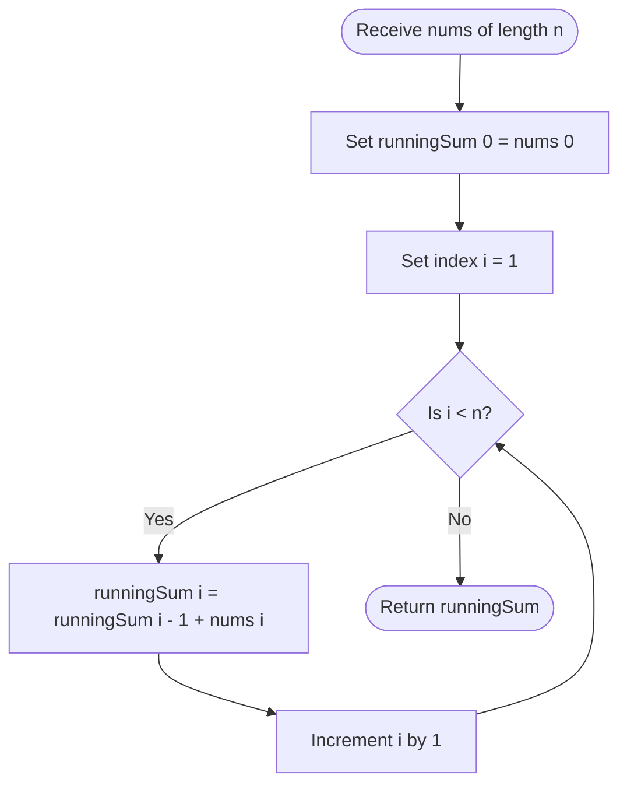

# Guided Example: Running Sum of 1d Array

We trace the step-by-step execution of the prefix accumulation algorithm on a representative problem instance:

- **Input:** `nums = [1, 2, 3, 4]`
- **Required output:** `[1, 3, 6, 10]`

This instance captures the foundational recurrence of sequential accumulation: each subsequent running total builds directly upon the accumulated sum of all preceding values through a single addition.

---

## 1. Instance & Teaching Goal

Given an integer array `nums` of length $n$, the running sum array `runningSum` is defined such that each element at index $i$ equals the cumulative sum of all array elements from index $0$ through index $i$:
$$\text{runningSum}[i] = \sum_{k=0}^i \text{nums}[k]$$

For `nums = [1, 2, 3, 4]`:
- $\text{runningSum}[0] = 1$
- $\text{runningSum}[1] = 1 + 2 = 3$
- $\text{runningSum}[2] = 1 + 2 + 3 = 6$
- $\text{runningSum}[3] = 1 + 2 + 3 + 4 = 10$

A naive approach sums the slice $\text{nums}[0 \dots i]$ from scratch for every index $i$. Across all $n$ positions, this requires $\sum_{i=1}^n i = \frac{n(n+1)}{2}$ additions, quadratic $\mathcal{O}(n^2)$ time.

The optimal approach recognizes that $\text{runningSum}[i] = \text{runningSum}[i-1] + \text{nums}[i]$. Storing or carrying forward the previous prefix sum enables each position to be computed in $\mathcal{O}(1)$ time, reducing the total workload to strictly $n - 1$ additions in $\mathcal{O}(n)$ time.

---

## 2. Conceptual Foundation & Invariants

Prefix accumulation transforms an array into a monotonic progression of partial sums using the standard first-order linear recurrence relation:
$$\text{runningSum}[0] = \text{nums}[0]$$
$$\text{runningSum}[i] = \text{runningSum}[i-1] + \text{nums}[i] \quad \text{for } i \ge 1$$

```
Index i:          0           1           2           3
Input nums:     [ 1    ,      2    ,      3    ,      4    ]
                  |           |           |           |
Prefix Recurrence:|           |           |           |
runSum[0] = 1 ----+           |           |           |
runSum[1] = runSum[0] + 2 ----+           |           |
runSum[2] = runSum[1] + 3 ----------------+           |
runSum[3] = runSum[2] + 4 ----------------------------+
Output:         [ 1    ,      3    ,      6    ,     10    ]
```

We establish the core parameters tracked during execution:

| Parameter | Mathematical Domain | Operational Responsibility | Initial State |
|---|---|---|---|
| Index $i$ | Integer $\in [0, n-1]$ | Current element position being scanned | $0$ |
| Element $\text{nums}[i]$ | Integer $\in [-10^6, 10^6]$ | Current input addend | $\text{nums}[0] = 1$ |
| Running Accumulator | Integer | Cumulative sum of elements processed so far | $0$ |
| Result Array | Array of length $n$ | Output sequence storing each prefix sum | Unpopulated |

> **Prefix Accumulation Invariant.** After processing index $i$, the accumulator holds the exact sum of all elements in the closed interval $\text{nums}[0 \dots i]$. The value at index $i+1$ is derived with a single addition without re-reading earlier elements.



---

## 3. Step-by-Step Worked Execution

### Step 1: Base Element at Index $i = 0$

We begin at the first element $\text{nums}[0] = 1$.
- By definition, the running sum for the single-element prefix contains only $\text{nums}[0]$.
- Cumulative total:
  $$\text{runningSum}[0] = 1$$

| Field | Prior Value | Transformation | Updated State |
|---|---|---|---|
| Evaluated Index | Unset | Initialize cursor at $i = 0$ | $i = 0$ |
| Current Addend | None | Read $\text{nums}[0]$ | $1$ |
| Accumulator Value | $0$ | Set base term $\text{runningSum}[0] = 1$ | $1$ |
| Output Prefix | $\emptyset$ | Append first term | $[1]$ |

---

### Step 2: Second Element at Index $i = 1$

We advance to index $i = 1$ with element $\text{nums}[1] = 2$.
- Add $\text{nums}[1]$ to the prior running sum $\text{runningSum}[0]$:
  $$\text{runningSum}[1] = \text{runningSum}[0] + \text{nums}[1] = 1 + 2 = 3$$

| Field | Prior Value | Transformation | Updated State |
|---|---|---|---|
| Evaluated Index | $0$ | Increment cursor to $i = 1$ | $i = 1$ |
| Current Addend | $1$ | Read $\text{nums}[1]$ | $2$ |
| Accumulator Value | $1$ | $1 + 2 = 3$ | $3$ |
| Output Prefix | $[1]$ | Append second term | $[1, 3]$ |

---

### Step 3: Third Element at Index $i = 2$

We advance to index $i = 2$ with element $\text{nums}[2] = 3$.
- Add $\text{nums}[2]$ to the prior running sum $\text{runningSum}[1]$:
  $$\text{runningSum}[2] = \text{runningSum}[1] + \text{nums}[2] = 3 + 3 = 6$$

| Field | Prior Value | Transformation | Updated State |
|---|---|---|---|
| Evaluated Index | $1$ | Increment cursor to $i = 2$ | $i = 2$ |
| Current Addend | $2$ | Read $\text{nums}[2]$ | $3$ |
| Accumulator Value | $3$ | $3 + 3 = 6$ | $6$ |
| Output Prefix | $[1, 3]$ | Append third term | $[1, 3, 6]$ |

---

### Step 4: Fourth Element at Index $i = 3$

We advance to the final index $i = 3$ with element $\text{nums}[3] = 4$.
- Add $\text{nums}[3]$ to the prior running sum $\text{runningSum}[2]$:
  $$\text{runningSum}[3] = \text{runningSum}[2] + \text{nums}[3] = 6 + 4 = 10$$

| Field | Prior Value | Transformation | Updated State |
|---|---|---|---|
| Evaluated Index | $2$ | Increment cursor to $i = 3$ | $i = 3$ |
| Current Addend | $3$ | Read $\text{nums}[3]$ | $4$ |
| Accumulator Value | $6$ | $6 + 4 = 10$ | $10$ |
| Output Prefix | $[1, 3, 6]$ | Append fourth term | $[1, 3, 6, 10]$ |

---

## 4. Complete Execution Trace

The table below summarizes the running sum progression across all array positions:

| Step | Index $i$ | Input Value $\text{nums}[i]$ | Prior Sum $\text{runningSum}[i-1]$ | Arithmetic Operation | Running Sum $\text{runningSum}[i]$ | Cumulative Slice |
|---|---|---|---|---|---|---|
| 1 | $0$ | $1$ | None (Base case) | $1$ | $1$ | $[1]$ |
| 2 | $1$ | $2$ | $1$ | $1 + 2$ | $3$ | $[1, 2]$ |
| 3 | $2$ | $3$ | $3$ | $3 + 3$ | $6$ | $[1, 2, 3]$ |
| 4 | $3$ | $4$ | $6$ | $6 + 4$ | $10$ | $[1, 2, 3, 4]$ |

The resulting output array is:
$$\text{runningSum} = [1, 3, 6, 10]$$

---

## 5. Algorithmic Correctness

We prove correctness by mathematical induction on the array index $i$.

### Base Case ($i = 0$)
For $i = 0$, the sum of the prefix is $\sum_{k=0}^0 \text{nums}[k] = \text{nums}[0]$. The algorithm directly assigns $\text{runningSum}[0] = \text{nums}[0]$, which is exact.

### Inductive Step
Assume that for some index $m \ge 0$, $\text{runningSum}[m] = \sum_{k=0}^m \text{nums}[k]$.
For index $m + 1$, the true mathematical prefix sum is:
$$\sum_{k=0}^{m+1} \text{nums}[k] = \left(\sum_{k=0}^m \text{nums}[k]\right) + \text{nums}[m+1]$$
By the inductive hypothesis, the parenthesized term equals $\text{runningSum}[m]$.
The algorithm calculates $\text{runningSum}[m+1] = \text{runningSum}[m] + \text{nums}[m+1]$.
Hence, $\text{runningSum}[m+1] = \sum_{k=0}^{m+1} \text{nums}[k]$.

By mathematical induction, the recurrence correctly computes the running sum for all $i \in [0, n-1]$.

---

## 6. Traps This Instance Exposes

### Trap 1: Quadratic Re-summation
Calling a summation helper on the slice $\text{nums}[0 \dots i]$ at each step repeats work that was already completed. For an array of size $n = 1000$, the recurrence performs $999$ additions, whereas re-summing slices performs $\approx 500{,}000$ additions.

### Trap 2: Destructive In-Place Modification
Modifying `nums` in-place (`nums[i] += nums[i-1]`) avoids allocating a new array, but mutates caller data when an immutable interface is expected. In environments requiring pure functions, creating a distinct output array or using standard iterator accumulation is necessary.

### Trap 3: Numeric Overflow on Large Addends
Although this specific problem constraints values to $[-10^6, 10^6]$ and $n \le 1000$ (maximum sum $\pm 10^9$, fitting within standard 32-bit signed integers), running sums in high-throughput data streams can easily exceed $2^{31} - 1$. Accumulators must use 64-bit integers when constraints expand.

---

## 7. Complexity Derivation

### Time Complexity

- The algorithm performs a single pass over the array of length $n$.
- At index $0$, an assignment takes $\mathcal{O}(1)$ time.
- For each index $i \in [1, n-1]$, exactly one addition and one assignment are performed.
- Total number of additions: $n - 1$.
- Total time complexity:
$$\mathcal{O}(n)$$

### Auxiliary Space Complexity

- **In-Place Transformation:** If modifying the input array in place, no extra heap memory is allocated, yielding $\mathcal{O}(1)$ auxiliary space.
- **Out-of-Place Result:** When generating a new output array of length $n$, the allocated memory is $\mathcal{O}(n)$.
- In both cases, only $\mathcal{O}(1)$ temporary scalar registers are maintained during iteration.
