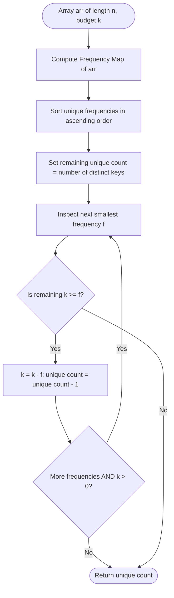

# Guided Example: Least Number of Unique Integers after K Removals

We trace the step-by-step execution of the greedy frequency-elimination algorithm on a representative problem instance:

- **Input:** `arr = [4, 3, 1, 1, 3, 3, 2]`, `k = 3`
- **Required output:** `2`

This instance captures the critical dynamics of greedy resource allocation: multiple integers with identical frequencies, complete eliminations of low-frequency items, and a partial removal where the remaining budget is insufficient to extinguish a multi-instance integer.

---

## 1. Instance & Teaching Goal

Given an array of integers `arr` and an integer $k$, we are tasked with removing exactly $k$ elements such that the number of unique integers remaining in the array is minimized.

For `arr = [4, 3, 1, 1, 3, 3, 2]` with $k = 3$:
- The array has length $7$ and contains $4$ unique values: $\{1, 2, 3, 4\}$.
- Frequencies: $2$ occurs $1$ time, $4$ occurs $1$ time, $1$ occurs $2$ times, and $3$ occurs $3$ times.
- Removing $3$ elements:
  - If we remove one $2$ and one $4$, both integers are completely gone from the array (spending $1 + 1 = 2$ from our budget).
  - With our remaining budget of $1$, removing one copy of $1$ leaves one copy of $1$ behind. The integer $1$ is still present in the array.
  - The remaining elements are $[1, 3, 3, 3]$, which contain $2$ unique values: $\{1, 3\}$.

A naive search over all $\binom{n}{k}$ removal subsets is computationally intractable ($\binom{7}{3} = 35$, but for $n = 10^5$ this exceeds cosmological timescales). The optimal approach relies on a greedy insight: reducing the count of unique integers requires *completely* removing every occurrence of an integer. Therefore, spending budget $k$ on elements with the smallest frequency first eliminates the maximum number of distinct values.

---

## 2. Conceptual Foundation & Invariants

Each unique integer $x$ has a multiplicity $c(x)$. Partially removing some copies of $x$ without removing all $c(x)$ copies leaves $x$ present in the array, providing zero reduction in the total number of unique integers. To maximize the number of unique integers eliminated, we must solve a knapsack-style minimization problem where each item costs $c(x)$ and yields a reward of $1$ eliminated unique value.

Because every eliminated integer provides the exact same reward ($1$), prioritizing items by ascending cost ($c(x)$) is mathematically optimal.

```
Frequencies: {2: 1, 4: 1, 1: 2, 3: 3}
Sorted Ascending Costs: [1, 1, 2, 3]

Budget k = 3
---------------------------------------------------------
Step 1: Cost = 1 (item 2) -> Budget left: 3 - 1 = 2 | Eliminated: 1
Step 2: Cost = 1 (item 4) -> Budget left: 2 - 1 = 1 | Eliminated: 2
Step 3: Cost = 2 (item 1) -> Budget left: 1 < 2     | Cannot eliminate!
---------------------------------------------------------
Remaining Unique Integers: Total Unique (4) - Eliminated (2) = 2
```

We define the primary state tracking parameters:

| Parameter | Domain / Type | Operational Purpose | Initial Value |
|---|---|---|---|
| Multiset Histogram | Map $\mathbb{Z} \to \mathbb{Z}^+$ | Tally occurrences of each unique integer in `arr` | $\{1: 2, 2: 1, 3: 3, 4: 1\}$ |
| Sorted Frequencies | Ordered list of positive integers | Ascending list of elimination costs | $[1, 1, 2, 3]$ |
| Remaining Budget $k$ | Integer $\ge 0$ | Available removals left to spend | $3$ |
| Unique Count | Integer $\in [0, u]$ | Current number of distinct integers still present | $4$ |

> **Greedy Elimination Invariant.** Sorting frequencies in ascending order ensures that at every step, the algorithm spends the minimal possible budget to decrease the number of unique integers by $1$. Once the remaining budget $k$ is strictly less than the next lowest frequency, no further integers can be completely removed, and the remaining unique count is final.



---

## 3. Step-by-Step Worked Execution

### Step 1: Frequency Histogram Construction
We scan `arr = [4, 3, 1, 1, 3, 3, 2]` and accumulate counts:
- Value $4$: count $1$
- Value $3$: count $3$
- Value $1$: count $2$
- Value $2$: count $1$
Total unique values $u = 4$.

| Value | Occurrence Indices in `arr` | Frequency Count |
|---|---|---|
| $2$ | Index $6$ | $1$ |
| $4$ | Index $0$ | $1$ |
| $1$ | Indices $2, 3$ | $2$ |
| $3$ | Indices $1, 4, 5$ | $3$ |

---

### Step 2: Sorting Frequencies
We extract the frequencies and sort them in non-decreasing order:
$$\text{Sorted Frequencies} = [1, 1, 2, 3]$$
Initial unique count is $4$. Budget $k = 3$.

| Step Cursor $i$ | Target Frequency $v$ | Remaining Budget $k$ | Feasibility Test $k \ge v$ | Updated Unique Count |
|---|---|---|---|---|
| Initial | None | $3$ | Unchecked | $4$ |

---

### Step 3: Eliminate First Smallest Frequency ($v = 1$, representing value $2$)
- We inspect the first frequency $v = 1$.
- Compare budget: $k = 3 \ge 1$.
- Deduct cost: $k = 3 - 1 = 2$.
- Value $2$ is completely removed from the array.
- Decrement unique count: $4 - 1 = 3$.

| Parameter | State Before Step | Operation / Rule Applied | State After Step |
|---|---|---|---|
| Target Item | Value $2$ (count $1$) | Spend $1$ removal from budget | Value $2$ extinguished |
| Remaining Budget $k$ | $3$ | $3 - 1 = 2$ | $2$ |
| Unique Integers Left | $4$ | Eliminated $1$ distinct key | $3$ |

---

### Step 4: Eliminate Second Smallest Frequency ($v = 1$, representing value $4$)
- We inspect the second frequency $v = 1$.
- Compare budget: $k = 2 \ge 1$.
- Deduct cost: $k = 2 - 1 = 1$.
- Value $4$ is completely removed from the array.
- Decrement unique count: $3 - 1 = 2$.

| Parameter | State Before Step | Operation / Rule Applied | State After Step |
|---|---|---|---|
| Target Item | Value $4$ (count $1$) | Spend $1$ removal from budget | Value $4$ extinguished |
| Remaining Budget $k$ | $2$ | $2 - 1 = 1$ | $1$ |
| Unique Integers Left | $3$ | Eliminated $1$ distinct key | $2$ |

---

### Step 5: Evaluate Third Frequency ($v = 2$, representing value $1$)
- We inspect the third frequency $v = 2$.
- Compare budget: $k = 1 < 2$.
- The remaining budget $k = 1$ cannot cover all $2$ occurrences of value $1$.
- Removing $1$ instance of value $1$ leaves $1$ instance still in the array.
- Value $1$ is **not** extinguished. Unique count is unchanged.
- The algorithm halts further eliminations.

| Parameter | State Before Step | Operation / Rule Applied | State After Step |
|---|---|---|---|
| Target Item | Value $1$ (count $2$) | Test $k \ge 2$: $1 \ge 2$ is False | Cannot extinguish value $1$ |
| Remaining Budget $k$ | $1$ | Insufficient budget for full removal | $1$ |
| Unique Integers Left | $2$ | Value $1$ survives | $2$ |

---

## 4. Complete Execution Trace

The table below summarizes the greedy elimination across all frequency buckets:

| Iteration | Target Frequency $v$ | Budget $k$ Before | Comparison $k \ge v$ | Action Taken | Budget $k$ After | Unique Values Remaining | Surviving Value Set |
|---|---|---|---|---|---|---|---|
| Start | - | $3$ | - | Initialize | $3$ | $4$ | $\{1, 2, 3, 4\}$ |
| 1 | $1$ | $3$ | $3 \ge 1$ (True) | Completely remove value $2$ | $2$ | $3$ | $\{1, 3, 4\}$ |
| 2 | $1$ | $2$ | $2 \ge 1$ (True) | Completely remove value $4$ | $1$ | $2$ | $\{1, 3\}$ |
| 3 | $2$ | $1$ | $1 \ge 2$ (False) | Budget exhausted; halt | $1$ | $2$ | $\{1, 3\}$ |
| Terminated | - | $1$ | - | Final result returned | $1$ | **$2$** | $\{1, 3\}$ |

The final answer is $2$.

---

## 5. Algorithmic Correctness

### Soundness

1. Every time the algorithm decrements the unique count, it has subtracted exactly the complete occurrence count $v$ of that integer from budget $k$.
2. Because the total number of subtractions does not exceed the initial budget $k$, all eliminated integers can be physically removed using the permitted $k$ deletions.
3. The remaining unique integers reflect a valid configuration reachable by deleting $k$ elements.

### Completeness (Optimality of the Greedy Choice)

Let the unique integers have frequencies $c_1 \le c_2 \le \dots \le c_u$.
1. Suppose an optimal solution $S^*$ completely removes a set of integers $I^* \subseteq \{1, \dots, u\}$ with $|I^*| = m$ such that $\sum_{i \in I^*} c_i \le k$.
2. The greedy strategy chooses the subset $G = \{1, 2, \dots, m\}$ of the $m$ smallest frequencies.
3. By definition of sorted order, $\sum_{i=1}^m c_i \le \sum_{i \in I^*} c_i \le k$.
4. Thus, the greedy strategy is always feasible for any count $m$ achieved by an optimal solution.
5. If the greedy strategy can eliminate $m+1$ elements while $S^*$ cannot, the greedy solution strictly outperforms $S^*$.
6. Therefore, greedy ascending elimination achieves the maximum possible number of completely removed integers, thereby minimizing the remaining unique count.

---

## 6. Traps This Instance Exposes

### Trap 1: Wasting Budget on Partial Removals
A tempting mistake is deleting elements from the highest-frequency integer (e.g., removing $3$ copies of value $3$). While this reduces the total count of elements, value $3$ is still present (or if $k=3$, exactly $0$ copies remain, extinguishing only $1$ unique value instead of $2$). Eliminating from the bottom up guarantees the maximum count of unique values extinguished.

### Trap 2: Budget Depletion Exhausting All Elements
If $k \ge n$, all elements in the array are deleted, leaving an empty array with $0$ unique integers. An implementation must cleanly handle $k = n$ without negative count indices, returning $0$.

### Trap 3: Sorting Elements Rather than Frequencies
Sorting the raw array `arr` of size $n$ takes $\mathcal{O}(n \log n)$ time. Counting frequencies with a hash map and sorting only the $u \le n$ unique frequencies takes $\mathcal{O}(n + u \log u)$ time, or $\mathcal{O}(n)$ using bucket sort.

---

## 7. Complexity Derivation

### Time Complexity

1. **Frequency Counting:** Iterating across `arr` of length $n$ to populate the hash map requires $\mathcal{O}(n)$ time.
2. **Extracting and Sorting Frequencies:** There are $u$ unique elements ($u \le n$). Sorting an array of $u$ integers takes $\mathcal{O}(u \log u)$ time.
3. **Greedy Elimination Loop:** We iterate through the sorted frequencies at most $u$ times, performing constant-time subtractions and comparisons: $\mathcal{O}(u)$ time.
- Total time complexity:
$$\mathcal{O}(n + u \log u)$$
Since $u \le n$, the worst case is $\mathcal{O}(n \log n)$, which takes under $20\text{ ms}$ for $n = 10^5$.

### Auxiliary Space Complexity

- The hash map stores $u$ unique keys and their counts: $\mathcal{O}(u)$ space.
- The sorted frequency list contains $u$ integers: $\mathcal{O}(u)$ space.
- Total auxiliary space:
$$\mathcal{O}(u) \subseteq \mathcal{O}(n)$$
