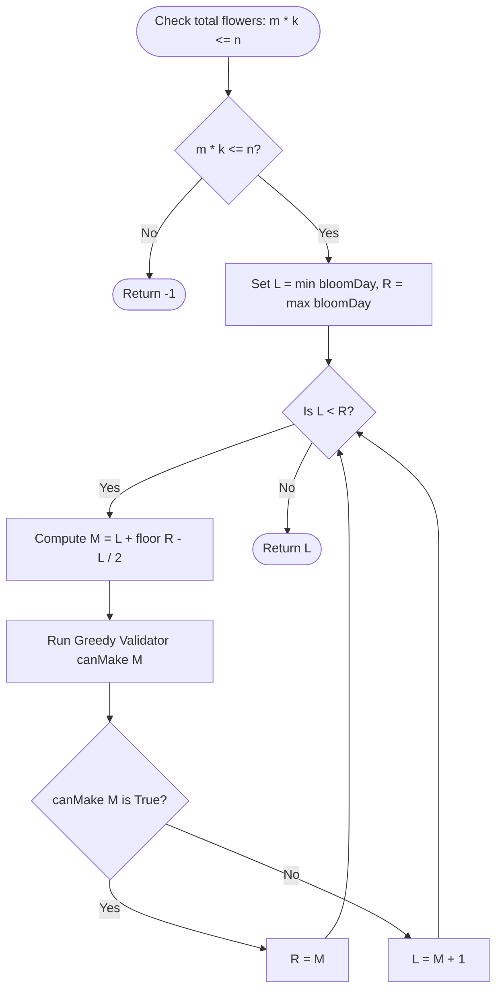

# Guided Example: Minimum Number of Days to Make m Bouquets

We trace the step-by-step execution of the binary search on answer with greedy linear validation on a representative problem instance:

- **Input:** `bloomDay = [7, 7, 7, 7, 12, 7, 7]`, `m = 2`, `k = 3`
- **Required output:** `12`

This instance demonstrates the core tension of the problem: flowers bloom on different calendar days, bouquets require strictly adjacent bloomed flowers, and an unbloomed flower in the middle of a garden partitions the garden and prevents adjacent combinations until it blooms.

---

## 1. Instance & Teaching Goal

You have a garden of $n$ flowers where the $i$-th flower blooms on day $\text{bloomDay}[i]$. You want to construct $m$ bouquets, where each bouquet requires exactly $k$ adjacent bloomed flowers. Each flower can belong to at most one bouquet. We must find the minimum waiting day $D$ such that at least $m$ valid bouquets can be made, or return $-1$ if impossible.

For `bloomDay = [7, 7, 7, 7, 12, 7, 7]` with $m = 2$ and $k = 3$:
- The garden has $n = 7$ flowers. Making $2$ bouquets of $3$ flowers requires $2 \times 3 = 6 \le 7$ flowers, so the request is physically possible.
- On day $7$: six flowers have bloomed at indices $0, 1, 2, 3$ and $5, 6$. However, flower $4$ has not bloomed ($\text{bloomDay}[4] = 12$).
  - Indices $0, 1, 2$ form $1$ bouquet of $3$ flowers.
  - Index $3$ is $1$ isolated flower.
  - Flower $4$ is unbloomed, breaking contiguity.
  - Indices $5, 6$ provide only $2$ flowers (insufficient to form a bouquet of size $3$).
  - Therefore, only $1$ bouquet can be made on day $7$, which is fewer than $m = 2$.
- On day $12$: flower $4$ finally blooms. All $7$ flowers are bloomed, providing a contiguous segment of length $7$, from which $\lfloor 7 / 3 \rfloor = 2$ bouquets are formed.

Evaluating each day linearly from $1$ to $10^9$ is far too slow. Because the count of bloomed flowers is monotonically non-decreasing over time, the feasibility predicate $\text{canMake}(D)$ is monotonic. We can pinpoint the exact minimum day via binary search in logarithmic time.

---

## 2. Conceptual Foundation & Invariants

Let $\text{canMake}(D)$ be a predicate that returns true if at least $m$ disjoint bouquets of $k$ adjacent flowers can be formed on day $D$.

1. **Monotonicity:** If $\text{canMake}(D)$ is true, then on any day $D' > D$, every flower that was bloomed on day $D$ is still bloomed, so $\text{canMake}(D')$ is also true. The truth values follow a step function:
   $$\text{False}, \text{False}, \dots, \text{False}, \mathbf{True}, \text{True}, \dots$$
2. **Greedy Contiguity Validation:** For a fixed day $D$, we scan the garden from left to right, maintaining a running streak of adjacent bloomed flowers ($\text{bloomDay}[i] \le D$). Whenever the streak reaches $k$, we increment our bouquet count by $1$ and reset the streak to $0$. When an unbloomed flower is encountered ($\text{bloomDay}[i] > D$), the streak resets to $0$.

```
Search Space: D in [min(bloomDay), max(bloomDay)] = [7, 12]

Feasibility Check on Day D:
Garden: [  7  ,   7  ,   7  ,   7  ,  12  ,   7  ,   7  ]
At D=9: [BLOOM, BLOOM, BLOOM, BLOOM,  WAIT, BLOOM, BLOOM]
        \__________________/    |      \__________/
          Bouquet 1 (3)       Leftover   Only 2 (need 3)
Total Bouquets = 1 < m=2 -> canMake(9) = False -> Search higher

At D=12:[BLOOM, BLOOM, BLOOM, BLOOM, BLOOM, BLOOM, BLOOM]
        \__________________/  \__________________/
          Bouquet 1 (3)           Bouquet 2 (3)
Total Bouquets = 2 >= m=2 -> canMake(12) = True -> Feasible!
```

We establish the core parameters:

| Parameter | Domain | Role in Bisection & Validation | Initial Value |
|---|---|---|---|
| Search Lower Bound $L$ | Integer $\ge \min(\text{bloomDay})$ | Smallest day that could potentially satisfy predicate | $7$ |
| Search Upper Bound $R$ | Integer $\le \max(\text{bloomDay})$ | Largest day needed (all flowers bloomed) | $12$ |
| Midpoint Probe $M$ | Integer $\in [L, R]$ | Day tested during current binary search step | $\lfloor (7 + 12) / 2 \rfloor = 9$ |
| Streak Counter | Integer $\in [0, k]$ | Consecutive adjacent bloomed flowers | $0$ |
| Bouquet Accumulator | Integer $\ge 0$ | Total valid bouquets formed on candidate day $M$ | $0$ |

> **Monotonic Threshold & Greedy Contiguity Invariant.** The feasibility predicate $\text{canMake}(D)$ is monotonically non-decreasing over $D$. For any day $D$, greedy left-to-right bouquet extraction is guaranteed to maximize the total number of disjoint bouquets of size $k$. Bisection over $[L, R]$ strictly preserves the invariant that the first day where $\text{canMake}(D) = \text{True}$ lies within $[L, R]$.



---

## 3. Step-by-Step Worked Execution

### Step 0: Capacity Pre-Check
We first verify physical feasibility:
$$m \times k = 2 \times 3 = 6$$
$$n = \text{len}(\text{bloomDay}) = 7$$
Since $6 \le 7$, it is physically possible to form the bouquets if we wait long enough.

We set the binary search bounds:
$$L = \min(\text{bloomDay}) = 7, \quad R = \max(\text{bloomDay}) = 12$$

---

### Step 1: Probe Midpoint Day $M = 9$

- Compute midpoint:
  $$M = 7 + \left\lfloor \frac{12 - 7}{2} \right\rfloor = 7 + 2 = 9$$
- We test feasibility on Day $9$ via greedy linear scan:
  - Garden state at Day $9$:
    - Index $0$: $7 \le 9 \implies \text{bloomed}$. $\text{streak} = 1$.
    - Index $1$: $7 \le 9 \implies \text{bloomed}$. $\text{streak} = 2$.
    - Index $2$: $7 \le 9 \implies \text{bloomed}$. $\text{streak} = 3 = k$. Form Bouquet $1$! Reset $\text{streak} = 0$.
    - Index $3$: $7 \le 9 \implies \text{bloomed}$. $\text{streak} = 1$.
    - Index $4$: $12 > 9 \implies \text{NOT bloomed}$. Streak broken! Reset $\text{streak} = 0$.
    - Index $5$: $7 \le 9 \implies \text{bloomed}$. $\text{streak} = 1$.
    - Index $6$: $7 \le 9 \implies \text{bloomed}$. $\text{streak} = 2$.
  - End of garden reached. Total bouquets formed: $1$.
  - Target requirement is $m = 2$. Since $1 < 2$, $\text{canMake}(9) = \text{False}$.
- Because Day $9$ cannot produce $2$ bouquets, no day $\le 9$ can produce $2$ bouquets.
- We discard the interval $[7, 9]$ and narrow the lower bound:
  $$L = M + 1 = 9 + 1 = 10$$

| Parameter | Value Before Step | Operation / Rule Applied | Value After Step |
|---|---|---|---|
| Search Interval $[L, R]$ | $[7, 12]$ | Midpoint test at $M = 9$ | Discard $[7, 9]$ |
| Midpoint Tested | None | $M = 9$ | Evaluated |
| Bouquets Formed | None | $1$ bouquet formed ($< 2$) | $\text{canMake}(9) = \text{False}$ |
| New Search Interval | $[7, 12]$ | Set $L = M + 1 = 10$ | $[10, 12]$ |

---

### Step 2: Probe Midpoint Day $M = 11$

- Compute midpoint of $[10, 12]$:
  $$M = 10 + \left\lfloor \frac{12 - 10}{2} \right\rfloor = 10 + 1 = 11$$
- We test feasibility on Day $11$:
  - Index $4$ still has $\text{bloomDay}[4] = 12 > 11$, so flower $4$ remains unbloomed.
  - The bloomed status of all flowers is identical to Day $9$:
    $$[\text{True}, \text{True}, \text{True}, \text{True}, \mathbf{False}, \text{True}, \text{True}]$$
  - Greedy scan produces the exact same bouquets:
    - Indices $0, 1, 2 \implies 1$ bouquet.
    - Index $3 \implies \text{streak} = 1$.
    - Index $4 \implies \text{unbloomed}, \text{streak} = 0$.
    - Indices $5, 6 \implies \text{streak} = 2$.
  - Total bouquets formed: $1 < 2 \implies \text{canMake}(11) = \text{False}$.
- We discard the interval $[10, 11]$ and narrow the lower bound:
  $$L = M + 1 = 11 + 1 = 12$$

| Parameter | Value Before Step | Operation / Rule Applied | Value After Step |
|---|---|---|---|
| Search Interval $[L, R]$ | $[10, 12]$ | Midpoint test at $M = 11$ | Discard $[10, 11]$ |
| Midpoint Tested | $9$ | $M = 11$ | Evaluated |
| Bouquets Formed | $1$ | $1$ bouquet formed ($< 2$) | $\text{canMake}(11) = \text{False}$ |
| New Search Interval | $[10, 12]$ | Set $L = M + 1 = 12$ | $[12, 12]$ |

---

### Step 3: Interval Convergence at $L = R = 12$

- Search interval has converged to a single candidate: $L = R = 12$.
- Verification on Day $12$:
  - All flowers satisfy $\text{bloomDay}[i] \le 12$:
    $$[\text{True}, \text{True}, \text{True}, \text{True}, \text{True}, \text{True}, \text{True}]$$
  - Greedy scan:
    - Indices $0, 1, 2 \implies \text{streak} = 3 = k \implies \text{Bouquet } 1, \text{streak} = 0$.
    - Indices $3, 4, 5 \implies \text{streak} = 3 = k \implies \text{Bouquet } 2, \text{streak} = 0$.
    - Index $6 \implies \text{streak} = 1$.
  - Total bouquets formed: $2 \ge m = 2 \implies \text{canMake}(12) = \text{True}$.
- The loop terminates. The minimal viable day is $L = 12$.

| Parameter | Value Before Step | Operation / Rule Applied | Value After Step |
|---|---|---|---|
| Search Interval $[L, R]$ | $[12, 12]$ | Convergence: $L = R$ | Halt search |
| Feasibility at $12$ | Unverified | Evaluates to $2$ bouquets $\ge 2$ | $\text{canMake}(12) = \text{True}$ |
| Final Minimum Day | Unset | Extracted from boundary $L$ | $12$ |

---

## 4. Complete Execution Trace

The table below summarizes the binary search progression across all iterations:

| Iteration | Lower Bound $L$ | Upper Bound $R$ | Probe Midpoint $M$ | Bloomed Status Array | Contiguous Segments Formed | Bouquets Count | Feasible ($\ge 2$)? | Updated Boundary Action |
|---|---|---|---|---|---|---|---|---|
| 1 | $7$ | $12$ | $9$ | $[\text{T}, \text{T}, \text{T}, \text{T}, \text{F}, \text{T}, \text{T}]$ | $[0..2], [3], [5..6]$ | $1$ | No | Set $L = M + 1 = 10$ |
| 2 | $10$ | $12$ | $11$ | $[\text{T}, \text{T}, \text{T}, \text{T}, \text{F}, \text{T}, \text{T}]$ | $[0..2], [3], [5..6]$ | $1$ | No | Set $L = M + 1 = 12$ |
| Converged | $12$ | $12$ | $12$ | $[\text{T}, \text{T}, \text{T}, \text{T}, \text{T}, \text{T}, \text{T}]$ | $[0..2], [3..5], [6]$ | $2$ | Yes | Terminate and return $12$ |

Final result returned: $12$.

---

## 5. Algorithmic Correctness

### Soundness of the Greedy Bouquet Validation

For any contiguous maximal segment of $S$ bloomed flowers, the maximum number of disjoint bouquets of size $k$ that can be formed from this segment is $\lfloor S / k \rfloor$.
1. If we form a bouquet using flowers $i \dots i+k-1$, starting at the earliest possible bloomed flower $i$ leaves the largest possible suffix $i+k \dots$ available for future bouquets.
2. Shifting the bouquet to the right can only restrict choices for subsequent flowers without creating extra room to the left.
3. Therefore, greedy left-to-right packing attains the exact maximum possible number of bouquets for any fixed day $D$.

### Completeness of Binary Search Bisection

1. The search domain $[\min(\text{bloomDay}), \max(\text{bloomDay})]$ contains all potential transition days where the count of bloomed flowers changes.
2. The function $f(D) = \text{bouquets}(D)$ is monotonic non-decreasing: $D_1 < D_2 \implies f(D_1) \le f(D_2)$.
3. If $f(M) < m$, no day $D \le M$ can satisfy $f(D) \ge m$. Thus, discarding $[L, M]$ retains all feasible days.
4. If $f(M) \ge m$, $M$ is feasible, and the minimal feasible day cannot exceed $M$. Setting $R = M$ preserves the optimal candidate.
5. Upon convergence $L = R$, the algorithm halts at the smallest day where $\text{canMake}(D) = \text{True}$.

---

## 6. Traps This Instance Exposes

### Trap 1: Integer Overflow on Capacity Pre-check
When checking if $m \times k > n$, if $m = 10^5$ and $k = 10^5$, their product is $10^{10}$, which overflows standard 32-bit signed integers ($2^{31} - 1 \approx 2.14 \times 10^9$). In statically typed languages, this computation must use 64-bit integers (`long long` or `int64`) to avoid negative wraparound causing false feasibility.

### Trap 2: Neglecting to Reset the Streak on Unbloomed Flowers
In Step 1 (Day $9$), flower $4$ is unbloomed. If an implementation simply skips flower $4$ without resetting the streak, it would combine flower $3$ with flowers $5$ and $6$ into a bouquet $\{3, 5, 6\}$. But flowers $3$ and $5$ are **not** adjacent in the garden because flower $4$ separates them. An unbloomed flower must strictly reset $\text{streak} = 0$.

### Trap 3: Resetting Bouquets Across Segments
When a contiguous segment of length $S \ge 2k$ is encountered, it yields multiple bouquets ($\lfloor S / k \rfloor$). An implementation that only yields at most $1$ bouquet per contiguous segment fails on instances where long bloomed runs contain multiple bouquets. Resetting the streak to $0$ upon reaching $k$ correctly allows the next bouquet to start immediately at the adjacent flower.

---

## 7. Complexity Derivation

### Time Complexity

- **Capacity Pre-check:** Multiplications and comparisons in $\mathcal{O}(1)$ time.
- **Finding Search Range:** Scanning $\text{bloomDay}$ of length $n$ to find minimum and maximum takes $\mathcal{O}(n)$ time.
- **Binary Search Iterations:**
  - The search space size is $V = \max(\text{bloomDay}) - \min(\text{bloomDay}) \le 10^9$.
  - The number of bisection steps is $\lfloor \log_2(V) \rfloor + 1 \le 30$.
- **Validation per Iteration:** The greedy validator scans all $n$ flowers once, taking $\mathcal{O}(n)$ time.
- Total time complexity:
$$\mathcal{O}(n \log(\max(\text{bloomDay}) - \min(\text{bloomDay})))$$
For $n = 10^5$ and $V = 10^9$, this performs at most $30 \times 10^5 = 3 \times 10^6$ operations, executing in under $30\text{ ms}$.

### Auxiliary Space Complexity

- The algorithm maintains scalar pointers $L, R, M, \text{streak}$, and $\text{cnt}$.
- No auxiliary arrays or recursive frames are created.
- Total auxiliary space is strictly constant:
$$\mathcal{O}(1)$$
