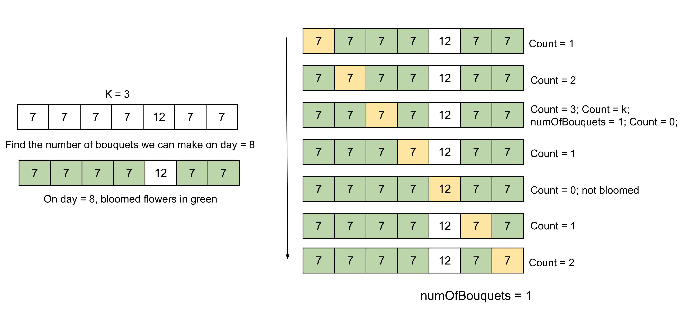

## Solution

---

### Approach: Binary Search

#### Intuition

In this problem, we need to return the number of days required to make a certain number of bouquets, or return -1 if it's not possible to make that many. The flowers for a bouquet must be consecutive in the garden and fully bloomed.

The naive approach would be to iterate through each day, starting from day 1, and check if we can make `m` bouquets on that day. This method is inefficient since it requires iterating over all possible days and all `N` flowers for each day.

To optimize the solution, we observe a crucial property: once a flower blooms, it remains bloomed. This means that the number of bloomed flowers stays the same or increases as the days progress. The same goes for the number of bouquets that can possibly be made.

This observation leads us to consider using a binary search algorithm. One clue that binary search can be applied is that we are searching for a specific value that satisfies a condition (the earliest day). Another clue is that the condition exhibits an "ordered property" – if the condition is satisfied on a particular day, it will also be satisfied on all of the following days.

The observation that the number of bloomed flowers stays the same or increases as the days progress allows us to define a search space between 1 and the maximum value in the `bloomDay` array. For each midpoint day in the search space, we calculate the number of bouquets that can be made on that day by counting the consecutive bloomed flowers.

If the number of bouquets we can make on the midpoint day is greater than or equal to the number required by the problem (`m`), then we can potentially find an earlier day that satisfies the requirement. Since we want to return the minimum number of days we need to wait, we update the search space to the left half to see if we can reduce our wait time. Conversely, if the number of bouquets is less than `m`, we update the search space to the right half to continue our search for a day that we can make the required number of bouquets.

By repeatedly narrowing down the search space through binary search, we can determine whether or not we can make the required number of bouquets.



#### Algorithm

1. Initialize `start` to `0` and `end` to the highest value in the array `bloomDay`.
2. Do the following while the search space (`start` to `end`) doesn't become empty:

- Initialize `mid` to $start + end / 2$.
- Find the number of bouquets possible on day `mid` using a helper function `getNumOfBouquets` as follows:

- Initialize the variable `numOfBouquets` to `0`.
- Iterate over the array `bloomDay` and for each index `i`

- If the value $\text{bloomDay}[i]$ is less than or equal to `mid`, increment the `count`; else, reset it to `0`.
- If the value of `count` is equal to `k`, make a bouquet by incrementing `numOfBouquets` and reset `count` to `0`.
- Return `numOfBouquets`.
- If `numOfBouquets` is more than or equal to `m` store `mid` as an answer in `ans`. Shift to the left of the search space by setting `end` to $mid - 1$.
- Otherwise, shift to the right of the search space by setting `start` to $mid + 1$.
3. Return `ans`.

#### Implementation

```python
class Solution:
    def get_num_of_bouquets(self, bloomDay, mid, k):
        num_of_bouquets = 0
        count = 0

        for day in bloomDay:
            # If the flower is bloomed, add to the set. Else reset the count.
            if day <= mid:
                count += 1
            else:
                count = 0

            if count == k:
                num_of_bouquets += 1
                count = 0

        return num_of_bouquets

    def minDays(self, bloomDay, m, k):
        if m * k > len(bloomDay):
            return -1

        start = 0
        end = max(bloomDay)
        minDays = -1

        while start <= end:
            mid = (start + end) // 2

            if self.get_num_of_bouquets(bloomDay, mid, k) >= m:
                minDays = mid
                end = mid - 1
            else:
                start = mid + 1

        return minDays
```

#### Complexity Analysis

Here, $N$ is the number of flowers and $D$ is the highest value in the array `bloomDay`.

* Time complexity: $O(N \log D)$.

  The search space is from $1$ to $D$ and for each of the chosen values of `mid` in the binary search we will iterate over the $N$ flowers. Therefore the time complexity is equal to $O(N \log D)$.

* Space complexity: $O(1)$

  No extra space is required apart from a few variables and hence the space complexity is constant.
---