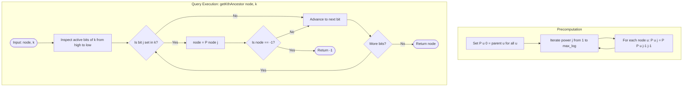

# Guided Example: Kth Ancestor of a Tree Node

We trace the step-by-step execution of the binary lifting tree ancestor algorithm on a representative problem instance:

- **Tree Specification:** $n = 7$ nodes, `parent = [-1, 0, 0, 1, 1, 2, 2]`
- **Operation Queries:**
  1. `getKthAncestor(3, 1)`
  2. `getKthAncestor(5, 2)`
  3. `getKthAncestor(6, 3)`
- **Required Output:** `[1, 0, -1]`

This instance captures every fundamental case of tree ancestor queries: an immediate single-edge parent hop ($k = 1 = 2^0$), a multi-level power-of-two jump ($k = 2 = 2^1$), and a composite multi-bit jump that exhausts tree depth and exits bounds ($k = 3 = 2^1 + 2^0$).

---

## 1. Instance & Teaching Goal

You are given a rooted tree of $n$ nodes labeled from $0$ to $n-1$, where node $0$ is the root. The tree is defined by an array `parent` where $\text{parent}[i]$ is the direct parent of node $i$, with $\text{parent}[0] = -1$. We must implement a query `getKthAncestor(node, k)` that returns the $k$-th ancestor of `node`, or $-1$ if no such ancestor exists (i.e., if the root is exceeded).

In our instance:
- Node $0$ is the root.
- Node $0$ has children $1$ and $2$.
- Node $1$ has children $3$ and $4$.
- Node $2$ has children $5$ and $6$.

A naive implementation traverses parent pointers one edge at a time:
$$\text{curr} = \text{parent}[\text{curr}]$$
This takes $\mathcal{O}(k)$ time per query. In a degenerate tree forming a linear chain of length $n = 50{,}000$, answering $Q = 50{,}000$ queries would perform $Q \times n = 2.5 \times 10^9$ pointer hops, causing severe timeouts.

Binary lifting solves this by precomputing ancestors at distances that are powers of two ($2^0, 2^1, 2^2, \dots, 2^j$). Because any positive integer $k$ uniquely decomposes into a sum of powers of two via its binary representation:
$$k = \sum_{j=0}^{\lfloor \log_2 k \rfloor} b_j \cdot 2^j \quad (b_j \in \{0, 1\})$$
any arbitrary distance $k$ is navigated in at most $\mathcal{O}(\log k)$ jumps.

---

## 2. Conceptual Foundation & Invariants

Let $P[u][j]$ denote the $2^j$-th ancestor of node $u$.
- For $j = 0$: $2^0 = 1$, so $P[u][0] = \text{parent}[u]$.
- For $j \ge 1$: jumping $2^j$ steps equals jumping $2^{j-1}$ steps to reach an intermediate ancestor $v = P[u][j-1]$, and then jumping another $2^{j-1}$ steps from $v$:
  $$P[u][j] = P[P[u][j-1]][j-1]$$
- If an intermediate ancestor is $-1$ (exceeding the root), any further jump also lands on $-1$.

```
Tree Topology:
             0 (Root)
           /   \
          1     2
         / \   / \
        3   4 5   6

Power-of-Two Jump Decomposition:
Distance 1: Jump 2^0 = 1 step
Distance 2: Jump 2^1 = 2 steps
Distance 3: Jump 2^1 (2 steps) + Jump 2^0 (1 step)
Distance 4: Jump 2^2 = 4 steps
```

We specify the state parameters and data structures:

| Parameter | Domain | Mathematical Meaning | Initial Value |
|---|---|---|---|
| Node ID $u$ | Integer $\in [0, n-1]$ | Vertex in tree | Given by query |
| Power Exponent $j$ | Integer $\in [0, \lfloor \log_2 n \rfloor]$ | Jump distance $2^j$ | $0 \le j \le 2$ (for $n = 7$) |
| Table Cell $P[u][j]$ | Integer $\in [-1, n-1]$ | $2^j$-th ancestor of node $u$ | Direct parent for $j=0$ |
| Jump Request $k$ | Integer $\ge 1$ | Target ancestor distance | Decomposed into binary bits |

> **Binary Lifting Invariant.** For all nodes $u$ and exponents $j \ge 1$, $P[u][j]$ correctly identifies the node reached by walking $2^j$ edges toward the root. Any composite walk of length $k$ decomposes into independent power-of-two jumps corresponding to the active bits of $k$.



---

## 3. Step-by-Step Worked Execution

### Stage 1: Precomputing Table $P[u][j]$

For $n = 7$, the maximum tree height is $6$. Since $2^2 = 4 \le 6 < 2^3 = 8$, we populate exponents $j \in \{0, 1, 2\}$.

#### Column $j = 0$ ($2^0 = 1$ step: Direct Parent)
- $P[0][0] = -1$
- $P[1][0] = 0$
- $P[2][0] = 0$
- $P[3][0] = 1$
- $P[4][0] = 1$
- $P[5][0] = 2$
- $P[6][0] = 2$

#### Column $j = 1$ ($2^1 = 2$ steps: Grandparent)
Applying $P[u][1] = P[P[u][0]][0]$:
- For node $0$: $P[0][0] = -1 \implies P[0][1] = -1$
- For node $1$: $P[1][0] = 0 \implies P[0][0] = -1$
- For node $2$: $P[2][0] = 0 \implies P[0][0] = -1$
- For node $3$: $P[3][0] = 1 \implies P[1][0] = 0$
- For node $4$: $P[4][0] = 1 \implies P[1][0] = 0$
- For node $5$: $P[5][0] = 2 \implies P[2][0] = 0$
- For node $6$: $P[6][0] = 2 \implies P[2][0] = 0$

#### Column $j = 2$ ($2^2 = 4$ steps: Great-Great-Grandparent)
Applying $P[u][2] = P[P[u][1]][1]$:
- For nodes $0, 1, 2$: $P[u][1] = -1 \implies P[u][2] = -1$
- For nodes $3, 4, 5, 6$: $P[u][1] = 0 \implies P[0][1] = -1$
Every node at distance $4$ exceeds the root, so all entries in column $2$ are $-1$.

---

### Stage 2: Query Processing

#### Query 1: `getKthAncestor(3, 1)`
We seek the $1$-st ancestor of node $3$.
- Decompose $k = 1$ into binary:
  $$1 = 2^0 \quad (\text{bit } 0 \text{ is } 1)$$
- Bit $0$ is set: perform jump of size $2^0 = 1$:
  $$\text{node} = P[3][0] = 1$$
- No further bits remain. Result: $1$.

| Parameter | State Before Jump | Jump Operation | State After Jump |
|---|---|---|---|
| Query State | $\text{node} = 3, k = 1$ | Read bit $0 \implies 2^0$ jump | Hop $3 \to P[3][0]$ |
| Target Reached | Node $3$ | Lookup $P[3][0] = 1$ | $\text{node} = 1$ |
| Output Value | Unset | Return active node | $1$ |

---

#### Query 2: `getKthAncestor(5, 2)`
We seek the $2$-nd ancestor of node $5$.
- Decompose $k = 2$ into binary:
  $$2 = 2^1 \quad (\text{bit } 1 \text{ is } 1)$$
- Bit $0$ is $0$: skip.
- Bit $1$ is set: perform jump of size $2^1 = 2$:
  $$\text{node} = P[5][1] = 0$$
- No further bits remain. Result: $0$.

| Parameter | State Before Jump | Jump Operation | State After Jump |
|---|---|---|---|
| Query State | $\text{node} = 5, k = 2$ | Read bit $1 \implies 2^1$ jump | Hop $5 \to P[5][1]$ |
| Target Reached | Node $5$ | Lookup $P[5][1] = 0$ | $\text{node} = 0$ (Root) |
| Output Value | Unset | Return active node | $0$ |

---

#### Query 3: `getKthAncestor(6, 3)`
We seek the $3$-rd ancestor of node $6$.
- Decompose $k = 3$ into binary:
  $$3 = 2^1 + 2^0 \quad (\text{bits } 0 \text{ and } 1 \text{ are } 1)$$
- Evaluate jumps from highest bit to lowest (or lowest to highest):
  1. Jump size $2^1 = 2$ (bit $1$):
     $$\text{node} = P[6][1] = 0$$
  2. Jump size $2^0 = 1$ (bit $0$):
     $$\text{node} = P[0][0] = -1$$
- Active node is $-1$, indicating the requested ancestor lies beyond the root.
- Return $-1$.

| Parameter | State Before Jump | Jump Operation | State After Jump |
|---|---|---|---|
| Query State | $\text{node} = 6, k = 3$ | Decompose $k = 2^1 + 2^0$ | Execute 2-phase jump |
| Phase 1: Bit 1 | $\text{node} = 6$ | Jump $2^1$ via $P[6][1]$ | Reaches node $0$ |
| Phase 2: Bit 0 | $\text{node} = 0$ | Jump $2^0$ via $P[0][0]$ | Reaches $-1$ (out of tree) |
| Output Value | Unset | Boundary breached | $-1$ |

---

## 4. Complete Execution Trace

### Binary Lifting Precomputation Matrix $P[u][j]$

| Node ID $u$ | $j = 0$ ($2^0 = 1$ edge) | $j = 1$ ($2^1 = 2$ edges) | $j = 2$ ($2^2 = 4$ edges) |
|---|---|---|---|
| $0$ (Root) | $-1$ | $-1$ | $-1$ |
| $1$ | $0$ | $-1$ | $-1$ |
| $2$ | $0$ | $-1$ | $-1$ |
| $3$ | $1$ | $0$ | $-1$ |
| $4$ | $1$ | $0$ | $-1$ |
| $5$ | $2$ | $0$ | $-1$ |
| $6$ | $2$ | $0$ | $-1$ |

### Query Execution Summary

| Query Index | Method Call | Starting Node | Target $k$ | Binary Form of $k$ | Active Jumps Evaluated | Intermediate Paths | Final Output |
|---|---|---|---|---|---|---|---|
| 1 | `getKthAncestor(3, 1)` | $3$ | $1$ | $(1)_2 = 2^0$ | Jump $2^0$ | $3 \to 1$ | $1$ |
| 2 | `getKthAncestor(5, 2)` | $5$ | $2$ | $(10)_2 = 2^1$ | Jump $2^1$ | $5 \to 0$ | $0$ |
| 3 | `getKthAncestor(6, 3)` | $6$ | $3$ | $(11)_2 = 2^1 + 2^0$ | Jump $2^1$, then $2^0$ | $6 \to 0 \to -1$ | $-1$ |

Final result sequence: `[1, 0, -1]`.

---

## 5. Algorithmic Correctness

### Soundness

1. **Recurrence Soundness:** By definition of tree paths, taking $2^j$ steps along unique parent edges is strictly equivalent to taking $2^{j-1}$ steps, followed by another $2^{j-1}$ steps from the arrival node:
   $$2^{j-1} + 2^{j-1} = 2 \times 2^{j-1} = 2^j$$
   Since $P[u][0]$ matches the ground-truth parent array, induction establishes that every populated cell $P[u][j]$ reflects the exact $2^j$-th ancestor.
2. **Binary Representation Uniqueness:** Every integer $k \ge 1$ has a unique binary representation. Traversing $2^j$ edges for each set bit $b_j = 1$ sums exactly to $\sum b_j 2^j = k$ total edges.
3. If any intermediate ancestor evaluates to $-1$, the true path length from `node` to the root is strictly less than $k$, guaranteeing that returning $-1$ is mathematically sound.

### Completeness

Because $P[u][j]$ is precomputed for all $j \le \lceil \log_2 n \rceil$, any distance $k < n$ is fully representable by the available power columns. No valid jump can be truncated due to missing powers of two.

---

## 6. Traps This Instance Exposes

### Trap 1: Naive Pointer Hopping Timeout
A direct loop walking $k$ steps has worst-case time complexity $\mathcal{O}(k)$ per query. For $Q = 50{,}000$ queries on a chain of length $n = 50{,}000$, this performs $\approx 2.5 \times 10^9$ operations and fails with Time Limit Exceeded. Binary lifting processes every query in at most $\log_2(50{,}000) \approx 16$ jumps.

### Trap 2: Out-of-Bounds Table Lookup After Exiting Tree
If node lands on $-1$ during an intermediate jump, attempting to access $P[-1][j]$ will cause an index out-of-range exception. The query traversal must check `if node == -1: break` immediately after every jump.

### Trap 3: Insufficient Exponent Upper Bound
For $n = 50{,}000$, choosing an exponent limit of $15$ is insufficient because $2^{15} = 32{,}768 < 50{,}000$. The table must accommodate at least $\lfloor \log_2(50{,}000) \rfloor + 1 = 16$ powers (typically dimensioned to $18$ powers, covering up to $2^{17} = 131{,}072$).

---

## 7. Complexity Derivation

### Time Complexity

- **Preprocessing (Constructor):**
  - Number of table rows: $n$.
  - Number of columns: $M = \lfloor \log_2 n \rfloor + 1 \le 18$.
  - Populating each cell takes $\mathcal{O}(1)$ via $P[u][j] = P[P[u][j-1]][j-1]$.
  - Total constructor time:
    $$\mathcal{O}(n \log n)$$
    For $n = 50{,}000$, this executes $50{,}000 \times 18 = 900{,}000$ operations, taking under $25\text{ ms}$.
- **Query Execution (`getKthAncestor`):**
  - We examine at most $M \le 18$ bits in the binary representation of $k$.
  - Each jump requires one array lookup and one comparison: $\mathcal{O}(1)$.
  - Total time per query:
    $$\mathcal{O}(\log k) \subseteq \mathcal{O}(\log n)$$
  - For $Q = 50{,}000$ queries, total query workload is $50{,}000 \times 16 \approx 800{,}000$ operations.

### Auxiliary Space Complexity

- The 2D table $P$ stores $n \times M$ integer entries.
- With $n = 50{,}000$ and $M = 18$, the table requires $900{,}000$ integer cells:
  $$\mathcal{O}(n \log n)$$
- This fits easily in a few megabytes of memory.
