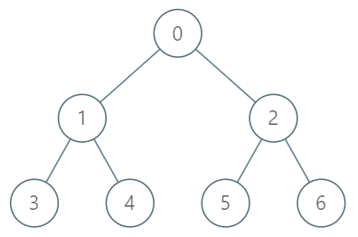

### 1. Description

You are given a tree with `n` nodes numbered from `0` to $n - 1$ in the form of a parent array `parent` where $\text{parent}[i]$ is the parent of $i^{\text{th}}$ node. The root of the tree is node `0`. Find the $k^{\text{th}}$ ancestor of a given node.

The $k^{\text{th}}$ ancestor of a tree node is the $k^{\text{th}}$ node in the path from that node to the root node.

Implement the `TreeAncestor` class:

- `TreeAncestor(int n, int[] parent)` Initializes the object with the number of nodes in the tree and the parent array.

- `int getKthAncestor(int node, int k)` return the $k^{\text{th}}$ ancestor of the given node `node`. If there is no such ancestor, return `-1`.

### 2. Function Contract

**Methods**

- `TreeAncestor(n: int, parent: List[int])`: Initializes the data structure.
- `getKthAncestor(node: int, k: int) -> `int``: Executes operation.

### 3. Examples

#### Example 1



```
**Input**
["TreeAncestor", "getKthAncestor", "getKthAncestor", "getKthAncestor"]
[[7, [-1, 0, 0, 1, 1, 2, 2]], [3, 1], [5, 2], [6, 3]]
**Output**
[null, 1, 0, -1]

**Explanation**
TreeAncestor treeAncestor = new TreeAncestor(7, [-1, 0, 0, 1, 1, 2, 2]);
treeAncestor.getKthAncestor(3, 1); // returns 1 which is the parent of 3
treeAncestor.getKthAncestor(5, 2); // returns 0 which is the grandparent of 5
treeAncestor.getKthAncestor(6, 3); // returns -1 because there is no such ancestor
```

### 4. Constraints

- $1 \le k \le n \le 5 * 10^{4}$

- $\text{parent.length} = n$

- $\text{parent}[0] = -1$

- $0 \le \text{parent}[i] < n$ for all `0 < i < n`

- $0 \le node < n$

- There will be at most $5 * 10^{4}$ queries.
