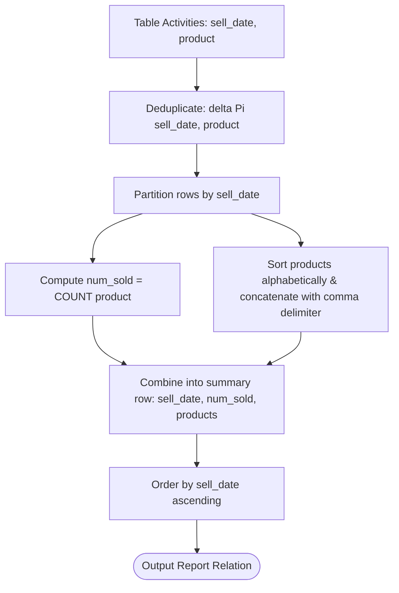

# Guided Example: Group Sold Products By The Date

We trace the step-by-step relational algebra transformation of sales transaction logs on a representative database instance:

- **Input Relation `Activities`:** $7$ recorded sales entries across $3$ distinct dates:

| sell_date | product |
|---|---|
| 2020-05-30 | Headphone |
| 2020-06-01 | Pencil |
| 2020-06-02 | Mask |
| 2020-05-30 | Basketball |
| 2020-06-01 | Bible |
| 2020-06-02 | Mask |
| 2020-05-30 | T-Shirt |

- **Required Output:** A date-aggregated summary reporting the count of distinct products and an alphabetically ordered comma-separated product list:

| sell_date | num_sold | products |
|---|---|---|
| 2020-05-30 | 3 | Basketball,Headphone,T-Shirt |
| 2020-06-01 | 2 | Bible,Pencil |
| 2020-06-02 | 1 | Mask |

This instance demonstrates two critical relational challenges: intra-date product deduplication (duplicate `Mask` on `2020-06-02`) and alphabetical ordering within string concatenation across multiple items (`Basketball` before `Headphone` before `T-Shirt`).

---

## 1. Instance & Teaching Goal

The objective is to compute a daily product sales report from an un-keyed sales log `Activities(sell_date, product)`. For each distinct date, the report must output:
1. `sell_date`: The transaction date.
2. `num_sold`: The number of distinct products sold on that date.
3. `products`: A single comma-separated string containing the distinct product names sold on that date, sorted in lexicographical order.

The final table must be ordered chronologically by `sell_date` ascending.

A naive string concatenation without deduplication includes duplicate product occurrences (e.g., `"Mask,Mask"`), violating the distinct product contract. Neglecting intra-group sorting concatenates products in arbitrary physical storage order rather than alphabetical order.

The optimal relational approach applies a multi-stage pipeline: deduplicating pair tuples $(\text{sell\_date}, \text{product})$, grouping by $\text{sell\_date}$, computing the cardinality of unique products, performing ordered string aggregation, and sorting the resulting summary by date.

---

## 2. Conceptual Foundation & Invariants

The relational transformation decomposes into four formal stages:

```
Activities (7 tuples with duplicates)
        |
        | Projection & Deduplication: delta(Pi_{sell_date, product})
        v
Unique Sales Pairs (6 distinct date-product pairs)
        |
        | Grouped Aggregation by sell_date
        | - Count unique products: COUNT(product)
        | - Order within group and concatenate: GROUP_CONCAT(product ORDER BY product)
        v
Aggregated Summary (3 date rows)
        |
        | Chronological Sort: tau_{sell_date ASC}
        v
Final Report Table
```

We establish the formal algebraic operators and schemas:

| Relational Operator | Algebraic Notation | Operational Responsibility | Input Cardinality $\to$ Output Cardinality |
|---|---|---|---|
| Deduplication | $\delta(\Pi_{\text{sell\_date}, \text{product}}(Activities))$ | Eliminates duplicate transactions for the same product on the same day | $7 \text{ rows} \to 6 \text{ distinct rows}$ |
| Intra-Group Sort | $\tau_{\text{product} \uparrow}$ within partition | Ensures concatenated product tokens follow alphabetical order | Partitioned streams |
| Grouped Count | $\gamma_{\text{sell\_date}, \text{COUNT}(\text{product}) \to \text{num\_sold}}$ | Computes cardinality of unique products per date | $6 \text{ rows} \to 3 \text{ date rows}$ |
| String Aggregation | $\text{AGG\_CONCAT}(\text{product}, ',')$ | Joins sorted product tokens with comma delimiters | $6 \text{ rows} \to 3 \text{ summary strings}$ |
| Global Sort | $\tau_{\text{sell\_date} \uparrow}$ | Enforces chronological ascending order of final rows | $3 \text{ rows} \to 3 \text{ sorted rows}$ |

> **Distinct String Aggregation Invariant.** Every product name in the comma-separated output string must appear at most once per `sell_date`. Applying duplicate elimination prior to concatenation guarantees that `num_sold` precisely matches the number of comma-separated tokens in `products`.



---

## 3. Step-by-Step Worked Execution

### Step 1: Input Multi-Relation Inspection
The input relation `Activities` contains $7$ tuples:
- Row 1: (`2020-05-30`, `Headphone`)
- Row 2: (`2020-06-01`, `Pencil`)
- Row 3: (`2020-06-02`, `Mask`)
- Row 4: (`2020-05-30`, `Basketball`)
- Row 5: (`2020-06-01`, `Bible`)
- Row 6: (`2020-06-02`, `Mask`) $\to$ identical to Row 3!
- Row 7: (`2020-05-30`, `T-Shirt`)

---

### Step 2: Projection and Deduplication ($\delta$)

Applying duplicate elimination operator $\delta$ removes redundant occurrences:
- Pair (`2020-06-02`, `Mask`) appears twice in the raw log (Rows 3 and 6). Deduplication merges them into a single unique record.
- Resulting relation $R_1$:

| sell_date | product | Deduplication Status |
|---|---|---|
| 2020-05-30 | Basketball | Unique |
| 2020-05-30 | Headphone | Unique |
| 2020-05-30 | T-Shirt | Unique |
| 2020-06-01 | Bible | Unique |
| 2020-06-01 | Pencil | Unique |
| 2020-06-02 | Mask | Merged duplicate from row 6 |

---

### Step 3: Partitioning by Date and Lexicographical Intra-Group Sort

We group rows by `sell_date` and sort products alphabetically:

1. **Partition `2020-05-30`:**
   - Products: `Headphone`, `Basketball`, `T-Shirt`.
   - Lexicographical sort:
     $$\text{Basketball} < \text{Headphone} < \text{T-Shirt}$$
   - Sorted sequence: `["Basketball", "Headphone", "T-Shirt"]`.
2. **Partition `2020-06-01`:**
   - Products: `Pencil`, `Bible`.
   - Lexicographical sort:
     $$\text{Bible} < \text{Pencil}$$
   - Sorted sequence: `["Bible", "Pencil"]`.
3. **Partition `2020-06-02`:**
   - Products: `Mask`.
   - Sorted sequence: `["Mask"]`.

---

### Step 4: Grouped Aggregation ($\gamma$)

We compute count and concatenate strings with delimiter `','`:

1. **Date `2020-05-30`:**
   - Unique product count: $3$.
   - Concatenated string: `"Basketball,Headphone,T-Shirt"`.
2. **Date `2020-06-01`:**
   - Unique product count: $2$.
   - Concatenated string: `"Bible,Pencil"`.
3. **Date `2020-06-02`:**
   - Unique product count: $1$.
   - Concatenated string: `"Mask"`.

---

### Step 5: Chronological Ordering ($\tau$)

Applying $\tau_{\text{sell\_date} \uparrow}$:
- `2020-05-30`
- `2020-06-01`
- `2020-06-02`

The rows are already sorted chronologically.

---

## 4. Complete Execution Trace

The table below summarizes the transformation across every partition:

| Partition Date | Raw Products Encountered | Deduplicated Set | Sorted Sequence | Cardinality `num_sold` | Concatenated Result `products` |
|---|---|---|---|---|---|
| `2020-05-30` | Headphone, Basketball, T-Shirt | {Basketball, Headphone, T-Shirt} | Basketball, Headphone, T-Shirt | $3$ | `Basketball,Headphone,T-Shirt` |
| `2020-06-01` | Pencil, Bible | {Bible, Pencil} | Bible, Pencil | $2$ | `Bible,Pencil` |
| `2020-06-02` | Mask, Mask | {Mask} | Mask | $1$ | `Mask` |

Final structured relation matching the required contract:

| sell_date | num_sold | products |
|---|---|---|
| 2020-05-30 | 3 | Basketball,Headphone,T-Shirt |
| 2020-06-01 | 2 | Bible,Pencil |
| 2020-06-02 | 1 | Mask |

---

## 5. Algorithmic Correctness

### Soundness

1. **Intra-Date Deduplication:** Every element in the final comma-separated list originates from a unique product in the deduplicated set. Because set semantics ensure $|S| = \text{COUNT}(\text{DISTINCT } \text{product})$, the integer value `num_sold` exactly equals the token count in `products`.
2. **Alphabetical Determinism:** The intra-group order operator enforces $p_1 < p_2 < \dots < p_m$ lexicographically, preventing arbitrary non-deterministic string outputs.
3. **Global Ordering:** Sorting by `sell_date` ascending ensures chronological determinism across rows.

### Completeness

Every row in `Activities` is associated with a date. Partitioning by `sell_date` is an equivalence relation over the domain of dates present in the table. No valid sales record or date is omitted.

---

## 6. Traps This Instance Exposes

### Trap 1: Omission of Intra-Group Deduplication
On `2020-06-02`, `Mask` appears twice in `Activities`. If string aggregation is performed without `DISTINCT`, the output becomes `"Mask,Mask"` and `num_sold` evaluates to $2$. The contract strictly requires distinct products.

### Trap 2: Missing Intra-Group Sort
In the `2020-05-30` partition, the input order is `Headphone`, `Basketball`, `T-Shirt`. If an implementation concatenates in insertion order without sorting, it produces `"Headphone,Basketball,T-Shirt"`. The contract requires strictly alphabetical ordering: `"Basketball,Headphone,T-Shirt"`.

### Trap 3: Spacing in Delimiters
The required delimiter is a single comma `','` with no trailing spaces. Emitting `", "` (comma followed by space) violates the exact string match expected by test suites.

---

## 7. Complexity Derivation

### Time Complexity

Let $N$ be the number of rows in `Activities`, and $D$ be the number of distinct dates ($D \le N$).

1. **Deduplication:** Hashing pairs $(\text{sell\_date}, \text{product})$ takes $\mathcal{O}(N \cdot L)$ time, where $L$ is the maximum product string length.
2. **Sorting within Groups:** For each date with $m_d$ distinct products, sorting the names takes $\mathcal{O}(m_d \log m_d \cdot L)$ time. Across all dates:
   $$\sum_{d=1}^D \mathcal{O}(m_d \log m_d \cdot L) \le \mathcal{O}(N \log N \cdot L)$$
3. **String Concatenation:** Concatenating names of total length $K_d$ takes $\mathcal{O}(K_d)$ time per date, totaling $\mathcal{O}(N \cdot L)$.
4. **Final Date Sorting:** Sorting $D$ dates takes $\mathcal{O}(D \log D)$ time.
- Total time complexity:
$$\mathcal{O}(N \log N \cdot L)$$
Given $N \le 1000$ and short product names, execution completes within a few milliseconds.

### Auxiliary Space Complexity

- The deduplicated intermediate relation and hash buckets store $N$ string references: $\mathcal{O}(N \cdot L)$ space.
- The output relation stores $D$ rows with aggregated strings: $\mathcal{O}(N \cdot L)$ space.
- Total auxiliary space:
$$\mathcal{O}(N \cdot L)$$
