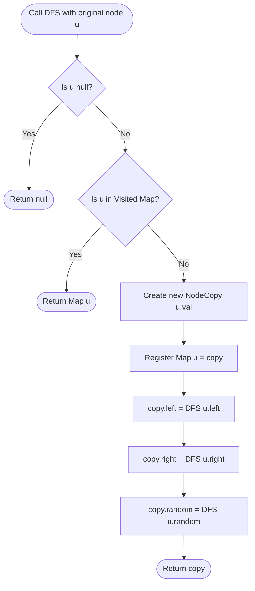

# Guided Example: Clone Binary Tree With Random Pointer

We trace the step-by-step execution of the memoized depth-first search (DFS) cloning algorithm on a representative problem instance:

- **Original Tree Structure:**
  - Node $A$ (value $1$): $\text{left} = \text{null}$, $\text{right} = B$, $\text{random} = \text{null}$
  - Node $B$ (value $4$): $\text{left} = C$, $\text{right} = \text{null}$, $\text{random} = C$
  - Node $C$ (value $7$): $\text{left} = \text{null}$, $\text{right} = \text{null}$, $\text{random} = A$
- **Required Output:** A completely detached deep copy with identical topology, where all `left`, `right`, and `random` references point exclusively to cloned nodes:
  - $A'$ (value $1$): $\text{left} = \text{null}$, $\text{right} = B'$, $\text{random} = \text{null}$
  - $B'$ (value $4$): $\text{left} = C'$, $\text{right} = \text{null}$, $\text{random} = C'$
  - $C'$ (value $7$): $\text{left} = \text{null}$, $\text{right} = \text{null}$, $\text{random} = A'$

This instance highlights the defining structural challenge: the random pointer from $C$ back to $A$ forms a directed cycle. A naive deep copy without memoization enters an infinite recursive loop.

---

## 1. Instance & Teaching Goal

A standard binary tree is a directed acyclic graph (DAG) where each node has at most two children (`left` and `right`). Adding an arbitrary `random` pointer allows edges to cross subtrees, point to ancestors, point to oneself, or form arbitrary directed cycles.

Our goal is to construct a deep copy `NodeCopy` of the entire structure such that:
1. Every node in the original tree maps to exactly one newly instantiated copy node.
2. The tree hierarchy (`left`, `right`) and auxiliary relationships (`random`) are faithfully replicated.
3. Zero references link the original tree and the new tree.

If an algorithm traverses `left`, `right`, and `random` edges without tracking visited nodes, the back-edge $C \to A$ triggers an infinite cascade ($A \to B \to C \to A \to \dots$), exhausting the call stack.

The optimal approach uses a memoization hash map mapping $\text{original\_node} \mapsto \text{cloned\_node}$. Before creating any copy, the algorithm checks the map; if the node has already been created, it returns the cached reference immediately, terminating recursion and resolving cycles in linear time.

---

## 2. Conceptual Foundation & Invariants

Each node is visited via DFS. The node is instantiated and immediately registered in the hash map *before* recursing on its neighbors (`left`, `right`, `random`). This ensures that if any child or random pointer cycles back to this node during the recursive descent, the lookup finds the already-allocated instance and returns it without re-allocating.

```
Original Topology:
       A (val: 1)
        \
         B (val: 4) -------+
        /                  | random
       C (val: 7) <--------+
        \
         +-----> A (val: 1) [Random Back-Edge Cycle!]

Cloning Mechanism:
Visit A -> Allocate A' -> Map[A] = A'
  Recurse B -> Allocate B' -> Map[B] = B'
    Recurse C -> Allocate C' -> Map[C] = C'
      Recurse C.random (A) -> A in Map? YES -> Return A' (Cycle Broken!)
```

We define the primary state parameters:

| Parameter | Domain / Type | Operational Responsibility | Initial State |
|---|---|---|---|
| Visited Map | Hash Map: $\text{Node} \to \text{NodeCopy}$ | Records the 1-to-1 correspondence between original and cloned nodes | Empty $\emptyset$ |
| Recursion Stack | Call frames of DFS | Tracks the active exploration path | $[\text{DFS}(A)]$ |
| Active Node $u$ | Original `Node` or `null` | Node currently being cloned | $A$ |
| Cloned Node $u'$ | New `NodeCopy` instance | Fresh replica assigned to mirror $u$ | Unallocated |

> **Identity-Mapping & Cycle Resolution Invariant.** For every visited node $u$, its clone $u'$ is registered in the hash map immediately upon allocation. Any subsequent reference to $u$ (via a child edge or a random cycle) intercepts the map and returns $u'$ directly, guaranteeing that no node is cloned twice and every cycle terminates safely.



---

## 3. Step-by-Step Worked Execution

### Step 1: Initialize at Root Node $A$ (Value $1$)
- Enter $\text{DFS}(A)$. $A$ is not null and not in `Map`.
- Instantiate $A' = \text{NodeCopy}(1)$.
- Register in map: $\text{Map}[A] = A'$.
- Recurse on $A.\text{left} = \text{null}$:
  $$\text{DFS}(\text{null}) \implies \text{returns null}$$
  $$A'.\text{left} = \text{null}$$
- Recurse on $A.\text{right} = B$.

| Call Frame | Active Node | Map Content | Action Taken | Returned Reference |
|---|---|---|---|---|
| Frame 1 | $A$ (val $1$) | $\{A: A'\}$ | Allocate $A'$, set $A'.\text{left} = \text{null}$ | Pending right child |

---

### Step 2: Traverse Right Child to Node $B$ (Value $4$)
- Enter $\text{DFS}(B)$. $B$ is not null and not in `Map`.
- Instantiate $B' = \text{NodeCopy}(4)$.
- Register in map: $\text{Map}[B] = B'$.
- Recurse on $B.\text{left} = C$.

| Call Frame | Active Node | Map Content | Action Taken | Returned Reference |
|---|---|---|---|---|
| Frame 2 | $B$ (val $4$) | $\{A: A', B: B'\}$ | Allocate $B'$, recurse on $C$ | Pending left child |

---

### Step 3: Traverse Left Child to Node $C$ (Value $7$)
- Enter $\text{DFS}(C)$. $C$ is not null and not in `Map`.
- Instantiate $C' = \text{NodeCopy}(7)$.
- Register in map: $\text{Map}[C] = C'$.
- Recurse on $C.\text{left} = \text{null} \implies \text{returns null}$.
- Recurse on $C.\text{right} = \text{null} \implies \text{returns null}$.
- Recurse on $C.\text{random} = A$.

| Call Frame | Active Node | Map Content | Action Taken | Returned Reference |
|---|---|---|---|---|
| Frame 3 | $C$ (val $7$) | $\{A: A', B: B', C: C'\}$ | Allocate $C'$, set children null, inspect random $A$ | Pending random |

---

### Step 4: Cycle Interception on $C.\text{random} \to A$
- Enter $\text{DFS}(A)$ from Frame 3.
- Check map: $A$ is already present in `Map`!
- Immediate return:
  $$\text{Map}[A] = A'$$
- No further recursion occurs. The back-edge cycle is cleanly closed.
- Assign $C'.\text{random} = A'$.
- Frame 3 completes and returns $C'$ to Frame 2.

| Call Frame | Active Node | Map Content | Action Taken | Returned Reference |
|---|---|---|---|---|
| Frame 4 | $A$ (val $1$) | $\{A: A', B: B', C: C'\}$ | Cache hit! Return $A'$ immediately | $A'$ |
| Frame 3 | $C$ (val $7$) | $\{A: A', B: B', C: C'\}$ | Assign $C'.\text{random} = A'$, frame finished | $C'$ |

---

### Step 5: Complete Node $B$'s Pointers
- Back in Frame 2, assign $B'.\text{left} = C'$.
- Recurse on $B.\text{right} = \text{null} \implies \text{returns null}$.
- Recurse on $B.\text{random} = C$:
  - Enter $\text{DFS}(C)$.
  - $C$ is already present in `Map`!
  - Cache hit returns $C'$ immediately.
- Assign $B'.\text{random} = C'$.
- Frame 2 completes and returns $B'$ to Frame 1.

| Call Frame | Active Node | Map Content | Action Taken | Returned Reference |
|---|---|---|---|---|
| Frame 2 | $B$ (val $4$) | $\{A: A', B: B', C: C'\}$ | Assign $B'.\text{left} = C'$, $B'.\text{random} = C'$ | $B'$ |

---

### Step 6: Complete Root Node $A$'s Pointers
- Back in Frame 1, assign $A'.\text{right} = B'$.
- Recurse on $A.\text{random} = \text{null} \implies \text{returns null}$.
- Assign $A'.\text{random} = \text{null}$.
- Frame 1 completes and returns $A'$.

| Call Frame | Active Node | Map Content | Action Taken | Returned Reference |
|---|---|---|---|---|
| Frame 1 | $A$ (val $1$) | $\{A: A', B: B', C: C'\}$ | Assign $A'.\text{right} = B'$, $A'.\text{random} = \text{null}$ | $A'$ (Cloned Root) |

---

## 4. Complete Execution Trace

The table below summarizes the full recursive call tree in chronological execution order:

| Call Step | Invocation | Target Node | In Map? | Action Taken | Cloned Object | Returned Reference |
|---|---|---|---|---|---|---|
| 1 | $\text{DFS}(A)$ | $A$ (val $1$) | No | Allocate $A'$, register in map | $A'$ | Pending |
| 2 | $\text{DFS}(A.\text{left})$ | null | - | Base case | - | null |
| 3 | $\text{DFS}(A.\text{right})$ | $B$ (val $4$) | No | Allocate $B'$, register in map | $B'$ | Pending |
| 4 | $\text{DFS}(B.\text{left})$ | $C$ (val $7$) | No | Allocate $C'$, register in map | $C'$ | Pending |
| 5 | $\text{DFS}(C.\text{left})$ | null | - | Base case | - | null |
| 6 | $\text{DFS}(C.\text{right})$ | null | - | Base case | - | null |
| 7 | $\text{DFS}(C.\text{random})$ | $A$ (val $1$) | **Yes** | **Cache hit! Break cycle** | - | $A'$ |
| 8 | Return to Frame 4 | $C$ completed | - | Assign $C'.\text{random} = A'$ | $C'$ | $C'$ |
| 9 | $\text{DFS}(B.\text{right})$ | null | - | Base case | - | null |
| 10 | $\text{DFS}(B.\text{random})$ | $C$ (val $7$) | **Yes** | **Cache hit! Reuse existing $C'$** | - | $C'$ |
| 11 | Return to Frame 2 | $B$ completed | - | Assign $B'.\text{left} = C', B'.\text{random} = C'$ | $B'$ | $B'$ |
| 12 | $\text{DFS}(A.\text{random})$ | null | - | Base case | - | null |
| 13 | Return to Frame 1 | $A$ completed | - | Assign $A'.\text{right} = B'$ | $A'$ | $A'$ |

The returned reference is $A'$, representing the root of the completely cloned binary tree.

---

## 5. Algorithmic Correctness

### Soundness

1. **Topological Isomorphism:** For every node $u$ in the original tree, its clone $u'$ has $u'.\text{val} = u.\text{val}$. Furthermore, $u'.\text{left} = \text{Map}[u.\text{left}]$, $u'.\text{right} = \text{Map}[u.\text{right}]$, and $u'.\text{random} = \text{Map}[u.\text{random}]$. The structural relations are 1-to-1 isomorphic.
2. **Deep Independence:** Every `NodeCopy` is created via a separate object instantiation. At no point is a reference to any original `Node` assigned to a field of a `NodeCopy`. The cloned tree is completely independent in memory.
3. **Finite Termination:** Because each original node is registered in the map immediately upon allocation, it is processed at most once. For a tree of $N$ nodes, at most $N$ non-null allocations occur. Any cycle encounters an existing map key and terminates in $\mathcal{O}(1)$ time.

### Completeness

Every node reachable from the root via any sequence of `left`, `right`, or `random` edges is traversed by the DFS. Therefore, the entire connected component containing the root is cloned without omission.

---

## 6. Traps This Instance Exposes

### Trap 1: Infinite Recursion on Cyclic Random Edges
If random pointers form cycles (such as $C \to A$), recursing unconditionally without tracking visited nodes causes stack overflow. Registering $u$ in `Map` *before* recursing on its children breaks the cycle.

### Trap 2: Duplicating Nodes via Multiple Incoming Edges
In our instance, node $C$ is reached both as $B$'s left child and as $B$'s random pointer. Without memoization, two distinct copies $C_1'$ and $C_2'$ would be created. The map ensures that both $B'.\text{left}$ and $B'.\text{random}$ point to the exact same cloned instance $C'$.

### Trap 3: Keying by Node Value Instead of Object Reference
In trees where multiple nodes have identical values (e.g., several nodes with value $1$), using the node's integer value as the map key causes collisions, erroneously merging separate tree nodes into one. The hash map must strictly key on object identity (memory address or object reference).

---

## 7. Complexity Derivation

### Time Complexity

- **Node Creation:** Each node in the tree is allocated exactly once: $\mathcal{O}(N)$.
- **Pointer Assignments:** For each node, three recursive calls are initiated (`left`, `right`, `random`), totaling $3N$ calls.
- **Hash Table Lookups:** Each call performs an $\mathcal{O}(1)$ average lookup and insertion in `Map`.
- Total time complexity:
$$\mathcal{O}(N)$$
For $N \le 1000$, execution requires fewer than $3000$ operations, taking under $2\text{ ms}$.

### Auxiliary Space Complexity

- **Visited Map:** Stores $N$ key-value pairs linking original nodes to cloned nodes: $\mathcal{O}(N)$ space.
- **Recursion Call Stack:** In the worst-case degenerate skewed tree, recursion depth reaches $N$: $\mathcal{O}(N)$ space.
- Total auxiliary space:
$$\mathcal{O}(N)$$