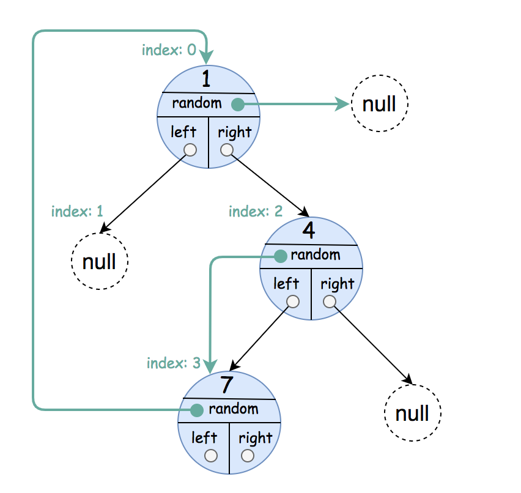
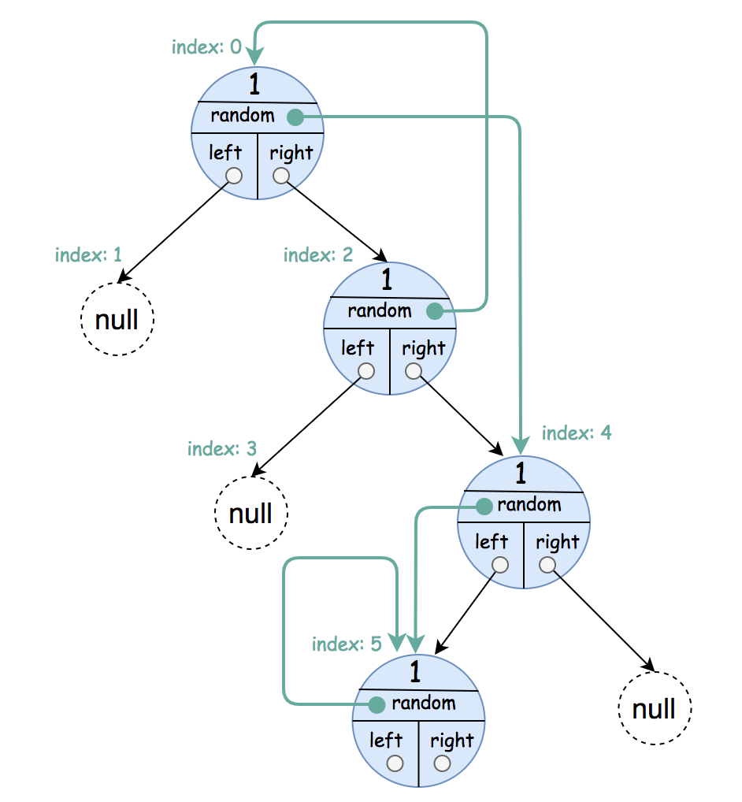
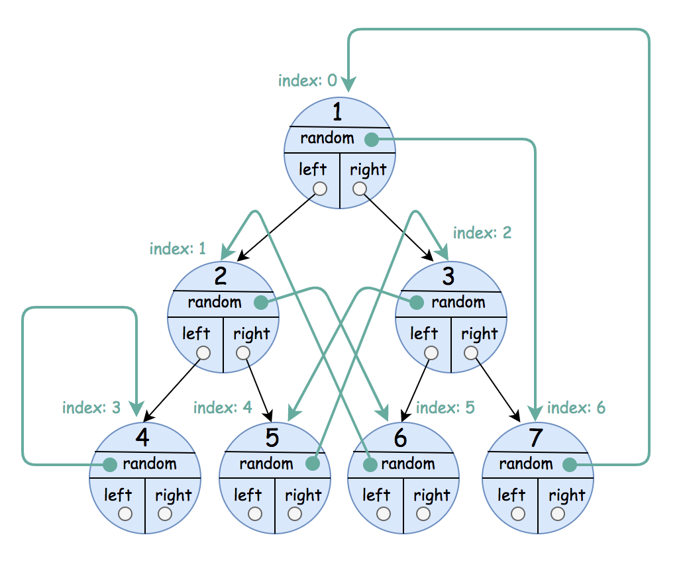

## Description

A binary tree is given such that each node contains an additional random pointer which could point to any node in the tree or null.

Return a <a href="https://en.wikipedia.org/wiki/Object_copying#Deep_copy" target="_blank">**deep copy**</a> of the tree.

The tree is represented in the same input/output way as normal binary trees where each node is represented as a pair of $[val, \text{random}_{index}]$ where:

- `val`: an integer representing `Node.val`

- $\text{random}_{index}$: the index of the node (in the input) where the random pointer points to, or `null` if it does not point to any node.

You will be given the tree in class `Node` and you should return the cloned tree in class `NodeCopy`. `NodeCopy` class is just a clone of `Node` class with the same attributes and constructors.
### Function Contract

**Input**

- `root`: the root of a binary tree whose `Node` objects contain `val`, `left`,
  `right`, and `random` fields, or `null` for an empty tree.

The app-local contract defines explicit equivalents of both source-native node
classes. Let $N$ be the number of non-null nodes.

**Return value**

Return the root of a newly allocated `NodeCopy` graph. Every copied node must
have the same value and the same labeled `left`, `right`, and `random`
relationships as its corresponding original node, with every non-null copied
pointer targeting another copied node rather than an original object. Return
`null` when `root` is `null`.

### Examples
#### Example 1

- **Input:** `root = [[1,null],null,[4,3],[7,0]]`
- **Output:** `[[1,null],null,[4,3],[7,0]]`
- **Explanation:** The original binary tree is [1,null,4,7].
The random pointer of node one is null, so it is represented as [1, null].
The random pointer of node 4 is node 7, so it is represented as [4, 3] where 3 is the index of node 7 in the array representing the tree.
The random pointer of node 7 is node 1, so it is represented as [7, 0] where 0 is the index of node 1 in the array representing the tree.
#### Example 2

- **Input:** `root = [[1,4],null,[1,0],null,[1,5],[1,5]]`
- **Output:** `[[1,4],null,[1,0],null,[1,5],[1,5]]`
- **Explanation:** The random pointer of a node can be the node itself.
#### Example 3

- **Input:** `root = [[1,6],[2,5],[3,4],[4,3],[5,2],[6,1],[7,0]]`
- **Output:** `[[1,6],[2,5],[3,4],[4,3],[5,2],[6,1],[7,0]]`
### Constraints

- The number of nodes in the `tree` is in the range $[0, 1000].$

- $1 \le \text{Node.val} \le 10^{6}$