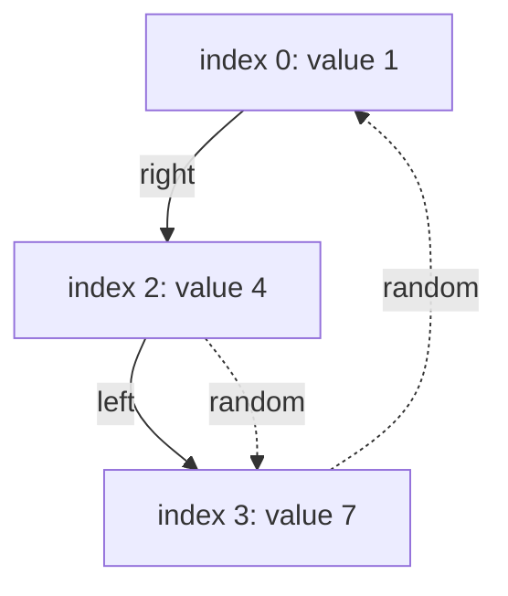
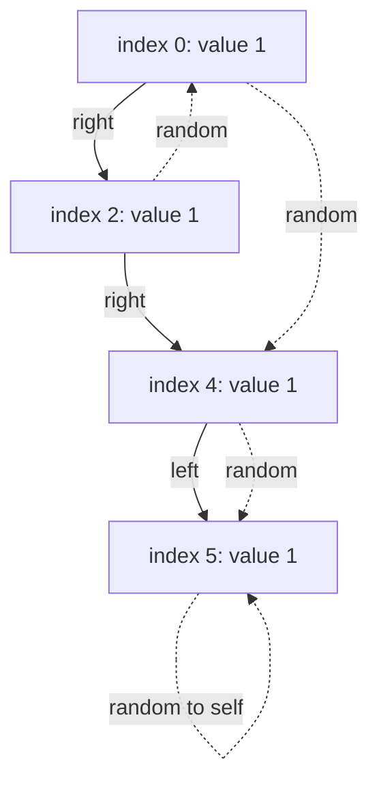
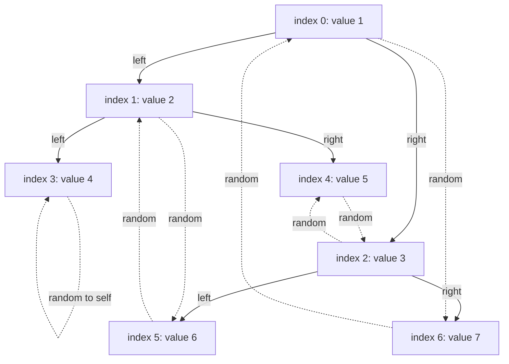

## Examples

**Example 1**

- **Input:** `root = [[1,null],null,[4,3],[7,0]]`

- **Output:** `[[1,null],null,[4,3],[7,0]]`
- **Explanation:** The original child-tree serialization is `[1,null,4,7]`.
  The root's null random pointer is encoded as `[1,null]`. The node with value
  `4` targets the node at input position `3`, giving `[4,3]`, while the node
  with value `7` targets the root at position `0`, giving `[7,0]`.

**Example 2**

- **Input:** `root = [[1,4],null,[1,0],null,[1,5],[1,5]]`

- **Output:** `[[1,4],null,[1,0],null,[1,5],[1,5]]`
- **Explanation:** A node's random pointer is allowed to target that same node,
  as the final `[1,5]` entry demonstrates.

**Example 3**

- **Input:** `root = [[1,6],[2,5],[3,4],[4,3],[5,2],[6,1],[7,0]]`

- **Output:** `[[1,6],[2,5],[3,4],[4,3],[5,2],[6,1],[7,0]]`
