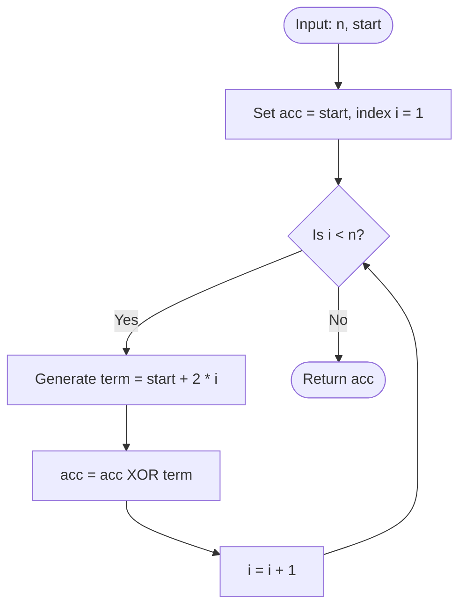

# Guided Example: XOR Operation in an Array

We trace the step-by-step execution of the sequential bitwise XOR accumulation algorithm on a representative problem instance:

- **Input:** $n = 4$, $\text{start} = 3$
- **Generated Array:** $\text{nums}[i] = \text{start} + 2i \implies [3, 5, 7, 9]$
- **Required Output:** $8$

This instance illustrates bitwise state transitions across non-zero, odd integers: bit cancellation ($6 \oplus 7 = 1$), bit activation ($1 \oplus 9 = 8$), and the preservation of low-order parity.

---

## 1. Instance & Teaching Goal

Given an integer $n$ and an integer `start`, an array `nums` of length $n$ is defined by the arithmetic formula:
$$\text{nums}[i] = \text{start} + 2i \quad \text{for } 0 \le i < n$$
Our objective is to compute the cumulative bitwise exclusive-OR (XOR) across all elements:
$$\text{result} = \bigoplus_{i=0}^{n-1} \text{nums}[i] = \text{nums}[0] \oplus \text{nums}[1] \oplus \dots \oplus \text{nums}[n-1]$$

For $n = 4$ and $\text{start} = 3$:
- $\text{nums}[0] = 3 + 2(0) = 3$
- $\text{nums}[1] = 3 + 2(1) = 5$
- $\text{nums}[2] = 3 + 2(2) = 7$
- $\text{nums}[3] = 3 + 2(3) = 9$

Computing the XOR sum:
$$3 \oplus 5 \oplus 7 \oplus 9 = 8$$

Rather than instantiating the entire array in memory and performing multiple passes, the optimal sequential approach accumulates terms in a single register on the fly.

---

## 2. Conceptual Foundation & Invariants

Bitwise XOR ($\oplus$) operates independently on each bit position. For any given bit column, the result is $1$ if and only if an odd number of operands possess a $1$ at that bit position. XOR possesses the fundamental algebraic properties of an abelian group:
1. **Identity:** $x \oplus 0 = x$
2. **Self-Inverse:** $x \oplus x = 0$
3. **Commutativity & Associativity:** $(a \oplus b) \oplus c = a \oplus (b \oplus c) = b \oplus (a \oplus c)$

```
Bit Column Breakdown:
Index i   nums[i]   Binary (b3 b2 b1 b0)
----------------------------------------
   0         3            0  0  1  1
   1         5            0  1  0  1
   2         7            0  1  1  1
   3         9            1  0  0  1
----------------------------------------
Sum of 1s per column:     1  2  2  4
Parity (Odd = 1, Even = 0):1  0  0  0  -> Binary 1000 = 8
```

We establish the core execution parameters:

| Parameter | Domain | Mathematical Purpose | Initial Value |
|---|---|---|---|
| Index Cursor $i$ | Integer $\in [0, n-1]$ | Current element index being evaluated | $0$ |
| Term Value $\text{nums}[i]$ | Integer $\ge 0$ | Evaluated value $\text{start} + 2i$ | $\text{nums}[0] = 3$ |
| Binary Representation | 4-bit word $(b_3 b_2 b_1 b_0)_2$ | Bit-level breakdown of current term | $(0011)_2$ |
| XOR Accumulator $\text{acc}$ | Integer $\ge 0$ | Cumulative XOR of elements processed so far | $\text{nums}[0] = 3$ |

> **Associative XOR Accumulation Invariant.** At the completion of step $i$, the accumulator holds the exact XOR product $\text{acc} = \bigoplus_{k=0}^i (\text{start} + 2k)$. At each bit position $j$, the $j$-th bit of $\text{acc}$ is $1$ if and only if the subset of terms evaluated so far contains an odd number of set bits at position $j$.



---

## 3. Step-by-Step Worked Execution

### Step 1: Base Term at Index $i = 0$
- Generate base value:
  $$\text{nums}[0] = 3 + 2(0) = 3 = (0011)_2$$
- Initialize accumulator:
  $$\text{acc} = 3 = (0011)_2$$

| Parameter | Value Before Step | Operation / Rule Applied | Value After Step |
|---|---|---|---|
| Cursor $i$ | Unset | Initialize at $i = 0$ | $0$ |
| Current Term | None | Evaluate $3 + 2(0) = 3$ | $3$ (Binary: `0011`) |
| Accumulator State | $0$ | Set base term $\text{acc} = 3$ | $3$ (Binary: `0011`) |

---

### Step 2: Incorporate Term at Index $i = 1$
- Advance cursor to $i = 1$.
- Generate term:
  $$\text{nums}[1] = 3 + 2(1) = 5 = (0101)_2$$
- Compute $\text{acc} \oplus \text{nums}[1]$:
  $$\begin{aligned}
  \text{acc} &= 0011_2 \quad (3) \\
  \oplus \quad \text{nums}[1] &= 0101_2 \quad (5) \\
  \hline
  \text{New acc} &= 0110_2 \quad (6)
  \end{aligned}$$
- Resulting accumulator: $6$.

| Parameter | Value Before Step | Operation / Rule Applied | Value After Step |
|---|---|---|---|
| Cursor $i$ | $0$ | Advance to $i = 1$ | $1$ |
| Current Term | $3$ | Evaluate $3 + 2(1) = 5$ | $5$ (Binary: `0101`) |
| Accumulator State | $3$ (`0011`) | $3 \oplus 5 = 6$ | $6$ (Binary: `0110`) |

---

### Step 3: Incorporate Term at Index $i = 2$
- Advance cursor to $i = 2$.
- Generate term:
  $$\text{nums}[2] = 3 + 2(2) = 7 = (0111)_2$$
- Compute $\text{acc} \oplus \text{nums}[2]$:
  $$\begin{aligned}
  \text{acc} &= 0110_2 \quad (6) \\
  \oplus \quad \text{nums}[2] &= 0111_2 \quad (7) \\
  \hline
  \text{New acc} &= 0001_2 \quad (1)
  \end{aligned}$$
- Note the cancellation: both operands share bits at positions $1$ and $2$ ($1 \oplus 1 = 0$).
- Resulting accumulator: $1$.

| Parameter | Value Before Step | Operation / Rule Applied | Value After Step |
|---|---|---|---|
| Cursor $i$ | $1$ | Advance to $i = 2$ | $2$ |
| Current Term | $5$ | Evaluate $3 + 2(2) = 7$ | $7$ (Binary: `0111`) |
| Accumulator State | $6$ (`0110`) | $6 \oplus 7 = 1$ | $1$ (Binary: `0001`) |

---

### Step 4: Incorporate Term at Index $i = 3$
- Advance cursor to $i = 3$.
- Generate term:
  $$\text{nums}[3] = 3 + 2(3) = 9 = (1001)_2$$
- Compute $\text{acc} \oplus \text{nums}[3]$:
  $$\begin{aligned}
  \text{acc} &= 0001_2 \quad (1) \\
  \oplus \quad \text{nums}[3] &= 1001_2 \quad (9) \\
  \hline
  \text{New acc} &= 1000_2 \quad (8)
  \end{aligned}$$
- Bit $0$ cancels ($1 \oplus 1 = 0$), and bit $3$ is activated ($0 \oplus 1 = 1$).
- Resulting accumulator: $8$.

| Parameter | Value Before Step | Operation / Rule Applied | Value After Step |
|---|---|---|---|
| Cursor $i$ | $2$ | Advance to final index $i = 3$ | $3$ |
| Current Term | $7$ | Evaluate $3 + 2(3) = 9$ | $9$ (Binary: `1001`) |
| Accumulator State | $1$ (`0001`) | $1 \oplus 9 = 8$ | $8$ (Binary: `1000`) |

---

## 4. Complete Execution Trace

The table below summarizes the entire reduction across all steps:

| Step $i$ | Formula $\text{start} + 2i$ | Term Decimal | Term Binary | Prior Accumulator Decimal | Prior Accumulator Binary | Bitwise Operation | Resulting Decimal $\text{acc}$ | Resulting Binary |
|---|---|---|---|---|---|---|---|---|
| $0$ | $3 + 0$ | $3$ | `0011` | $0$ | `0000` | Base assignment | $3$ | `0011` |
| $1$ | $3 + 2$ | $5$ | `0101` | $3$ | `0011` | $0011 \oplus 0101$ | $6$ | `0110` |
| $2$ | $3 + 4$ | $7$ | `0111` | $6$ | `0110` | $0110 \oplus 0111$ | $1$ | `0001` |
| $3$ | $3 + 6$ | $9$ | `1001` | $1$ | `0001` | $0001 \oplus 1001$ | $8$ | `1000` |

All $n = 4$ terms have been incorporated. The final result is:
$$\text{result} = 8$$

---

## 5. Algorithmic Correctness

### Soundness

1. By mathematical definition, the bitwise XOR operator on integers is bitwise parity addition modulo $2$:
   $$c_j = \left(\sum_{k=0}^{n-1} b_{k, j}\right) \bmod 2$$
   where $b_{k, j}$ is the $j$-th bit of term $k$.
2. The sequential accumulation computes $\text{acc}_i = \text{acc}_{i-1} \oplus \text{nums}[i]$.
3. Since addition modulo $2$ is strictly associative and commutative, any sequential grouping $((t_0 \oplus t_1) \oplus t_2) \dots$ evaluates to the exact multi-operand XOR sum $\bigoplus_{k=0}^{n-1} t_k$.

### Completeness

The loop executes for all indices $i \in [0, n-1]$. Every term specified by the sequence definition is visited exactly once. No term is skipped or duplicated.

---

## 6. Traps This Instance Exposes

### Trap 1: Materializing the Entire Array in Memory
Allocating a separate array of length $n$ takes $\mathcal{O}(n)$ memory. When $n$ is large or when executing in memory-constrained environments, maintaining a single running scalar accumulator yields the exact same answer using $\mathcal{O}(1)$ space.

### Trap 2: Term Spacing Step Error
A frequent typo is using $\text{start} + i$ instead of $\text{start} + 2i$. For $\text{start} = 3$ and $n = 4$, $\text{start} + i$ produces $[3, 4, 5, 6]$ with XOR sum $3 \oplus 4 \oplus 5 \oplus 6 = 4$, whereas the problem definition produces $[3, 5, 7, 9]$ with XOR sum $8$. The multiplier $2$ is mandatory.

### Trap 3: Bitwise XOR Operator Precedence
In many programming languages (such as C, C++, and Python), bitwise XOR `^` has lower precedence than relational operators like `==` or `!=`, and lower precedence than addition `+`. Grouping expressions without explicit parentheses (such as `a ^ b == c`) evaluates as `a ^ (b == c)`. Expressions must be cleanly parenthesized.

---

## 7. Complexity Derivation

### Time Complexity

- The algorithm computes each term $\text{nums}[i] = \text{start} + 2i$ in constant time $\mathcal{O}(1)$.
- Incorporating each term into the accumulator requires one bitwise XOR operation in $\mathcal{O}(1)$ time.
- The loop executes exactly $n$ times.
- Total time complexity:
$$\mathcal{O}(n)$$
For $n \le 1000$, this executes in less than $1\text{ ms}$.

### Auxiliary Space Complexity

- The algorithm maintains only a few scalar integer variables ($i$, $\text{acc}$, and temporary terms).
- No heap memory or dynamic arrays are allocated.
- Total auxiliary space complexity:
$$\mathcal{O}(1)$$
