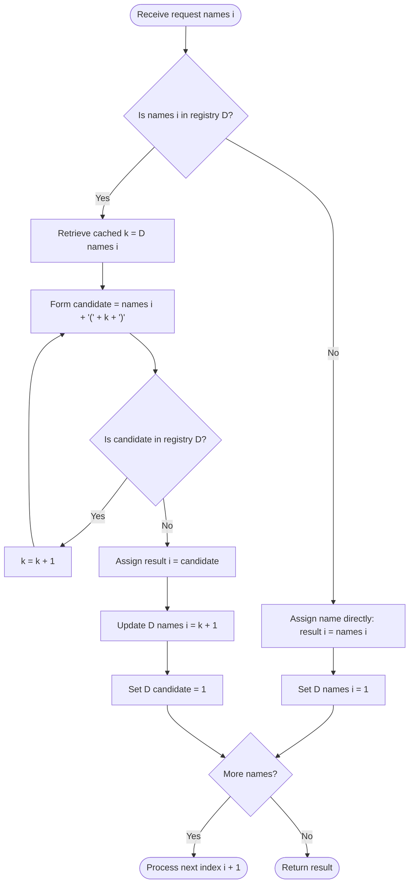

# Guided Example: Making File Names Unique

We trace the step-by-step execution of the persistent suffix-tracking collision resolution algorithm on a representative problem instance:

- **Input:** `names = ["gta", "gta(1)", "gta", "avalon"]`
- **Required output:** `["gta", "gta(1)", "gta(2)", "avalon"]`

This instance demonstrates the core conflict of filesystem name allocation: handling duplicate requests for a base name (`"gta"`), handling pre-existing explicitly named folders that already contain numeric suffixes (`"gta(1)"`), advancing the suffix pointer past occupied names without redundant rescanning, and safely admitting novel names (`"avalon"`).

---

## 1. Instance & Teaching Goal

Given an array of folder name requests `names` of size $n$, we must create $n$ folders sequentially in the filesystem subject to two rules:
1. If the requested folder name does not yet exist, use it directly.
2. If the requested folder name has already been created, append a suffix `(k)` where $k$ is the smallest positive integer ($1, 2, 3, \dots$) such that the resulting name `name(k)` is not currently in use.

For `names = ["gta", "gta(1)", "gta", "avalon"]`:
- Request 1 (`"gta"`): `"gta"` is unused $\implies$ assign `"gta"`.
- Request 2 (`"gta(1)"`): `"gta(1)"` is unused $\implies$ assign `"gta(1)"`.
- Request 3 (`"gta"`): `"gta"` is already taken! The natural next suffix is $k = 1$, yielding `"gta(1)"`. But `"gta(1)"` was already created in Request 2! We must advance to $k = 2$, yielding `"gta(2)"`, which is free $\implies$ assign `"gta(2)"`.
- Request 4 (`"avalon"`): `"avalon"` is unused $\implies$ assign `"avalon"`.

A naive implementation resets $k = 1$ and probes $k = 1, 2, 3, \dots$ from scratch upon every collision. If an input requests the same name $n$ times (`["doc", "doc", "doc", ...]`), testing $k = 1, 2, \dots, i$ costs $\sum i = \mathcal{O}(n^2)$ time.

The optimal approach stores the smallest untried suffix index $k$ for each base name in a hash map. When a collision occurs, testing resumes directly from the cached suffix index, ensuring that each generated name is probed once and avoiding repeated scanning.

---

## 2. Conceptual Foundation & Invariants

We maintain a hash map $D$ serving a dual role:
1. **Name Existence:** A key in $D$ indicates that a folder with this exact string has already been allocated in the system.
2. **Persistent Suffix Cache:** For any base name $S$, the associated value $D[S]$ stores the next integer candidate $k$ to test when resolving subsequent collisions for $S$.

```
Request Stream:
1. "gta"      -> Unused! Assign "gta". Set D["gta"] = 1.
2. "gta(1)"   -> Unused! Assign "gta(1)". Set D["gta(1)"] = 1.
3. "gta"      -> Collision on "gta"! Lookup D["gta"] = 1.
                 Probe "gta(1)": Already in D! Increment k to 2.
                 Probe "gta(2)": Free!
                 Update D["gta"] = 3 (Next time start from 3).
                 Assign "gta(2)". Set D["gta(2)"] = 1.
4. "avalon"   -> Unused! Assign "avalon". Set D["avalon"] = 1.
```

We define the primary state tracking parameters:

| State Parameter | Mathematical Domain | Operational Responsibility | Initial State |
|---|---|---|---|
| Index $i$ | Integer $\in [0, n-1]$ | Current folder request being processed | $0$ |
| Requested String | String $\in \Sigma^*$ | Name provided in input array `names[i]` | `"gta"` |
| Name Registry $D$ | Hash Map: $\text{String} \to \mathbb{Z}^+$ | Maps allocated folder names to their next candidate suffix index $k$ | Empty $\emptyset$ |
| Candidate Suffix $k$ | Positive Integer $\ge 1$ | Active numeric suffix being tested inside `(k)` | $1$ |
| Assigned Output | String | Final distinct name assigned to the $i$-th folder | Unassigned |

> **Monotonic Suffix Advancement & Name Uniqueness Invariant.** Every assigned name is registered as a key in $D$. For any base name $S$, the cached index $D[S]$ is monotonically non-decreasing over time: any integer $m < D[S]$ has already been tested and confirmed occupied. Thus, collision resolution never inspects previously occupied suffixes.



---

## 3. Step-by-Step Worked Execution

### Step 1: Request `"gta"` at Index $i = 0$
- Incoming name: `"gta"`.
- Check registry $D$: `"gta"` is not present in $D$.
- The name is completely novel and is used as is.
- Register `"gta"` in $D$: set $D[\text{"gta"}] = 1$.
- Output assigned: `"gta"`.

| Parameter | State Before Step | Operation / Rule Applied | State After Step |
|---|---|---|---|
| Input Name | None | Read `names[0] = "gta"` | `"gta"` |
| Registry Check | $D = \emptyset$ | Key not found $\implies$ Novel name | Assigned as `"gta"` |
| Registry Update | $\emptyset$ | Record existence and initial suffix: $D[\text{"gta"}] = 1$ | $D = \{\text{"gta"}: 1\}$ |
| Output Array | `[]` | Append `"gta"` | `["gta"]` |

---

### Step 2: Request `"gta(1)"` at Index $i = 1$
- Incoming name: `"gta(1)"`.
- Check registry $D$: $D$ currently contains only `{"gta": 1}`. The string `"gta(1)"` is not in $D$.
- Even though `"gta(1)"` contains parentheses, it is a valid independent name request that is not yet occupied.
- Register `"gta(1)"` in $D$: set $D[\text{"gta(1)"}] = 1$.
- Output assigned: `"gta(1)"`.

| Parameter | State Before Step | Operation / Rule Applied | State After Step |
|---|---|---|---|
| Input Name | `"gta"` | Read `names[1] = "gta(1)"` | `"gta(1)"` |
| Registry Check | `{"gta": 1}` | Key `"gta(1)"` not found $\implies$ Novel name | Assigned as `"gta(1)"` |
| Registry Update | `{"gta": 1}` | Record existence: $D[\text{"gta(1)"}] = 1$ | $D = \{\text{"gta"}: 1, \text{"gta(1)"}: 1\}$ |
| Output Array | `["gta"]` | Append `"gta(1)"` | `["gta", "gta(1)"]` |

---

### Step 3: Request `"gta"` at Index $i = 2$ (Collision Resolution)
- Incoming name: `"gta"`.
- Check registry $D$: `"gta"` is already present in $D$. Collision detected!
- Retrieve cached suffix index: $k = D[\text{"gta"}] = 1$.
- **Probe 1 ($k = 1$):**
  - Form candidate string: `f"gta({k})"` $\implies$ `"gta(1)"`.
  - Is `"gta(1)"` in $D$? Yes! (Occupied by Request 2).
  - Increment $k$ to $2$.
- **Probe 2 ($k = 2$):**
  - Form candidate string: `f"gta({k})"` $\implies$ `"gta(2)"`.
  - Is `"gta(2)"` in $D$? No! Candidate is available.
- Assign `"gta(2)"` to index $2$.
- Update registry:
  - Advance base pointer: $D[\text{"gta"}] = k + 1 = 3$.
  - Register new name: $D[\text{"gta(2)"}] = 1$.

| Parameter | State Before Step | Operation / Rule Applied | State After Step |
|---|---|---|---|
| Input Name | `"gta(1)"` | Read `names[2] = "gta"` | `"gta"` (Collision) |
| Collision Probing | $k = 1$ from $D[\text{"gta"}]$ | `"gta(1)"` taken $\implies$ advance $k \to 2$; `"gta(2)"` free | Resolved to `"gta(2)"` |
| Registry Update | $2$ keys in $D$ | Set $D[\text{"gta"}] = 3$, $D[\text{"gta(2)"}] = 1$ | $D$ has $3$ keys |
| Output Array | `["gta", "gta(1)"]` | Append `"gta(2)"` | `["gta", "gta(1)", "gta(2)"]` |

---

### Step 4: Request `"avalon"` at Index $i = 3$
- Incoming name: `"avalon"`.
- Check registry $D$: `"avalon"` is not present in $D$.
- Use as is: assign `"avalon"`.
- Register in $D$: set $D[\text{"avalon"}] = 1$.

| Parameter | State Before Step | Operation / Rule Applied | State After Step |
|---|---|---|---|
| Input Name | `"gta"` | Read `names[3] = "avalon"` | `"avalon"` |
| Registry Check | $3$ keys in $D$ | Key not found $\implies$ Novel name | Assigned as `"avalon"` |
| Registry Update | $3$ keys in $D$ | Set $D[\text{"avalon"}] = 1$ | $D$ has $4$ keys |
| Output Array | Prior 3 names | Append `"avalon"` | `["gta", "gta(1)", "gta(2)", "avalon"]` |

---

## 4. Complete Execution Trace

The table below summarizes the lifecycle of each folder name request:

| Step $i$ | Input Name | In Registry? | Cached $k$ | Probed Names Tested | Collision Status | Assigned Output Name | Updated Base Entry $D[\text{input}]$ | Newly Registered Key in $D$ |
|---|---|---|---|---|---|---|---|---|
| 0 | `"gta"` | No | - | None | None (Free) | `"gta"` | $D[\text{"gta"}] = 1$ | `"gta"` |
| 1 | `"gta(1)"` | No | - | None | None (Free) | `"gta(1)"` | $D[\text{"gta(1)"}] = 1$ | `"gta(1)"` |
| 2 | `"gta"` | **Yes** | $1$ | `"gta(1)"` (Taken), `"gta(2)"` (Free) | Collided with step 0 & 1 | `"gta(2)"` | $D[\text{"gta"}] = 3$ | `"gta(2)"` |
| 3 | `"avalon"` | No | - | None | None (Free) | `"avalon"` | $D[\text{"avalon"}] = 1$ | `"avalon"` |

Final allocated sequence:
$$[\text{"gta"}, \text{"gta(1)"}, \text{"gta(2)"}, \text{"avalon"}]$$

---

## 5. Algorithmic Correctness

### Soundness

1. **Strict Mutual Exclusivity:** Every assigned name is inserted as a key in $D$. An incoming name is assigned only if it is not currently a key in $D$. Therefore, no two folders in the output array can ever have the exact same name.
2. **Minimal Positive Suffix $k$:** When a collision on base name $S$ occurs, candidate suffixes are tested strictly in increasing integer order $k, k+1, \dots$. The first value $k$ for which $S(k) \notin D$ is selected, strictly adhering to the problem definition.

### Completeness (Amortized Monotonicity)

For any base name $S$, the cached index $D[S]$ only increases. Once a candidate name $S(k)$ is registered in $D$, future requests for $S$ start probing at $D[S] > k$. No occupied suffix is ever re-tested. Because each increment of $k$ discovers an existing key in $D$, the total number of while-loop iterations across all $n$ folder requests cannot exceed the total number of keys inserted into $D$, which is bounded by $2n$.

---

## 6. Traps This Instance Exposes

### Trap 1: Failing to Register Literal Suffix Names
In Step 2, the user explicitly requested `"gta(1)"`. If the algorithm treats `"gta(1)"` as just an arbitrary string without registering it in $D$, then when `"gta"` collides in Step 3, the prober would test $k=1$, believe `"gta(1)"` is free, and assign `"gta(1)"` a second time! Every assigned name—whether original or generated—must be registered in $D$.

### Trap 2: Re-probing from $k = 1$ on Every Duplicate
Resetting $k = 1$ on every duplicate of a name causes quadratic runtime. For an input with $n = 50{,}000$ identical requests `["a", "a", "a", ...]`, restarting from $1$ executes $1 + 2 + \dots + 50{,}000 \approx 1.25 \times 10^9$ string checks, timing out. Storing the running index $k$ in $D[\text{base}]$ makes each increment permanent, guaranteeing linear time.

### Trap 3: Not Registering the Newly Formed Name
In Step 3, after creating `"gta(2)"`, we must set $D[\text{"gta(2)"}] = 1$. If a subsequent request in the input happens to be `"gta(2)"`, it must detect that `"gta(2)"` is already occupied.

---

## 7. Complexity Derivation

### Time Complexity

Let $n$ be the number of folder requests in `names`, and $L$ be the maximum string length of a folder name ($L \le 20$).
1. **Novel Requests:** For names that do not collide, checking $D$ and inserting takes $\mathcal{O}(L)$ time.
2. **Collision Probing:**
   - In the while-loop, each step tests string presence in $D$ in $\mathcal{O}(L)$ time.
   - If a candidate $S(k)$ is already in $D$, it was placed there by some previous request.
   - Because $D[S]$ never decreases, each previously occupied string is encountered at most once across the entire algorithm.
   - Therefore, the while-loop condition `candidate in D` evaluates to true at most $n$ times across all operations.
- Total time complexity:
$$\mathcal{O}(n \cdot L)$$
For $n = 50{,}000$ and $L = 20$, the algorithm executes fewer than $10^6$ basic operations, finishing in under $30\text{ ms}$.

### Auxiliary Space Complexity

- The hash map $D$ stores at most $2n$ distinct strings (the original requests plus the generated unique names).
- Each string has length $\mathcal{O}(L + \log_{10} n)$.
- Total auxiliary space:
$$\mathcal{O}(n \cdot L)$$
This requires roughly $10\text{ MB}$ of memory for $n = 50{,}000$.
