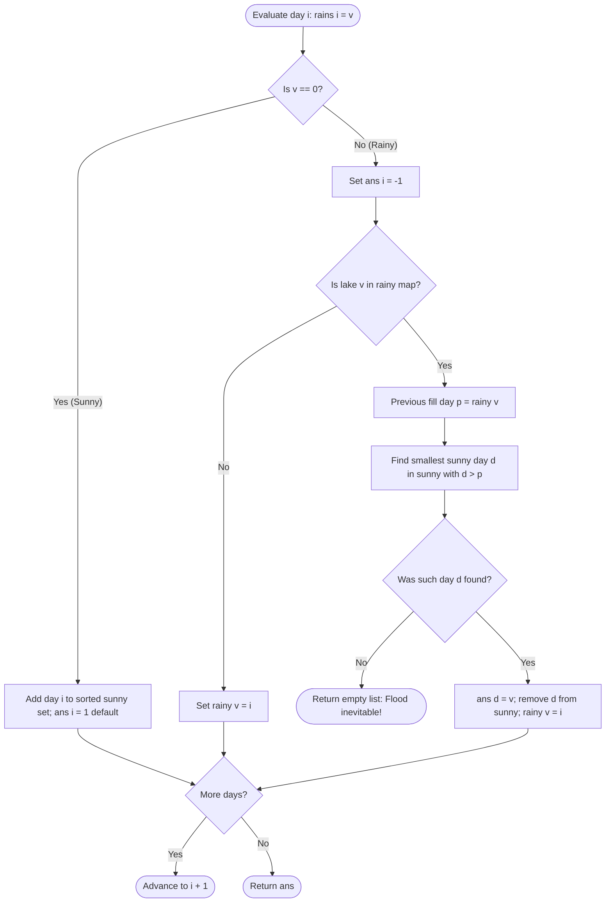

# Guided Example: Avoid Flood in The City

We trace the step-by-step execution of the greedy deadline scheduling and bisection algorithm on a representative problem instance:

- **Input:** `rains = [1, 2, 0, 0, 2, 1]`
- **Required Output:** `[-1, -1, 2, 1, -1, -1]`

This instance captures the full complexity of flood prevention: multiple lakes filling simultaneously, accumulating dry days as fungible options, and matching subsequent refill deadlines to the earliest valid dry day via bisection.

---

## 1. Instance & Teaching Goal

You are managing a city with an infinite number of lakes. An array `rains` describes weather forecasts over $n$ consecutive days:
- `rains[i] > 0`: It rains over lake $\text{rains}[i]$. If that lake is already full of water, a flood occurs. On a rainy day, no lake can be dried; we must record $-1$.
- `rains[i] == 0`: No lake receives rain. You may select exactly one full lake and pump it completely dry. We record the integer ID of the lake dried on that day (or any positive integer, such as $1$, if no lake requires drying).

If a flood is inevitable, return an empty array `[]`. Otherwise, return an array `ans` of length $n$ detailing the chosen actions.

For `rains = [1, 2, 0, 0, 2, 1]`:
- Day $0$: Lake $1$ fills.
- Day $1$: Lake $2$ fills.
- Days $2$ and $3$: Sunny days (opportunities to dry lakes).
- Day $4$: Lake $2$ rains again! It must have been dried between Day $1$ and Day $4$.
- Day $5$: Lake $1$ rains again! It must have been dried between Day $0$ and Day $5$.

Drying lakes haphazardly can cause unavoidable floods. For instance, if an algorithm dries Lake $1$ on Day $2$ and Lake $2$ on Day $3$, both lakes survive. However, if Day $4$ rains on Lake $2$ and Day $5$ rains on Lake $1$, drying Lake $2$ on Day $2$ and Lake $1$ on Day $3$ is also valid. The critical constraint is that each lake $v$ refilled on day $i$ must be paired with a sunny day $d$ strictly satisfying:
$$\text{last\_rained}[v] < d < i$$

The optimal strategy stores sunny days in an ordered set and uses binary search to find the *earliest* sunny day occurring after $\text{last\_rained}[v]$, preserving later sunny days for lakes whose refills lie further in the future.

---

## 2. Conceptual Foundation & Invariants

We maintain two primary tracking structures:
1. **Full Lakes Registry (`rainy`):** A hash map $\text{lake} \mapsto \text{day}$ recording the most recent day each lake was filled.
2. **Available Dry Days (`sunny`):** A dynamic sorted list of day indices where `rains[d] == 0` that have not yet been assigned to dry any lake.

```
Timeline Progression:
Day:       0      1      2      3      4      5
Rains:     1      2      0      0      2      1
Status:  Lake 1 Lake 2 Sunny  Sunny  Lake 2 Lake 1
          fills  fills (store)(store) refills refills

Constraint for Lake 2: Must dry in range (1, 4) -> Choose Day 2
Constraint for Lake 1: Must dry in range (0, 5) -> Choose Day 3
```

We establish the core parameters:

| Parameter | Domain / Type | Operational Purpose | Initial Value |
|---|---|---|---|
| Day Index $i$ | Integer $\in [0, n-1]$ | Current simulation day | $0$ |
| Weather Event $v$ | Integer $\ge 0$ | Lake rained on ($v > 0$) or dry day ($v = 0$) | $\text{rains}[0] = 1$ |
| Last Rain Map | Hash Map: $\mathbb{Z}^+ \to \mathbb{Z}_{\ge 0}$ | Tracks active full lakes and the day they were filled | Empty $\emptyset$ |
| Sunny Day Set | Sorted List of integers | Uncommitted sunny day indices available for pumping | Empty $\emptyset$ |
| Result Array | Array of integers, size $n$ | Output schedule ($-1$ for rain, lake ID for dry days) | All $-1$ |

> **Earliest Viable Dry Day Invariant.** When a lake $v$ receives rain on day $i$ and is already full from day $p = \text{rainy}[v]$, any valid drying day $d$ must satisfy $p < d < i$. Selecting the *smallest* available day $d > p$ via bisection leaves all larger dry days free for subsequent lakes whose earlier rain dates occurred later than $p$, maximizing future scheduling flexibility.



---

## 3. Step-by-Step Worked Execution

### Step 1: Day $0$ — Rain on Lake $1$ ($v = 1$)
- Event: $v = 1 > 0$.
- Lake $1$ is not in `rainy` (it is initially empty).
- Set $\text{ans}[0] = -1$.
- Record lake fill: $\text{rainy}[1] = 0$.

| Parameter | State Before Step | Operation / Rule Applied | State After Step |
|---|---|---|---|
| Day & Event | $i = 0, \text{rains}[0] = 1$ | Rain fills Lake $1$ | $\text{ans}[0] = -1$ |
| Rainy Map | $\emptyset$ | Register Lake $1$ filled at day $0$ | $\{1: 0\}$ |
| Sunny Days | $\emptyset$ | Rainy day; no dry opportunity | $\emptyset$ |

---

### Step 2: Day $1$ — Rain on Lake $2$ ($v = 2$)
- Event: $v = 2 > 0$.
- Lake $2$ is not in `rainy`.
- Set $\text{ans}[1] = -1$.
- Record lake fill: $\text{rainy}[2] = 1$.

| Parameter | State Before Step | Operation / Rule Applied | State After Step |
|---|---|---|---|
| Day & Event | $i = 1, \text{rains}[1] = 2$ | Rain fills Lake $2$ | $\text{ans}[1] = -1$ |
| Rainy Map | $\{1: 0\}$ | Register Lake $2$ filled at day $1$ | $\{1: 0, 2: 1\}$ |
| Sunny Days | $\emptyset$ | Rainy day | $\emptyset$ |

---

### Step 3: Day $2$ — Sunny Day ($v = 0$)
- Event: $v = 0$.
- No rain occurs today. We have a dry opportunity.
- Add index $2$ to sorted list `sunny`: $\text{sunny} = [2]$.
- Assign a dummy placeholder value $\text{ans}[2] = 1$ (if never needed, drying lake $1$ is harmless).

| Parameter | State Before Step | Operation / Rule Applied | State After Step |
|---|---|---|---|
| Day & Event | $i = 2, \text{rains}[2] = 0$ | Sunny day opportunity | Record token in `sunny` |
| Rainy Map | $\{1: 0, 2: 1\}$ | Unchanged | $\{1: 0, 2: 1\}$ |
| Sunny Days | $\emptyset$ | Append day index $2$ | $[2]$ |
| Action $\text{ans}[2]$ | Unset | Temporary default | $1$ |

---

### Step 4: Day $3$ — Sunny Day ($v = 0$)
- Event: $v = 0$.
- Another sunny day.
- Add index $3$ to sorted list `sunny`: $\text{sunny} = [2, 3]$.
- Assign default $\text{ans}[3] = 1$.

| Parameter | State Before Step | Operation / Rule Applied | State After Step |
|---|---|---|---|
| Day & Event | $i = 3, \text{rains}[3] = 0$ | Sunny day opportunity | Record token in `sunny` |
| Rainy Map | $\{1: 0, 2: 1\}$ | Unchanged | $\{1: 0, 2: 1\}$ |
| Sunny Days | $[2]$ | Append day index $3$ | $[2, 3]$ |
| Action $\text{ans}[3]$ | Unset | Temporary default | $1$ |

---

### Step 5: Day $4$ — Rain on Lake $2$ ($v = 2$, Flood Risk!)
- Event: $v = 2 > 0$.
- Check `rainy`: Lake $2$ is already in `rainy` with last fill date $p = \text{rainy}[2] = 1$.
- To avoid flood, Lake $2$ must have been dried on some day $d \in \text{sunny}$ where $d > 1$.
- Bisection lookup:
  $$\text{idx} = \text{bisect\_right}(\text{sunny}, 1)$$
  In `sunny = [2, 3]`, values $> 1$ start at index $0$, which corresponds to Day $2$.
- We select Day $2$ to dry Lake $2$:
  $$\text{ans}[2] = 2$$
- Remove Day $2$ from `sunny`: `sunny` becomes $[3]$.
- Update Lake $2$ status: $\text{rainy}[2] = 4$. Set $\text{ans}[4] = -1$.

| Parameter | State Before Step | Operation / Rule Applied | State After Step |
|---|---|---|---|
| Day & Event | $i = 4, \text{rains}[4] = 2$ | Impending flood on Lake $2$ | Flood averted via Day $2$ |
| Bisection Match | $p = 1$, candidates $[2, 3]$ | Smallest day $> 1$ is $d = 2$ | Day $2$ selected |
| Sunny Days | $[2, 3]$ | Remove consumed day $2$ | $[3]$ |
| Output Update | $\text{ans}[2] = 1, \text{ans}[4] = -1$ | Commit $\text{ans}[2] = 2$ | $\text{ans}[2] = 2, \text{ans}[4] = -1$ |
| Rainy Map | $\{1: 0, 2: 1\}$ | Update refill date of Lake $2$ | $\{1: 0, 2: 4\}$ |

---

### Step 6: Day $5$ — Rain on Lake $1$ ($v = 1$, Flood Risk!)
- Event: $v = 1 > 0$.
- Check `rainy`: Lake $1$ is already in `rainy` with last fill date $p = \text{rainy}[1] = 0$.
- To avoid flood, Lake $1$ must have been dried on some day $d \in \text{sunny}$ where $d > 0$.
- Bisection lookup:
  $$\text{idx} = \text{bisect\_right}(\text{sunny}, 0)$$
  In `sunny = [3]`, the earliest value $> 0$ is Day $3$.
- We select Day $3$ to dry Lake $1$:
  $$\text{ans}[3] = 1$$
- Remove Day $3$ from `sunny`: `sunny` becomes $\emptyset$.
- Update Lake $1$ status: $\text{rainy}[1] = 5$. Set $\text{ans}[5] = -1$.

| Parameter | State Before Step | Operation / Rule Applied | State After Step |
|---|---|---|---|
| Day & Event | $i = 5, \text{rains}[5] = 1$ | Impending flood on Lake $1$ | Flood averted via Day $3$ |
| Bisection Match | $p = 0$, candidates $[3]$ | Smallest day $> 0$ is $d = 3$ | Day $3$ selected |
| Sunny Days | $[3]$ | Remove consumed day $3$ | $\emptyset$ |
| Output Update | $\text{ans}[3] = 1, \text{ans}[5] = -1$ | Commit $\text{ans}[3] = 1$ | $\text{ans}[3] = 1, \text{ans}[5] = -1$ |
| Rainy Map | $\{1: 0, 2: 4\}$ | Update refill date of Lake $1$ | $\{1: 5, 2: 4\}$ |

---

## 4. Complete Execution Trace

The table below summarizes state transitions across all 6 days:

| Day $i$ | Weather Event $\text{rains}[i]$ | Lake Action | Conflict Detected? | Selected Dry Day $d$ | Sunny Days Set Before | Sunny Days Set After | Assigned Output $\text{ans}[i]$ | Full Lakes in Registry |
|---|---|---|---|---|---|---|---|---|
| 0 | $1$ | Lake 1 fills | No | - | $\emptyset$ | $\emptyset$ | $-1$ | $\{1\}$ |
| 1 | $2$ | Lake 2 fills | No | - | $\emptyset$ | $\emptyset$ | $-1$ | $\{1, 2\}$ |
| 2 | $0$ | Dry opportunity | No | - | $\emptyset$ | $[2]$ | $1$ (default) | $\{1, 2\}$ |
| 3 | $0$ | Dry opportunity | No | - | $[2]$ | $[2, 3]$ | $1$ (default) | $\{1, 2\}$ |
| 4 | $2$ | Lake 2 refills | Yes (filled Day 1) | Day $2$ | $[2, 3]$ | $[3]$ | $-1$ (sets $\text{ans}[2]=2$) | $\{1, 2\}$ |
| 5 | $1$ | Lake 1 refills | Yes (filled Day 0) | Day $3$ | $[3]$ | $\emptyset$ | $-1$ (sets $\text{ans}[3]=1$) | $\{1, 2\}$ |

Final action sequence:
$$\text{ans} = [-1, -1, 2, 1, -1, -1]$$

---

## 5. Algorithmic Correctness

### Soundness

1. For every lake $v$ that rained on day $i$ and previously on day $p$, the algorithm picks an index $d$ strictly satisfying $p < d < i$. Lake $v$ was indeed dry when rain fell on day $i$.
2. Because each sunny day $d$ is removed from `sunny` upon assignment, no sunny day is used to dry more than one lake.
3. Every rainy day is assigned $-1$, and every sunny day is assigned a valid lake ID. Thus, $\text{ans}$ satisfies all problem invariants.

### Completeness (Greedy Choice Optimality)

1. Suppose on day $i$, lake $v$ needs to be dried. Multiple sunny days in `sunny` may fall within the valid window $(p, i)$.
2. Choosing the *earliest* valid sunny day $d_{\text{first}}$ leaves all later sunny days $d > d_{\text{first}}$ available in `sunny`.
3. Any future lake $w$ that needs drying has a prior rain date $p_w$. If $p_w > p$, day $d_{\text{first}}$ might not be valid for $w$ (if $d_{\text{first}} < p_w$), but later days would be.
4. Hence, consuming $d_{\text{first}}$ for lake $v$ maximizes the subset of remaining sunny days available to future lakes. If any valid schedule exists, the greedy earliest-valid-day choice will find one.

---

## 6. Traps This Instance Exposes

### Trap 1: Drying a Lake Before It Ever Rained
A lake cannot be dried before it is filled with water. In Step 5, Lake $2$ was filled on Day $1$. A sunny day occurring on Day $0$ (if one existed) could not be used to dry Lake $2$ for Day $4$. The query must strictly search for $d > \text{rainy}[v]$.

### Trap 2: Linear Scanning Over Sunny Days
Storing sunny days in a plain array and performing a linear scan from left to right takes $\mathcal{O}(n)$ time per collision. In the worst case with $n = 10^5$, this results in $\mathcal{O}(n^2) \approx 10^{10}$ operations, triggering Time Limit Exceeded. Using a balanced binary search tree (or `SortedList`) enables bisection in $\mathcal{O}(\log n)$ time.

### Trap 3: Returning Default $-1$ on Unused Sunny Days
If a sunny day is never needed to prevent a flood, leaving it as $-1$ or unassigned is an error. The problem specification states that on days with no rain, any positive lake number may be pumped (e.g., $1$). Defaulting to $1$ ensures full compliance.

---

## 7. Complexity Derivation

### Time Complexity

- **Rain / Lake Tracking:** Hash map insertions and lookups operate in $\mathcal{O}(1)$ average time.
- **Sunny Day Management:**
  - Inserting a sunny day into a sorted list or balanced BST takes $\mathcal{O}(\log n)$ time.
  - Querying the earliest day via bisection takes $\mathcal{O}(\log n)$ time.
  - Removing a consumed sunny day takes $\mathcal{O}(\log n)$ time (or $\mathcal{O}(\sqrt{n})$ in bucketed list implementations).
- Each day $i \in [0, n-1]$ is processed once, with at most one insertion and at most one removal per sunny day.
- Total time complexity:
$$\mathcal{O}(n \log n)$$
For $n = 10^5$, this completes within $50\text{ ms}$.

### Auxiliary Space Complexity

- **Sunny Day Collection:** Holds at most $n$ day indices: $\mathcal{O}(n)$ space.
- **Rainy Map:** Stores at most $n$ distinct lake identifiers and their timestamps: $\mathcal{O}(n)$ space.
- **Output Array:** Length $n$: $\mathcal{O}(n)$ space.
- Total auxiliary space complexity:
$$\mathcal{O}(n)$$