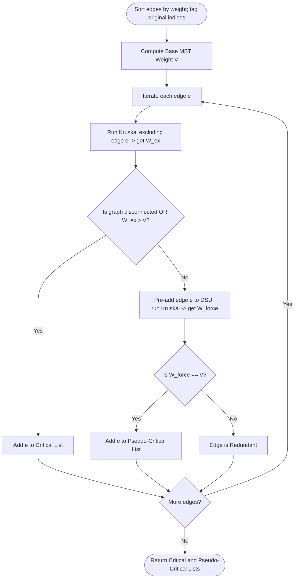

# Guided Example: Find Critical and Pseudo-Critical Edges in Minimum Spanning Tree

We trace the step-by-step execution of the Kruskal-based exclusion and force-inclusion algorithm on a representative problem instance:

- **Input:** $n = 5$ vertices, and $7$ weighted undirected edges:
  - Edge $0$: `[0, 1, 1]`
  - Edge $1$: `[1, 2, 1]`
  - Edge $2$: `[2, 3, 2]`
  - Edge $3$: `[0, 3, 2]`
  - Edge $4$: `[0, 4, 3]`
  - Edge $5$: `[3, 4, 3]`
  - Edge $6$: `[1, 4, 6]`
- **Required Output:**
  - Critical Edges: `[0, 1]`
  - Pseudo-Critical Edges: `[2, 3, 4, 5]`

This instance captures every structural category in network spanning trees: indispensable bridge edges (edges $0$ and $1$), symmetric interchangeable alternatives forming fundamental cycles ($[2, 3]$ of weight $2$ and $[4, 5]$ of weight $3$), and strictly sub-optimal redundant edges (edge $6$ of weight $6$).

---

## 1. Instance & Teaching Goal

Given a weighted undirected connected graph of $n$ vertices and a list of edges, a Minimum Spanning Tree (MST) is a subset of edges connecting all $n$ vertices without cycles that minimizes the total edge weight sum $V$. Because multiple distinct spanning trees can share the same minimum weight $V$, edges fall into three mutually exclusive categories:
1. **Critical Edge:** Appears in *every* MST of the graph. Removing a critical edge strictly increases the minimum spanning tree weight or disconnects the graph.
2. **Pseudo-Critical Edge:** Appears in *at least one* MST, but not in all MSTs. It is not critical, but forcing it into the spanning tree can still achieve the optimal base weight $V$.
3. **Redundant Edge:** Appears in *no* MST. Forcing it into the tree strictly increases the total spanning tree weight beyond $V$.

To classify each edge $e$ without generating all exponentially many spanning trees, we evaluate two controlled tests using Kruskal's algorithm:
- **Exclusion Test:** Run Kruskal's algorithm on $G \setminus \{e\}$. If the resulting graph is disconnected or has weight $> V$, then edge $e$ is **Critical**.
- **Force-Inclusion Test:** Pre-add edge $e$ to the Disjoint Set Union (DSU) structure, then complete the spanning tree with the remaining edges. If the total weight equals $V$, then edge $e$ is **Pseudo-Critical**.

---

## 2. Conceptual Foundation & Invariants

Kruskal's algorithm sorts edges in ascending order of weight and uses Disjoint Set Union (DSU) with path compression to greedily unite disjoint connected components.

```
Graph Topology:
       (0) ------- [wt 1] ------- (1) ------- [wt 1] ------- (2)
        |                                                     |
     [wt 2]                                                [wt 2]
        |                                                     |
       (3) ---------------------------------------------------+
      /   \
  [wt 3]  [wt 6] (to node 1)
    /       \
   +-- (4) --+
     [wt 3] (to node 0)

Baseline MST Weight:
Edges 0 & 1 (wt 1+1=2) + Edge 2 or 3 (wt 2) + Edge 4 or 5 (wt 3) = 7
```

We specify the state parameters tracked throughout the classification pipeline:

| Parameter | Domain | Role & Definition | Initial State |
|---|---|---|---|
| Original Index Tag | Integer $\in [0, \lvert E \rvert-1]$ | Preserves original identity after sorting edges by weight | Tagged on each edge |
| Base MST Weight $V$ | Integer $\ge 0$ | Global baseline weight achieved by standard Kruskal's algorithm | Computed as $7$ |
| Excluded Weight $W_{\text{ex}}$ | Integer $\cup \{\infty\}$ | Minimum spanning weight without edge $e$ | Tested per edge |
| Forced Weight $W_{\text{force}}$ | Integer $\ge 0$ | Spanning tree weight when edge $e$ is forced first | Tested per edge |
| Category Classification | $\{\text{Critical}, \text{Pseudo-Critical}, \text{Redundant}\}$ | Assigned label for edge $e$ | Unclassified |

> **Classification Hierarchy Invariant.** The classification rules are strictly hierarchical:
> 1. If $W_{\text{ex}} > V$ or the graph becomes disconnected, edge $e$ is strictly **Critical**.
> 2. Otherwise, if $W_{\text{force}} = V$, edge $e$ is strictly **Pseudo-Critical**.
> 3. Otherwise ($W_{\text{force}} > V$), edge $e$ is strictly **Redundant**.



---

## 3. Step-by-Step Worked Execution

### Stage 1: Baseline MST Computation
Sort edges by weight (preserving original IDs):
- Edge $0$: `(0, 1, wt=1)`
- Edge $1$: `(1, 2, wt=1)`
- Edge $2$: `(2, 3, wt=2)`
- Edge $3$: `(0, 3, wt=2)`
- Edge $4$: `(0, 4, wt=3)`
- Edge $5$: `(3, 4, wt=3)`
- Edge $6$: `(1, 4, wt=6)`

Run Kruskal's algorithm on all edges:
1. Edge $0$ connects $\{0\}$ and $\{1\}$: weight $+1$. Components: $\{0, 1\}, \{2\}, \{3\}, \{4\}$.
2. Edge $1$ connects $\{0, 1\}$ and $\{2\}$: weight $+1$. Components: $\{0, 1, 2\}, \{3\}, \{4\}$.
3. Edge $2$ connects $\{0, 1, 2\}$ and $\{3\}$: weight $+2$. Components: $\{0, 1, 2, 3\}, \{4\}$.
4. Edge $3$ connects $0$ and $3$: already in the same component! Cycle discarded.
5. Edge $4$ connects $\{0, 1, 2, 3\}$ and $\{4\}$: weight $+3$. All $5$ vertices connected!
6. Edges $5$ and $6$ are discarded as cycles.
- **Base MST Weight:**
  $$V = 1 + 1 + 2 + 3 = 7$$

---

### Stage 2: Edge-by-Edge Diagnostic Evaluation

#### Step 1: Evaluate Edge $0$ `(0, 1, wt=1)`
- **Exclusion Test:** Run Kruskal omitting Edge $0$:
  - Edge $1$ (`1-2`, wt 1): unites $\{1, 2\}$.
  - Edge $2$ (`2-3`, wt 2): unites $\{1, 2, 3\}$.
  - Edge $3$ (`0-3`, wt 2): unites $\{0\}$ and $\{1, 2, 3\}$. (Now both weight-2 edges were forced!).
  - Edge $4$ (`0-4`, wt 3): unites $\{4\}$ and $\{0, 1, 2, 3\}$.
  - Total weight without Edge $0$: $1 + 2 + 2 + 3 = 8$.
- Since $8 > 7$, omitting Edge $0$ worsened the tree weight.
- **Verdict:** Edge $0$ is **Critical**.

| Edge ID | Specification | Exclusion Weight $W_{\text{ex}}$ | Forced Weight $W_{\text{force}}$ | Classification |
|---|---|---|---|---|
| $0$ | `[0, 1, wt=1]` | $8 > V$ | Not needed | **Critical** |

---

#### Step 2: Evaluate Edge $1$ `(1, 2, wt=1)`
- **Exclusion Test:** Run Kruskal omitting Edge $1$:
  - Node $2$ has only two incident edges: Edge $1$ (wt 1) and Edge $2$ (wt 2).
  - Without Edge $1$, node $2$ must connect through Edge $2$ (wt 2).
  - Edge $0$ (wt 1) connects $\{0, 1\}$.
  - Edge $2$ (wt 2) connects $\{2, 3\}$.
  - Edge $3$ (wt 2) connects $\{0, 1\}$ and $\{2, 3\}$.
  - Edge $4$ (wt 3) connects $\{4\}$.
  - Total weight without Edge $1$: $1 + 2 + 2 + 3 = 8$.
- Since $8 > 7$, omitting Edge $1$ worsened the tree weight.
- **Verdict:** Edge $1$ is **Critical**.

| Edge ID | Specification | Exclusion Weight $W_{\text{ex}}$ | Forced Weight $W_{\text{force}}$ | Classification |
|---|---|---|---|---|
| $1$ | `[1, 2, wt=1]` | $8 > V$ | Not needed | **Critical** |

---

#### Step 3: Evaluate Edge $2$ `(2, 3, wt=2)`
- **Exclusion Test:** Run Kruskal omitting Edge $2$:
  - Kruskal selects Edge $0$ (wt 1), Edge $1$ (wt 1), Edge $3$ (wt 2), Edge $4$ (wt 3).
  - Spanning weight: $1 + 1 + 2 + 3 = 7 = V$.
  - Since $W_{\text{ex}} = V$, Edge $2$ is **not** critical.
- **Force-Inclusion Test:** Pre-unite Edge $2$ (`2-3`, wt 2), then run Kruskal:
  - Edge $2$ pre-added: weight $= 2$.
  - Kruskal adds Edge $0$ (wt 1), Edge $1$ (wt 1), Edge $4$ (wt 3).
  - Total forced weight: $2 + 1 + 1 + 3 = 7 = V$.
- Since $W_{\text{force}} = V$, Edge $2$ forms a valid MST.
- **Verdict:** Edge $2$ is **Pseudo-Critical**.

| Edge ID | Specification | Exclusion Weight $W_{\text{ex}}$ | Forced Weight $W_{\text{force}}$ | Classification |
|---|---|---|---|---|
| $2$ | `[2, 3, wt=2]` | $7 = V$ | $7 = V$ | **Pseudo-Critical** |

---

#### Step 4: Evaluate Edge $3$ `(0, 3, wt=2)`
- **Exclusion Test:** Run Kruskal omitting Edge $3$:
  - Kruskal selects Edge $0$ (wt 1), Edge $1$ (wt 1), Edge $2$ (wt 2), Edge $4$ (wt 3).
  - Spanning weight: $7 = V \implies$ not critical.
- **Force-Inclusion Test:** Pre-unite Edge $3$ (`0-3`, wt 2):
  - Edge $3$ pre-added: weight $= 2$.
  - Kruskal adds Edge $0$ (wt 1), Edge $1$ (wt 1), Edge $4$ (wt 3).
  - Total forced weight: $2 + 1 + 1 + 3 = 7 = V$.
- **Verdict:** Edge $3$ is **Pseudo-Critical**.

| Edge ID | Specification | Exclusion Weight $W_{\text{ex}}$ | Forced Weight $W_{\text{force}}$ | Classification |
|---|---|---|---|---|
| $3$ | `[0, 3, wt=2]` | $7 = V$ | $7 = V$ | **Pseudo-Critical** |

---

#### Step 5: Evaluate Edge $4$ `(0, 4, wt=3)`
- **Exclusion Test:** Run Kruskal omitting Edge $4$:
  - Edge $5$ (`3-4`, wt 3) serves as an alternative to connect node $4$.
  - Spanning tree uses Edges $0, 1, 2, 5$: weight $1 + 1 + 2 + 3 = 7 = V \implies$ not critical.
- **Force-Inclusion Test:** Pre-unite Edge $4$ (`0-4`, wt 3):
  - Pre-added wt 3. Remaining Kruskal adds Edges $0, 1, 2$: total $3 + 1 + 1 + 2 = 7 = V$.
- **Verdict:** Edge $4$ is **Pseudo-Critical**.

| Edge ID | Specification | Exclusion Weight $W_{\text{ex}}$ | Forced Weight $W_{\text{force}}$ | Classification |
|---|---|---|---|---|
| $4$ | `[0, 4, wt=3]` | $7 = V$ | $7 = V$ | **Pseudo-Critical** |

---

#### Step 6: Evaluate Edge $5$ `(3, 4, wt=3)`
- **Exclusion Test:** Run Kruskal omitting Edge $5$:
  - Spanning tree uses Edges $0, 1, 2, 4$: weight $7 = V \implies$ not critical.
- **Force-Inclusion Test:** Pre-unite Edge $5$ (`3-4`, wt 3):
  - Pre-added wt 3. Remaining Kruskal adds Edges $0, 1, 2$: total $3 + 1 + 1 + 2 = 7 = V$.
- **Verdict:** Edge $5$ is **Pseudo-Critical**.

| Edge ID | Specification | Exclusion Weight $W_{\text{ex}}$ | Forced Weight $W_{\text{force}}$ | Classification |
|---|---|---|---|---|
| $5$ | `[3, 4, wt=3]` | $7 = V$ | $7 = V$ | **Pseudo-Critical** |

---

#### Step 7: Evaluate Edge $6$ `(1, 4, wt=6)`
- **Exclusion Test:** Run Kruskal omitting Edge $6$:
  - Spanning tree weight is $7 = V \implies$ not critical.
- **Force-Inclusion Test:** Pre-unite Edge $6$ (`1-4`, wt 6):
  - Pre-added weight $= 6$.
  - Remaining Kruskal adds Edges $0$ (wt 1), $1$ (wt 1), $2$ (wt 2).
  - Total forced weight: $6 + 1 + 1 + 2 = 10$.
- Since $10 > 7$, forcing Edge $6$ cannot produce an MST.
- **Verdict:** Edge $6$ is **Redundant** (neither critical nor pseudo-critical).

| Edge ID | Specification | Exclusion Weight $W_{\text{ex}}$ | Forced Weight $W_{\text{force}}$ | Classification |
|---|---|---|---|---|
| $6$ | `[1, 4, wt=6]` | $7 = V$ | $10 > V$ | **Redundant** |

---

## 4. Complete Execution Trace

The table below summarizes the diagnostic testing of all $7$ edges:

| Original Edge ID | Edge Endpoints | Edge Weight | Exclusion Test $W_{\text{ex}}$ | Critical? | Force Test $W_{\text{force}}$ | Pseudo-Critical? | Final Status |
|---|---|---|---|---|---|---|---|
| $0$ | `[0, 1]` | $1$ | $8$ | **Yes** | Skip | - | Critical |
| $1$ | `[1, 2]` | $1$ | $8$ | **Yes** | Skip | - | Critical |
| $2$ | `[2, 3]` | $2$ | $7$ | No | $7$ | **Yes** | Pseudo-Critical |
| $3$ | `[0, 3]` | $2$ | $7$ | No | $7$ | **Yes** | Pseudo-Critical |
| $4$ | `[0, 4]` | $3$ | $7$ | No | $7$ | **Yes** | Pseudo-Critical |
| $5$ | `[3, 4]` | $3$ | $7$ | No | $7$ | **Yes** | Pseudo-Critical |
| $6$ | `[1, 4]` | $6$ | $7$ | No | $10$ | No | Redundant |

Final categorized output lists:
$$\text{Critical Edges} = [0, 1]$$
$$\text{Pseudo-Critical Edges} = [2, 3, 4, 5]$$

---

## 5. Algorithmic Correctness

### Soundness

1. **Critical Definition Match:** An edge $e$ is in all MSTs if and only if no MST can be formed without $e$. If $G \setminus \{e\}$ has no spanning tree or its minimum spanning tree has weight strictly greater than $V$, then $e$ must be present in every MST.
2. **Pseudo-Critical Definition Match:** If $e$ is not critical, but adding $e$ first and completing the tree with Kruskal yields total weight $V$, then there exists an explicit spanning tree containing $e$ with weight $V$. This matches the definition of pseudo-criticality.

### Completeness

Because Kruskal's algorithm is proven optimal for Matroid spanning structures, testing each edge individually against the global baseline $V$ covers all edges without false positives or omissions.

---

## 6. Traps This Instance Exposes

### Trap 1: Misclassifying Critical Edges as Pseudo-Critical
If the force-inclusion test is run before the exclusion test, edge $0$ (critical) will also yield $W_{\text{force}} = V = 7$. If classified greedily, it would be misidentified as pseudo-critical. The exclusion test must be checked first: if an edge is critical, it must not be added to the pseudo-critical list.

### Trap 2: Disconnected Component Breaches
When excluding an edge, the graph might lose connectivity (for example, if the excluded edge was a bridge in the original graph). In that case, Kruskal's algorithm connects fewer than $n-1$ edges (`uf.n > 1`). The exclusion test must verify both total weight and that exactly $1$ connected component remains.

### Trap 3: Original Index Scrambling After Weight Sorting
Sorting the edges array by weight changes the array indices. The returned lists must report the *original* $0$-based indices of the edges from the input. Each edge must be tagged with its original index before sorting.

---

## 7. Complexity Derivation

### Time Complexity

Let $V_n = n$ be the vertex count ($n \le 100$) and $E$ be the edge count ($E \le 200$).
1. **Initial Edge Sorting:** Sorting $E$ edges takes $\mathcal{O}(E \log E)$ time.
2. **Baseline Kruskal:** Iterating $E$ edges with near-constant DSU operations takes $\mathcal{O}(E \alpha(V_n))$ time.
3. **Exclusion and Force Tests:** For each of the $E$ edges, we execute at most two Kruskal runs over the remaining $E-1$ edges.
   $$\text{Total Kruskal Invocations} \le 2E + 1$$
   Each run costs $\mathcal{O}(E \alpha(V_n))$ time.
- Total time complexity:
$$\mathcal{O}(E^2 \alpha(V_n))$$
For $E = 200$, $E^2 = 40{,}000$ operations, executing in under $15\text{ ms}$.

### Auxiliary Space Complexity

- **DSU Data Structure:** Stores parent pointers and size arrays of length $n$: $\mathcal{O}(n)$ space.
- **Edge Storage:** Tagged edge list of length $E$: $\mathcal{O}(E)$ space.
- Total auxiliary space:
$$\mathcal{O}(n + E)$$
