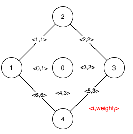
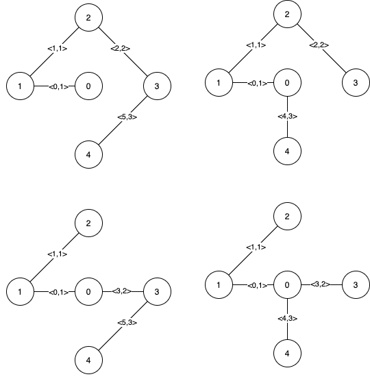
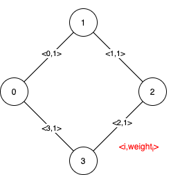

### 1. Description

Given a weighted undirected connected graph with `n` vertices numbered from `0` to $n - 1$, and an array `edges` where $\text{edges}[i] = [a_{i}, b_{i}, \text{weight}_{i}]$ represents a bidirectional and weighted edge between nodes $a_{i}$ and $b_{i}$. A minimum spanning tree (MST) is a subset of the graph's edges that connects all vertices without cycles and with the minimum possible total edge weight.

Find *all the critical and pseudo-critical edges in the given graph's minimum spanning tree (MST)*. An MST edge whose deletion from the graph would cause the MST weight to increase is called a *critical edge*. On the other hand, a pseudo-critical edge is that which can appear in some MSTs but not all.

Note that you can return the indices of the edges in any order.

### 2. Function Contract

- `n`: Input parameter.
- Returns expected result.

### 3. Examples

#### Example 1

- **Input:** $n = 5, edges = [[0,1,1],[1,2,1],[2,3,2],[0,3,2],[0,4,3],[3,4,3],[1,4,6]]$
- **Output:** `[[0,1],[2,3,4,5]]`
- **Explanation:** The figure above describes the graph.
The following figure shows all the possible MSTs:

Notice that the two edges 0 and 1 appear in all MSTs, therefore they are critical edges, so we return them in the first list of the output.
The edges 2, 3, 4, and 5 are only part of some MSTs, therefore they are considered pseudo-critical edges. We add them to the second list of the output.
#### Example 2

- **Input:** $n = 4, edges = [[0,1,1],[1,2,1],[2,3,1],[0,3,1]]$
- **Output:** `[[],[0,1,2,3]]`
- **Explanation:** We can observe that since all 4 edges have equal weight, choosing any 3 edges from the given 4 will yield an MST. Therefore all 4 edges are pseudo-critical.

### 4. Constraints

- $2 \le n \le 100$

- $1 \le \text{edges.length} \le min(200, n * (n - 1) / 2)$

- $\text{edges}[i].length = 3$

- $0 \le a_{i} < b_{i} < n$

- $1 \le \text{weight}_{i} \le 1000$

- All pairs $(a_{i}, b_{i})$ are **distinct**.