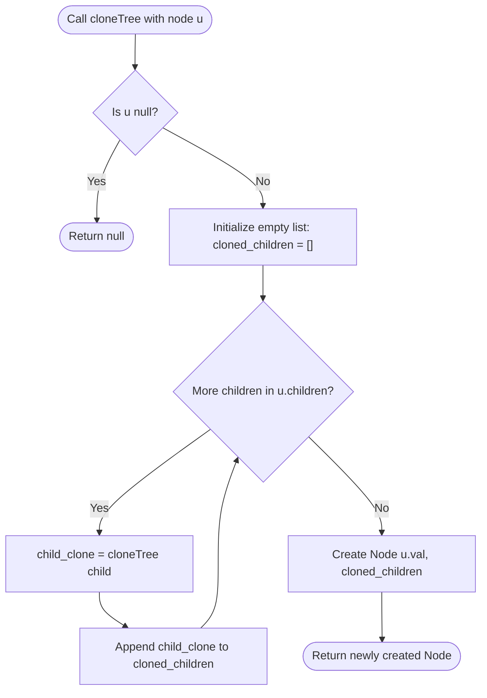

# Guided Example: Clone N-ary Tree

We trace the step-by-step execution of the post-order depth-first structural cloning algorithm on a representative problem instance:

- **Original Tree Hierarchy:**
  - Root Node $1$ has three children: $[3, 2, 4]$.
  - Child Node $3$ has two children: $[5, 6]$.
  - Child Nodes $2$ and $4$ are leaf nodes with empty children lists.
  - Child Nodes $5$ and $6$ are leaf nodes with empty children lists.
- **Required Output:** A completely detached deep copy with identical tree topology and value assignments:
  - Root $1'$ with children $[3', 2', 4']$.
  - Subtree root $3'$ with children $[5', 6']$.
  - Subtrees $2', 4', 5', 6'$ as independent leaf copies.

This instance illustrates arbitrary branching degrees (degree $3$ at the root, degree $2$ at node $3$, and degree $0$ at leaves), sequential sibling order preservation, and the bottom-up assembly of dynamically sized child pointer lists.

---

## 1. Instance & Teaching Goal

An N-ary tree is a rooted hierarchical graph where each node contains an integer value `val` and a list of references `children` pointing to an arbitrary number of ordered child nodes.

Our objective is to construct a deep copy of the tree such that:
1. Every node in the original tree maps to a distinct newly allocated `Node` instance.
2. The tree hierarchy and relative order of sibling children are preserved.
3. No reference in the cloned structure points to any object in the original tree, and modifying the clone has zero side effects on the original tree.

A shallow copy that copies the outer node but reuses the `children` list references fails completely: any modification to a child alters both trees.

The optimal approach applies post-order depth-first search (DFS). By recursively cloning all child subtrees before constructing the parent node, the parent can be instantiated with an entirely new list populated with fresh cloned child references.

---

## 2. Conceptual Foundation & Invariants

Because an N-ary tree is strictly acyclic, no visited-map or cycle detection is required. Each node $u$ is processed by:
1. Recursively invoking the cloner on every element in $u.\text{children}$.
2. Collecting the resulting child references into a newly allocated list `cloned_children`.
3. Instantiating a new node $u' = \text{Node}(u.\text{val}, \text{cloned\_children})$ and returning it.

```
Tree Topology:
               1 (Root)
           /   |   \
          3    2    4
        /   \
       5     6

Post-Order Assembly Flow:
1. Visit 5 -> Leaf -> return 5'
2. Visit 6 -> Leaf -> return 6'
3. Assemble 3' with children [5', 6'] -> return 3'
4. Visit 2 -> Leaf -> return 2'
5. Visit 4 -> Leaf -> return 4'
6. Assemble 1' with children [3', 2', 4'] -> return 1'
```

We specify the state parameters tracked throughout recursion:

| Parameter | Domain / Type | Operational Responsibility | Initial State |
|---|---|---|---|
| Current Node $u$ | Original `Node` or `null` | Active tree node being explored | Root $1$ |
| Sibling Cursor | Integer $\in [0, \lvert \text{children} \rvert-1]$ | Iteration position across children list | $0$ |
| Cloned Subtree List | Dynamic List of `Node` | Accumulates cloned child roots in exact original order | Empty `[]` |
| Cloned Node $u'$ | Newly instantiated `Node` | Returned deep copy representing the subtree at $u$ | Unallocated |

> **Structural Isomorphism & Deep Detachment Invariant.** For every node $u$, the recursive procedure returns a newly allocated node $u'$ whose value equals $u.\text{val}$ and whose `children` list contains exact deep clones of $u$'s children in identical sequential order. No node or list in the cloned subtree shares memory references with the original tree.



---

## 3. Step-by-Step Worked Execution

### Step 1: Root Invocations and Traversal to Leaf Node $5$
- Call $\text{cloneTree}(1)$:
  - Node $1$ has $3$ children: $[3, 2, 4]$.
  - Recurse on first child: call $\text{cloneTree}(3)$.
- Call $\text{cloneTree}(3)$:
  - Node $3$ has $2$ children: $[5, 6]$.
  - Recurse on first child: call $\text{cloneTree}(5)$.
- Call $\text{cloneTree}(5)$:
  - Node $5$ has empty children `[]`.
  - Loop over children finishes immediately.
  - Instantiate leaf clone: $5' = \text{Node}(5, [])$.
  - Return $5'$ to caller (node $3$).

| Call Frame | Active Node | Children Processed | Cloned Child Subtrees | Action Taken |
|---|---|---|---|---|
| Frame 3 | $5$ (val $5$) | `[]` (0 children) | `[]` | Instantiate $5'$, return to Frame 2 |

---

### Step 2: Traverse and Clone Sibling Leaf Node $6$
- Return to Frame 2 (node $3$):
  - Add $5'$ to node $3$'s child list: $\text{cloned\_children}_3 = [5']$.
  - Recurse on second child: call $\text{cloneTree}(6)$.
- Call $\text{cloneTree}(6)$:
  - Node $6$ has empty children `[]`.
  - Instantiate leaf clone: $6' = \text{Node}(6, [])$.
  - Return $6'$ to caller (node $3$).

| Call Frame | Active Node | Children Processed | Cloned Child Subtrees | Action Taken |
|---|---|---|---|---|
| Frame 4 | $6$ (val $6$) | `[]` (0 children) | `[]` | Instantiate $6'$, return to Frame 2 |

---

### Step 3: Assemble Subtree Root $3'$
- Back in Frame 2 (node $3$):
  - Add $6'$ to child list: $\text{cloned\_children}_3 = [5', 6']$.
  - All children of node $3$ have been cloned.
  - Instantiate subtree root:
    $$3' = \text{Node}(3, [5', 6'])$$
  - Return $3'$ to caller (root $1$).

| Call Frame | Active Node | Children Processed | Cloned Child Subtrees | Action Taken |
|---|---|---|---|---|
| Frame 2 | $3$ (val $3$) | $[5, 6]$ (2 children) | $[5', 6']$ | Instantiate $3'$, return to Frame 1 |

---

### Step 4: Traverse and Clone Sibling Child $2$
- Return to Frame 1 (root $1$):
  - Add $3'$ to root's child list: $\text{cloned\_children}_1 = [3']$.
  - Recurse on second child: call $\text{cloneTree}(2)$.
- Call $\text{cloneTree}(2)$:
  - Node $2$ has empty children `[]`.
  - Instantiate leaf clone: $2' = \text{Node}(2, [])$.
  - Return $2'$ to caller (root $1$).

| Call Frame | Active Node | Children Processed | Cloned Child Subtrees | Action Taken |
|---|---|---|---|---|
| Frame 5 | $2$ (val $2$) | `[]` (0 children) | `[]` | Instantiate $2'$, return to Frame 1 |

---

### Step 5: Traverse and Clone Sibling Child $4$
- Return to Frame 1 (root $1$):
  - Add $2'$ to root's child list: $\text{cloned\_children}_1 = [3', 2']$.
  - Recurse on third child: call $\text{cloneTree}(4)$.
- Call $\text{cloneTree}(4)$:
  - Node $4$ has empty children `[]`.
  - Instantiate leaf clone: $4' = \text{Node}(4, [])$.
  - Return $4'$ to caller (root $1$).

| Call Frame | Active Node | Children Processed | Cloned Child Subtrees | Action Taken |
|---|---|---|---|---|
| Frame 6 | $4$ (val $4$) | `[]` (0 children) | `[]` | Instantiate $4'$, return to Frame 1 |

---

### Step 6: Assemble Final Root Node $1'$
- Return to Frame 1 (root $1$):
  - Add $4'$ to root's child list: $\text{cloned\_children}_1 = [3', 2', 4']$.
  - All $3$ children of root $1$ are now fully cloned.
  - Instantiate cloned root:
    $$1' = \text{Node}(1, [3', 2', 4'])$$
  - Execution completes and returns $1'$.

| Call Frame | Active Node | Children Processed | Cloned Child Subtrees | Action Taken |
|---|---|---|---|---|
| Frame 1 | $1$ (val $1$) | $[3, 2, 4]$ (3 children) | $[3', 2', 4']$ | Instantiate $1'$, return final clone |

---

## 4. Complete Execution Trace

The table below summarizes all recursive call frames in order of activation and completion:

| Sequence | Invocations | Target Node | Child Count | Recursive Sub-calls | Returned Subtree Clones | Instantiated Clone Object |
|---|---|---|---|---|---|---|
| 1 | $\text{cloneTree}(1)$ | Node $1$ | $3$ | Calls for nodes $3, 2, 4$ | $[3', 2', 4']$ | $1' = \text{Node}(1, [3', 2', 4'])$ |
| 2 | $\text{cloneTree}(3)$ | Node $3$ | $2$ | Calls for nodes $5, 6$ | $[5', 6']$ | $3' = \text{Node}(3, [5', 6'])$ |
| 3 | $\text{cloneTree}(5)$ | Node $5$ | $0$ | None (Leaf) | `[]` | $5' = \text{Node}(5, [])$ |
| 4 | $\text{cloneTree}(6)$ | Node $6$ | $0$ | None (Leaf) | `[]` | $6' = \text{Node}(6, [])$ |
| 5 | $\text{cloneTree}(2)$ | Node $2$ | $0$ | None (Leaf) | `[]` | $2' = \text{Node}(2, [])$ |
| 6 | $\text{cloneTree}(4)$ | Node $4$ | $0$ | None (Leaf) | `[]` | $4' = \text{Node}(4, [])$ |

The returned object is $1'$, representing a fully independent, deep-cloned copy of the original N-ary tree.

---

## 5. Algorithmic Correctness

### Soundness

We prove correctness by structural induction on the tree height $H$.
1. **Base Case ($H = 1$, Leaf Node):**
   - If $u$ is a leaf, $u.\text{children}$ is empty.
   - The list comprehension produces an empty list `[]`.
   - The algorithm returns $u' = \text{Node}(u.\text{val}, [])$, which is an exact deep clone of the leaf.
2. **Inductive Step:**
   - Assume that for all child subtrees of height $< H$, the cloner returns exact, deeply detached clones.
   - For a node $u$ of height $H$, the algorithm maps each child $c_i \in u.\text{children}$ to its clone $c_i'$.
   - By hypothesis, each $c_i'$ is a completely independent deep copy preserving subtree topology.
   - The parent allocates a fresh list $[c_1', c_2', \dots, c_k']$ and a fresh node $u'$.
   - Thus, the subtree rooted at $u'$ is an exact deep copy of height $H$.

By structural induction, the algorithm is sound for all N-ary trees.

### Completeness

Every node in the tree is reachable by traversing the `children` lists from the root. Because the list comprehension iterates across every child of every visited node, all nodes in the tree are visited and cloned.

---

## 6. Traps This Instance Exposes

### Trap 1: Shallow Copying the Children List
Writing `Node(root.val, root.children)` instantiates a new root node, but its `children` list points directly to the original child nodes. Any mutation to child nodes in the "cloned" tree will silently mutate the original tree. Every child must be cloned recursively.

### Trap 2: Reversing or Scrambling Sibling Order
N-ary tree children lists are ordered sequences. Using an unordered set or inserting children in reverse order alters the tree structure. In our instance, the root's children must remain $[3', 2', 4']$, not $[4', 2', 3']$. Standard sequential list comprehensions preserve exact order.

### Trap 3: Unhandled Null Root
If the tree is empty (`root is None`), attempting to access `root.children` raises a null pointer exception. An initial base case check `if root is None: return None` is mandatory.

---

## 7. Complexity Derivation

### Time Complexity

Let $N$ be the total number of nodes in the N-ary tree.
- Each node is visited exactly once by the recursive function $\text{cloneTree}$.
- In each invocation, we iterate over the node's `children` list. The sum of children list lengths across all nodes equals the total number of directed edges in the tree, which is $N - 1$.
- Instantiating each new `Node` and list takes time proportional to the number of children.
- Total time complexity:
$$\mathcal{O}(N)$$
For $N \le 1000$, the algorithm executes fewer than $2000$ operations, finishing in under $1\text{ ms}$.

### Auxiliary Space Complexity

- **Recursion Call Stack:** In the worst-case degenerate chain tree, the stack depth reaches $N$. In a balanced tree, stack depth is $\mathcal{O}(\log N)$. In all cases, call stack space is bounded by $\mathcal{O}(N)$.
- **Heap Memory:** Allocating $N$ new `Node` objects and their child reference lists requires $\mathcal{O}(N)$ memory.
- Total auxiliary space complexity:
$$\mathcal{O}(N)$$
